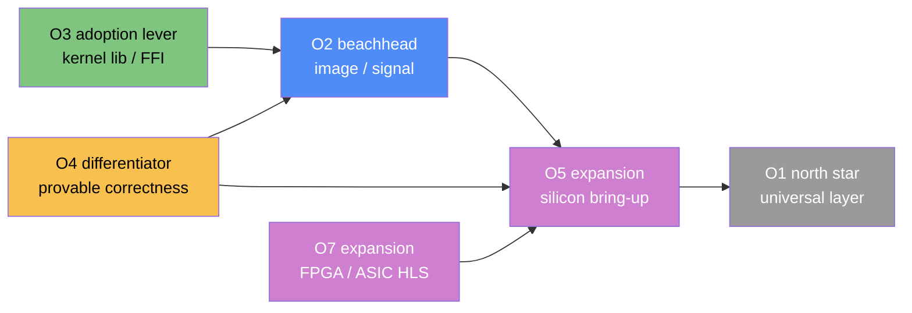

# VISION.md — Flow as a portable accelerator layer

**Status:** Positioning / north-star — **non-binding**. · **Date:** 2026-06-13

> This document records *strategic options* for what Flow could become in the
> market. It is the "why," not the "what." It **does not** alter the frozen
> Level-A spec (`docs/spec/category-ir.md` + `ERRATA.md`), the Flow-Core scope
> (`HANDOFF.md §4`), or the roadmap (`HANDOFF.md §8`). Per the project's own
> stated risk — *"the single biggest project risk is another year of
> specification without an implementation"* — nothing here adds scope to the next
> sessions. The technical thesis is still tested by **M5** (one `sepia.flow`,
> three targets); the market thesis only becomes real *after* that demo exists.
> Changes of direction are made by ADR, not by editing this file.

---

## 1. The thesis

NVIDIA controls accelerated computing through **CUDA**: nearly every framework
targets CUDA first, which raises the barrier for any new GPU/ASIC vendor — their
hardware is useless until the entire software ecosystem is re-ported to it. This
is a lock-in moat, not only a technology lead.

Flow's bet: **decouple the programming model from the hardware vendor.** A new
hardware company writes *one* backend for Flow and instantly inherits Flow's
entire ecosystem — every program, library, and tool. The same source runs on
CPU, GPU, FPGA, or novel silicon, with the compiler's *correctness argument being
functoriality*. CUDA uses LLVM to reach PTX; Flow does the same trick one level
up, with **plug-and-play backends** for both hardware developers (build a target)
and hardware interpreters (run the ecosystem on it).

## 2. Why Flow is structurally suited (this is not a pivot)

The vision is already latent in the architecture — it does not require redesign:

- **Backend = functor.** `category-ir.md §8` defines a backend as a functor
  `F : Flow-Cat → T` out of the IR. A new vendor backend is, in the model,
  *adjoining one functor* — the plug-and-play story is literally the spec.
- **Dataflow → spatial hardware.** A dataflow graph maps to FPGAs/ASICs far more
  naturally than CUDA's SIMT model. The existing Verilog backend is evidence the
  model reaches past GPUs in a way CUDA cannot.
- **Provable cross-target equivalence.** Functor laws give *"same source =
  provably same function"* across CPU/GPU/FPGA — a claim heuristic pipelines
  (MLIR/XLA/TVM) cannot make.
- **Parallel-first by default.** `seq` opts into ordering; everything else is
  structurally parallel — the right default for accelerators.
- **Backend/runtime is the one real `Loc`/`Trm` seam** (ADR-0014): placement and
  host↔device transmission carry real cost *only* at the target boundary — which
  is exactly where this market thesis lives.

## 3. The strategic options

Seven options came out of the discussion. They are **not all mutually
exclusive**: O1↔O2 is the core fork (boil-the-ocean vs. niche-first); O3 and O4
are cross-cutting levers usable under any positioning; O5/O7 are expansion plays
the FPGA/ASIC + functor strengths unlock; O6 is the tempting-but-hardest market.

- **O1 — Universal compute layer ("the anti-CUDA").** Be the portable model for
  *every* accelerator — the default way anyone writes parallel code; CUDA's
  replacement.
- **O2 — Domain beachhead: real-time image/signal processing.** Win one vertical
  where dataflow is the native shape (the `HANDOFF.md` stated strategy + the
  `sepia.flow` demo), then generalize.
- **O3 — Embeddable kernel language (linked lib / FFI).** Compile accelerated
  kernels, export as a C-ABI library callable from Python/C++/Rust — a *guest* in
  existing stacks, no rewrite required.
- **O4 — Provable cross-target correctness layer.** Lead with the claim
  incumbents can't make: the same source is provably the same function on
  CPU/GPU/FPGA (functorial backends).
- **O5 — Novel-silicon bring-up & vendor enablement.** The tool a new GPU/ASIC
  vendor uses to validate hardware against the interpreter-oracle and inherit the
  ecosystem by writing one backend functor (your original "open the market"
  framing).
- **O6 — AI/ML compute.** A parallel-first language aimed at AI workloads;
  compete in the hottest, most-funded market.
- **O7 — High-level hardware synthesis (FPGA/ASIC).** Dataflow → spatial
  hardware: a higher-level, correctness-checked alternative to HLS and RTL DSLs;
  leverages the existing Verilog backend.

## 4. Options × competition × problems × opportunities

| ID | Option | Primary competition | Key problems / risks | Opportunities |
| -- | ------ | ------------------- | -------------------- | ------------- |
| **O1** | Universal compute layer ("anti-CUDA") | CUDA; Mojo/MAX; MLIR; OpenCL; SYCL/oneAPI | Head-on with NVIDIA + the best-funded players; platform cold-start (no users → no vendors → no users); portability ≠ performance at the broadest scope; needs a decade of two-sided subsidy NVIDIA already paid | Largest TAM; the "default parallel language" prize; rides industry-wide anti-lock-in demand |
| **O2** | Domain beachhead: image/signal processing | Halide; OpenCV+CUDA; MATLAB/Simulink; vendor DSP toolchains; OpenVINO | Niche is itself contested (Halide is strong); must beat tuned libraries on a real workload; risk of staying boxed in the niche | Dataflow is the native shape here; matches the frozen `sepia.flow` demo + stated strategy; concrete buyers; provable correctness is a real edge over Halide's schedule-bug surface |
| **O3** | Embeddable kernel lib (FFI / linked lib) | Triton; Numba; Taichi; JAX/Pallas; raw CUDA/C | ABI/FFI + host↔device memory management is where the hard engineering hides; must match kernel performance; "just a kernel DSL" caps the ambition/valuation narrative | **Easiest adoption** — no rewrite, meet users where they are; fastest path to real usage and feedback; composes with every other option |
| **O4** | Provable cross-target correctness layer | *None portable*; CompCert (CPU-only certified); Vericert (mechanized C→Verilog HLS); MLIR/XLA/TVM are heuristic (bug-for-bug target drift) | "Provable" only as strong as the functor proofs (the E1 trace theorem is still informal); correctness alone doesn't sell if performance is poor; market may not *pay* for correctness | No *portable cross-target* functorial claim among the heuristic pipelines — but Vericert/CompCert are **stronger, single-target, mechanized** proofs: they are the bar to beat, not absent prior art (see `docs/notes/related-work.md`); decisive in safety-critical/regulated domains (CompCert is DO-178C-qualified, SCADE sells exactly this workflow); defensible moat; already the spec's core thesis (§8) |
| **O5** | Novel-silicon bring-up / vendor enablement | Vendor MLIR backends; TVM BYOC; OpenXLA PJRT plugins | Chicken-and-egg (vendors want an *existing* ecosystem); long enterprise sales cycles; needs ≥1 backend + real users to be credible | Your original "open the market" thesis; new GPU/ASIC startups are a real, growing, underserved buyer; one backend = inherit the whole ecosystem; the correctness oracle is genuinely useful for HW validation |
| **O6** | AI/ML compute | OpenXLA/XLA; Triton; torch.compile/Inductor; TVM; cuDNN/CUTLASS; Mojo/MAX | Hardest, most-defended ground; dense GEMM/attention favors tuned libs + tensor cores, where general dataflow has **no edge**; fighting NVIDIA's full stack | Largest spend; real upside **if** won via streaming/irregular/heterogeneous dataflow (not dense GEMM); rides anti-CUDA sentiment |
| **O7** | High-level hardware synthesis (FPGA/ASIC) | Vivado/Intel HLS; Chisel; Bluespec; Spatial/Dahlia; Halide-HLS | FPGA/ASIC market is smaller + specialized; verification & timing-closure depth; Verilog backend today is feedforward + single-loop FSM only | Dataflow → spatial is more natural than SIMT; provable lowering is rare in HLS; differentiated against both the CUDA world and the RTL world; leverages the existing Verilog backend |

## 5. Cross-cutting truths (apply to every option)

1. **The language imposes no inherent performance ceiling — performance lives in
   the backend, and that cuts both ways.** Flow is not inherently slower. Its
   pure, single-source/single-target dataflow IR is arguably a *better*
   optimization substrate than C/CUDA: no aliasing ambiguity (no pointers in
   Core), explicit data dependencies, explicit parallelism, and intent (`map f`)
   expressed instead of mechanism (a hand-written loop) — so the backend is free
   to fuse, tile, and re-schedule. High-level data-parallel compilers (Halide,
   XLA, Triton, Futhark) show such a language can match or beat hand-written
   kernels. **But the performance work does not vanish — it relocates into each
   backend, per target.** A *correctness*-preserving functor is cheap and
   provable; a *performance*-competitive backend is the same tiling / fusion /
   memory-hierarchy / autotuning effort CUDA represents, redone for each target.
   Two surviving caveats: (a) the performance-bearing **schedule is not
   portable** — the *algorithm* ports, the tuning must be re-autotuned per target
   (why Halide splits algorithm from schedule); (b) the top of the envelope
   (tensor-core GEMM) may need intrinsics or a library escape hatch. Retire the
   marketing line *"all a vendor does is write a backend"*: they inherit
   *correctness* for free, *performance* only with real investment. *Portable
   performance is the graveyard this class of project usually dies in — not
   because the language caps it, but because per-target tuning is expensive.*
2. **The field is crowded with heavy hitters pursuing this exact thesis** — MLIR,
   TVM, IREE, XLA/StableHLO, Triton, SYCL/oneAPI, OpenCL, and especially
   **Mojo/MAX** (the anti-CUDA-lock-in stack from Chris Lattner — creator of
   LLVM, Clang, and Swift). This
   *validates* the thesis but means "be the universal layer" is a fight on
   everyone's turf. Flow needs a wedge they lack. (For the verified-correctness
   and one-source→many-targets prior art specifically — Compiling to Categories,
   DaCe, Futhark, Vericert, CompCert, Halide's formal semantics, SCADE — see
   `docs/notes/related-work.md`.)
3. **Platform cold-start.** "Vendors write a backend and get the ecosystem free"
   only works once an ecosystem worth getting *exists*. Today: zero users. The
   answer is not to out-subsidize NVIDIA — it is to out-*niche* them.

## 6. Open source — the delivery model the thesis requires

Open-sourcing is not a side question; it is structurally entailed by the thesis,
and it is the **mechanism that makes §5's per-target performance problem
tractable**. The two arguments are one: performance lives in backends → a
performant backend is large, per-target work → open source distributes that work
across vendors and community instead of leaving it to one team. An anti-lock-in
layer that is itself a proprietary single-vendor dependency is a contradiction;
the open compiler tooling the portability story rests on — **LLVM** and
**MLIR** — and the CUDA alternatives that gained real traction — **TVM**,
**Triton**, **IREE** — are all open source. **Open source therefore underlies every option in §3–§4, not a
new option beside them.**

**Why it accelerates the thesis**

- **Vendor trust.** No hardware company bets its silicon's software stack on a
  closed compiler it cannot inspect or fork. Permissive open source de-risks the
  exact adoption O5 needs.
- **Distributed performance work.** Backends, optimizers, and autotuning
  databases get community + vendor contributions — the only realistic way to fund
  *portable performance* across many targets.
- **A neutral "Switzerland."** Open governance lets competing vendors trust one
  layer none of them controls — what an anti-monopoly standard requires.
- **More eyes, faster oracle.** The differential-testing method (interpreter as
  oracle) strengthens with every contributed program and target.

**Honest nuances**

- **Necessary, not sufficient.** Open source *enables* an ecosystem; it does not
  *cause* one. Most OSS projects get zero contributors — users and a compelling
  reason to contribute still have to exist.
- **Timing.** Build in the open from day one (public repo, permissive license for
  credibility), but spend the one-time launch moment when something *runs* — the
  **M5 tri-target demo is the ideal launch artifact**, not a pre-interpreter P2
  repo.
- **License is strategic.** Permissive (**Apache-2.0**, with its patent grant) is
  the LLVM/MLIR standard and what vendors require; copyleft (GPL) would repel the
  hardware vendors O5 targets. Almost certainly Apache-2.0 — worth an explicit ADR.
- **Name the business model, don't foreclose it.** If the core is open and value
  is "vendors write backends," monetization lives elsewhere: hosted autotuning,
  correctness / certification-as-a-service, premium or proprietary backends,
  support and integration. Decide deliberately so open-sourcing keeps options
  open rather than closing them.

## 7. The recommended wedge (how the options combine)

The strongest version of the thesis is **not** "replace CUDA for AI training"
(O1/O6 head-on — densest, best-defended ground, where general dataflow has no
advantage on GEMM). It is:

> **The provably-correct portable layer for heterogeneous/streaming dataflow on
> novel silicon — where correctness across targets is the value and the workload
> is dataflow-shaped.**

A complementary stack rather than one bet:

- **Now (≤ M5):** O2 (beachhead) as the framing, O3 (kernel-lib) as the adoption
  mechanism, O4 (provable correctness) as the differentiator — all over an
  **open-source (Apache-2.0) base** (§6). All fit the current roadmap without
  changing scope.
- **After M5:** O5 (silicon bring-up) and O7 (FPGA/ASIC HLS) — the expansion
  plays the FPGA/ASIC + functor strengths unlock.
- **O1 (universal layer):** eventual north star only; earned, never assaulted.
- **O6 (AI/ML):** approach *only* via streaming/irregular/heterogeneous dataflow;
  never via dense GEMM/attention.

## 8. What this does not change

- **Frozen Level-A spec untouched** (ADR-0014 firewall): no `category-ir.md`
  edit, no ERRATA entry, no scope change.
- **M5 remains the test of the technical thesis** — does one source actually run
  correctly on three targets? Market positioning is downstream of that proof.
- **Roadmap and Flow-Core scope are unchanged** (`HANDOFF.md §4`, §8). This doc
  is the "why" that motivates the existing "what."

## 9. Open questions (→ future ADRs / decisions)

- Which beachhead workload first proves *portable performance*, not just
  portable correctness? (The honest crux of the whole vision.)
- Is the primary buyer the **developer** (O3 adoption) or the **hardware vendor**
  (O5 enablement)? They imply different go-to-market and different first backend.
- How strong must the correctness claim be to be sellable — informal
  functoriality, or the mechanized E1 trace-preservation theorem?
- What is the minimum "ecosystem worth inheriting" that makes O5's vendor pitch
  credible?
- **Open-source license & governance:** Apache-2.0 + neutral governance? When to
  make the repo *public* (early, for credibility) vs. when to *launch* it (at M5,
  for momentum)?
- **Business model under an open core:** hosted autotuning, certification-as-a-
  service, premium backends, or support/integration — which, and decided when?
