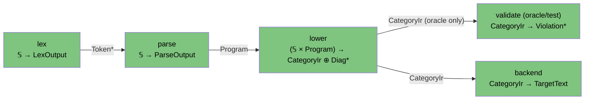

# Architecture: the categorical model layer (Level B)

Status: accepted (ADR-0014, ratified 2026-06-14). Authority: `FRAMEWORK.md`
(repo root) is the method; this document is its **project-specific instantiation**
for the Mapal compiler. Frozen Level-A authority is `docs/spec/category-ir.md`, which
this document never restates.

This is the binding statement of how every `flow-*` crate is modeled, reviewed, and
documented. It exists so the discipline the project already practices (deduce-don't-store,
one-seam variation, independent-oracle validation) has a **named home** and a **single
firewall** against the two-`category` hazard (errata E5 / ADR-0006).

## 0. Why model the compiler categorically (one paragraph)

`FRAMEWORK.md` turns "good architecture" from taste into something you can *check*:
model the system's `Dat` (data types + their relations) and `Trn` (passes, as objects
with `t_from`/`t_to` into `Dat`), then run the §8 checklist. For *this* project the
payoff is concrete and already partly banked — the Consolidation Principle (§3) is the
reason `mapal-ir` has one `Object` struct with a partial `value?` morphism (not parallel
`ConstantNode`/`InnerNode` types), the reason `topo`/`sccs`/`loop_structure` are deduced
not stored (D3/D5), and the reason `SourceLoc` is duplicated at exactly one declared seam
rather than shared (D8). Naming the method lets a future session *re-derive* those
decisions instead of re-arguing them.

## 1. The two-level firewall (the load-bearing rule)

There are two categories in this project that share nouns. **They must never touch.**

| Level | What it is | Authoritative in | Modeled by FRAMEWORK? |
| ----- | ---------- | ---------------- | --------------------- |
| **A — object language** | Mapal *programs* are morphisms in **Mapal-Cat** | `docs/spec/category-ir.md` (frozen) | **No** — restated nowhere; appears in Level B only as *data* |
| **B — the compiler itself** | The `flow-*` crates' own data types + passes | each crate's `DESIGN.md` | **Yes** — this is what we model |

**The collision is deliberate and dangerous.** `mapal-ir`'s Rust types `CategoryIr`,
`Object`, `Morphism`, `Operation` echo the Level-A category's nouns on purpose. But at
Level B they are **just Rust structs the compiler holds in RAM** — `Dat` objects of the
*compiler*, not arrows of Mapal-Cat. The project has paid this tax once already: **E5**
(ADR-0006) renamed the surface keyword `category` → `type` because the two senses were
confusable in the object language. The firewall is the standing mitigation in the design
docs.

**Firewall rules (enforced at review):**

- A Level-B model section models the **compiler's** types. A `CategoryIr` *value* is one
  large Level-B `Dat` object (a sealed dataflow graph); its `Object`/`Morphism` fields are
  Level-B morphisms. **It is never a Mapal-Cat arrow.**
- Level-A constructs may appear **only as data** inside Level B. Example: `mapal-syntax`'s
  `Chain`/`Stage`/`StageKind` are Level-B AST nodes that *represent* a Level-A pipe-and-filter
  chain — they are not themselves Level-A morphisms.
- **Do not restate `category-ir.md`.** A DESIGN section that models a Mapal program *as* a
  category is doing Level A's (frozen) job in the wrong place. Reject it.
- Every Level-B model section states its scope up front: "these are the compiler's own
  `Dat` types, not Mapal-Cat."

## 2. The vocabulary we apply — `Dat` + `Trn` richly, `Loc`/`Trm` only at the seam

We use FRAMEWORK's exact four atoms:

- **`Dat`** — the crate's own data types (objects) and the field/structural relations
  between them (morphisms): products `×` (a struct/row), sums `⊕` (a tagged enum), free
  monoids `A*` (a `Vec`/log), partial morphisms `?` (an `Option` field, a value present in
  one variant). Modeled **richly** — this is the bulk of every component DESIGN.
- **`Trn`** — each pass is a transformation *object* with `t_from`/`t_to` projections into
  `Dat`; the free category on them is the algorithm category `Alg` (composable pass chains
  `f ; g` with `t_to(f) = t_from(g)`). Modeled **richly**.
- **`Loc` / `Trm`** — physical execution sites and typed transmissions. **Degenerate for
  the compiler** (see §3). Invoked **only** at the backend/runtime seam.

### The morphism table is mandatory

Per FRAMEWORK §2, every model section carries a morphism table with columns
`Morphism | Signature | Partiality (Total / Partial / Deduced / Future) | Semantics`, and
**every arrow in the diagram appears in the table and vice versa**. The ground-truth
inventories the project has already built (objects + morphisms + passes per crate) are the
raw material for these tables.

## 3. `Loc`/`Trm` are degenerate — state it, do not fight it

The compiler is a single in-process **pipe-and-filter** pipeline (FRAMEWORK §7.1):



| Morphism | Signature | Partiality | Semantics |
| -------- | --------- | ---------- | --------- |
| `Token*` | `lex → parse` | Total | The pipe-weld datum: the token stream `lex` hands to `parse` |
| `Program` | `parse → lower` | Total | The thin parse tree `parse` hands to `lower` |
| `CategoryIr` | `lower → validate` | Deduced | The sealed IR fed to the independent oracle (debug-assert / test harness only — `lower` does not call `validate()`; the property is "seal Ok ⇒ validate empty") |
| `CategoryIr` | `lower → backend` | Total | The sealed IR consumed by codegen |

(`validate` is a property-test/debug oracle, not a mandatory production pass — see below.)

Every filter shares one process `Loc`; every pipe is same-location. Per FRAMEWORK §7.1's
degenerate-case note, **the physical pair collapses** and the model reduces to `Dat` +
`Alg`. So frontend components (`syntax`, `ir`, `lower`, `check`, `interp`) declare the
physical pair degenerate and model in `Dat` + `Alg` only.

**The one place `Loc`/`Trm` are real:** the **backend/runtime seam**. CPU/GPU/FPGA targets
are genuine `Loc`s; host↔device transmission (`cudaMemcpy` H→D / D→H, FPGA `stream_data`)
is a genuine `Trm` with `c_from ≠ c_to` and a typed `carries` (Coherence Laws 1–2 do real
work there: no data teleport; typed crossing; the H↔D round-trip is where GPU latency
lives). The backend DESIGNs (`backend-llvm`, `backend-cuda`, `backend-verilog`) are the
only ones that invoke the physical pair with content; the strategy-2-category framing of
the parallel target functors is owned by a future backend ADR, not here.

> `SourceLoc` in `mapal-ir`/`mapal-syntax` is **not** a FRAMEWORK `Loc`. It is a byte-range
> *datum* (a `Dat` object), despite the name. The firewall applies to it too.

## 4. The required DESIGN.md lead section

Per FRAMEWORK §6 rule 1 ("Design before implementing") and §2 ("How to write a model section"), every
component `DESIGN.md` **leads** with a `## Categorical model (Dat + Trn)` section,
immediately after the one-line overview and **before** scope, tables, or recipes. Template:

```markdown
## Categorical model (Dat + Trn)

**Firewall.** These are the compiler's own Level-B `Dat` types, not Mapal-Cat arrows.
[If the crate holds Level-A constructs as data, name them and say "as data only."]

**Physical pair.** Degenerate (FRAMEWORK §7.1) — `Dat` + `Alg` only.
[Backend/runtime crates instead: name the real `Loc`s and `Trm`s.]

### Why (one paragraph)
What modeling *this* crate categorically buys, concretely.

### Core category
A diagram: objects (the crate's types) + labeled morphism arrows; `?`/dashed for partial.

### Morphism table
| Morphism | Signature | Partiality | Semantics |

### Passes (Trn)
Each pass as a `Trn` object with `t_from` / `t_to`.

### Composition rules / invariants
Numbered equations the implementation must preserve (deductions, constraints, naturality).

### Bridges
Boundary morphisms to neighbouring crates, each with a stored-vs-deduced note.
```

Existing DESIGNs (`syntax`, `ir`, `lower`) gain the section opportunistically when next
edited; `interp` (P3) leads with it from the start.

## 5. The reconcile gate gains one coherence line

The doc-reconcile step (run each session, alongside the ledger checks) adds a
**FRAMEWORK §8 coherence line**: for every component touched this session, check its model
section against the §8 modeling smells —

- [ ] No new object that is an existing object "plus morphisms" (§3) — no parallel type
      where a partial morphism + `kind?` discriminator belongs (cf. `Object.value?`).
- [ ] Stored values that are really deduced (caches, mirrored state) are justified and
      have a consistency mechanism (cf. topo/SCC deduced not stored, D3/D5).
- [ ] Every diagram morphism is in the morphism table and vice versa; new fields updated
      the table in the same change.
- [ ] The firewall holds — no Level-B section restates Level A or models a Mapal program as
      a category.

This rides the existing reconcile pass; it is one checklist block, not a new review stage.

## 6. Cross-component bridges (the boundary morphisms)

The compiler-wide picture has three boundary morphisms worth naming here, each a
`Trm`-shaped crossing in the degenerate pipeline (same-`Loc`, so a `Dat` hand-off in
`Alg`) with an explicit stored-vs-deduced decision:

| Bridge | Signature | Stored? | Semantics |
| ------ | --------- | ------- | --------- |
| `SourceLoc` duality (D8) | `mapal_syntax::SourceLoc → mapal_ir::SourceLoc` | **Stored copy** at one seam (`mapal_lower::tys::ir_loc`) | Field-identical `{start,end}`; `mapal-ir` defines its **own** copy to keep zero deps on `mapal-syntax` (it is the depended-on hub). The §5 "one source of truth, variation at one declared seam" pattern at the *link* level: seam = the crate boundary, variation = zero, cost = one trivial total function. **Not** a FRAMEWORK `Loc` — a byte-range datum |
| The Diagnostic seam | `IrError ⊕ IrViolation ⇀ Diagnostic` (rendered downstream) | **Deduced** at the CLI | Every crate emits *renderer-free* structured error values (no `Display` — C3/I5); presentation is reserved for one downstream site (`mapal-cli`). The §4.4 cross-cutting natural transformation / §5 "isolate effects, define each boundary once". `IrError` (build context) and `IrViolation` (graph ids) stay **two objects** by the independent-oracle design (§11) — a justified difference, not a redundancy |
| The type-resolution functor | `mapal_syntax::TyKind ⇀ mapal_ir::Ty` (`resolve_ty` / `TypeTable::resolve`) | **Deduced** (a pass) | A **partial** `Trn` — name resolution + struct inlining + Core whitelisting + depth bounding — bijective-on-objects in neither direction (surface-only `Dynamic`/`Error`; IR-only `Unit`/`Str`/`IoToken`; `Named` fans out to `Int`/`Float`/`Bool`/`Struct`). Two distinct `Ty` objects joined by a partial functor; **do not conflate** the surface `Ty` with the IR `Ty` |

Each is the §3-correct shape already executed (consolidate what commutes, segregate what
does not); they are recorded here so a future reader does not try to "fix" them (collapse
the two `SourceLoc`s, share a `Ty`, or merge the error types) — which would invert the
dependency direction (D8), break the I9 Core whitelist, or destroy the oracle independence.

## 7. Audit findings — reductions, deductions, performance

The output of running FRAMEWORK §3's five-step reduction across twelve candidate
object-clusters of the compiler's `Dat`, each verdict adversarially verified (a finding
that over-claimed a "redundancy" where the difference is in fact justified was rejected;
eleven of twelve survived). **This pass changes no code** — it records what the model
makes visible; anything actionable becomes an ADR candidate (§7.5). Grouped by what the
reduction returned.

### 7.1 Ratifications — the framework names a decision already made right

The reduction confirms the categorical move the project already executed; the value is the
named justification a future session can re-derive instead of re-arguing.

| Subject | What the reduction confirms | Banked as |
| ------- | --------------------------- | --------- |
| `Object.value?` | Consolidation done right: one `Object` struct + a partial morphism `value? : Object → Value` total exactly on `kind = Constant` — **not** parallel `ConstantNode`/`InnerNode` types (FRAMEWORK §3 step 5: segregate the real difference as a partial morphism + `kind` discriminator). | ir I7 |
| Loops, no stored `Trace` | Deduce-don't-store at the structural level: `Operation::Trace` is **not materialized**; loop regions are recovered by Tarjan SCC on demand. One representation, never two. | ir D3 / §7 |
| `topo_order` / `sccs` / `loop_structure` | Deduce-don't-store: `FuncDef.morphisms` is an insertion-ordered *set*; order is recomputed, never stored — no second copy to keep consistent. | ir D5 / §13 |
| Pair-then-primitive | `a + b` reifies as `env → (A × B) → T`: the product is a real `Object`, so the one-source/one-target law (I1) is a **consequence** of using categorical products, not a constraint bolted on. There is no wide-edge type to parallel. | ir D1 / §5.1 |
| Arena / dense ids | `slotmap` + `SecondaryMap`, no `HashMap`, insertion-ordered `Vec`s: cache-friendly iteration **and** determinism (E2) fall out of one decision. | ir D2 |

### 7.2 Justified differences — the reduction proves two objects are genuinely two

Pairs the naive olog suggests collapsing; the reduction shows the non-commuting morphisms
are *real*, so they stay separate. **Recorded so a future session does not "fix" them** —
each "fix" would invert a dependency, break an invariant, or destroy an oracle.

| Pair | Why they stay two |
| ---- | ----------------- |
| `mapal_syntax::SourceLoc` vs `mapal_ir::SourceLoc` (D8) | Field-identical, but collapsing inverts the dependency direction — `mapal-ir` is the depended-on hub and must stay free of `mapal-syntax`. One declared seam (`mapal_lower` conversion), zero variation, a trivial total function. A stored copy *by design*. |
| `IrError` (build context) vs `IrViolation` (graph ids) | Collapsing destroys the **independent oracle**: `validate()` must re-derive the invariants without sharing builder code (ir §11). The duplication *buys* the property "seal Ok ⇒ validate empty." |
| surface `Ty` (`TyKind`) vs IR `Ty` | Joined by a **partial functor** (`resolve_ty`): surface-only `Dynamic`/`Error`; IR-only `Unit`/`Str`/`IoToken`; `Named` fans out to `Int`/`Float`/`Bool`/`Struct`. Bijective-on-objects in neither direction — genuinely two objects, one partial map. |

### 7.3 Modeling insights — a relation the model makes newly visible

- **The surface parse category strictly contains Mapal-Core; rejection _is_ the partiality
  of the lowering functor.** `mapal-syntax` deliberately *keeps* out-of-Core forms it has
  already rejected (`Call`, `Question`, `Dynamic`, custom loop labels, `OutOfCore` guards,
  `Void` fanout — retained for span-precise diagnostics). Categorically these are partial
  morphisms into an out-of-Core subcategory, and `lower`/`check` is the **partial functor**
  whose domain of definition is exactly Mapal-Core. "Reject with a clear diagnostic"
  (HANDOFF §4) = "the functor is undefined here, and says where."
- **Diagnostics are a cross-cutting concern (a natural transformation), realized as
  parallel renderer-free error types.** Every crate emits structured, `Display`-free error
  values (`Diagnostic` / `IrError` / `IrViolation`); presentation is reserved for one site
  (`mapal-cli`). This is FRAMEWORK §4.4's "same wrapper applied everywhere" plus §5's
  "define each boundary once" — and it raises one soft consolidation candidate (§7.5).

### 7.4 Performance deductions — optimizations read off the model

The premise that modeling exposes performance levers held: the model surfaces four, each a
consequence of the categorical shape rather than a bolt-on.

- **Type-checking is embarrassingly parallel — _because_ the type rule is a local predicate
  at each morphism.** Single-source/single-target (I1) makes well-typedness checkable
  per-morphism with no tree traversal; disjoint morphisms check independently
  (architecture.md §8.1). The parallelism is a consequence of the IR shape, not a feature.
- **Deduce-don't-store is safe to _selectively reverse_ post-seal.** A sealed `CategoryIr`
  is immutable (append-only-then-sealed), so a per-seal cache of `topo_order`/`sccs` has a
  trivial consistency story (invalidate = never). The default (deduce) is right, and the one
  legitimate stored-copy optimization — should a hot path ever demand it — arrives with its
  consistency mechanism for free. Exactly the FRAMEWORK §5 tradeoff, made explicit.
- **GPU cost is localized to the one real `Trm`.** The H↔D round-trip (`cudaMemcpy`) is the
  only crossing with `c_from ≠ c_to`; it is where GPU latency lives (architecture.md §8.2).
  And map-fusion — a functor law at Level A — is *preserved* by `F_CUDA`, so source-level
  fusion becomes kernel fusion for free: the single biggest lever, deduced from
  functoriality, no separate pass.
- **Determinism and cache-friendliness are one decision** (D2): dense arena ids with
  insertion-ordered iteration buy both at once.

### 7.5 ADR candidates

One firm, one soft; everything else above is ratification or justified difference (no
action).

1. **Backend strategy-2-category / parallel target functors** *(firm — greenfield)*.
   `F_LLVM` / `F_CUDA` / `F_Verilog` (and spec-only `F_WASM`) are parallel realizations of
   one contract `CategoryIr → TargetText`; choosing one selects a 2-cell, adding one adjoins
   an object and never edits the core (FRAMEWORK §4.4 / §7.4). This is **the** place
   `Loc`/`Trm` are real. The three backend crates are 1-line stubs today (all
   `not-started`); the framing — a shared `Backend` contract and a `TargetText` type —
   should be fixed by a backend ADR *before* the first backend is written. Reserved here,
   owned there.
2. **A single diagnostic contract all crates map into** *(soft — revisit when `mapal-cli`
   is built)*. Today each crate carries its own renderer-free error enum and the CLI renders
   each; FRAMEWORK §5 ("define each boundary once") suggests one declared `Diagnostic`
   target every crate's errors map into, so the CLI has one renderer, not N. Not urgent
   (the per-crate enums are clean). **Not** a merge of `IrError`/`IrViolation` — those stay
   two (§7.2).

## 8. Index

The index of models lives in `docs/architecture/INDEX.md` (FRAMEWORK §6, rule 4 —
"Add missing docs"). Add each new component model section to it as it is written.
