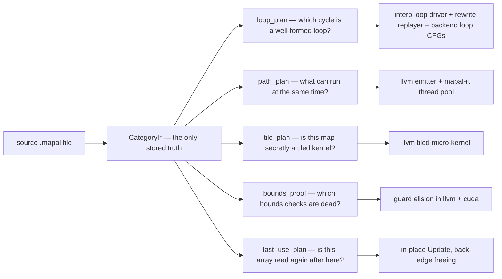
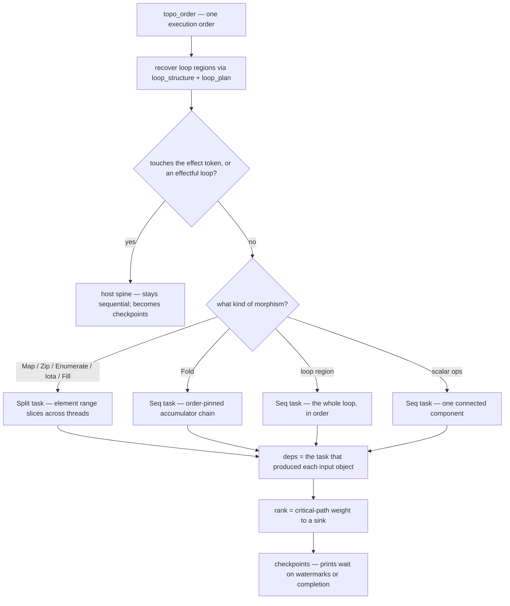
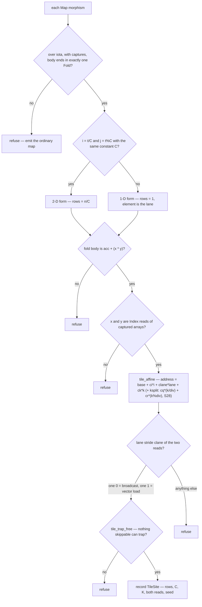
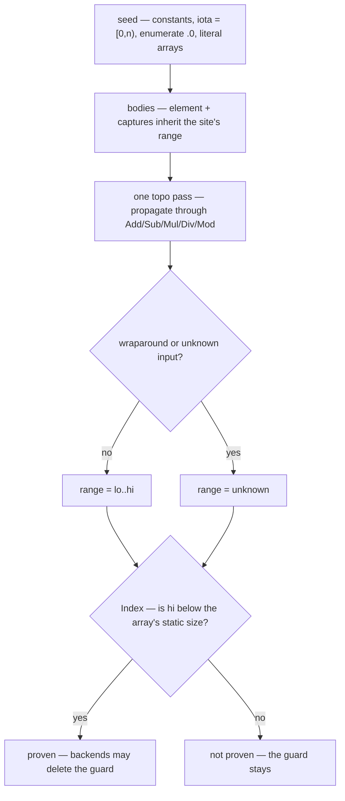
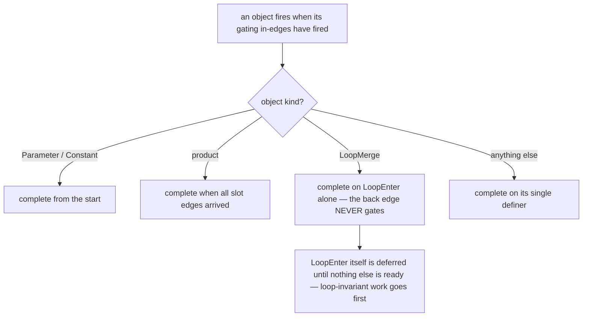
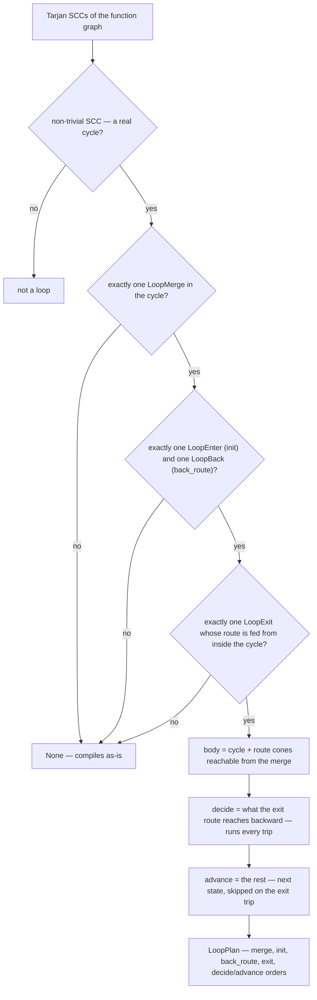
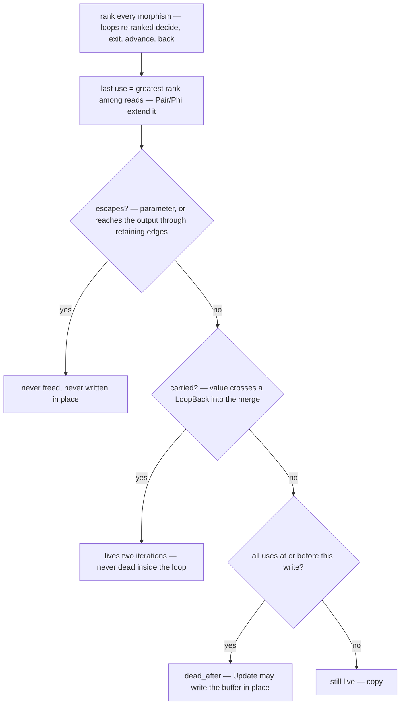

# Deduced queries — how the Mapal compiler knows things

An explainer for engineers who are not compiler people. Every mechanism below is
real code: the query names (`loop_plan`, `path_plan`, `tile_plan`, `bounds_proof`,
`last_use_plan`) are functions on `CategoryIr` in `crates/mapal-ir/src/algo.rs`, so
you can grep them and read the source alongside this doc.

## The one idea

The compiler stores exactly one thing: **the graph**. After lowering, your program
is a `CategoryIr` (`crates/mapal-ir/src/graph.rs`) — a set of *objects* (values:
parameters, constants, temporaries, the return value, loop-merge points) connected
by *morphisms* (directed edges, each labeled with one `Operation`: `Add`, `Mul`,
`Index`, `Map`, `Fold`, `Phi`, `Update`, `Print`, the loop trio
`LoopEnter`/`LoopBack`/`LoopExit`, …). Every value has exactly one producer. The
graph is sealed and immutable; it is the only stored truth.

Everything *structural* about the program — where the loops are, what can run in
parallel, which bounds checks are dead — is a **deduced query**: a pure function
over the sealed graph, computed on demand, never stored. Because the answers are
never stored, they can never drift out of sync with the code. There is no
invalidation bug to have.

And the queries don't trust declarations — they **prove** structure. Mapal has no
`parallel` keyword, no `restrict` pointers, no vector intrinsics. Independence is
"there is no path between these two nodes" — an exact reachability answer, not a
programmer's promise. Reuse is fanout the graph can see. A loop is a literal cycle.

The queries compose: `path_plan` calls `loop_plan` and `bounds_proof`; `tile_plan`
calls `bounds_proof`; `last_use_plan` calls `topo_order` and `loop_plan`. Each one
answers a single question and hands the answer to the consumers that need it:



(There is a sixth, `emission_plan` — "which objects need a name in the emitted
text?" — the same trick applied at emission time. It is out of scope here; the
five above are the interesting ones.)

Two disciplines run through everything below:

- **Every query is partial.** If it can't prove the shape, it returns nothing —
  `None`, an empty map, `false` — and the compiler takes the slow correct path.
  Never a wrong answer. This is half the story; the last section is about it.
- **Every answer is gated by the oracle differential.** The interpreter executes
  the graph itself and is the definition of correctness. Optimized output must be
  byte-identical to that oracle — at any thread count, at `-O0` and `-O2`
  (`crates/backends/llvm/tests/differential.rs` compiles every case at both).

---

## `path_plan` — what can run at the same time?

**The question in plain words:** which parts of this function are independent, so
threads can run them at once — and where must the sequential world wait for them?

There are no parallelism annotations in Mapal. The graph's paths **are** the
concurrency: if no path connects two computations, neither can observe the other,
so running them simultaneously cannot change the answer.

A tiny example — two maps reading the same array, nothing connecting them:

```flow
fn main() {
    [1, 2, 3, 4] -> a: [i32; 4];
    a -> map { x -> x * 2 }  -> b: [i32; 4];
    a -> map { x -> x + 10 } -> c: [i32; 4];
    (b, c) -> zip -> map { p -> p.0 + p.1 } -> d: [i32; 4];
    d[0] -> println;
}
```

The two maps are independent paths across nodes → two tasks. The zip+map depends
on both → one task with two dependencies. The print is effectful → the host waits.

**How the algorithm works** (`CategoryIr::path_plan`, `crates/mapal-ir/src/algo.rs:946`):

1. Put the function's morphisms in execution order (`topo_order`).
2. Set aside the **host spine**: anything that touches the effect token (prints,
   effectful calls) stays sequential, in order, and so does any loop region that
   contains effects. These become *checkpoints*, not tasks.
3. Turn the rest into **tasks**:
   - a bulk op (`Map`, `Zip`, `Enumerate`, `Iota`, `Fill`) → one `Split` task:
     its element range can be cut into slices for lanes/threads;
   - a `Fold` → one sequential (`Seq`) task: its chain is order-pinned by
     meaning — each step reads the previous step's accumulator;
   - a recognized loop region (from `loop_structure` + `loop_plan`) → one `Seq`
     task: the whole loop runs in order;
   - remaining scalar ops → grouped by connectivity into `Seq` components.
4. **Dependencies are just the edges.** A task produces the objects its morphisms
   write; a task depends on whichever task produced each object it reads. As the
   code puts it: "direct object dataflow is the complete dependency relation" —
   no separate dependence analysis exists.
5. Give each task a **rank**: its critical-path weight to a sink, so the runtime
   schedules long poles first.
6. Emit **checkpoints** for the host spine: at each print, which tasks must reach
   what before the host may pass. A task that can trap only has to pass its last
   trap-capable point before the checkpoint (a *watermark*), not finish — unless
   the checkpoint consumes its value; then completion is required. (This is what
   keeps "the array task trapped" ordered before "the print ran".)



**Who consumes the answer:** the llvm backend
(`crates/backends/llvm/src/lib.rs:105`). If the plan isn't `is_single_path()`, it
emits one `@task{i}` function per task plus a static dependency/rank table, and
`mapal-rt` (`crates/mapal-rt/src/lib.rs`) executes it on a work-stealing thread pool
(`MAPAL_PAR` sets the thread count; `MAPAL_PAR=1` is the sequential lever). If the
plan looks malformed, the backend drops it and emits plain sequential code —
again: unrecognized means slow, never wrong.

**Correctness gate:** the differential suite runs the parallel cases against the
interpreter oracle at `-O0` and `-O2`, with `MAPAL_PAR` varied — stdout must be
byte-equal at any thread count.

---

## `tile_plan` — is this map secretly a tiled kernel?

**The question in plain words:** this innocent-looking "compute each output cell"
map — are its array reads so regular that lanes can compute neighboring cells in
lockstep with vector loads and a broadcast? (Matmul, FIR filters, and
attention-shaped code all match; there is no matrix concept in the recognizer.)

The recognized shape, verbatim from `benches/matmul/matmul4_cap.mapal`:

```flow
16 -> iota -> ta;                 // one counted range: the 16 cells
ta -> map { t -> (t * 7 + 13) % 101 - 50 -> widen_f64 } -> a;
ta -> map { t -> (t * 7 + 57) % 101 - 50 -> widen_f64 } -> b;
4  -> iota -> krange;             // another: the dot-product chain
ta -> map { t ->
    t / 4 -> i;                   // row = t / 4
    t % 4 -> j;                   // col = t % 4
    (0.0, krange) -> fold { acc, k -> acc + a[i * 4 + k] * b[k * 4 + j] }
} -> c;
```

Read it as: each cell `c[i*4+j]` is an independent dot product,
`fold(acc, k -> acc + a[i*K+k] * b[k*C+j])`. Sixteen independent chains, each
order-pinned. That is exactly what a SIMD unit wants: run 4/8/16 cells in lanes,
each lane doing its own `acc + x*y`, one lane's `b`-read being the neighbor's.

**How the algorithm works** (`CategoryIr::tile_plan`, `crates/mapal-ir/src/algo.rs:510`;
the recognition pipeline is `tile_site` → `tile_fold_shape` → `tile_affine`, with
`tile_trap_free` as the safety gate):

1. **Find the skeleton.** Look for a `Map` over an `iota` (a counted range
   `0..n`) whose body ends in exactly one `Fold` producing the body's output —
   "one result per element, each computed by one order-pinned chain".
2. **Recover the coordinates.** Look for the div/mod decomposition `i = t / C`,
   `j = t % C` with the *same* constant `C`. Found → the 2-D form, `rows = n / C`.
   No split → the 1-D form (`rows = 1`, the element itself is the lane).
3. **Match the chain shape.** In the fold body, require `acc + (x * y)` — a
   multiply-accumulate, in either operand order (the plan records which side is
   which via `mul_a_first` / `add_acc_first`).
4. **Walk the addresses.** `x` and `y` must each be an `Index` read of a captured
   array. `tile_affine` walks each address's arithmetic: additions and
   multiply-by-constant are **affine**, so every address decomposes into four
   integer coefficients — `base + ci*i + clane*lane + ck*k` (the `TileRead`
   record). Now the one question that matters: **when the lane moves by 1, how
   does the address move?**
   - `clane = 0` → every lane reads the same element: a **broadcast**;
   - `clane = 1` → neighboring lanes read neighboring elements: one **vector
     load**;
   - anything else → **refuse**.
   Exactly one read must be the broadcast and the other the unit-stride load
   (`a[i*4+k]` moves 0 with the lane; `b[k*4+j]` moves 1).

   **Fold-body derived axes (S28).** The fold's counted axis `k` gets the same
   derived-var move the map body got in step 2: a `Div`/`Mod` pair on the fold
   element (`k / div`, `k % div`, one shared literal divisor, `depth % div == 0`)
   binds two more walker axes `kq`/`kr`, and the coefficient space widens by
   `cq·(k÷div) + cr·(k%div)` — recorded as the partial morphism
   `TileRead.ksplit? : TileRead → TileKSplit` (§3 consolidation: the same
   `TileRead`, one more morphism, not a new site type). conv2d's
   `img[(i + k/3)*18 + j + k%3]` records `ci=18, clane=1, ck=0,
   ksplit={div:3, cq:18, cr:1}`. Rules: a read is affine in raw `k` XOR in the
   derived pair (`ksplit ⇒ ck == 0`; mixed refuses), and a bound-but-unused pair
   records `ksplit: None` — pre-S28 sites stay bit-identical.
5. **Prove nothing skippable can trap.** The micro-kernel emits only the
   recognized chain, so anything it would skip must be provably unobservable.
   `tile_trap_free` requires every `Index` proven in-bounds by `bounds_proof`,
   no integer div/mod by a non-constant, no `Update`, no `Call`, no nested
   `Map`/`Fold` the kernel can't see into. A skipped trap would be a wrong
   answer, not a missed optimization — so this gate is absolute.
6. **Record the site.** A `TileSite`: `rows`, `c`, `k`, both reads' coefficient
   tuples (with the optional `ksplit`), the seed value, the element type.
   Geometry only — the backend owns tile factors (lane width, register blocking).



**Why it's bit-exact:** the kernel interleaves *different cells'* chains — lane 0's
cell, lane 1's cell, … in lockstep — but each cell's own `acc + x*y` chain keeps
its exact operation and operand order. Floating-point addition is not associative,
and the plan never reassociates: different cells' chains interleaved, each cell's
own chain untouched. Per-cell order preserved ⇒ byte-identical output.

**Who consumes the answer:** the llvm emitter's tiled micro-kernel
(`crates/backends/llvm/src/func.rs:FnEmit::new` — computed only when tiling is
enabled). Emission dispatch (S28): a k-split site takes the conv micro-kernel
branch (`conv_site`) or the untiled fallback — never the affine tile path.
Sites absent from the `TilePlan` are emitted as ordinary maps. The
`docs/notes/tile-ladder-direction.md` note is the standing direction: this one
rule is the CPU SIMD rung today and is designed to be the same record a CUDA or
FPGA backend places differently.

**Correctness gate:** new shape families join only with a differential run —
tiled output byte-equal to the oracle — plus a measured number.

---

## `bounds_proof` — which bounds checks are dead insurance?

**The question in plain words:** is this array index provably within `[0, n)`?
If yes, the bounds check can be deleted — **the guard was never semantics, it was
insurance.** An out-of-bounds `Index` traps in Mapal; but if the index provably
can't leave the array, the trap is unreachable and the check is dead weight in
the hottest loops (it blocks unrolling and vectorization — the S20 finding).

In the matmul example above: `a[i * 4 + k]` where `t ∈ [0, 16)`, so `i = t / 4 ∈
[0, 4)` and `k ∈ [0, 4)` (it indexes a 4-element `iota`), hence `i*4 + k ∈
[0, 16)` — provably inside a `[f64; 16]`. Guard deleted.

**How the algorithm works** (`CategoryIr::bounds_proof`,
`crates/mapal-ir/src/algo.rs:2008` — interval analysis over the object graph):

1. **Seed ranges.** Non-negative integer constants know their exact value;
   elements of an `iota(n)` array lie in `[0, n)`; so does the `.0` of an
   `enumerate` element; a literal array of int constants is `[min, max]`.
2. **Seed the map/fold bodies.** A body fn's element parameter rides the site's
   element range; captures inherit their ranges from the *enclosing* function's
   own analysis (capture-range threading — this is how the matmul fold's `i` and
   `j` arrive already ranged).
3. **Propagate once, in topo order.** Ranges flow through `Add`/`Sub`/`Mul`/
   `Div`/`Mod` interval arithmetic (`arith_range`) — the div/mod decomposition is
   what gives `t / C` its tight `[0, n/C)` range. `Proj` looks through products.
   Any wraparound (a subtraction past zero, an overflow of the type's width) or
   any unknown input → the range becomes **unknown**.
4. **Prove each `Index`.** If the index's range upper bound is below the array's
   static size, the morphism goes into the proof set; `BoundsProof::proven(m)`
   answers yes/no per `Index`.



**Who consumes the answer:** the llvm and cuda backends skip the bounds check
(and the trap path) for proven `Index` morphisms
(`crates/backends/llvm/src/func.rs:47`, `crates/backends/cuda/src/kernel.rs:276`).
Inside mapal-ir itself, `tile_trap_free`, `emission_guarded`, and `path_plan`'s
trap watermarks all read it to know what can still trap.

**Correctness gate:** the analysis is conservative by construction — anything
unknown, wrapping, or loop-carried is *not* proven, so today's guards stay. Zero
behavior change where unproven; the differential proves the proven ones.

---

## `loop_plan` — which cycle is a loop, and what shape is it?

**The question in plain words:** this cycle in the graph — is it a well-formed
loop? If so: which node is the header, what's the init value, what's the back
edge, where does it exit, and which body operations *decide* (run every trip)
versus *advance* (skipped on the exit trip)?

In Mapal a loop is a literal cycle in the graph. Surface syntax like
(`examples/sum_to_n.mapal`):

```flow
fn sum_to_n(n: i32) -> i32 {
    mut i: i32   <- 1;
    mut acc: i32 <- 0;
    loop {
        (i <= n) -> {
            -true->  { acc + i -> acc; i + 1 -> i; -> loop; }
            -false-> acc -> ret;
        }
    }
}
```

lowers to a cycle: a **LoopMerge** node (the `(i, acc)` state) with one edge in
from outside the cycle (the `LoopEnter` carrying the init `(1, 0)`) and one edge
from inside (the `LoopBack` carrying the next state and the continue-condition).

**The φ-point intuition.** The merge has two incoming values — the init (first
trip) and the back-route (later trips). Some node must answer: *"are you reading
the first trip's value or a later one?"* In SSA-based IRs that answer is a
φ-function, reconstructed by analysis. Here it's a node kind, present by
construction — and the merge is *deducible*, not declared: it's a cycle node that
also receives an edge from outside the cycle (the init arriving).

**The firing problem, and the exemption.** Dataflow's rule is "fire a node when
its inputs have fired" — but in a cycle every node waits on another node in the
cycle: deadlock. The emission scheduler (`topo_order`,
`crates/mapal-ir/src/algo.rs:1383`) breaks it with two rules:

- a `LoopMerge` completes on its `LoopEnter` alone — **the `LoopBack` edge is
  emitted but never gates** (header-first: the init arrives, the merge fires, the
  body runs, the back edge fires but gates nothing);
- a ready `LoopEnter` is **deferred** until nothing else can fire — so every
  loop-invariant computation, however many hops away, lands before the loop
  header in the order.



**How the recognition algorithm works** (`CategoryIr::loop_plan`,
`crates/mapal-ir/src/algo.rs:1553`):

1. **Find the cycles.** `loop_structure` runs iterative Tarjan SCC over the
   function's object graph; a non-trivial SCC (more than one node, or a
   self-loop) is a candidate loop. A trivial SCC is not a loop.
2. **Check the canonical shape.** Exactly one `LoopMerge` in the cycle; exactly
   one `LoopEnter` into it (its source is the **init**); exactly one `LoopBack`
   (its source is the **back_route** — the `(next_state, cond)` pair).
3. **Attribute the exit.** A `LoopExit` belongs to this loop iff its route object
   is fed (through `Pair` edges) by a node *inside this cycle* — never by
   per-function reachability, which would mis-attribute a downstream loop's exit
   to an upstream merge. Require exactly one.
4. **Collect the body.** The cycle plus the *route cones*: computed payloads that
   feed the routes and are forward-reachable from the merge (e.g. a `t * 2`
   returned on exit) — they must re-fire every trip. Loop-**invariant** feeders
   are unreachable from the merge and stay outside: evaluated once, before the
   loop.
5. **Split decide vs. advance** (ADR-0016). *Decide* = everything the exit route
   reaches backward — the condition and the exit payload; it runs every trip,
   including the last. *Advance* = the rest — the next-state computation;
   skipped on the exit trip. The per-trip execution order is the guard-first
   quartet: **decide → LoopExit → advance → LoopBack**.



**Refusal is built in:** `loop_plan` returns `None` for any non-canonical shape
(multi-merge SCC, ≠1 back edges, ≠1 attributed exits). Capability gates read
`.is_some()`; the interpreter and backend drivers only run loops that passed, and
everything else compiles as-is.

**Who consumes the answer:** everyone who needs loop attribution derives it from
this one plan — the interpreter's loop driver (`crates/mapal-interp/src/loops.rs:32`),
the rewrite replayer (`crates/mapal-rewrite/src/replay.rs:256`), and both backends
(llvm `loops.rs`, cuda `loops.rs`). The code comment explains why it's one query:
the rule's two hand-maintained copies both regressed in S12, so now there is one
source of truth.

**Correctness gate:** the loop CFGs the backends emit are differential-tested
against the oracle at both opt levels, traps included.

---

## `last_use_plan` — is this array ever read again?

**The question in plain words:** after this point in the program, does anyone
read the old array again? If provably not, then "make a fresh array with slot `i`
changed" — the `Update` operation — can just… change slot `i`. In place. No copy.

The example is `matmul4.mapal`'s inner loop: `c[t] <- v` — semantics say a *fresh*
array with slot `t` replaced. If `c` is never read again except by the next
update, the "fresh array" can be the same buffer mutated in place (S20 deleted a
per-iteration 16 KB `memcpy` this way).

**How the algorithm works** (`CategoryIr::last_use_plan`,
`crates/mapal-ir/src/algo.rs:1747`):

1. **Lay the program out in execution order.** `topo_order` gives every morphism
   a rank; each canonical loop is re-ranked into the order trips actually
   execute: decide < `LoopExit` < advance < `LoopBack`.
2. **Find each object's last use** — the greatest rank among its reads — with
   retention through `Pair`/`Phi`: a value packed into a tuple lives as long as
   the tuple that holds it.
3. **Classify the two exceptions:**
   - **Escape.** A value that may outlive the function — every parameter (it's
     borrowed), and anything reaching the output through value-*retaining* edges
     (`Pair`, `Phi`, `Proj`, `Output`, `Call`, an array-typed `Index`) — is never
     freed and never written in place. One refinement: a loop's own carried
     state gets a per-iteration *release valve* — the path through its own
     `LoopExit` doesn't count as escape for the carrier (the escaping final
     instance rides the exit object, which is not exempt).
   - **Carried.** A value that crosses a `LoopBack` into the merge lives "into
     the next iteration" — two-iteration liveness — so it's never dead inside
     its loop.
4. **Answer the consumer predicate.** `dead_after(o, idx)` = `o` doesn't escape,
   AND isn't carried, AND every use of `o` ranks at or before `idx`.



**Who consumes the answer:** the llvm backend gates in-place `Update` on it
(`crates/backends/llvm/src/func.rs:1861` — write into the source buffer instead
of materializing a fresh array); the cuda backend uses it for back-edge freeing
and arena coloring (`crates/backends/cuda/src/func.rs:393`).

**Correctness gate:** like everything else — the differential, which includes the
loop-driven `Update` cases at both opt levels.

---

## The refusal discipline

Every query above is **partial**, and that's the design, not a limitation:

| Query | When it can't prove the shape | Fallback |
| --- | --- | --- |
| `path_plan` | malformed/acyclic-broken plan | sequential emission |
| `tile_plan` | any recognition step fails | ordinary map/fold emission |
| `bounds_proof` | range unknown or wrapping | the bounds check stays |
| `loop_plan` | non-canonical cycle | the loop compiles as-is |
| `last_use_plan` | escape/carried/unknown | copy instead of in-place |

Unrecognized = absent = the slow correct path. Never a wrong answer. A missed
optimization is free to retry next session; a wrong optimization is a miscompile,
so every gate is biased toward "no".

This is what makes the project safe to push on, and it has a name and a harness.
The contract (**R1**): optimized output must be **byte-equal to the interpreter
oracle** — the interpreter executes the graph itself, so it *is* the meaning —
at any thread count (`MAPAL_PAR`) and any optimization level (every differential
case compiles and runs at both `-O0` and `-O2`,
`crates/backends/llvm/tests/differential.rs`). And the standing direction
(`docs/notes/tile-ladder-direction.md`): the performance claim is earned
**shape-family by shape-family**, each family with a differential gate and a
measured number. Deduce the transform, prove it bit-exact, measure the rung —
then climb.
