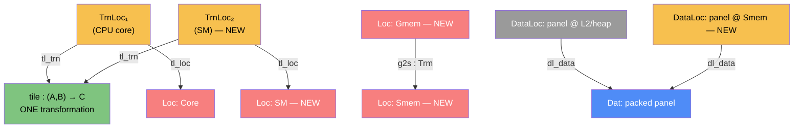

# plan-s41: the NVPTX leg — one `Trn`, a second `Loc`

Written: 2026-07-29 · S41 · by: Claude (orchestrator; category-architect skill)
Status: **RATIFIED (Sapir, 2026-07-29).** Step 1 built and gated; see §5.
Decided upstream: **NVPTX, not CUDA C** (Sapir, S38 §6 — the audit's blockers were unverified
and a 15-minute `llc` probe refuted them). This plan does not re-open that.
Drives: ADR-0033 D3/D4 (the second-consumer proof obligation) · ADR-0032 (genericity contract).
Prior: `sessions/2026-07-27-s38-trap-order-is-source-order.md` §6 (the probe) ·
`sessions/2026-07-28-s39-guards-gate-the-flow.md` (`guard_plan`, four realizations) ·
`sessions/2026-07-28-s40-the-arm-owns-the-loop.md` ("NVPTX inherits gating from scratch").

---

## 0. The one-line claim this leg tests

> One geometric deduction on the graph pays out on every backend.

That is the founding bet (ADR-0033 context, `tile-ladder-direction.md`). Its shape half is
**proven** — one affine-address rule matched matmul, FIR and attention. Its backend half has
**zero measurement**, and the number that says so is a grep:

```
tile_plan  llvm:  lib.rs:166 · func/core.rs:54 · func/drive.rs:411   (3 call sites)
           cuda:  0
elem_plan  llvm:  func/core.rs:55                                    (1 call site)
           cuda:  0
guard_plan llvm:  func/core.rs:22          cuda: host only, loop-touching sites strict (S40)
```

Re-verified 2026-07-29 against the current tree, unchanged since ADR-0033 recorded it on
2026-07-25. Nine sessions of ladder rungs — register blocking (S26), FMA + packing + panel
residence (S27/S27b), k-split + window + conv micro-kernels (S28), the KC nest (S29),
`elem_plan` (S37) — have had exactly one consumer.

**This leg either converts the claim into a measured fact or names the field the record does
not carry. ADR-0033 D4 makes both a successful discharge.**

---

## 1. The model — why this is a placement change and nothing else

### 1.1 Why model it categorically here

Because it settles what a second backend is *allowed to re-derive*. If a GPU matmul is a **new
transformation**, then deducing its geometry separately is legitimate. If it is the **same**
transformation at a different location, then any emitter that re-derives the geometry from the
graph instead of reading the record is duplicating a deduction that already exists — FRAMEWORK
§3's parallel-object mistake — and the record, not the emitter, is the thing that must be shared.

The model below says it is the second case. That is a claim about *the record*, not about crate
layout: where the emitting code lives is §2's packaging question, and the two are independent.

For scale, the current CUDA backend is 8,933 lines that consume none of the geometry queries and
sit at rung 0 — zero `__shared__`, zero `__syncthreads`, zero `dim3`, one thread per element,
block 256. That is stated as the size of the greenfield, **not** as a consequence of its being a
separate crate (see §2's correction).

### 1.2 The core category — unchanged `Trn`, new `Loc`, new `Trm`

The matmul kernel's transformation is `tile : (A, B) → C`, already recognized by `tile_plan`
and already placed on the CPU. S41 adds a second placement of **the same** `Trn`.



`runsAt` is a relation (§4.5 law 6), and this is the fibre over `tile` growing from one element
to two. **Nothing in `Dat` or `Trn` changes. No new `Operation`, no new `Ty` variant, no
`validate()` change, no `mapal-ir` edit** — the same bar `guard_plan` cleared at S39.

### 1.3 Morphism table — the new atoms only

| Morphism | Signature | Partiality | Semantics |
| --- | --- | --- | --- |
| `h2d` | `Trm`, `c_from=Host, c_to=Gmem, carries=Array` | Total | the input arrays cross PCIe |
| `d2h` | `Trm`, `c_from=Gmem, c_to=Host, carries=Array` | Total | the result comes back |
| `g2s` | `Trm`, `c_from=Gmem, c_to=Smem, carries=Panel` | Total | the cooperative tile stage |
| `s2r` | `Trm`, `c_from=Smem, c_to=Regs, carries=Elem` | Total | the per-thread accumulator read |
| `launch` | `Trm`, `c_from=Host, c_to=SM, carries=GridShape × Frame` | Total | the kernel launch |
| `tl_loc(TrnLoc₂)` | `→ SM` | Total | the tile kernel's GPU placement |
| `dl_loc(DataLoc₂)` | `→ Smem` | Total | **the pack `DataLoc` at the smem location** (ADR-0033 D3) |

### 1.4 The coherence law that *is* the correctness argument

FRAMEWORK §7.6 says Law 1 (placement honesty) becomes a literal hardware-bug detector at this
level, and here it names the classic GPU bug exactly:

> A transformation placed at `Smem` must have its inputs *materialised* at `Smem` or *delivered*
> to `Smem`. A thread reading the staged panel before `g2s` completes is reading a location no
> `Trm` has yet delivered to.

**`__syncthreads` (`llvm.nvvm.barrier0`) is not a GPU idiom to remember — it is the morphism
that makes `g2s` complete.** Omitting it is Law 1 failing, and the framework names the missing
transmission before the differential does. This is the plan's main structural claim and the
reason the model is worth writing before the code.

### 1.5 Composition rules the implementation must preserve

1. `tile_plan(ir, f)` returns the **same** `TileSite` values for both placements. Any GPU-only
   recognition is a violation — it would mean the record is a CPU record.
2. `eval ∘ emit_nvptx = eval ∘ interp` on the conformance face, bit-exact (ADR-0020's existing
   differential duty, the gate ADR-0033 D3 names).
3. No `mapal-ir` diff. If the leg needs a fact the record lacks, it is recorded as an
   ADR-0033 D4(b) finding, **not** patched into a query mid-leg.
4. Precision: the region's declared contract governs (ADR-0032 D3). The leg runs the **`exact`**
   face. `mma`/tf32 is out of scope (ADR-0033 D3 says so explicitly).

---

## 2. The seam — the decision this plan exists to take

A GPU program is two LLVM modules: a **host** module (host triple, driver-API glue) and a
**device** module (`nvptx64-nvidia-cuda`, `ptx_kernel` cc, no host calls). The question is where
the device module's emitter lives.

**This turned out to be the less important half of the section.** §2.2 holds the part that binds
in every option; the packaging choice below is a default, not a verdict.

Inventory that decides it (verified 2026-07-29):

- Both backends emit **textual LLVM IR by `String` concatenation** — no inkwell, no llvm-sys.
  `func/mod.rs:251 FnEmit` declares the `allocas`/`body` accumulators; `func/drive.rs:9 emit`
  finalizes. Deps are `mapal-ir` + `slotmap` only.
- **The emitted IR carries no machine text at all** — grep for `target triple`, `datalayout`,
  `x86`, `aarch64`, `avx`, `neon`, `addrspace` across `src/` and every `.snap` returns nothing.
  clang infers the host. So the target enters at the module preamble and nowhere else today.
- `mapal_par_*` coupling is **confined, not structural**: 4 sites, and after §2.3's split all
  four live in **one** file — `func/drive.rs` (`emit_parallel`, `emit_task`, `walk_filtered`,
  `emit_checkpoint`). `emit_morphism` contains **zero** `mapal_par_*` calls: the body walk is
  parallelism-agnostic, so the launch-glue substitution is confined to a single 672-line module.
- The op table (`func/ops.rs:10 emit_morphism`, ~25 `Operation` variants) emits `fadd`, `fmul`,
  `getelementptr`, `load`, `store` — **identical text on both targets**.
- `ty.rs` (133 lines), `loops.rs` (75), `reuse.rs` (226) are already target-generic.

**Correction (Sapir, at plan gate).** An earlier draft of this section claimed that forking is
*why* `backends/cuda` consumes zero geometry queries. **That was wrong and is retracted.** The
record says otherwise and this plan quotes it in §0: `tile_plan` landed at S25, the last CUDA
session was S23. CUDA stopped consuming because *work stopped on it*, not because it lives in its
own crate. Sapir: *"forking didn't stop the second consumer from being a consumer, it is just
because we stopped working on it and tailored for the cpu for the time being."* The packaging
question and the drift question are independent, and §2.2 replaces the causal story with the
mechanism that actually prevents drift.

| Option | Cost | Assessment |
| --- | --- | --- |
| **A. A new crate** (`backends/nvptx/`, the CUDA precedent) | duplicated op table unless deliberately shared | Best code locality per target; the real cost is *duplication*, not drift. Drift is prevented by §2.2's gate, which works in every option. |
| **B. Extract a shared emitter trait first** | touches ~90 `impl FnEmit` methods | Premature — ADR-0033 D5's own argument: "the second consumer is what tells us which parts of the llvm nest are schedule (generic) and which are `Loc` constants. Extracting first is the premature abstraction FRAMEWORK §5 forbids." Deferred to §8.5, judged on built code. |
| **C. A machine discriminator on `TargetProfile`** | ~4 branch sites + a preamble + address-space annotation | Shares the op table and the `tile_plan` call directly. Risk is **behaviour locality** — `if gpu` conditions spreading through a shared file (Sapir's objection). Acceptable only under §2.2's realization rule. |

**Verdict: this is a packaging decision, not an architecture one, and it is deliberately left
open until §2.2's two rules are in place.** Those rules bind in all three options; once they hold,
the choice between A and C is about where files sit and costs little either way. The default this
plan proceeds under is **C for the leg** — because reusing the identical op table and the
identical `tile_plan` call site is the cheapest way to get a *second consumer at all* — with §8.5
re-judging on the built code, and A remaining fully available.

### 2.1 What C looks like

`EmitOpts::target: &'static str` already resolves to a `&'static TargetProfile`
(`lib.rs:75` → `lib.rs:103` → `profile.rs:140 resolve`), threaded through `FnEmit::new`. Today
`TargetProfile` is flat CPU microarchitecture constants (`vec_regs`, `l2_bytes`, `tile_i` =
"half the register file") — meaningless for an SM.

Per FRAMEWORK §3, `GpuProfile` is **not a new object**: both are "counts of a machine resource
that bound a tile", differing only in which fields are populated. So it is `TargetProfile` plus a
`class` discriminator and partial fields — not a parallel struct with a translator.

| Field | CPU reading | GPU reading |
| --- | --- | --- |
| `vec_bytes` / `lanes` | SIMD lane count | **per-thread registers** (S38's finding: "one record field, two readings") |
| `l2_bytes` | L2 capacity | `smem_bytes` per block |
| `vec_regs` | register file | `max_threads_per_block` |
| *(new, partial)* | — | `warp` = 32 |

Branch sites for the GPU class: module preamble (triple + datalayout + `ptx_kernel`), the 4
`mapal_par_*` sites (→ launch glue), and pointer types in `ty.rs` (→ `addrspace(1)`/`(3)`).

### 2.2 The two rules that actually matter (Sapir, at plan gate)

Both are independent of packaging. Together they replace the retracted causal argument above.

#### Rule 1 — every consumer is gated, all the time

Sapir: *"the tests should guard it by checking all consumers all the time."* A geometry query
going stale on a backend is a **test gap**, not a code-layout consequence, and the fix belongs in
the gate:

- **Consumer-coverage gate.** A test enumerates every registered realization of a query and
  asserts each one consumes the record. A backend that quietly stops calling `tile_plan` fails the
  suite instead of drifting for nine sessions.
- **Record-identity gate.** For one IR, `tile_plan` must return **identical** `TileSite` values
  whichever realization is selected. Any per-target divergence in the *record* means a machine
  fact has leaked into `mapal-ir` — precisely the ADR-0032 violation ADR-0033 D4(b) asks the leg
  to report.

This is the durable answer. Had it existed at S25, the nine-session gap could not have opened
regardless of how many crates the backends live in.

#### Rule 2 — realizations are cohesive units, selected by capability, never scattered branches

Sapir's objection to C: *"branching per profile a bit, but can also imply less code locality of
behavior."* Correct, and it is the real risk in C. The distinction that resolves it:

| Kind of difference | Example | Mechanism |
| --- | --- | --- |
| **Same algorithm, different constants** | tile width 16 vs 32; "16 SIMD lanes" vs "16 per-thread registers" | a `TargetProfile` **field**. No branch — the code reads a number. This is most of the existing ladder. |
| **Different leaf, shared nest** | the innermost multiply-accumulate and how its operands are staged: SIMD `fmla` · NVIDIA `mma.sync` · ARM SME `fmopa` into a ZA tile · Intel AMX `TDPBF16PS` into a tile register | a **realization** — one cohesive code path swapped at the leaf. No profile number can express *which instruction*. |
| **Cooperation (GPU only)** | several threads share one staged panel and must synchronise | genuinely structural — a barrier morphism (§1.4). No CPU analogue, because on a CPU one thread owns its whole tile. |

The second kind needs a real fork *somewhere*; the question is only whether it is one cohesive
unit or a scatter of `if gpu` conditions. FRAMEWORK §4.4/§5 give the shape: parallel realizations
of one contract `TileSite → code` are **parallel arrows**, and "strategies self-register; the core
resolves one at runtime." So:

> The profile **declares a capability**; the capability **selects a realization**; each realization
> is one cohesive unit of code. The profile never branches the body of a shared emitter.

`emit_tiled_map` (CPU SIMD), an smem realization, an `mma` realization, an SME realization are four
arrows over one record — and adding one is *adjoining an object*, never editing the others.
Concretely for C, this bounds the GPU's footprint to the module preamble, the address-space
annotation, the launch-glue substitution, and **one selection point** — the ~6-branch budget in
§9. Exceeding it is the signal that A was right, and §8.5 is where that is judged.

#### Corollary — "when mma instead of fma?" is already decided, and it is not a speed question

ADR-0032 answers it with two conditions that must **both** hold:

1. **The region's declared precision contract admits it** (D1's `exact` / `contract` /
   `tf32-class` lattice). mma is reduced precision — it changes output bits — so this is a
   **language** fact carried by the program.
2. **The target's capability matrix says the unit exists** (D3). A **machine** fact.

Both true ⇒ the mma realization fires. Either false ⇒ the exact fallback, same source, no code
change — D3: "The backend can honor the declared contract or fall back; it never violates it."

**Precision is a language fact, the unit is a machine fact, and they must agree.** A unit is never
selected because it is faster; it is selected because the program permitted the precision *and*
the chip has the hardware. SME and Intel AMX are the identical shape, already queued as
"hardware-specific units as a per-`Loc` capability, never a mapal-ir fact" (S39 P1). This also
keeps `mma` cleanly out of S41's scope (§7) without leaving the question unanswered.

### 2.4 The parallel CPU track — SME, and the two things called "AMX"

Sapir asked whether the matrix-unit work can run alongside the GPU leg. It can, but **not as
"AMX"** — that name is ambiguous and the ambiguity has been sitting in `next-session.md:64`
("Hardware-specific units (AMX / tensor cores)") without saying which is meant.

| Name | What it is | Documented? | Reachable by a compiler? | Present here? |
| --- | --- | --- | --- | --- |
| **Apple AMX** | Apple's matrix coprocessor, M1–M4 | **No** — no public encoding | **No** — Accelerate (BLAS/vDSP/BNNS) is the only door | yes (M4 Pro) |
| **Intel AMX** | ISA extension: tile registers, `TDPBF16PS` | yes (Intel SDM) | yes (LLVM target feature) | **no** — i9-14900F reports `amx flag count: 0` |
| **ARM SME/SME2** | ARM's *architectural* matrix extension: ZA tile registers, `fmopa` outer-product accumulate | yes | **yes** — LLVM 22.1.8 has `sme`, `sme2`, `sme-f64f64`, `sme-mop4`, and knows `-mcpu=apple-m4` | **yes** — M4 Pro reports `FEAT_SME=1`, `FEAT_SME2=1`, `FEAT_SME_F64F64=1` |

Verified 2026-07-29 by direct probe on both machines. So **SME is the only matrix unit in this
project's reach that a compiler can emit**, and it is on the development laptop.

**Why it is worth doing alongside.** S33 measured numpy 3.3× ahead on M4 matmul and concluded
"the M4 matmul gap is silicon, not code generation" — numpy → Accelerate → the coprocessor. SME
is a documented ISA path to matrix silicon on the same part, so that conclusion stops being a
closed file and becomes testable: Sapir's goal, in his words, *"match/beat numpy with our generic
proof compiler instead of hand written code."*

**Why it is cheap.** By §2.2's corrected taxonomy, SME is a **leaf swap inside the existing
nest** — same `Loc` class, same memory hierarchy, same `mapal-rt` threading, same host module, no
address spaces, no launch glue, no barriers. It reuses the i-region / j-split / k-loop / packing
structure S26–S30 built and replaces the innermost multiply-accumulate. The GPU leg is the
expensive one precisely because it adds cooperation, which SME does not.

**What it does and does not discharge.** It is a real second consumer of `tile_plan` and it
exercises §2.2's consumer-coverage gate immediately. It is **not** a substitute for the GPU leg
under ADR-0033: the ADR asks for "a second, structurally different `Loc`", and SME is the same
`Loc` class. Complementary, not a discharge.

#### The SME probe — 4/4, run before promising anything (the S38 method)

S38's method note: *"A verdict from a fleet of agents is a hypothesis, not a result."* So SME was
probed the same way NVPTX was, on 2026-07-29, LLVM 22.1.8:

| Question | Result |
| --- | --- |
| does LLVM lower an outer-product accumulate into ZA? | ✅ `llvm.aarch64.sme.mopa.nxv4f32` → **`fmopa za0.s, p0/m, p1/m, z0.s, z1.s`** |
| is streaming mode handled, or hand-rolled? | ✅ LLVM emits `zero {za}` / `smstart za` / `smstop za` **automatically** from the `aarch64_pstate_sm_enabled` + `aarch64_new_za` attributes |
| does the hardware report the extension? | ✅ M4 Pro: `FEAT_SME=1`, `FEAT_SME2=1`, `FEAT_SME_F64F64=1` (`FEAT_SME2p1=0`) |
| what is the tile shape? | ✅ **measured, not assumed** — `rdsvl` on this machine returns **SVL = 64 bytes (512 bits)**, so ZA is 64×64 B, one f32 tile is **16×16**, and there are **4** f32 tiles (8 at f64) |

**The accumulator arithmetic, which is the reason to expect a win.** The two quantities Sapir's
unification names are exactly the two `TargetProfile` already models — how big one accumulator
block is, and how many stay resident. SME moves both into a dedicated file:

| | NEON path today | SME |
| --- | --- | --- |
| resident accumulator | `tile_i(4) × tile_j(16)` = **64 f32** | 4 ZA tiles × 16×16 = **1024 f32** |
| vector registers consumed by it | 16 of 32 (`tile_i` is literally "half the file") | **0** — ZA is separate silicon |
| vector registers left for staging | 16 | **32** |

**16× the resident accumulator, and the whole NEON file freed for staging.** That is the
quantified form of Sapir's framing: the unit holds more data, and the core's own registers stay
hot for feeding it. It also means `tile_i`'s "half the register file" policy has no meaning under
SME — the SME realization needs its *own* derivation of the same quantity, which is the first
concrete ADR-0033 D4(b)-shaped finding on the CPU side.

#### The SME execution probe — it RUNS, and it found two facts that would have cost days

Compiling proved nothing about executing, so the probe was carried to a running 16×16 matmul
checked against a scalar reference. Both findings below came out of that ten minutes.

**Finding 1 — `-march=armv9-a+sme2` produces a binary that SIGILLs on this machine.**
The faulting instruction is `cntd` (an SVE instruction) in the prologue, *outside* streaming mode.
The M4 has **SME without full SVE** — `FEAT_SME=1`, `FEAT_SME2=1`, but `FEAT_SVE` is unset — and
`armv9-a` implies `+sve`, so LLVM emits non-streaming SVE the hardware does not implement.
Working configurations, all verified: **`-march=armv8-a+sme2`**, `armv8.5-a+sme2`, or explicit
`armv9-a+sme2+nosve`. Any SME realization must target the **streaming-only** configuration; this
is a per-`Loc` capability fact and belongs in the profile, never in `mapal-ir`.

Also recorded from the same probe: `__arm_new("za")` is a *declaration* attribute and
`__arm_streaming` is a *type* attribute — they sit on opposite sides of the parameter list, and
swapping them is a compile error, not a silent misbuild.

**Finding 2 — `fmopa` fuses, so SME is a `contract`-face unit.** The same 16×16 kernel, run on
values that actually round, compared against two references:

| SME `fmopa` vs | Result |
| --- | ---: |
| separate mul + add (the **`exact`** / conformance face) | **92/256 differ** |
| fused `fmaf` (the **`contract`** face) | **0/256 differ** |

So SME is not a free speedup — it is a **precision-class realization**, and ADR-0032 decides when
it may fire, exactly as §2.2's corollary predicted before the probe ran: the region's declared
contract must admit single-rounding (D1) **and** the target must have the unit (D3); otherwise the
`exact` fallback runs, same source, no code change (D3: "never violates it").

This is convenient rather than limiting. Every published matmul number is already `flow-fma` — the
contract face (`EmitOpts::contract`, S27) — so SME is available precisely where the numpy
comparison lives. It also inherits the *existing* position of that face: the bit-exact differential
gate runs on the conformance face, and the contract face is measured-and-published but not
byte-equal to the interpreter, which is a known documented state (S36d's `Operation::Fma` plan is
what would close it), not a new hole this leg opens.

Per-output-element accumulation order under `fmopa` is the sequential `k` order — the same left
fold the scalar and NEON paths use — so the ordering half of bit-equality is preserved by
construction; only the rounding count differs.

#### The target, in absolute milliseconds

Sapir: *"I want to see results against the tests we already ran in performance folder … if we can
beat numpy on here this is a huge result."* So the bar is not invented — it is the existing M4 Pro
matmul table, `docs/performance/matmul/s33.md:150-158`, f32, numpy → Accelerate → the coprocessor:

| N | flow-fma-1t (ms) | numpy-1t (ms) | 1t gap | flow-fma-par (ms) | numpy-thr (ms) | par gap |
| ---: | ---: | ---: | ---: | ---: | ---: | ---: |
| 512 | 2.1766 | 0.1600 | numpy 13.6× | 0.4073 | 0.1075 | numpy 3.8× |
| 1024 | 17.5449 | 1.2977 | numpy **13.5×** | 2.2281 | 0.6757 | numpy **3.3×** |
| 2048 | 152.07 | 10.529 | numpy 14.4× | 18.4645 | 5.3045 | numpy 3.5× |
| 4096 | 1256.29 | 84.617 | numpy 14.8× | 151.24 | 44.143 | numpy 3.4× |

**This is the only table where numpy beats Mapal on this machine.** On the shape ladder Mapal is
already 4.2–8.5× *ahead* of numpy at 1t (`s33.md:108-113`: fir 65 536 0.0904 vs 0.3929; conv2d
512 0.0466 vs 0.3968). Matmul is the exception, and S33's verdict was "hardware, not software".

Reaching 1t parity at 1024 means ~14×, from 17.5449 ms to ≈1.30 ms. Whether that is reachable is
the open question the leg answers; the arithmetic at least admits it — one `fmopa` at SVL=512
retires a 16×16 f32 outer product (512 flops), so a single SME pipe at this clock is in the same
order as the ≈1.6 TFLOP/s Accelerate is achieving in that 1.2977 ms cell, while the NEON path is
delivering ≈0.12 TFLOP/s. **Order-of-magnitude plausible, entirely unproven — do not quote this
paragraph as a projection.**

Reporting rules that bind here (the standing measurement rules, S36c/S37/S38): the **FMA face**,
not conformance — every leg in the table above is `flow-fma`, and comparing a conformance build
against Accelerate would repeat S36c's exact error; absolute ms with the baseline commit named,
never ratios alone; ≥50 alternating runs before any sub-10% claim; and the value-identity check
before any timing is reported at all.

**The measurement that must come first, before any tuning claim.** Whether M4's SME and M4's
Apple-AMX are the same physical block is **not publicly documented** — widely assumed, not
confirmed. It decides what a numpy comparison means: same silicon ⇒ a fair compiler-vs-Accelerate
fight; different silicon ⇒ a different claim entirely. One SME matmul against one Accelerate
matmul at one size settles it, and it is cheap. **Do not publish a numpy comparison before this
is answered** — it is exactly the class of confound S36c's FMA-face finding was.

### 2.3 Prerequisite, DONE — `func.rs` split into `func/` (Sapir's directive)

Option C's honest cost was that it grows a 7,299-line file. That objection is now removed: the
single `func.rs` is split into a `func/` module tree, so a GPU branch lands in the one submodule
that owns the concern instead of somewhere in a seven-thousand-line wall.

The `impl<'a> FnEmit<'a>` block ran lines 562–7128 — **6,567 lines in one impl**. It is now
eleven submodules, each a child of `func`, each holding its own `impl<'a> FnEmit<'a>` block:

| Module | Lines | Owns |
| --- | --- | --- |
| `func/mod.rs` | 745 | `FnAttrs`, `FrameLayout`, `FnEmit`'s declaration, site predicates, llt helpers, free helpers |
| `func/core.rs` | 820 | slots, name minting, loads/stores, heap + packed buffers, trap sites |
| `func/frame.rs` | 232 | storage prep, elided arrays, local slots, `%Frame` layout |
| `func/drive.rs` | 672 | `emit`, `emit_parallel`, `emit_task`, the `topo_order` walks |
| `func/ops.rs` | 743 | `emit_morphism` and the scalar ops |
| `func/tile.rs` | 492 | tile entry, `emit_tiled_map`, the register-blocked main tile |
| `func/window.rs` | 382 | the FIR 1-D window rung |
| `func/conv.rs` | 828 | the conv2d micro-kernel rung |
| `func/packed.rs` | 971 | BLAS rung 3 — packed j-outer panel + KC nest |
| `func/trio.rs` | 761 | the main tile trio |
| `func/vec.rs` | 377 | the vector path |
| `func/bulk.rs` | 428 | map, fold, zip, enumerate, iota, fill |

Visibility is *exactly* preserved, not widened: previously-private methods became `pub(super)`,
which makes them visible throughout `func` and its children — the same surface a single
`func.rs` had. Nothing leaked to `pub(crate)` that was not already there (13 before, 13 after).

**Proven a pure refactor, not asserted.** Per measurement rule 9/10 and the S31 A/B rule:

| Check | Result |
| --- | --- |
| A/B emission sweep, 53 sources × 3 faces | **159/159 byte-identical**, pre vs post |
| re-run after `cargo fmt` reflowed the widened signatures | **159/159 byte-identical** |
| methods preserved | 113 in the old impl, 113 in the new submodules |
| `cargo fmt --check` | clean |
| build warnings | zero |

Note that the byte-identity sweep is the right instrument here and the test suite is not
sufficient on its own: a refactor that silently reordered emission would pass every unit test and
move goldens only where a golden happens to exist. 159 emissions is the wider net.

Residual honest cost of C: a GPU branch still lives inside the crate that serves the CPU. §8.5
re-judges that on the built code rather than on this prediction.

---

## 3. Toolchain and hardware — the leg can actually run

Verified 2026-07-29 by direct probe, not assumption:

| | Mac (dev) | Arch box `100.81.226.103` |
| --- | --- | --- |
| `llc` with `nvptx64` target | ✅ LLVM 22.1.8 | ➖ not installed; `extra/llvm 22.1.8-1` available — **same version, no skew** |
| `nvcc` / `ptxas` / `cuobjdump` / `nvdisasm` | ❌ | ✅ **CUDA 13.3.1 already installed** at `/opt/cuda/bin` (not on `PATH` — that is why an earlier `command -v nvcc` said absent) |
| `compute-sanitizer` | ❌ | ✅ `/opt/cuda/bin` |
| driver API | ❌ | ✅ `libcuda.so.610.43.03` |
| GPU | ❌ | ✅ **RTX 4070 Ti, sm_89 (Ada), driver 610.43.03, 12 GB** |
| `cargo` / `rustc` | ✅ | ✅ 1.90.0 |
| `gcc` | (clang 22.1.8) | ✅ 16.1.1 |
| repo checkout | ✅ | ❌ none yet — the one real setup step |
| disk free | — | 894 GB |

**The box needs no installation.** `cuda` is already there; `llc` is optional because the device
`.ll` can be lowered to PTX on the Mac (the established cross-compile pattern for this box) and
only `ptxas` + the driver need to run remotely. `sudo` on the box needs a password, so any install
is Sapir's to run — and as of this probe, none is required.

**The GPU box already exists and is owned.** This was not recorded anywhere in `docs/` — prior
GPU legs (S23/S24) rented a vast.ai 4090 at ≈$0.42/session. Consequences:

1. No rental step, no box-destruction gotcha, no `vastai` lifecycle in the handoff.
2. **GPU and CPU numbers come from the same machine** — the S33 cross-machine leg's baselines and
   this leg's GPU numbers are same-silicon comparable, which no prior GPU measurement could claim.
3. `perf` works there (unlike vast.ai containers, which drop `CAP_PERFMON`).
4. sm_89 has 4th-gen tensor cores but **no MXFP block-scale** (that is sm_100/Blackwell) — the
   S38 probe's MXFP intrinsics are emittable but not runnable here. Irrelevant to this leg
   (`mma` is out of scope) and recorded so a later precision rung does not assume otherwise.

The emitted CUDA header already pins `-arch=sm_89` (`cuda/src/lib.rs:159-165`) — the exact
capability of this GPU.

### 3.1 The local no-hardware ceiling

The CUDA differential already skips-with-reason without `nvcc` and is backstopped by
`examples/emit_sweep.rs` (a 320-draw emission sweep that needs no toolchain, S23). NVPTX gets a
**stronger** local rung for free, because `llc -march=nvptx64` **is** present on the Mac:

| Rung | Needs | Proves |
| --- | --- | --- |
| emit | nothing | the module is produced |
| **`llc -march=nvptx64` → PTX** | **local `llc` only** | the IR is *valid NVPTX* — catches bad addrspaces, bad cc, bad intrinsics |
| `ptxas` | box | PTX assembles for sm_89 |
| run + differential | box + GPU | bit-exactness vs the oracle |

Rung 2 is the new one: most of what a fresh backend gets wrong is caught on the laptop, before
any hardware run. That is the same lesson as S23's fold bug (found only on hardware because no
local rung existed for it).

---

## 4. ADR-0033 D2's three lines, pre-registered

D2 requires every rung to record these *before it ships*. Answered where known; the leg answers
the rest.

**(a) Which `tile_plan` fields it consumes.** The record is (verified in
`crates/mapal-ir/src/algo.rs`):

```
TileSite { rows, c, k, a: TileRead, b: TileRead, seed, elem, mul_a_first, add_acc_first }
TileRead { slot, base, ci, ck, clane, ksplit: Option<TileKSplit{div,cq,cr}> }
```

Pure affine address geometry — `addr = base + ci·i + ck·k + clane·lane`, in elements. No machine
fact in it. The smem stager needs `slot`/`base`/`ci`/`ck`/`clane` to know *what* to stage;
`rows`/`c`/`k` to size the stage; `elem` for the type; `mul_a_first`/`add_acc_first` to preserve
operation order (which is what keeps bit-exactness).

**(b) The CUDA realization, named against the record.** `ci == 0` means the read is invariant in
the row axis — on CPU that licenses row blocking, on GPU it means **the whole thread block shares
that read**, which is precisely the smem staging condition. `clane` is the coalescing stride:
`clane == 1` is a coalesced load, `clane > 1` is strided and wants a transposed stage. The
`ksplit` decomposition is the same axis split in both languages.

**(c) Machine facts the record does not carry — the open answer.** Predicted, to be confirmed or
refuted by building: warp size, smem capacity, bank count/conflict geometry, and the launch
shape. All four are per-`Loc` capabilities and belong in the profile (ADR-0032), **not** in
`mapal-ir`. The one already found by S38 is the `<TJ x elem>` ambiguity — SIMD lanes on CPU,
per-thread registers on GPU: one record field, two readings, and the leg must say whether that
ambiguity is benign or a genuine gap.

---

## 5. Build order

Each step ends at a runnable check. Steps 1–4 need **no hardware**.

| # | Step | Check |
| --- | --- | --- |
| 1 | ✅ **DONE** — `TargetProfile` gains `Machine::{Cpu, Gpu(Gpu)}` + the `cuda-ada` profile (sm_89: warp 32, 48 KB smem, 1024 threads/block, verified against the device) | ✅ **159/159 byte-identical** vs baseline; 9/9 profile tests green, 4 new. Every pre-S41 profile pinned `Cpu`, GPU facts reachable only via `gpu() -> Option`, CPU-shaped placeholders pinned as inherited-not-measured. `cuda-ada` resolves and today emits identically to `generic` — no realization consumes it yet, which is what step 1 means |
| 2 | Device module preamble: `nvptx64-nvidia-cuda` triple + datalayout, `ptx_kernel` cc on kernels, `addrspace(1)` globals | `llc -march=nvptx64` accepts the empty module |
| 3 | The thread-index prologue via `llvm.nvvm.read.ptx.sreg.{tid,ntid,ctaid}.x`; one recognized matmul `TileSite` emitted as a **naive** (no-smem) kernel | `llc` → PTX contains `.visible .entry`; local golden |
| 4 | The smem rung: `addrspace(3)` panel + cooperative stage + `llvm.nvvm.barrier0`, driven by `ci == 0` / `clane` from the record | `llc` → PTX contains `.shared` + `bar.sync`; local golden |
| 5 | Host launch glue: driver API (`cuModuleLoadData`/`cuLaunchKernel`) replacing the 4 `mapal_par_*` sites for the GPU class | host module compiles and links |
| 6 | **Box bring-up**: repo checkout only — `/opt/cuda` is already installed; `ptxas` the PTX | PTX assembles for sm_89 |
| 7 | **The differential on hardware** — ADR-0020's duty, conformance face | bit-exact vs the interpreter oracle |
| 8 | One measurement: the smem kernel vs the untiled GPU path, one size, compute-only (ADR-0033 D4(c)) | a number, either sign |

`guard_plan` is **not** in this leg. S40 recorded "NVPTX inherits gating from scratch", and
S39 recorded that a gate has four realizations of which warp divergence is one — but a gate on a
matmul tile site is not what this leg tests. Deferred to §8 explicitly rather than silently.

---

## 6. Tests

- **Local goldens** for the device module (the `golden_ll` pattern), one per build step.
- **An `llc` gate** — a test that shells `llc -march=nvptx64` and asserts exit 0 on every emitted
  device module. This is the rung that does not exist for CUDA C and is the main reason NVPTX is
  cheaper to trust: validity is machine-checkable on the laptop.
- **The two §2.2 gates — the durable part of this leg.** These outlive S41 and are the actual
  answer to the nine-session drift; write them even if everything else slips:
  - **Consumer-coverage gate.** Enumerate every registered realization and assert each consumes
    the geometry record. A backend that stops calling `tile_plan` fails the suite that day
    instead of drifting silently. Sapir: *"the tests should guard it by checking all consumers
    all the time."*
  - **Record-identity gate.** On one IR, `tile_plan` returns identical `TileSite` values whichever
    realization is selected. Composition rule 1 made a test; any divergence in the record means a
    machine fact leaked into `mapal-ir`, which is exactly the ADR-0033 D4(b) finding to report.
- **The hardware differential** — extend the existing duty; skip-with-reason locally, never faked.
- A negative control: with the `barrier0` removed, the differential must fail (Law 1, §1.4).
- **`compute-sanitizer --tool racecheck` on the box** — it is already installed, and it detects a
  missing `__syncthreads` *directly*, as a shared-memory hazard, rather than waiting for the
  differential to get unlucky. This is §1.4's law failure made machine-checkable: the framework
  predicts the bug class, and the tool names the exact line. Run it once on the smem kernel and
  once on the barrier-removed negative control; the control must report a hazard.

---

## 7. Not doing

- **`mma` / tensor cores / tf32.** ADR-0033 D3 puts it out of scope; it is the precision-face
  rung (ADR-0032 D1/D3) and follows once the memory rung is measured. The 804 intrinsics the S38
  probe found are not going anywhere.
- **Deleting `backends/cuda`.** It stays green and untouched this leg. Its removal is a decision
  for after NVPTX demonstrably covers its ground — not a scope item to smuggle in here.
  (It has zero dependents, so removal is cheap whenever it is taken.)
- **Region-based emission** (cuda suggestion #0, one kernel per maximal device region). Real and
  language-independent, but it is a second thesis; this leg tests one.
- **The whole op surface.** Only what one matmul site needs. Anything else is `Unsupported`.
- **A `mapal-ir` change of any kind.** If one looks necessary, that is a D4(b) finding and a stop.

---

## 8. Done when

1. A `tile_plan`-recognized matmul site runs on the 4070 Ti through PTX, **differential
   bit-exact** against the interpreter oracle on the conformance face. *(This is S38's own
   done-bar for the P0, verbatim, with the GPU changed from a rented 4090 to the owned box.)*
2. ADR-0033 D4's three answers are recorded in the session log **whatever they are** — including
   the negative result, which D4 defines as a successful discharge.
3. **Both §2.2 gates are green and permanent** — consumer-coverage and record-identity. This is
   the item that must not be traded away: it is what makes a *third* backend cheap and what
   would have prevented the S25→S41 drift regardless of packaging.
4. One compute-only measurement exists, either sign, with the machine stamped on it.
5. The §2 seam is re-judged **on the built code**: does the machine discriminator hold, or did the
   GPU branches spread far enough that option B (extract the emitter trait) is now the measured
   answer? ADR-0033 D5's `block_plan` gate discharges here too.

Not required: beating anything. A GPU leg that is bit-exact and slow is a discharge; a fast one
that skipped the differential is not.

---

## 9. Risks

| Risk | Signal | Response |
| --- | --- | --- |
| The GPU branches metastasize through the shared emitter (Sapir's locality objection) | more than ~6 `class` branches outside the 4 known sites, or any branch inside `emit_morphism` | stop and switch packaging — §2.2 Rule 2 is the invariant, option A the fallback. Recorded as §8.5, a measured answer, not a failure |
| A realization is bolted on as scattered conditions instead of a cohesive unit | a new target requires edits in more than one existing realization | §2.2 Rule 2: adding a realization is *adjoining an arrow*, never editing a sibling |
| The record turns out insufficient for smem | a fact must be re-derived locally in the emitter | **record it** — that is D4(b) and the leg's actual product |
| ~~Box bring-up eats the session~~ | — | **retired by probe**: CUDA 13.3.1 is already installed, the box's available `llvm` is 22.1.8 (identical to the Mac's, no skew), and steps 1–4 need no box at all |
| Bit-exactness fails on float order | differential diverges at the accumulate | `mul_a_first`/`add_acc_first` exist in the record precisely for this; honor them before touching anything else |
| Scope creep into `mma` | "while we're here" | §7 |
