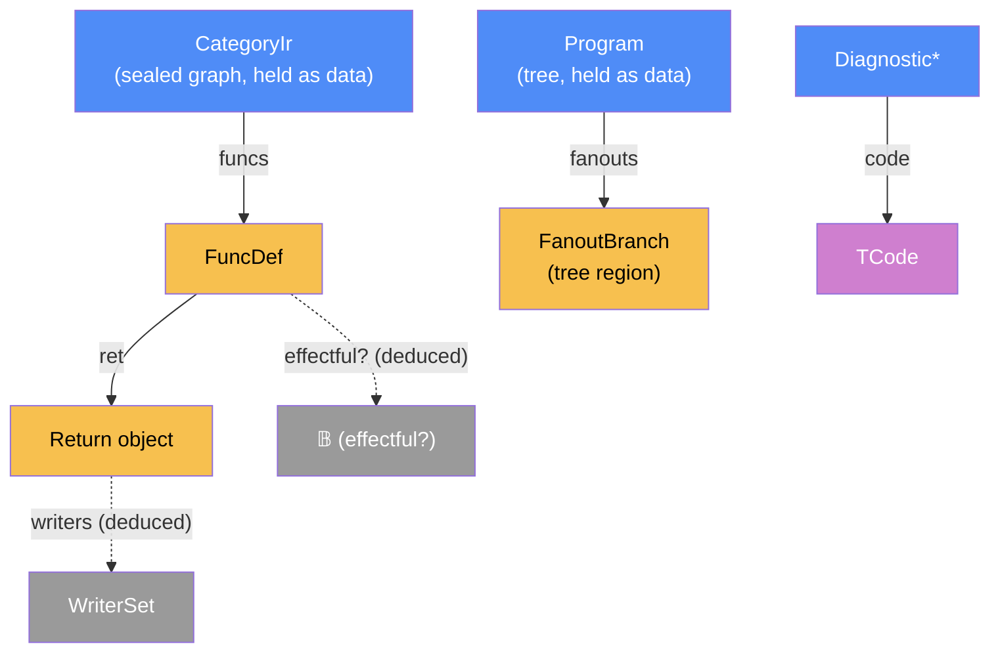

# Component: check — DESIGN

Written: 2026-07-16 · Session 10 · Status of this doc: increment 1 (P3 completion) — authoritative for `crates/mapal-check`
Spec authority: ADR-0003 (E2: no effects in parallel fanout; the effect checker is mapal-check's) > ADR-0004 (E3: memory guarantee scoped to the first-order non-cyclic core) > ir/DESIGN §9/§17 (I-RET permits ≥1 full-value Return writers; exclusivity is check's) > lower/DESIGN §12 (the deferral ledger) > architecture.md §2.2.4/§2.2.5 (per-morphism type predicate; frontier/escape) > user-guide §5–§7. Check consumes the **sealed, `validate()`-clean** `mapal_ir::CategoryIr` **plus the `mapal_syntax::Program` tree** (CK1, §1) and emits structured diagnostics only; it discharges exactly the obligations interp assumes (interp/DESIGN §9, IN3).

## Categorical model (Dat + Trn)

**Firewall.** These are the compiler's own Level-B `Dat` types, not Mapal-Cat arrows. The crate holds two Level-A-adjacent constructs **as data only**: the `Program` tree and the sealed `CategoryIr` graph. Nothing here restates `category-ir.md`.

**Physical pair.** Degenerate (FRAMEWORK §7.1) — `Dat` + `Alg` only (categorical-model.md §3: check is a frontend filter in the single-process pipeline).

### Why (one paragraph)

The categorical lens makes three things exact that prose would blur. (1) **Check is the completion of the pipeline's partial functor**: `lower/check : 𝒮 ⇀ Core` (categorical-model.md §7.3) — lower's domain restriction is "what can be built at all"; check restricts further to "what is legal", and *accept = empty diagnostic word*, so the domain of the composite is precisely Mapal-Core. (2) **Effectfulness is composition, not annotation**: a fanout branch is a Kleisli composite, and the composite is effectful iff any factor is — which is why E2 is checked through the *lowered signatures* (`token ∈ sig`) rather than re-inferred: the token-in⇒token-out synthesis (ir §8) already computed the closure. (3) **The two real checks are fibre computations**: Return writers are the fibre `in_edges(ret)` (deduced from adjacency, never stored), and per-function effectfulness is deduced through `ty_contains_token` — both are §5 "deduce, don't store" applied literally.

### Core category



### Morphism table

| Morphism | Signature | Partiality | Semantics |
| -------- | --------- | ---------- | --------- |
| `funcs` | `CategoryIr → FuncDef*` | Total | insertion-ordered function iteration (ir read API) |
| `ret` | `FuncDef → Return object` | Total | `fd.output`; kind `Return` (builder-guaranteed) |
| `writers` | `Return object → 𝒫(MorphismId)` | Deduced | full-value writers = non-`Pair` in-edges of `ret` — read off `in_edges`, never stored |
| `effectful?` | `FuncDef → 𝔹` | Deduced | `ty_contains_token(ty(input)) ∨ ty_contains_token(ty(output))` — the lowered signature *is* the effect closure (ir §8 token synthesis); never recomputed from the tree |
| `fanouts` | `Program → FanoutBranch*` | Total | every branch of every `StageKind::Fanout` stage, at every nesting level (tree walk); a `Fanout` opens the illegal-effect context unconditionally (`FanoutKind` is `Plain \| Void`; `Void` is P0113-rejected at parse, out of Core, unreachable here). `seq` is a **distinct node** now (`StageKind::SeqBlock`, ADR-0019), not a fanout kind — it recurses with sticky context, never opening the context itself |
| `name_text` | `Name × Src → 𝕊` | Total | identifier text is `&source[span]` — `Name` nodes carry spans only (ast.rs), which is why `Src` is an input (CK1) |
| `code` | `Diagnostic → TCode` | Total | the stable machine code (`"T####"`) |
| `exclusivity` | `CategoryIr → Diagnostic*` | Total | pass 1 (§3) |
| `effects` | `Src × Program × CategoryIr → Diagnostic*` | Total | pass 2 (§4) |
| `check` | `Src × Program × CategoryIr → Diagnostic*` | Total | **the component**: `concat ∘ ⟨exclusivity ∘ π₃, effects⟩`; empty = accept |

(`Src` = the source text `𝕊`, the same value `parse` and `lower` take. The three pass morphisms are `Trn` objects — listed in the Passes table; the Dat diagram above draws the data olog only, per the interp/ir precedent, and this note is the required parity remark.)

### Passes (Trn)

| Trn | t_from | t_to | Effect |
| --- | ------ | ---- | ------ |
| `exclusivity` | `CategoryIr` | `Diagnostic*` | pure |
| `effects` | `Src × Program × CategoryIr` | `Diagnostic*` | pure |

Both are total folds over deterministic iterators; `check` is their concatenation in the free monoid `Diagnostic*`. There is no third pass: the typing obligation is discharged at the boundary (§1) and E3 is vacuous (§5).

### Composition rules / invariants

- **C-check-1 (boundary).** `check`'s domain is the sealed, validate-clean graph: `debug_assert!(validate(ir).is_empty())` at entry — `validate` was designed as exactly this debug-assert hook for future passes (ir/DESIGN §11). Check re-derives **no** I-ledger clause and no §5.1 typing row (the golden oracle stays test-only, untouched).
- **C-check-2 (discharge).** `check(p, ir) = ε` ⟹ interp's IN3 assumption is sound: at most one full-value writer exists per Return, so at most one fires per run.
- **C-check-3 (deduce, don't store).** `effectful?` and `writers` are fibre computations over borrowed data; the crate materialises no cache of either (the only owned allocation is the output `Vec<Diagnostic>` and a transient name→FuncId map, rebuilt per call).
- **C-check-4 (effect-through-composition).** A fanout branch is illegal iff its Kleisli composite is effectful, i.e. iff any morphism in the branch subtree is a `print`/`println`/`time` builtin (S29: the clock read threads the IO token exactly like a print, so it is an effect site by the same argument — plan-time-builtin) or a call to `f` with `effectful?(f)`. The walk **discriminates on node kind** (ADR-0019, the natural reading): a `StageKind::Fanout` opens the illegal context **unconditionally** (its branches race); a `StageKind::SeqBlock` recurses with the context **unchanged (sticky)** — a top-level `seq` never opens it (it is the legal effect site the T0201 message points at), and an inner `seq` inside a branch does not clear it (`effectful?(seq b) = ⋁ effectful?(body)` — composition with a sequencer does not make the *branch* pure, and sibling branches still race). The old "context-sensitive, keyed on the `FanoutKind` field" reading is gone with the `FanoutKind::Seq` summand (`seq` is its own node now).
- **C-check-5 (determinism).** Output order is a function of `(program, ir)` alone: exclusivity findings in `funcs()` insertion order, then effect findings in tree walk order. No `HashMap` anywhere (D2 discipline).

### Bridges

| Bridge | Signature | Stored? | Semantics |
| ------ | --------- | ------- | --------- |
| source intake | `&str → (this crate)` | borrowed `&` | identifier text — `Name` nodes are spans; text is `&source[span]` (same reason `lower(source, &program)` takes it) |
| tree intake | `mapal_syntax::Program → (this crate)` | borrowed `&` | fanout-block shape + the `Fanout`-vs-`SeqBlock` node-kind distinction (ADR-0019) — the facts the sealed graph cannot carry (§4, CK1; lower/DESIGN §0-B obligation 5 pins that the tree keeps them *because* they change E2 legality) |
| IR intake | `mapal_ir::CategoryIr → (this crate)` | borrowed `&` | read API only (`funcs`/`object`/`in_edges`/`ty_contains_token`); never mutates; same intake as interp |
| diagnostics out | `(this crate) → mapal_syntax::Diagnostic*` | owned `Vec` | structured, render-free (C3 / ADR-0008); `mapal-cli` is the lone renderer |

---

## 0. Scope of increment 1 (P3 completion)

In: the two passes (§3, §4); the T-code catalogue (§2); the E3 vacuity record (§5); acceptance over all nine in-Core examples (§7). Out (each with an owner): E3 frontier/escape when heap ops exist (§5); channel-era effect structure (ADR-0003 post-M5); multi-route-loop exclusivity loosening (lower OQ7); IN6/IN7 numeric ADRs (interp §14 — not check passes).

**What check does NOT do (and why that is the design, not a gap):**

- **No typing pass.** Builder I2 (per-call) and `validate::edge_type_ok` (independent re-derivation) already certify the §5.1 table for every sealed graph; lower's contract guarantees validate-clean output (lower §1). The typing obligation is discharged **by construction** — the residual on the sealed graph is empty; re-walking §5.1 here would be a third copy of the one table (FRAMEWORK §5, one source of truth). **This supersedes lower/DESIGN §12's "mapal-check re-walks the sealed graph (§11.2 phase-2)" clause**, which predates the builder-I2 + `edge_type_ok` discharge argument (and whose "§11.2" pointer was dangling); lower §12 is amended to point here in the same change (§6.3 reconcile-with-the-change).
- **No name/recursion/token checks.** L11xx (lower), I6 acyclic references (validate), I4/I4b/I5 token linearity (validate) — all upstream.
- **No runtime policing.** Exclusivity is enforced *statically* (§3); interp keeps trusting (IN3) — now soundly.

## 1. Contract & boundary

```rust
pub fn check(source: &str, program: &mapal_syntax::Program, ir: &CategoryIr) -> Vec<Diagnostic>
```

- Empty vec = accept. Non-empty = reject; diagnostics are `mapal_syntax::Diagnostic` with `severity: Error`, `fix: None` (v1, same as lower).
- **Why the tree + source parameters (CK1):** E2 is not decidable on the graph lower emits — lower token-threads a fanout branch and a `seq` block identically (a fanout branch carries no kind marker in the graph, and `seq` has **no IR footprint at all** — ADR-0019 pin d — its ordering *is* the token thread), so print-in-fanout and print-in-seq seal to indistinguishable graphs; the node-kind distinction (`StageKind::Fanout` vs `StageKind::SeqBlock`) exists only in the tree (and lower/DESIGN §0-B obligation 5 pins that the tree keeps it *because* it changes E2 legality). `source` rides along because `Name` nodes carry spans, not strings — identifier text is `&source[span]`, the same reason `lower(source, &program)` takes both. Effect truth lives in the graph signatures. Check reads all three, invents nothing. Rejected alternatives: IR fanout annotation (new IR surface + ADR for one consumer — ir §17 says escalate only when genuinely needed as data); E2 inside lower (contradicts ADR-0003's assignment); tree-side effect inference (duplicates lower Pass B).
- **Caller contract:** `source`, `program`, `ir` must be the same source's parse/lower (the standard pipeline `parse → lower → check`: `let po = parse(src); let ir = lower(src, &po.program)?; check(src, &po.program, &ir)`). Mismatched inputs are a caller bug (debug-territory, like cross-builder id mixing in ir).
- **Boundary (CK2):** `debug_assert!(validate(ir).is_empty())`. No release-mode re-validation, no T-code for dirty input: a dirty sealed graph is unconstructible through the public builder, and interp set the precedent of trusting the same boundary (interp §9).
- Pipeline position: `parse → lower → check → {interp, rewrite, backends}`. Nothing calls check yet in code (cli is P-later); tests and downstream discipline enforce the order. Interp stays independent of check (oracle purity — it *assumes*, per IN3).

## 2. Diagnostics — the T-code catalogue

Check owns the **`T####`** code space (reserved in mapal-syntax diag.rs). Mirror of lower's pattern: `enum TCode` + `fn code(self) -> &'static str` + one free `fn diag(code, span, message) -> Diagnostic`.

| Code | Name | Trigger | Span |
| ---- | ---- | ------- | ---- |
| T0101 | MultipleReturnWriters | >1 full-value writer on one function's Return (§3) | the second+ writer's `loc` |
| T0201 | EffectInFanout | effectful morphism inside a parallel-fanout branch (§4); message names the offender and points at `seq` (ADR-0003 mandate) | the offending call/builtin's span |

Bands: T01xx graph-side checks · T02xx surface-effect checks · T03xx **reserved** for E3 (unallocated until heap ops exist, §5). Every T-code has ≥1 rejection test. One code per rule, specific messages (L1201 precedent).

## 3. Pass 1 — Return exclusivity (T0101)

For each `(f, fd)` in `ir.funcs()` (insertion order): let `ret = fd.output`; **full-value writers** `W = { m ∈ in_edges(ret) : op(m) ≠ Pair }` (the slot form writes via `Pair{slot,arity}` edges and is per-slot single-writer by validate's I-RET shape arms; no mixing, also validate's).

**Rule (CK3, strict):** `|W| > 1 ⟹ T0101` on each writer beyond the first (walk order). No exceptions in v1.

- Grounding: validate's §9 scope note disclaims exactly this — "a validate-clean graph may still have two unconditional full-value Return writers" (ir/DESIGN §9). Lower's own output is always single-writer (L1405 keeps guard-arm ret-writes out; loop exits funnel through one `Output`); multi-writer graphs arise only from hand-built IR. Nothing through M5 constructs a legitimate multi-writer shape: multi-route loops — the one future shape where two same-SCC `LoopExit` cones would each write `ret` and be mutually exclusive by E1 — are L1409-rejected at lower and parked on lower OQ7's ADR. When that ADR lands, the loosening ("writers fed from distinct exits of one loop SCC are exclusive") is additive here (OQ-C2).
- With T0101 in force, interp's "takes the writer that fires" (IN3) is vacuous-safe: at most one *can* fire.

## 4. Pass 2 — E2 effect legality (T0201)

Two deduced facts, then one tree walk:

1. **Name → `effectful?`** over `ir.funcs()` (Named kind only; names unique per L1003 DuplicateFn; identifier text via `&source[span]` — `Name` is a span). Transient `BTreeMap<&str, bool>` keyed by `FuncDef.name`, rebuilt per call (C-check-3). *(As built: the name→FuncId and FuncId→effectful steps collapse into one map — identical result, one fewer indirection.)*
2. **`effectful?(f)`** = `ty_contains_token` on `f`'s input or output object ty. This *is* the transitive closure: lower's signature synthesis (token-in⇒token-out, ir §8) already propagated effects through the call graph — a function that transitively prints carries the token in its signature. No fixpoint here.
3. **Tree walk (the discriminator is the node kind, ADR-0019):** since `seq { … }` is its own node (`StageKind::SeqBlock`), distinct from a parallel `StageKind::Fanout`, the walk keys on **node kind** — the natural reading, ending the S10 "walk must key on the `kind` field" trap. A `Fanout` opens an illegal-effect context **unconditionally** (`FanoutKind` is `Plain | Void`); a `SeqBlock` recurses with the context **unchanged (sticky)** — a top-level `seq` never opens it, an inner `seq` inside a branch does not clear it (CK5, C-check-4). The context is sticky through every nested construct and clears only on leaving the branch. In context, any effectful morphism is a T0201 at its own site: a `print`/`println`/`time` builtin use, or a **call** — exactly a stage-position bare `Var` that does not resolve to an in-scope local binding (mirror of lower's effect walk: scope-aware, locals shadow function names) — whose `resolve(n)` is `effectful?`. Nested `Fanout`s recurse (one report per offending site, against its nearest enclosing fanout). `FanoutKind::Void` is P0113-rejected at parse (out of Core) — unreachable behind check's parse-clean precondition. Guard blocks (`StageKind::Guard`) and map/fold inline-block bodies cannot be effectful (I4 token-free bodies; lower rejects upstream) — skipped, not re-checked.

Message shape (ADR-0003:37-38): `` `print` is not permitted in a parallel fanout branch; effects must sequence — wrap the statements in a `seq` block `` (call case: `` call to effectful function `g` … ``).

**What counts as sequential context (the whole rule):** E2 legality = *not inside a parallel-fanout branch*. Linear chains are sequential; `seq` blocks force sequencing of statement lists; both are legal sites for effects. There is no other illegal site in Core (effectful guard arms and effectful map/fold bodies are unrepresentable/rejected upstream).

## 5. E3 — vacuous for Core (the proof, and the reopen trigger)

The lifetime/escape obligation (ADR-0004, category-ir §10, architecture §2.2.5) is **vacuously discharged** for Mapal-Core as realized, and check ships **zero lifetime code** (CK6):

1. The realized op set has no heap operation: `Load/Store/Alloc/Free` were omitted from Core IR by ADR-0013 ("no heap in Core — E3 scope", ir/DESIGN §5). The frontier algorithm's input — "each heap-allocated object" (architecture §2.2.5) — is the empty set on every constructible graph.
2. `Ty` has no reference/pointer/borrow variant (ir ty.rs); Core data is fixed-size value-semantics (I9 whitelist; `Array.size` mandatory). Escape analysis has no *subject*, not no *sites*: `Return` remains a real escape site (architecture §2.2.5 — "source of Return/Store/ChannelSend"), but with the heap-object set empty (point 1) there is nothing that can escape through it; `Store`/`ChannelSend` additionally don't exist as ops. (When heap ops arrive, Return is an escape site from day one — the reopen trigger below covers it.)
3. Primitives skip the lifetime pass by spec (architecture §3.4); everything in Core is primitive-or-fixed-size.

A violating graph is therefore *unconstructible* — a scope-guard pass would be dead code asserting an unfalsifiable property (rejected option, plan D-E discussion). **Reopen trigger:** the first ADR that adds a heap-class op (`Alloc`/dynamic arrays/`Vec`/strings-as-data, all currently P0104/L-rejected upstream) MUST add the §10 frontier + escape pass here and allocate T03xx. Until then the guarantee holds *by construction*, which is stronger than any check.

## 6. Determinism

C-check-5: no `HashMap`; `funcs()` insertion order; tree walk order; two runs on equal inputs yield identical `Vec<Diagnostic>` (tested, §7). Both passes are O(V+E) single walks; no bench (CK8 — no perf-relevant loop; STATUS records the rationale).

## 7. Test plan

1. **Acceptance (the green line).** All nine in-Core examples — abs, sum_to_n, pipeline, fanout, fir, sepia, zip_demo, vector_add, **calc** — run `parse → lower → check` and assert **zero diagnostics**. *(Resolved S10: calc — previously never tested through lower — parses, lowers, and checks clean; no upstream defect.)*
2. **T0101 rejections (IrBuilder, hand-built).** Two unconditional full-value writers → exactly one T0101 (at the second writer); three writers → two T0101s; slot-form Pair writers (one per slot) → clean; single writer → clean.
3. **T0201 rejections (parse → lower → check).** `print` in a `Plain` fanout branch → T0201 naming `seq`; **`() -> time` inside a `seq` in a `Plain` branch → T0201 naming `time`** (S29 — the print twin; the *reachable* shape is inside a branch `seq` because `time` is wire-less: a bare `-> time` branch stage never reaches check, lower rejects it as L1302, so this case rides the same sticky context as `seq_inside_plain_branch_still_t0201`); effectful *call* in a branch (fn that prints transitively) → T0201 (the closure case); nested fanout, inner print → T0201; `seq { print }` **inside** a `Plain` branch → **still** T0201 (CK5, now a theorem — the sticky context, not a pin); a **pure** `seq` inside a `Plain` branch → **clean** (OQ-C1 closed by ADR-0019, free by construction); the reverse nesting — a `Fanout` **inside** a top-level `seq` → T0201 per branch (the inner `Fanout` node forces the context though the enclosing `seq` is sequential); a `loop`+rebind carrying an in-loop `print` **inside** a `seq` in a `Plain` branch → T0201 (composition rule 2 reaches the seq body's statement forms, sticky context through the loop); top-level `seq { print; print }` → **clean** (its own `SeqBlock` node never opens the context — node-kind discrimination, no same-node-kind trap); prints in linear chains → clean; pure fanout (`fanout.mapal`) → clean; a local binding shadowing an effectful fn name, used as a bare stage in a `Plain` branch → *(resolved S10: lower rejects the shape upstream as L1105 FunctionAsValue; the test documents that rejection. Check's scope-aware resolution is defense-in-depth — the clean-shadow path is reachable only via a hand-built tree, not the standard pipeline.)*
4. **Exclusivity clean-under-loops.** `sum_to_n`/`countdown`-shaped IR (loop exit → Output → ret; token-bearing variants) → clean (|W| = 1 by construction).
5. **Determinism + cross-pass order.** Byte-identical diagnostic Vec across two runs on a two-violation program; the exclusivity-then-effects order pin is covered by a dedicated fixture pairing a hand-built multi-writer IR with an effect-in-fanout tree (`["T0101","T0201","T0201"]` exact) — no single real-pipeline source can violate both rules (lower is always single-writer), so the pair is composed.
6. **Boundary.** debug_assert path exercised implicitly by every test (all fixtures are builder-sealed); no dirty-graph test (unconstructible — CK2).

## 8. Module layout

```
crates/mapal-check/src/
  lib.rs          // pub fn check(source, program, ir); orchestration + boundary debug_assert
  diag.rs         // TCode + code() + diag() (mirror of lower's)
  exclusivity.rs  // §3
  effects.rs      // §4 (node-kind-keyed tree walk, scope stack, the two deduced maps; text via &source[span])
crates/mapal-check/tests/
  acceptance.rs   // §7.1 nine examples + §7.5 determinism
  exclusivity.rs  // §7.2/§7.4
  effects.rs      // §7.3
```

Cargo: `[dependencies] mapal-ir, mapal-syntax` (Program + Diagnostic); `[dev-dependencies] mapal-lower` (parse→lower fixtures, interp's pattern). No slotmap (no per-object secondary state), no insta (assert on codes/messages directly), no criterion (CK8). Tree recursion in `effects.rs` mirrors the parser's depth-128-bounded tree (J1 precedent; `debug_assert!` depth counter like lower).

## 9. Decision ledger (CK1–CK8 — decided once, do not re-litigate)

| id | decision | why |
| -- | -------- | --- |
| CK1 | `check(&str, &Program, &CategoryIr)` — source + tree + graph | E2 is graph-invisible (lower token-threads a fanout branch and a `seq` block identically; `seq` has no IR footprint — ADR-0019 pin d); the `Fanout`-vs-`SeqBlock` node distinction is tree-only, identifier text is span+source-only (`Name` carries no string), effect truth is signature-only; alternatives (IR annotation / E2-in-lower / tree inference) each violate a standing pin |
| CK2 | Boundary = `debug_assert!(validate empty)`; no dirty-input T-code | validate is the designed debug-assert hook (ir §11); dirty sealed graphs unconstructible; interp precedent (trust the certified layer, check the disclaimed one) |
| CK3 | Exclusivity strict: `|W| > 1 ⟹ T0101`, no loop-exit exception in v1 | no constructible legitimate multi-writer shape through M5 (L1405/L1409 upstream); loosening is additive when the multi-route-loop ADR lands (OQ-C2) |
| CK4 | `effectful?` = token-in-lowered-signature | the signature synthesis already computed the effect closure; recomputing = second source of truth |
| CK5 | `seq` inside a fanout branch does not legalize — a **theorem** (ADR-0019), was a conservative pin | the branch composite stays effectful under composition (`effectful?(seq b) = ⋁ effectful?(body)`); sibling branches still race; ADR-0003's "no effectful morphism as a branch" covers the composite. ADR-0019 made `seq` its own node (`StageKind::SeqBlock`), so this now falls out of node-kind discrimination for free — no pin, no blanket rule (OQ-C1 closed) |
| CK6 | E3 = documented vacuity proof, zero code, T03xx reserved | violating graphs unconstructible (no heap ops, no ref types); dead-code pass would assert an unfalsifiable property; reopen trigger pinned (§5) |
| CK7 | T-band: T01xx graph checks, T02xx surface-effect checks, T03xx reserved | mirrors lower's banded L-space; room for both sides to grow |
| CK8 | No criterion bench | two O(V+E) folds over graphs that build in µs–ms; STATUS notes it; add only if a profile ever says otherwise |

## 10. Open questions (→ ADR candidates / Sapir)

- **OQ-C1 — CLOSED (ADR-0019).** ~~is `seq { print }` inside a fanout branch *definitively* illegal?~~ Answered by construction: ADR-0019 makes `seq` its own node (`StageKind::SeqBlock`), and C-check-4's node-kind discrimination yields the composite reading for free — an *effectful* seq in a branch is still T0201 (CK5, now a theorem), a *pure* seq in a branch is trivially clean. No pin, no blanket rule; the loosening OQ-C1 asked about was free.
- **OQ-C2:** when lower OQ7's multi-route-loop ADR lands, T0101 gains the same-SCC-exit-cone exception (§3). Owner: that ADR, not check.
- **OQ-C3:** E3 reopen trigger (§5) — the first heap-op ADR owns adding the frontier/escape pass + T03xx.
- **OQ-C4:** pipeline enforcement — today nothing *forces* `check` between `lower` and `interp` (cli is P-later). Acceptable while the only callers are tests; the cli DESIGN should pin `build = parse ; lower ; check` when written.
