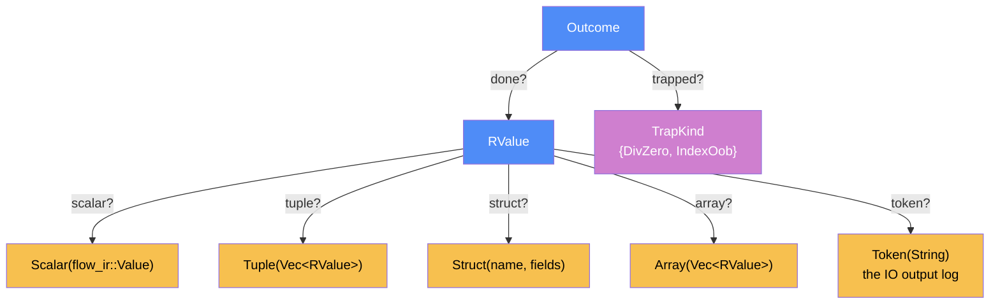

# Component: interp — DESIGN

Written: 2026-06-14 · Session 07 · Status of this doc: increment 1 (P3, → M1) — authoritative for `crates/flow-interp`
Spec authority: ADR-0002 (E1: fueled / least-fixpoint loop semantics — divergence is a defined outcome) > **ADR-0016 (loop branch evaluation is guard-first — the continue-branch is not speculatively evaluated on the exit step; §4)** > ir/DESIGN §5.1 (op typing table), §7 (loops / D7 exit-value pin), §8 (tokens / effect order) > category-ir.md §2.6–2.8 (Kleisli effects, divergence monad, trace), §11.4 (graph walk in topo order, SCCs for loops) > ADR-0013 (traps: div/mod-zero, OOB Index). The interpreter consumes only a **sealed, `validate()`-clean** `flow_ir::CategoryIr`; it is the project's **oracle** (HANDOFF §5 item 4, §7.3).

## Categorical model (Dat + Trn)

This crate is modeled as a FRAMEWORK component (ADR-0014). **Two-level firewall, stated once:** Flow programs *as* morphisms of Flow-Cat are **Level A** (frozen in `docs/spec/category-ir.md`); this section models **Level B — the interpreter's own Rust data + its one pass**. The `CategoryIr` value the interpreter walks is Level-B *data* (a sealed graph in RAM), not a Flow-Cat arrow. Cross-component picture: see `docs/architecture/categorical-model.md`.

**Scoping truth (FRAMEWORK §7.1 degenerate case).** The interpreter is one in-process pass; the PHYSICAL pair `Loc`/`Trm` is **degenerate** here. The complete model is `Dat` (the runtime value domain) + `Alg` (the single `eval` transformation).

### Why (one paragraph)

The categorical lens names three decisions that would otherwise be ad-hoc. (1) The **value domain `RValue` is the interpreter's `Dat`** — `flow_ir::Value` is scalars only, so the interpreter owns a richer object with products (`Tuple`/`Struct`), free-monoid-shaped arrays, and the world token. (2) **`eval` is the one `Trn`**, `(CategoryIr × RValue) → Outcome`; the abnormal cases (`Diverged`, `Trapped`) are exactly the **partiality / error monads of §2.6** made a sum type — divergence is the carrier `A⊥` of the divergence monad (E1), not a hang. (3) The **world token is the `IO`/`Writer` monad made concrete**: a `Token` carrying the output log, threaded as data, so effect order = dataflow order (§8) and E2 determinism is structural, not enforced.

> The interpreter *is*, at Level A, the standard semantic functor ⟦−⟧ from Flow-Core into partial functions on `RValue` — that is what makes it the oracle. At Level B (here) it is simply a `Trn`; the denotational reading lives in `category-ir.md` and is not restated.

### The Dat category (objects)



### Morphism table

| Morphism | Signature | Partiality | Semantics |
| -------- | --------- | ---------- | --------- |
| `scalar?` | `RValue → flow_ir::Value` | Partial | the scalar payload (i32/i64/u8/f32/f64/bool/str), present in the `Scalar` case |
| `tuple?` | `RValue → RValue*` | Partial | ordered components, present in the `Tuple` case |
| `struct?` | `RValue → (𝕊 × RValue)*` | Partial | named fields in declared order, present in the `Struct` case |
| `array?` | `RValue → RValue*` | Partial | elements, present in the `Array` case |
| `token?` | `RValue → 𝕊` | Partial | the accumulated output log, present in the `Token` case |
| `done?` | `Outcome → RValue` | Partial | the produced value, present in the `Done` case |
| `trapped?` | `Outcome → TrapKind` | Partial | the trap reason, present in the `Trapped` case |
| `eval` | `(CategoryIr × FuncId × RValue × Budget) → Outcome` | Total | **the one `Trn`** — fueled graph walk; never panics, never hangs (E1) |
| `render` | `flow_ir::Value → 𝕊` | Total | print rendering (floats via Rust shortest-Display; §5) |

### Composition rules

- **C-interp-1 (totality / E1).** `eval` is total into `Outcome`: every run halts with `Done`, `Diverged` (budget exhausted), or `Trapped`. No Rust panic, no hang. (cf. §6.)
- **C-interp-2 (oracle equivalence).** For every backend functor `F` and rewrite `r`, `eval ∘ r ≅ eval` and `run_target ∘ F ≅ eval` on equal inputs (the differential-test law, discharged by `rewrite`/`backend`, not here).
- **C-interp-3 (effect order = dataflow).** The observable output is `token?` of the final `main` token; because the token threads as data through the §8 token chain, the output is a function of the graph alone, independent of evaluation order (E2). **`TimeMs` (S29) is order-deterministic but value-nondeterministic** — its position in the chain is fixed by the token exactly like `Print`'s, but the *reading* is a fact about the machine, not the graph, so a `time`-bearing program has no byte-golden and no cross-run determinism pin (§5).

### Bridges

| Bridge | Signature | Stored? | Semantics |
| ------ | --------- | ------- | --------- |
| IR intake | `flow_ir::CategoryIr → (this crate)` | borrowed `&` | the interpreter never mutates the IR; it reads `object`/`morphism`/`topo_order`/`loop_structure` (ir read API). Depends on `ir`; **not** on `lower` (it walks any sealed IR). |
| value seed | `flow_ir::Value → RValue::Scalar` | Deduced | scalars lift trivially; aggregates/token are interpreter-only |

---

## 0. Scope of increment 1 (P3 → M1)

In: the value domain (§1); the fueled evaluator (§2) with the per-operation semantics of §3 and the SCC loop driver of §4; effects/IO via the token-as-log (§5); divergence + traps (§6); the entry protocol and program output (§7); the public API (§8); golden interpreter-output tests for all six `examples/*.flow` — **the M1 acceptance line** — plus `sum_to_n(10) == 55` *by execution*, fueled-divergence, and trap tests (§11).

Out (deliberately): `flow-check` (type/effect/lifetime checks — separate component; interp **assumes** a well-typed, exclusivity-respecting graph per §9); rewrite/backend differential harnesses (they consume the oracle, P4+); coproducts/`Option`/`Result`/`?` and channels (Core+1); any mutation of the IR; performance tuning beyond a recorded `interp_scale` bench.

## 1. The value domain

```rust
pub enum RValue {
    Scalar(flow_ir::Value),          // i32/i64/u8/f32/f64/bool/str (str only as a Print arg, §5)
    Tuple(Vec<RValue>),              // arity ≥ 2 products
    Struct { name: String, fields: Vec<(String, RValue)> },  // named product, declared field order
    Array(Vec<RValue>),              // fixed-size; len pinned by the source Ty
    Token(String),                   // the world token: the output log accumulated so far (§5)
    Unit,                            // the Unit witness (mirrors Ty::Unit; RValue::Tuple stays arity ≥ 2)
}

pub enum TrapKind { DivZero, IndexOob }

pub enum Outcome {
    Done(RValue),
    Diverged,                        // global step budget exhausted (E1)
    Trapped(TrapKind),               // a defined runtime trap (ADR-0013)
}
```

- `RValue` mirrors `flow_ir::Ty` structurally (scalar/tuple/struct/array) plus `Token`. There is **no** `Phi`/`IoToken`-as-value confusion: `IoToken`-typed objects hold `RValue::Token`.
- **Internally**, evaluation threads `Result<RValue, Abort>` where `Abort = Diverged | Trapped(TrapKind)`; `?` propagates the first abort. `Outcome` is the public lift at the entry boundary (§7). This keeps the per-op code (§3) a straight-line happy path with `?` on the two exceptional exits.
- `Token(String)` accumulates the rendered output **with a trailing newline per `Print`** (§5). The choice of `String` (not `Vec<String>`) makes the golden assertion the literal program output.

## 2. The evaluator — env + topo walk + loop driver

One function evaluates one `FuncDef` against one argument:

```rust
fn eval_fn(ir: &CategoryIr, f: FuncId, arg: RValue, budget: &mut u64)
    -> Result<RValue, Abort>;
```

State is an `env: SecondaryMap<ObjectId, RValue>` scoped to the function (objects never cross functions — ir I6). Seeding:

- `env[fd.input] = arg` (the one `Parameter` object; a product when the surface fn had multiple params, ir §6).
- every `Constant` object `c`: `env[c] = RValue::Scalar(c.value)` (ir I7 guarantees `value.is_some()`).

Then walk `ir.topo_order(f)` (Kahn order over the function's morphisms, **LoopBack excluded**, LoopMerge header-first — ir §13). Precompute the in-SCC object set from `ir.loop_structure(f)` (the §2 tail). For each morphism `m`:

1. **`LoopEnter`** (source outside the SCC, target a `LoopMerge`) → invoke the **loop driver** (§4) for that merge. The driver evaluates the SCC iteratively, builds its back/exit **route** objects, and writes the loop's exit object(s).
2. **driver-owned → skip** (the §4 driver owns it). `m` is driver-owned iff `op(m) ∈ {LoopBack, LoopExit}`, **or** `m` is *incident* to a loop SCC (`source(m) ∈ SCC` ∨ `target(m) ∈ SCC`) with `op(m) ≠ LoopEnter`. Incidence — **not** "both endpoints in-SCC" — is load-bearing: it makes the driver own (a) the route-pack `Pair` edges whose **source** is in-SCC but whose route **target** sits *outside* the SCC (the back/exit routes — see §4), and (b) the loop-invariant `Pair` edges whose **target** is in-SCC but whose source is outside (e.g. fir's `coeffs[k]`/`signal[4+k]` array slot), which the driver re-fires each iteration so a buffer reset cannot drop the invariant slot.
3. **otherwise** (not incident, `op ∉ {LoopBack, LoopExit}`) → `eval_morphism(m)` (§3): read `env[m.source]`, apply `m.op`, write `env[m.target]`. Decrement `budget`; `0 ⇒ Err(Diverged)`. This computes the loop-invariant inputs (before the driver fires) and the post-loop consumers (after it has written the exit objects). *"Invariants before the driver" is a `topo_order` **theorem**, not an assumption (S12): ir §13's LoopEnter-deferral rule guarantees every non-merge-gated morphism precedes the header. Before S12 this held only for initially-ready feeders (fir's param projs) — a multi-hop invariant (`x * 2`, matmul's `i * 4 + k`) was ordered after `LoopEnter` and panicked the driver at read-before-write; pinned by `tests/loop_invariants.rs`.*

Return `env[fd.output]` (the `Return` object). The in-SCC object set is precomputed once: `ir.loop_structure(f)` returns `Vec<LoopScc>` (`LoopScc { objects: Vec<ObjectId>, merges: Vec<ObjectId> }`) — there is **no** `MergeId` type and no public `scc_of`. The interpreter folds it into a `SecondaryMap<ObjectId, ObjectId>` (object → its merge `ObjectId`): for each `LoopScc` with `merges.len() == 1`, map every `objects[i] → merges[0]`; absence ⇒ the object is in no loop SCC.

**Product assembly (the only multi-in-edge object).** A product object `p` is targeted by exactly `arity` `Pair{slot, arity}` edges (ir I3c). Because topo order completes `p` only after all `arity` slot edges have fired (ir §13), `eval_morphism` for a `Pair` edge stages the component into a per-object buffer; the last slot finalizes `env[p]` as `Tuple`/`Struct`/`Array` according to `p.ty`. (For `Struct`, the field names come from `p.ty`’s `Struct { fields }`; for `Array`, all elements share `elem`.)

## 3. Per-operation semantics (runtime reading of ir/DESIGN §5.1)

`x@k` = component `k` of an aggregate `x`. Numeric ops are computed at the operands' Rust type (`i32`/`i64`/`u8`/`f32`/`f64`); the IR guarantees both operands share one numeric `Ty` (ir §5.1), so no coercion.

| `op` | source shape | result `env[target]` |
| ---- | ------------ | -------------------- |
| `Pair{slot,arity}` | scalar/aggregate | stage into `target`'s buffer at `slot`; finalize at the last slot (§2) |
| `Proj{index}` | `Tuple`/`Struct` | `src@index` |
| `Add/Sub/Mul` | `(N,N)` | machine op at the operand width (overflow: IN-7) |
| `Div/Mod` | `(N,N)` | integer operands: divisor `0 ⇒ Trapped(DivZero)`, else Rust `/`,`%`; float operands: IEEE (no trap) — IN-6 |
| `Neg` | `N` | `-src` (IEEE `fneg` for floats; not `0 - x`) |
| `Eq/Neq` | `(A,A)`, `A ∈ N ∪ {Bool}` | `Bool` |
| `Lt/Gt/Le/Ge` | `(N,N)` | `Bool` (IEEE ordering for floats) |
| `And/Or` | `(Bool,Bool)` | strict (both already evaluated; pure ⇒ unobservable) |
| `Not` | `Bool` | negation |
| `Phi` | `(T,T,Bool)` | `src@2 ? src@0 : src@1` — both branches already computed (strict, pure) |
| `Call(g)` | `g`'s input ty | `eval_fn(ir, g, src, budget)?` |
| `Map{body}` | `Array{T,n}` | `Array( src.map(|e| eval_fn(ir, body, e, budget))? )` |
| `Fold{body}` | `(Acc, Array{T,n})` | left fold: `acc = src@0; for e in src@1 { acc = eval_fn(ir, body, Tuple[acc,e], budget)? }` |
| `Index` | `(Array{T,n}, I)` | `i = src@1 as int`; `i < 0 ∨ i ≥ n ⇒ Trapped(IndexOob)`, else `src@0 [i]` |
| `Update` | `(Array{T,n}, I, T)` (3-tuple) | `i = src@1 as int`; `i < 0 ∨ i ≥ n ⇒ Trapped(IndexOob)`, else a fresh `Array` = `src@0` with slot `i` set to `src@2` (value semantics — source array unchanged; pure) (ADR-0021) |
| `Zip` | `([A;n], [B;n])` (2-tuple; sizes equal by ir typing) | `Array( (0..n).map(|i| Tuple[src@0[i], src@1[i]]) )` — elementwise pairing (ADR-0018) |
| `Enumerate` | `[A;n]` (`n ≤ i32::MAX`, ir-guaranteed) | `Array( src.enumerate().map(|(i,x)| Tuple[I32(i as i32), x]) )` — index pinned `i32`, exact cast (ADR-0018) |
| `Print {newline}` | `(IoToken, P)` | `Token( src@0.log + render(src@1) + (newline ? "\n" : "") )` (§5; ADR-0015) |
| `TimeMs` | `IoToken` (the bare token — no packed source) | `Tuple[ src, F64(ms) ]` — `ms` = milliseconds elapsed against the process-lifetime epoch; the token passes through unchanged as slot 0 (§5; plan-time-builtin) |
| `Output` | `T` | `src` (the bare `x -> ret` identity move, ir D6) |
| `LoopEnter/Back/Exit` | — | not evaluated here — see §4 |

`render(v)` (§5): integers → decimal; `Bool` → `true`/`false`; `F32`/`F64` → `format!("{v}")` (Rust shortest round-trip — `4080.0 → "4080"`, `5.375 → "5.375"`); `Str(s) → s`.

## 4. Loops — SCC-driven fueled iteration, **guard-first** (the 55 contract)

A loop is one non-trivial SCC with a designated `LoopMerge m` (ir §7). The per-merge
layout the driver walks — init source, carried slots, decide/advance route feeders —
is not re-derived here: `run_loop` calls **`flow_ir::CategoryIr::loop_plan(f, m)`** (ir §13),
the one source of truth for the canonical loop CFG (BL7), and unwraps its `Some`
(M1 canonicity is guaranteed by lower + rewrite's R6 gate, which shares this predicate).
The driver is **guard-first (ADR-0016)**: on each iteration it evaluates only the
**decide/exit cone** (the shared guard `cond` and the `LoopExit` payload), reads
the guard, and evaluates the **advance set** (the `LoopBack` next-state — where
speculative traps like `fir`'s `Index(coeffs, k)` live) **only when the guard
continues**. The continue-branch is the `inr(U)` arm of the Elgot step
`f : U → B ⊕ U` (E1) and is the **not-taken** arm on the exit step — it MUST NOT
be evaluated there. The earlier "evaluate the whole body, then test the guard"
reading miscompiled `fir`: on the exit state `k = 4` it indexed `coeffs[4]` on a
`[f32; 4]` ⇒ a spurious `Trapped(IndexOob)` instead of `5.375` (ADR-0016).

```
run_loop(m):
    state := env[ source(LoopEnter→m) ]          # the init value (computed outside the SCC)
    repeat:
        env[m] := state
        reset the staging buffer of every in-SCC / route product object (decide + advance)
        for mo in decide_order(m):               # def below; decrements budget per morphism
            eval_morphism(mo)                    #   builds the cond + the LoopExit route (incl. exit-feeding effects)
        cond := env[ exit_route(m) ]@1           # the shared guard bool (D7: back true / exit false)
        if cond == Bool(false):                  # EXIT — do NOT evaluate the continue-branch
            for ex in exits(m):
                env[ target(ex) ] := env[ source(ex) ]@0   # source(ex) = exit route, built by decide_order
            break
        for mo in advance_order(m):              # CONTINUE — now build the next-state (the inr(U) arm)
            eval_morphism(mo)
        state := env[ back_route(m) ]@0          # the (next_state, cond) route's slot 0
```

**Loop-part location (read API).** `flow-ir` exposes no direct accessor for these; the driver derives them once per merge `m`:

- `source(LoopEnter→m)` / `back_route(m)` = `source(e)` for the unique `e ∈ in_edges(m)` with `op == LoopEnter` / `op == LoopBack` respectively (ir §7: exactly one `LoopEnter`; one `LoopBack` in the M1 canonical shape, §4 scope).
- `exits(m)` = the `LoopExit` morphisms whose exit-**route** object is built from in-SCC values (its slot-`Pair` sources ∈ `SCC(m)`). `LoopExit` edges are **not** in `in_edges(m)` and their route sits *outside* the SCC, so attribute by route-feeder membership — not by `in_edges(m)`, and not by SCC membership of the route itself. `exit_route(m) = source(ex)` for the unique M1 `ex ∈ exits(m)` — the `(value, cond)` route object.
- `body_order(m)` = `ir.topo_order(owner(m))` filtered to morphisms *incident* to `SCC(m)` (`source ∈ SCC(m)` ∨ `target ∈ SCC(m)`) **plus** any `Pair` edge whose **target is `back_route(m)` or `exit_route(m)`** (even if both its endpoints lie outside the SCC), EXCLUDING ops `LoopEnter`/`LoopBack`/`LoopExit`. It is header-first because `topo_order` releases the `LoopMerge` on its lone `LoopEnter` (ir §13); it includes both the **source-in-SCC** route-pack `Pair` edges and the **target-in-SCC** loop-invariant `Pair` edges — so `env[back_route(m)]` and `env[source(ex)]` are populated, and every in-SCC product is fully re-slotted, before they are read. The route-target clause is **degenerate-guard completeness** (impl S08): when the guard `cond` (or the exit value) is a `Constant` — e.g. the §11.3 constant-`true` divergence loop — the route-pack `Pair` edge has *no* in-SCC endpoint (constant source, route target, both outside the SCC), so pure incidence would drop it and the route would never finalize; the clause re-fires it each iteration. It is a no-op for the six examples (their `cond` is computed in-SCC, so the slot edge already has an in-SCC endpoint).
- **The decide/advance split (ADR-0016).** Let `D(m)` = the objects backward-reachable, within `body_order(m)`'s edges, from `exit_route(m)` (`o ∈ D` iff `o == exit_route(m)` ∨ `o` feeds a morphism whose target ∈ `D`). Then `decide_order(m)` = `body_order(m)` filtered to `target(mo) ∈ D(m)` (topo order preserved); `advance_order(m)` = `body_order(m)` ∖ `decide_order(m)`. `D(m)` captures exactly the shared `cond` (the exit route's slot-1 source), the exit payload (slot-0 source), the merge `Proj`s they need, and any **exit-feeding effect** (countdown's `println` feeds the exit token, so it lands in `decide_order` — fired once per iteration, before the guard is read). The next-state computation feeding `LoopBack` (fir's `Index`/`Mul`/`Add`) feeds only the back route, never `exit_route(m)`, so it lands in `advance_order` — evaluated only on a continuing iteration. The shared `cond → back_route` `Pair` edge is in `advance_order` (its target `back_route ∉ D`), and reads `cond` already in `env` from the decide phase.

**Per-iteration buffer reset.** Because `decide_order(m)` + `advance_order(m)` re-fire the `Pair` edges that assemble in-SCC / route product objects each iteration, the driver clears those objects' staging buffers at the top of every iteration (alongside `env[m] := state`) so finalization re-triggers cleanly. The reset covers **both** phases' product targets even though the advance phase may be skipped on the exit iteration (a stale next-state buffer must never leak into the following run — moot at M1 since the run ends on exit, but kept correct for safety). A loop-invariant slot fed from outside the SCC is re-read from its existing `env` entry (the source value never changes), so re-firing it is harmless and keeps the slot present after the reset.

- **The 55 contract (ir D7).** The exit payload is read from the **exit iteration's merge state**, never from the next-state. Guard-first makes this structural: on the iteration where `cond` is false, `env[m]` still holds the current `state`, the exit route was built (in `decide_order`) from `Proj`s of `m`, and the next-state is **never evaluated at all** (it is in `advance_order`, skipped) — so `env[exit_route(m)]@0` is the merge-view value. `sum_to_n(10)`: states `(1,0)…(11,55)`; at `(11,55)` the guard `11 ≤ 10` is false, exit reads `acc = 55`. **Not 54, not 65.** A golden pins this both structurally (already in `ir`/`lower`) and now **by execution**.
- **Budget.** Every `eval_morphism` decrements the global budget; an unbounded loop therefore exhausts it mid-iteration (its always-`true` guard keeps re-entering `advance_order`) and yields `Diverged` (E1) — never a hang. (A loop whose guard is a constant `Bool(true)` — an always-taken `LoopBack` plus a structurally-present, never-fired `LoopExit` — is legal, sealable, and diverges under fuel. A truly exit-less loop **cannot** be sealed: `end_loop` requires ≥1 `LoopExit`.)
- **Tokens through loops (§8 / I4b).** If a `Print` is inside the loop, `IoToken` is a component of `U`; the token (output log) threads through `state` and accumulates across iterations, escaping via the token-bearing `LoopExit` payload (the countdown shape — golden in §11). A `print`/`println` that **precedes the guard** feeds the exit-route token, so it is in `decide_order` (ADR-0016) and fires on **every** iteration including the exit one — countdown prints `0` on the `n = 0` exit step. It fires exactly once per iteration (it is in `decide_order`, never re-run by `advance_order`).
- **Scope (M1).** Single-merge, single-back, single-exit canonical SCCs (sum_to_n, fir, countdown). The canonicity predicate is **`flow_ir::CategoryIr::loop_plan(f, merge)`** (ir §13, BL7 — S13: extracted from the interp-local `derive_plan` into flow-ir as the one source of truth shared with rewrite and backend-llvm): it yields `Some(LoopPlan)` only for a single merge with exactly one `LoopBack` and exactly one attributed `LoopExit`; any other shape (multi-merge nested loops, or multiple back/exit edges per merge) is Core-degenerate, **out of M1**, gets `None`, and `run_loop` unwraps that as `unreachable!` rather than miscomputing. *Attribution is per-merge-SCC (S12): `loop_plan` builds its `in_scc` set from the specific merge's `LoopScc`, never the per-function union — the union attributed a second sequential loop's exit (and body morphisms) to the first merge and panicked the M1 check on a legal Core program. **Multiple sequential canonical loops per function are in scope**; pinned by `tests/loop_invariants.rs::two_sequential_loops_in_one_fn`.* None arise from the six examples, and lower OQ7 restricts generation to canonical shapes. The multi-guard rule ir §7 defers to this component (each `LoopExit` gated by its own route slot-1 cond) is pinned in a later increment — so the Bridges claim reads "walks any sealed IR, **erroring on out-of-M1 loop shapes**."

## 5. Effects & IO — the token as a Writer

`Print {newline} : (IoToken, P) → IoToken` is Core's effect (ir §8; ADR-0015): `print` (`newline:false`) appends `render(P)` raw; `println` (`newline:true`) appends `render(P)` **plus `"\n"`**. The world token is **`RValue::Token(String)`**, the output log so far. Because the token threads as data along the §8 chain, the effects are ordered exactly by their dataflow dependency — E2 determinism is structural (C-interp-3), no scheduler involved.

- **Newline (ADR-0015, supersedes IN5).** `print` is raw; `println` appends `"\n"`. Examples use `println` for line-terminated output and `print` only for `pipeline`'s inline label. Acceptance set: `abs→"7\n"`, `sum_to_n→"55\n"`, `fanout→"36\n12\n"`, `fir→"5.375\n"`, `sepia→"4080\n"`, `pipeline→"f(10) = 25\n"` (label via `print`, value via `println` — one line). `pipeline.flow`'s header comment is now exactly correct.
- **Float formatting (IN-4, pinned).** `F32`/`F64` render via Rust shortest round-trip `Display` — drops trailing `.0`, so `4080.0 → "4080"` and `5.375 → "5.375"`, matching the contract exactly.
- **String values** appear only as a `Print` argument (ir I9s); `render(Str(s)) = s` (already unescaped at lex; `"f(10) = "` renders with its trailing space).
- **The clock (`TimeMs`, S29 — plan-time-builtin).** `TimeMs : IoToken → (IoToken, f64)` is Core's second effect: it consumes the token and re-mints it beside the reading, so it rides the §8 chain's ordering with no new machinery (never const-folded, CSE'd, reordered or DCE'd — the token dependency delivers all four). The reading is `elapsed` against **one process-lifetime `Instant` epoch** shared by every read (`eval.rs:time_epoch`), so two reads in a run are non-decreasing and their difference is real elapsed milliseconds — that pair (monotone + finite) is the whole denotation. An absolute duration is never contracted (C-interp-3), so the fixture asserts the bracketed work computed and `t1 >= t0 >= 0`, nothing more.

## 6. Fuel, divergence, traps

- **Budget (IN-1).** A single `budget: u64` step counter, decremented once per evaluated morphism (covering loop bodies, `Call` chains, `Map`/`Fold` element applications). Reaching `0` ⇒ `Diverged`. Tests pass an explicit budget; a hanging test is a protocol violation, not bad luck (HANDOFF §7.3).
- **Traps (ADR-0013).** `Trapped(DivZero)` on integer divide/modulo by zero; `Trapped(IndexOob)` on an out-of-range (incl. negative) `Index`. Floats follow IEEE (no trap) — IN-6. A trap aborts the whole run (propagated by `?`), surfaced as `Outcome::Trapped(kind)` — a first-class oracle result, never a Rust panic.
- These are exactly the §2.6 partiality (`Divergence`) and error (`Err`) monads, realized as the `Outcome` sum rather than nested `Result`s — the categorical effect story made operational.

## 7. Entry protocol & program output

```rust
pub fn run(ir: &CategoryIr, budget: u64) -> RunResult;
pub struct RunResult { pub outcome: Outcome, pub output: String }   // output = "" unless Done with a token
```

- Seed the entry function (`ir.entry()`, always `FuncKind::Named`). Effectful `main` declares `main : IoToken → IoToken` (ir §8 signature synthesis): seed `arg = RValue::Token(String::new())`; on `Done(Token(log))`, `output = log`. A pure `main : Unit → Unit` seeds `arg = RValue::Unit`; if its `Return` ty is `Unit` and no `Output` writer fired (I-RET permits zero Unit writers), `eval_fn` returns `Done(RValue::Unit)` without reading `env[fd.output]`. `output = ""` (no token).
- `RunResult.output` is the program's observable stdout (what the golden asserts). `outcome` distinguishes `Done`/`Diverged`/`Trapped` for non-print contracts (e.g. `sum_to_n` called directly returns `Done(Scalar(I32(55)))`).
- The six examples all have effectful `main`; their golden is `RunResult.output`.

## 8. Public API

```rust
pub fn run(ir: &CategoryIr, budget: u64) -> RunResult;            // entry; seeds main, collects output
pub fn eval_call(ir: &CategoryIr, f: FuncId, arg: RValue, budget: u64) -> Outcome;  // call one fn (tests)
pub enum RValue { /* §1 */ }   pub enum Outcome { /* §1 */ }   pub enum TrapKind { /* §1 */ }
pub struct RunResult { pub outcome: Outcome, pub output: String }
```

No `Display` impls (C3, matching `ir`/`syntax`); a plain `render` function owns value→string. `RValue`/`Outcome` derive `Clone, Debug, PartialEq` (floats: `PartialEq` only).

## 9. Assumptions & invariants (what the oracle trusts)

The interpreter validates at exactly one boundary — the IR is **sealed and `validate()`-clean** — and trusts everything that guarantees (FRAMEWORK §5 YAGNI; HANDOFF §7.3):

- **Well-typed (ir I2/§5.1).** Every morphism's operand shapes are as typed; the interpreter does not re-type-check. A shape mismatch is an `unreachable!`-class interpreter bug, not a user diagnostic (that is `flow-check`'s job, upstream).
- **Exclusivity (IN-3, decided).** The IR permits multiple full-value `Return` writers (ir I-RET); the interpreter **assumes** flow-check guarantees exactly one fires per run and takes the writer that fires (last-write in the walk). It does **not** police exclusivity — leaner, and the obligation is documented as flow-check's (ir §17 / lower OQ3).
- **Acyclic call graph (ir I6).** No recursion in Core ⇒ `eval_fn` recursion is bounded by the static call depth; only loops can diverge, and they are fueled.
- **One definition per object (ir I3).** Every non-product, non-merge object has exactly one defining morphism ⇒ `env[o]` is written once (products: `arity` times then sealed; merge: per iteration by the driver).

## 10. Determinism

`RValue`/`env` use no `HashMap`; `Map`/`Fold` iterate array order; `topo_order`/`loop_structure` are deterministic (ir D2/§13). Running the same program twice with the same budget yields byte-identical `output` and identical `outcome` — tested, not assumed (§11).

## 11. Test plan (what M1-green means)

1. **Acceptance goldens (the M1 line).** For each `examples/*.flow`: `parse → lower → run(budget)` and assert `RunResult.output` exactly: `abs "7\n"`, `sum_to_n "55\n"`, `pipeline "f(10) = 25\n"`, `fanout "36\n12\n"`, `fir "5.375\n"`, `sepia "4080\n"`, `zip_demo "c[0]  = 100\nc[15] = 115\ne[0]  = 0\ne[15] = 30\n"`, `vector_add "c[0]  = 100\nc[15] = 115\nsum   = 1720\n"` (the last two, ADR-0018, exercise the `zip`/`enumerate` builtins end-to-end) (ADR-0015 split: `println` terminates lines, `print` is raw).
2. **The 55 contract by execution.** `eval_call(sum_to_n, I32(10))` == `Done(Scalar(I32(55)))`; plus `fir4(...) == Done(Scalar(F32(5.375)))` and `sepia` fold `== 4080.0` — the structural pins (ir/lower) now confirmed dynamically.
3. **Fueled divergence (E1).** A hand-built loop with a constant-`true` guard (`LoopBack` always taken, `LoopExit` present-but-never-fired) and a small budget ⇒ `Diverged`; assert it returns (no hang) within the budget. A budget large enough for `sum_to_n(10)` ⇒ `Done`; one too small ⇒ `Diverged` (boundary tested).
4. **Traps (ADR-0013).** Hand-built IR: integer `Div` by `0` ⇒ `Trapped(DivZero)`; `Index` with `i = n` and `i = -1` ⇒ `Trapped(IndexOob)`. Float `1.0/0.0` ⇒ `Done` (IEEE inf), **not** a trap (IN-6).
5. **Token-through-loop (the countdown shape).** Reuse lower's committed `countdown` golden-h fixture (`println` *before* the guard) ⇒ output `"5\n4\n3\n2\n1\n0\n"` (the `n = 0` iteration prints `0` before the guard fails); asserts the token threads the loop state and escapes via the token-bearing `LoopExit` (§4 / §5). One source of truth for the fixture — already lowered & validated.
6. **Determinism (E2).** Build+run each example twice ⇒ byte-identical `output` and `outcome`.
7. **Bench** (`interp_scale`): run a synthetic deep loop / large `map` at growing sizes; record numbers in STATUS (HANDOFF §7.2 step 6).

Golden source files for (1) are `examples/*.flow` read live; (4)/(3) use hand-built `IrBuilder` graphs (no surface for div/divergence in the six examples).

## 12. Module layout

```
crates/flow-interp/src/
  lib.rs      // run, eval_call, RunResult + curated pub use
  value.rs    // RValue, Outcome, TrapKind, Abort, render
  eval.rs     // eval_fn, eval_morphism, product assembly, the flat topo walk
  loops.rs    // run_loop (SCC-driven fueled iteration; the §4 driver)
crates/flow-interp/tests/
  acceptance.rs   // the six example goldens (§11.1) + the 55/fir/sepia value contracts
  traps.rs        // div-zero / index-oob (§11.4)
  divergence.rs   // fueled loops (§11.3)
  determinism.rs  // §11.6
crates/flow-interp/benches/interp_scale.rs
```

Cargo deps: `flow-ir` + `slotmap` (the `env`/staging maps are `SecondaryMap<ObjectId, _>`; `flow-ir` does not re-export `slotmap`, so it is a direct dep at the same version — still no `HashMap`, D2/E2); `flow-syntax` + `flow-lower` as **dev-deps** (the acceptance pipeline `parse→lower→run` lives in tests — the library depends on `ir` + `slotmap` alone, per the §0 bridge). Dev-deps `criterion` + `[[bench]] interp_scale` (acceptance asserts the literal program output with `assert_eq!`, not snapshots — no `insta`; `proptest` later).

## 13. Decision ledger (IN1–IN8 — decided once, do not re-litigate)

| id | decision | why |
| -- | -------- | --- |
| IN1 | Global `u64` step budget, decremented per morphism; `0 ⇒ Diverged` | E1 divergence must be a defined, test-bounded outcome; global counter bounds loops, calls, map/fold uniformly |
| IN2 | `Outcome = Done \| Diverged \| Trapped(kind)`; abnormal cases are first-class oracle results, never panics | differential tests must assert "traps"/"diverges" as values; §2.6 monads as a sum |
| IN3 | Interp **assumes** Return exclusivity (trusts flow-check); takes the firing writer | FRAMEWORK §5 (validate at boundaries, trust internal invariants); ir §17 assigns exclusivity to check |
| IN4 | Floats render via Rust shortest-Display (`4080.0→"4080"`, `5.375→"5.375"`) | matches the acceptance contract exactly; pins the spec-parked formatting (ir §17) |
| IN5 | **superseded by ADR-0015** — `print` raw, `println` appends `"\n"` | the example set is inconsistent under a single newline-appending `print`; the split fixes it and makes `pipeline.flow`'s comment correct |
| IN6 | Integer Div/Mod-by-zero ⇒ `Trapped(DivZero)` (ADR-0013); float ÷0 ⇒ IEEE inf/nan, no trap — **provisional, §14** | ADR-0013 mandates the integer trap but does **not** restrict it to integers; the float-IEEE reading is interp's conservative choice, not ADR-compelled. No example divides |
| IN7 | Integer overflow is **out of M1 scope** (no example overflows); the first cut uses checked/explicit-wrap per the operand width with the choice deferred to a `flow-check`/backend ADR | pinning UB-vs-wrap-vs-trap is a cross-target decision, not the oracle’s to fix alone |
| IN8 | World token = `RValue::Token(String)` (the output log); `run` returns `output: String` | functional Writer model; E2 determinism structural; golden = literal stdout |

## 14. Open questions (→ ADR candidates / Sapir)

- **`print`/`println`:** resolved by ADR-0015 (`print` raw, `println` newline); examples updated; `pipeline.flow`'s `f(10) = 25` header is now exactly correct (label `print` + value `println`).
- **IN6 float ÷0 (CLOSED S13):** ADR-0013's S13 amendment (ratified by Sapir) makes it normative — div-zero trap is integer-only; float ÷0 is IEEE. Backends inherit. **IN7 integer overflow:** likewise untested by the six examples; deferred to a `flow-check`/backend ADR.
- **Multi-merge loop SCCs** (nested un-labeled loops) are out of M1 (§4); lifting waits on lower OQ7 (the I4 token-fork / per-arm-cond ADR).
- **countdown shape (cross-component, informational):** the interp token-through-loop golden (§11.5) **reuses lower's committed golden-h fixture** (`println` before the guard → `"…1\n0\n"`). user-guide §3.5 is a *different*, guard-first shape (→ `"…1\n"`); both are valid Core programs. No action needed unless you want lower's fixture and the user-guide example unified (lower DESIGN line 276 calls §3.5 "canonical" but its fixture is print-before-guard — a naming nuance, not a bug).
- **`flow-check` handoff:** exclusivity (IN3), surface-`seq` effect legality (E2), and full typing are owed by `check`; the interp’s assumptions (§9) are precisely that owed ledger.
