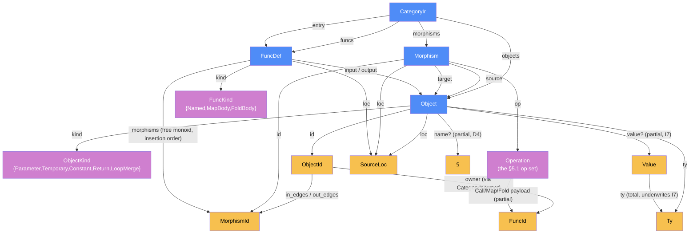

# Component: ir — DESIGN

Written: 2026-06-12 · Session 04 · Status of this doc: increment 1 (P2) — authoritative for `crates/mapal-ir`
Spec authority: ADR-0013 > category-ir.md §3/§5 (+§2, §4 worked lowerings, §9.5, §11) > architecture.md §3. CHANGES §1 is the rationale; E1 (ADR-0002) and E2 (ADR-0003) constrain loops and effects.

## Categorical model (Dat + Trn)

This crate is modeled as a FRAMEWORK component (FRAMEWORK §0–§4). **Two-level firewall, stated once so it is never re-litigated:** the object language — Mapal programs *as* morphisms of Mapal-Cat — is **Level A**, already modeled in `docs/spec/category-ir.md`; this section does **not** restate it. What is modeled here is **Level B: the compiler itself** — `mapal-ir`'s own internal Rust data types and the passes over them. The name collision is deliberate and is the errata-E5 tax: `CategoryIr`/`Object`/`Morphism`/`Operation` are Level-B *Rust structs the compiler holds in RAM* (objects of the compiler's `Dat`), **not** arrows of Mapal-Cat. Never conflate the two. One-line pointer to the cross-component picture: see `docs/architecture/categorical-model.md`.

**Scoping truth (FRAMEWORK §7.1 degenerate case).** The compiler is a single in-process pipe-and-filter pipeline, so the PHYSICAL pair `Loc`/`Trm` is **degenerate** for `mapal-ir`: every type lives in one process, every pass is same-location, no transmission crosses a boundary. `loc.rs::SourceLoc` is a byte-range *datum*, **not** a FRAMEWORK `Loc` execution site (D8). The LOGICAL pair `Dat`/`Trn` is therefore applied richly and `Loc`/`Trm` are not invoked until the downstream backend/runtime seam (CPU/GPU/FPGA; host↔device `cudaMemcpy`), which lives in other crates. So the complete model of this crate is `Dat` (the data category below) + `Alg` (its passes, §§ below).

### Why (one paragraph)

Modeling `mapal-ir` as a category buys three concrete things. (1) *Optionality is a partial morphism*: `value? : Object → Value` is defined exactly on `kind == Constant` (I7) — the nullable field IS the partiality, with the `kind` enum as its discriminator (FRAMEWORK §3 step 5). (2) *Deduce, don't store*: loop regions, topological order, and SCCs are **deduced morphisms** out of `CategoryIr`, never stored fields — so there is no second copy to drift (D3/D5; FRAMEWORK §5 "Deduce, don't store"). (3) *Consolidation*: each k-ary operation is one categorical product (`k` `Pair` edges into one product `Object`, then one op-edge), so I1 (one source, one target) is the *consequence* of representing arity as a product object, not a restriction bolted on top — there is no wide-edge type to parallel.

### The Dat category (objects)

The internal data category `Dat` of the compiler. Objects are the Rust types of `crates/mapal-ir/src/{graph,ty,loc}.rs`; primitive sets follow FRAMEWORK notation (`𝕊` string, `𝔹` bool, `ℕ` natural, `u8`/`u32`/`u64`/`i32`/… the machine scalars). The central object is `CategoryIr` — one sealed dataflow graph — built out of `Object`/`Morphism`/`FuncDef` keyed by the opaque id atoms `ObjectId`/`MorphismId`/`FuncId`.



**Object catalogue** (full Rust definitions in §§2–6; this is the categorical view).

| Object | Kind | Role in `Dat` |
|---|---|---|
| `CategoryIr` | product | the sealed graph — the central data object ten crates depend on; append-only then frozen |
| `Object` | product | a graph node (data atom); `value?` partial on `kind==Constant` (I7) |
| `ObjectKind` | discrete cat | `{Parameter, Temporary, Constant, Return, LoopMerge}` — the `kind` discriminator selecting each I3 in-edge shape |
| `Morphism` | product | a directed dataflow edge — exactly one `source`, one `target` (I1); the `Dat`-level morphism of the IR graph |
| `Operation` | discrete cat (+ `FuncId` payload on `Call`/`Map`/`Fold`) | the op tag keying the §5.1 typing table |
| `FuncDef` | product | one function: one input `Parameter`, one output `Return`, an insertion-ordered `morphisms` set (free monoid `MorphismId*`) |
| `FuncKind` | discrete cat | `{Named, MapBody, FoldBody}` |
| `Ty` | sum ⊕ + recursive product (`Tuple` ×, `Struct` named ×, `Array`) | the Core type universe; depth-bounded ≤64 (I10) |
| `Value` | sum ⊕ | the literal of a `Constant`; `value.ty()` total, underwrites I7 |
| `SourceLoc` | product | half-open `[start,end)` byte span (I11) — a datum, **not** a `Loc` |
| `ObjectId` / `MorphismId` / `FuncId` | identity atoms | opaque slotmap keys; insertion-ordered ⇒ deterministic iteration (I12/D2) |

### Morphisms — the §5.1 Operation typing table is canonical

The edge-tagging morphisms of the IR — i.e. the meaning of each `Morphism` keyed by its `Operation` — are specified **once and canonically** by the **§5.1 Operation typing table** (`op | source ty | target ty | extra conditions`). That table IS the morphism table for the `Operation` quiver of this category; **it is normative for both the builder (I2, per call) and the validator (`edge_type_ok` re-derives it), and is not duplicated here.** Read §5.1 as the canonical morphism specification.

The remaining (non-edge) morphisms are the structural projections out of each `Dat` object, catalogued below. Partial morphisms carry `?`; deduced morphisms are dashed.

| Morphism | Signature | Partiality | Semantics |
|---|---|---|---|
| `Object.ty` | `Object → Ty` | Total | the node's Core type |
| `Object.kind` | `Object → ObjectKind` | Total | the discriminator selecting the I3 in-edge shape |
| `Object.value?` | `Object → Value` | **Partial** | the literal carried by a `Constant`; `Some ⇔ kind==Constant` (I7), then `value.ty()==ty`. **The partial-morphism exemplar** (FRAMEWORK §3 step 5): one consolidated `Object` struct, with the one non-commuting distinction segregated as a partial morphism keyed on `kind` — never split into parallel `ConstantNode`/`InnerNode` types |
| `Object.name?` | `Object → 𝕊` | Partial | surface name for dumps/debug (D4); `None` on synthesized nodes |
| `Object.loc` | `Object → SourceLoc` | Total | source span (I11) |
| `Morphism.source` / `Morphism.target` | `Morphism → Object` | Total | the edge's unique endpoints (I1) |
| `Morphism.op` | `Morphism → Operation` | Total | constrains source/target per **§5.1** (I2) |
| `Value.ty` | `Value → Ty` | Total | the unique ty of a literal; underwrites I7 |
| `FuncDef.input` / `FuncDef.output` | `FuncDef → Object` | Total | the single `Parameter` / single `Return` object |
| `FuncDef.morphisms` | `FuncDef → MorphismId*` | Total | the body as a free monoid in **insertion** order (a valid *construction* order; the *execution* order is deduced — see below) |
| `CategoryIr.owner` | `ObjectId → FuncId` | Total (`try_owner` is the partial form validate uses for the I6 ownership clause) | the owning function; no cross-function edges (I6) |
| `CategoryIr.entry` | `CategoryIr → FuncId` | Total | the entry function; always `FuncKind::Named` (`EntryNotNamed` otherwise) |
| `CategoryIr.in_edges` / `out_edges` | `ObjectId → MorphismId*` | Total | incident edges in insertion order; `in_edges` shape decides I3 |

**Partial-morphism worked example.** `value? : Object → Value` is the textbook FRAMEWORK §3 reduction realized in code. The naive split into two objects — `ConstantNode` (carrying `value`) and `InnerNode` (Parameter/Temporary/Return/LoopMerge, no `value`) — has every shared morphism (`id`, `ty`, `kind`, `name?`, `loc`) landing in the same targets, so the identity-on-objects functor between them commutes everywhere: they are **one object in disguise**. The single morphism that does *not* commute, `value`, is therefore segregated as a partial morphism on the unified `Object`, with `kind : Object → ObjectKind` as the discriminator (`value.is_some() ⇔ kind==Constant`). Corollary applied: `Object.ty` on a `Constant` is **deduced through** `value` (`object.ty == value.ty()`, single-sourced by `constant()`, re-checked by validate) — never an independent copy that could drift.

### The Trn passes — builder primitives are morphism constructors

The crate's transformations (`Trn`, FRAMEWORK §4.1) are its passes; with `Loc`/`Trm` degenerate, the model is the free **algorithm category `Alg`** of composable passes. Each `Trn` carries `t_from`/`t_to` projections into `Dat`.

The **builder primitives are the morphism-and-object *constructors* of `Dat`** — the only producers of a `CategoryIr` ("ill-formed is unconstructible"). Each `FnBuilder` primitive (`constant`/`proj`/`pack`/`pack_struct`/`pack_array`/`unop`/`binop`/`phi`/`index`/`call`/`map`/`fold`/`print`/`output`/the loop quartet) is a *guarded constructor*: it mints a fresh target `Object` and the §5.1-typed defining `Morphism`(s), intaking every synthesized `Ty` (I9) and dispatching the per-op typing row (I2). Composite ops build their internal `Pair` packs **atomically** (the "Pair-then-primitive" product formation — callers cannot half-build a product). This is the Consolidation Principle made structural: arity is a product `Object`, so every constructor yields single-source/single-target edges and I1 holds by construction.

| Pass (`Trn`) | `t_from → t_to` | Effect on `Dat` |
|---|---|---|
| `IrBuilder::declare` | `(FuncKind, 𝕊, Ty, Ty, SourceLoc) → FuncId ⊕ IrError` | mints a function's `Parameter`+`Return`; intakes both tys (I9) |
| `FnBuilder` primitives | `(args…, Dest, SourceLoc) → ObjectId ⊕ IrError` | the object/morphism constructors above; enforce §5.1 (I2) + I9 per call |
| `IrBuilder::seal` | `(IrBuilder, FuncId) ⇀ CategoryIr ⊕ IrError` | freezes the graph and runs the global checks (I4b/I5/I6/I-RET/struct-name); the **headline property**: `seal Ok ⇒ validate empty` |
| `validate` | `&CategoryIr → IrViolation*` | the **independent oracle** (§11): re-derives every graph-shape clause from scratch with **no shared code** with the builder; empty `Vec` ⇔ well-formed |
| `sccs` / `topo_order` / `loop_structure` | `CategoryIr × FuncId → …` | **deduced** structure recovery — see below |
| `to_mermaid` / `lint_mermaid` | `&CategoryIr → 𝕊` / `&str → 𝕊*` | deterministic dump + lint |

The builder is `Trn` (a genuine pass with algorithmic content) producing `Dat`; `validate` is a *parallel realization* of the same well-formedness contract on an independent code path — the FRAMEWORK §7.2 "validate twice, honestly" shape: two non-shared realizations of one contract make the `seal Ok ⇒ validate empty` property load-bearing rather than a tautology.

### Deduce, don't store — topo / SCC / loop regions (D3/D5)

Order and region structure are **deduced morphisms** out of `CategoryIr`, never stored fields (FRAMEWORK §5; D3, D5). The one stored ordering — `FuncDef.morphisms` in *insertion* order — is forced for free by the slotmap determinism contract (I12/D2) and serves only as the deterministic tie-break; the expensive *views* are recomputed on demand:

| Deduced morphism | Signature | Why deduced, not stored |
|---|---|---|
| `topo_order` | `CategoryIr × FuncId → MorphismId*` | the dataflow/execution order (Kahn, `LoopBack` non-gating). A *different* ordering of the same edge set than the stored insertion (construction) order — a pure function of adjacency, so storing it would be a copy that could drift |
| `sccs` | `CategoryIr × FuncId → Vec<ObjectId>*` | iterative Tarjan over adjacency; non-trivial SCCs **are** the loop regions, back edges **are** the `LoopBack` morphisms |
| `loop_structure` | `CategoryIr × FuncId → LoopScc*` | `sccs ∘ kind-filter ∘ merge-tag` — the backend capability predicate (D3) |
| `loop_plan` | `CategoryIr × FuncId × ObjectId → LoopPlan?` | per-merge canonical-loop layout (init/carried/back-route/exit-route feeders) recovered from adjacency; `None` for any non-canonical shape. The one source of truth for the loop CFG shared by interp's driver, rewrite's canonicity gate, and backend-llvm (BL7) — see §13 |
| `path_plan` | `CategoryIr × FuncId → PathPlan` | the execution graph's task DAG + host-spine checkpoints (S24, plan-parallel-orchestrator). Partition, deps, ranks and waits are pure functions of adjacency + `topo_order` + `loc`; storing them would be a copy that drifts from the graph. Backend-independent — one plan, every runtime schedules it. S29's two clock rules (fence on **source** position, host cone) live here — see §13 |

This is the load-bearing instance of "Deduce, don't store": **`Operation::Trace` is not materialized — the trace IS the cycle** (D3). A stored `Trace` payload (or stored topo/region fields) would be a *stored copy of a deduced morphism* — exactly the redundant-morphism smell — that could drift from the back edges. `seal` itself recomputes `sccs(f)` for its I4/I5 checks rather than caching, confirming the discipline. (Honest cost, recorded once: each call is `O(V+E)` and recursion-free per call; on Core's single-file programs this is cheap and is the right trade for zero-drift determinism. If a future profile shows `seal`/codegen hot on large graphs, the §5-sanctioned move is a single post-seal memo — legal precisely because the graph is immutable after seal, so the cache cannot drift — added in its own ADR, not now.)

### Mermaid lint rules (project convention)

All diagrams in this and sibling docs follow the project Mermaid rules — the same rules `lint_mermaid` (§14) enforces on every IR dump in tests, plus the FRAMEWORK appendix color legend:

1. **One arrow style** in the whole document: `-->` only (labeled as `-- "label" -->` in `flowchart`, `-->|"label"|` in `graph`). No `-.->`/`==>`/`---` for edges **anywhere** — including design diagrams; partial/deduced/future morphisms are flagged by a **label** on a solid arrow (`-->|"… (partial)"|`), not by a dashed edge, while `to_mermaid` output likewise uses one solid style and labels back edges `"LoopBack ↩"` + the `⟲ ` merge prefix (D9) rather than dashing them.
2. **Every label double-quoted**, with `"` escaped (`#quot;` in `to_mermaid`).
3. **Structural**: a `flowchart`/`graph` header, balanced `subgraph`/`end`, node ids `[A-Za-z0-9_]+` (per-dump `f{i}o{j}` ordinals, never raw slotmap bits).
4. **Color legend** (FRAMEWORK appendix): blue `#4f8cf7` data objects, green `#7fc47f` `Trn`, red `#f77f7f` `Loc`, teal `#7fc4c4` `Trm`/junctions, yellow `#f7c04f` primitives/ids/ports, purple `#cf7fcf` components/enums, grey `#9a9a9a` deduced/future.

## 0. Scope of increment 1

In: the graph data structures (§3–§5 below), the invariant-enforcing builder (§10–§11), the independent validator (§12), iterative Tarjan SCC + topological order (§13), the deterministic Mermaid dump + lint (§14), tests (§16), a small criterion bench.

Out (deliberately): JSON serialization (category-ir §5.3 — deferred until a consumer exists; note the `rhs_const` example there is LC-4-patched); any mutation/rewrite API (P4 will design removal/replacement with its own invariant story — v1 graphs are **append-only then sealed**); bifunctor-image tagging for §9.5 (deferred — recomputable from adjacency; revisit in rewrite's design); effect *legality* checking (print-only-in-seq is mapal-check's job; the IR enforces only the structural token rules of §8); lowering itself (mapal-lower).

The IR is the project's central data structure; ten components depend on it. Where the spec is internally inconsistent, ADR-0013 + ERRATA LC-4 record the resolution; this document only restates those decisions and adds the concrete Rust realization.

## 1. The one structural decision everything else follows from

**All dataflow is adjacency edges. No morphism payload carries value flow.** (ADR-0013, LC-4.)

category-ir §4.1 suggested Pair "metadata" bundling env projections and §5.3 fused constants into primitives (`{"Mul": {"rhs_const": 2}}`); but §4.4/§4.5's own diagrams draw every component as a real in-edge, §5.1 defines merge detection as `in_edges.len() > 1`, and §9.4 (last-use), §9.5 (reachability/parallelism), §10 (lifetime frontier) all read adjacency only. Metadata-carried dataflow would be invisible to every analysis the IR exists to serve. Therefore:

- Product formation (tuple, struct, fixed array) = one `Pair { slot, arity }` morphism **per component**, all targeting the product object.
- Constants = **source objects** (`kind: Constant`, `value: Some`, in-degree 0). No `Const : 1 → A` morphism, no terminal-object plumbing.
- Loops = **inline cycles** through a `LoopMerge` object; the back edge is a real edge Tarjan sees (CHANGES §1.3). `Operation::Trace { body }` is not materialized.
- Effects = **linear world-token threading** (§8); effect order is dataflow.

Consequence (load-bearing for interp/topo): the **one-definition rule** (invariant I3) — every object's in-edge set has exactly one well-formed shape, SSA-like. `mut` re-assignment never mutates an object; lowering creates a fresh object and the loop back edge routes it to the merge.

## 2. Ids, storage, determinism

```rust
slotmap::new_key_type! { pub struct ObjectId; pub struct MorphismId; pub struct FuncId; }

pub struct CategoryIr {
    pub(crate) objects:   SlotMap<ObjectId, Object>,
    pub(crate) morphisms: SlotMap<MorphismId, Morphism>,
    pub(crate) out_edges: SecondaryMap<ObjectId, Vec<MorphismId>>,  // source = o
    pub(crate) in_edges:  SecondaryMap<ObjectId, Vec<MorphismId>>,  // target = o
    pub(crate) owner:     SecondaryMap<ObjectId, FuncId>,           // every object belongs to one function
    pub(crate) funcs:     SlotMap<FuncId, FuncDef>,
    pub(crate) entry:     FuncId,
}
```

- `slotmap` is a new dependency (nothing else pins it; declare inline per workspace convention — no `[workspace.dependencies]` table exists).
- **No `HashMap` anywhere in the graph** (spec §5.1 says HashMap; we deviate for determinism — D2). SlotMap/SecondaryMap iterate in key order; v1 graphs are append-only, so iteration order = insertion order = deterministic. Mermaid dumps, topo orders, and snapshots depend on this.
- Edge Vecs are in insertion order (stable tie-break for topo).
- Fields are `pub(crate)`: integration tests and downstream crates construct graphs **only** through the builder; in-crate unit tests may corrupt graphs to negative-test `validate()`.
- `SourceLoc { pub start: u32, pub end: u32 }` is defined **in this crate**, field-identical to `mapal_syntax::SourceLoc` (half-open byte range). mapal-ir keeps zero dependencies on mapal-syntax (per ir/STATUS.md); mapal-lower converts trivially.

Read API (all `&self`, no `Display` impls anywhere — C3 convention): `object(id)`, `morphism(id)`, `objects()`, `morphisms()`, `in_edges(id) -> &[MorphismId]`, `out_edges(id) -> &[MorphismId]`, `owner(id) -> FuncId`, `func(id)`, `funcs()`, `entry()`, plus §13's `sccs(f)` / `topo_order(f)` / `loop_structure(f)` / `loop_plan(f, merge)` and §14's `to_mermaid()`.

## 3. Ty and Value (Core subset — ADR-0013 delta from §3.4)

```rust
#[derive(Clone, Debug, PartialEq, Eq, Hash)]
pub enum Ty {
    Int { bits: u8, signed: bool },   // Core admits exactly: (32,true)=i32, (64,true)=i64, (8,false)=u8
    Float { bits: u8 },               // Core admits exactly: 32, 64
    Bool,
    Unit,                             // terminal object 1; ty of main's input and unwritten returns
    Str,                              // string-literal type; Core: valid ONLY as Print input (HANDOFF §4.1)
    IoToken,                          // the linear world token (§8; ADR-0013)
    Tuple(Vec<Ty>),                   // arity ≥ 2 (no 0/1-tuples; Unit is its own ty)
    Struct { name: String, fields: Vec<(String, Ty)> },   // named product; structural equality incl. name
    Array { elem: Box<Ty>, size: u64 },                   // fixed-size only; size ≥ 1 (matches TyKind::Array len: u64)
}
```

Omitted vs spec §3.4 (added when their feature lands, per ADR-0013): `Char`, `Never`, `Sum`, `Option`, `Result` (Core+1 coproducts), `Fn` (closures), `Io`/`State` (subsumed by `IoToken` for Core; revisit with channels). `Array.size` is mandatory (spec's `Option<usize>` dynamic form is out of Core, P0104-rejected upstream). One further recorded deviation (reviewer F6): **`Index` takes a Core integer scalar where §4.2 wrote `Nat`** (Core has no Nat); a negative index is therefore an OOB *trap*, not a type error — consistent with the ADR-0013 trap decision.

```rust
#[derive(Clone, Debug, PartialEq)]        // PartialEq only: floats. No Eq.
pub enum Value { I32(i32), I64(i64), U8(u8), F32(f32), F64(f64), Bool(bool), Str(String) }
```

`Value::ty(&self) -> Ty` is total. Float formatting stays unpinned (interp's DESIGN decides; dumps render via `{:?}`).

**I10 (J1 transplant):** `Ty` is recursive; every Ty entering the builder is depth-checked (`MAX_TY_DEPTH = 64`) with an **iterative** walk. mapal-syntax's only blocker-grade defect was unguarded type recursion; this crate does not repeat it. No recursive algorithm in this crate may run without either a depth guard or an explicit-stack formulation (see §13).

## 4. Object

```rust
pub struct Object {
    pub id: ObjectId,
    pub ty: Ty,
    pub value: Option<Value>,    // Some ⇔ kind == Constant (I7)
    pub kind: ObjectKind,
    pub name: Option<String>,    // surface variable name, for dumps/debug (spec §11.5 renders it; §3.2 omits it — D4)
    pub loc: SourceLoc,
}
pub enum ObjectKind { Parameter, Temporary, Constant, Return, LoopMerge }   // exactly spec §3.2
```

Kind facts (enforced as invariants, §9):

| kind | in-edges | out-edges | notes |
|---|---|---|---|
| Parameter | 0 | any | one per function: the (possibly product) input object |
| Constant | 0 | any | `value: Some(v)`, `v.ty() == ty` |
| Temporary | per I3 (one definer, or `arity` Pair slots) | any | the default kind |
| Return | per I-RET (§9) | 0 | exactly one per function, ty = declared output |
| LoopMerge | 1 LoopEnter + ≥1 LoopBack | any | the `U` of `Tr^U` (E1/ADR-0002) |

## 5. Morphism and the Core operation set (ADR-0013 delta from §3.3)

```rust
pub struct Morphism {
    pub id: MorphismId,
    pub source: ObjectId,   // exactly one — invariant I1, type-level
    pub target: ObjectId,   // exactly one
    pub op: Operation,
    pub loc: SourceLoc,
}

pub enum Operation {
    // structural
    Pair { slot: u32, arity: u32 },  // slot-injection into a product object (LC-4 reading of spec `Pair`)
    Proj { index: u32 },             // π_index out of Tuple/Struct
    // arithmetic (binary ops take the 2-tuple product as source — Pair-then-primitive, §3.1)
    Add, Sub, Mul, Div, Mod,
    Neg,                             // unary; IEEE fneg ≠ 0−x (parse tree has UnOp::Neg) — ADR-0013
    // comparison / logic
    Eq, Neq, Lt, Gt, Le, Ge,
    And, Or, Not,
    // selection
    Phi,                             // (T × T × Bool) → T; first-class per CHANGES §1.2
    // calls & collections
    Call(FuncId),                    // Named functions only
    Map  { body: FuncId },           // [T; n] → [U; n]; body: T → U          (ADR-0009/LC-2)
    Fold { body: FuncId },           // (Acc × [T; n]) → Acc; body: (Acc × T) → Acc
    Index,                           // ([T; n] × I) → T; OOB = trap in Core (ADR-0013)
    Zip,                             // ([A; n] × [B; n]) → [(A, B); n]         (ADR-0018)
    Enumerate,                       // [A; n] → [(i32, A); n]; n ≤ i32::MAX    (ADR-0018)
    Update,                          // (Array{T,n} × I × T) → Array{T,n}; slot i replaced; OOB=trap (ADR-0021)
    // effects (§8)
    Print { newline: bool },         // (IoToken × P) → IoToken; println appends \n, print raw (ADR-0015)
    TimeMs,                          // IoToken → (IoToken × f64) — monotonic-clock read in ms (S29, plan-time-builtin)
    // loops (§7) — the inline-cycle realization of Tr^U (CHANGES §1.3)
    LoopEnter,                       // U → U, init value → LoopMerge
    LoopBack,                        // (U × Bool) → U, route → LoopMerge; THE back edge; fires when Bool = true
    LoopExit,                        // (B × Bool) → B, route → exit object; fires when Bool = false
    // the only identity-shaped morphism (D6): explicit bare `x -> ret` / `x -> ret.k` full-value move
    Output,
}
```

Omitted vs spec §3.3 (ADR-0013): `Identity` (never emitted, §2.1.1 — `Output` is the single sanctioned exception, see D6), `Const` (constants are objects), `Trace` (the cycle is the trace), `Inject`/`Copair`/`Distribute` (Core+1 coproducts), `Apply` (closures), `Load`/`Store`/`Alloc`/`Free` (no heap in Core — E3 scope), `Return`/`Bind` (Kleisli lifts subsumed by token threading for Core).

### 5.1 Operation typing table (normative for builder and validator)

Notation: `N` = Core numeric scalar (`i32`/`i64`/`u8`/`f32`/`f64`), `I` = Core integer scalar, `P` = printable (`N`, `Bool`, `Str`). "source must be" refers to the source *object's* ty.

| op | source ty | target ty | extra conditions |
|---|---|---|---|
| `Pair{slot,arity}` | component ty at `slot` of target | Tuple(len=arity) / Struct(fields=arity) / Array(size=arity) | `slot < arity`; product object accumulates exactly `arity` such edges, distinct slots (I3c) |
| `Proj{index}` | Tuple or Struct | component ty at `index` | `index < arity`; arrays use `Index`, not `Proj` |
| `Add..Mod` | `(N, N)` 2-tuple, both same `N` | `N` | div/mod-by-zero traps in Core (ADR-0013) |
| `Neg` | `N` | same `N` | unary: direct edge, no tuple |
| `Eq, Neq` | `(A, A)`, `A` ∈ `N` ∪ {Bool} | Bool | |
| `Lt, Gt, Le, Ge` | `(N, N)` same `N` | Bool | |
| `And, Or` | `(Bool, Bool)` | Bool | strict (both computed) — pure, so unobservable |
| `Not` | Bool | Bool | |
| `Phi` | `(T, T, Bool)` 3-tuple | `T` | `T` must not contain `IoToken` (I4 — both branches compute) |
| `Call(f)` | `funcs[f].input ty` | `funcs[f].output ty` | `f` is `FuncKind::Named` (I6) |
| `Map{body}` | `Array{T, n}` | `Array{U, n}` | body: `T → U`, `FuncKind::MapBody`, token-free |
| `Fold{body}` | `(Acc, Array{T, n})` | `Acc` | body: `(Acc, T) → Acc`, `FuncKind::FoldBody`, token-free |
| `Index` | `(Array{T, n}, I)` | `T` | OOB traps in Core |
| `Zip` | `([A, n], [B, n])` 2-tuple, sizes equal | `[(A, B); n]` | ADR-0018; source is the 2-tuple product (Pair-then-primitive); elem tys arbitrary Core tys; result depth bound I10 applies |
| `Enumerate` | `[A, n]` | `[(i32, A); n]` | ADR-0018; index pinned `i32`; extra condition `n ≤ i32::MAX` (builder rejects; `check_edges` re-derives — a graph-shape *extra condition*, not a typing judgment, so `edge_type_ok`/its golden stays pure) |
| `Update` | `(Array{T, n}, I, T)` 3-tuple | `Array{T, n}` | ADR-0021; source is the 3-tuple product (Pair-then-primitive); `I` = `Index`'s integer-scalar set; OOB (`i < 0 ∨ i ≥ n`) traps (same class as `Index`) |
| `Print {newline}` | `(IoToken, P)` | `IoToken` | the effectful op (HANDOFF §4.1); `newline` selects `println`/`print` (ADR-0015), typing identical |
| `TimeMs` | `IoToken` | `(IoToken, f64)` 2-tuple | S29 (plan-time-builtin); the second effect. Source is the **bare** token (unlike `Print` there is no value operand, so no internal pair); the target pairs the rebound token with monotonic **milliseconds**, `f64` pinned (no integer/ns twin — §17). Callers `Proj 0` the token on, `Proj 1` the reading |
| `LoopEnter` | `U` | `U` (target kind LoopMerge) | exactly one per merge |
| `LoopBack` | `(U, Bool)` | `U` (target kind LoopMerge) | ≥1 per merge; source inside the loop SCC (I5) |
| `LoopExit` | `(B, Bool)` | `B` | source inside the SCC, target outside (I5) |
| `Output` | `T` | `T` (target kind Return) | only via ret-write API (D6) |

## 6. Functions

```rust
pub enum FuncKind { Named, MapBody, FoldBody }
pub struct FuncDef {
    pub name: String,                 // Named: surface name; bodies: synthesized "map_body@<loc>" etc.
    pub kind: FuncKind,
    pub input: ObjectId,              // the one Parameter object (product ty when multi-param — user-guide §3.2)
    pub output: ObjectId,             // the one Return object (Unit ty when fn has no return type)
    pub morphisms: Vec<MorphismId>,   // insertion order (a valid construction order); topo recomputed on demand (D5)
    pub loc: SourceLoc,
}
```

- Multi-parameter surface functions become one product-typed input object; lowering projects parameters out with `Proj` (spec's own device, §2.2/§3.3). Zero-parameter pure functions get `Unit` input; the entry/effectful signature convention (e.g. `main : IoToken → IoToken`) is **lowering policy**, not IR law — the IR accepts any declared input/output tys (§8).
- `Composition.morphisms` in spec §3.2 is "in composition order ... a path" — a function body is a DAG with fanout, not a path; we store the morphism *set* in insertion order and recompute topo order on demand (D5; recorded in ADR-0013).
- Map/fold inline blocks are stored as `MapBody`/`FoldBody` functions: not first-class (LC-2 stands — nothing in the IR makes them values; only `Map`/`Fold` op payloads may reference them, and `Call` may not).
- **I6:** the reference graph (Call edges + Map/Fold body refs) must be acyclic (ADR-0001: no recursion in Core) — checked at seal. Morphisms never cross functions (`owner[source] == owner[target] ==` the function being built).

## 7. Loops — the inline trace (E1/ADR-0002, CHANGES §1.3)

The v1 encoding **generalizes** §4.5's worked example (which is the `B = U` special case drawn with one shared route; v1 canonicalizes to two routes — see the first bullet below):

```
Γ ──i₀──> [LoopEnter] ──> (i_loop : LoopMerge, ty U)
i_loop ──Pair──> (i_loop, 10) ──Lt──> c : Bool
i_loop ──Pair──> (i_loop, 1)  ──Add──> i' : i32
(i', c)  ──Pair×2──> route_back : (i32, Bool) ──LoopBack──> i_loop      ← THE back edge (real, SCC-visible)
(i_exit?, c) ──Pair×2──> route_exit : (B, Bool) ──LoopExit──> out : B   ← exit edge, target outside the cycle
```

- The continue payload and exit payload get **separate route objects** (each `(payload, Bool)`), *always* — this is the canonical form even when `B = U` (the builder constructs routes internally, so §4.5's drawn single-route graph realizes as two routes; one normal form, no CSE-dependent variants). This generalizes to Elgot-shaped `body : U → B + U` without coproducts, which is exactly what guard arms `-true-> {…; -> loop;}` / `-false-> v -> ret;` produce (lower/DESIGN §0 obligations 11–13).
- Multiple carried `mut` vars (fir: `k: i32`, `acc: f32`) ⇒ `U` is a tuple; lowering packs before `LoopEnter`/`LoopBack` and projects after the merge. No extra IR machinery.
- `LoopBack` fires on `Bool = true`, `LoopExit` on `Bool = false` (mnemonic: the §4.5 diagram's "true-case"/"false-case"). Lowering inverts the condition with `Not` if the surface polarity differs. Pinned here so interp/backends never guess.
- **Exit-value semantics pinned** (the §4.5 `inext`-vs-`i` question, reviewer L3-2): the exit payload is computed from the **merge-state view of the iteration in which the guard fails** — i.e. from `Proj`s of the LoopMerge (or values derived from them *before* the state update), never from the recomputed next state. `sum_to_n` is the contract: carried `(i, acc)` starting `(1, 0)`, guard `i <= n`, exit reads `acc` from the merge view — for `n = 10` the exit value is **55**, not 54 or 65. The canonical Core loop has exactly one `LoopBack` and one `LoopExit` sharing one `cond` object; richer shapes are representable (multiple guards), and their evaluation rule is pinned in interp's DESIGN, not here.
- Loop *regions* are not stored; they are **recovered** by SCC (§13). Nested un-labeled loops are legal-but-degenerate in Core (inner can only exit via `ret`); Tarjan then yields one merged SCC with two merges — valid per the invariants, and `topo_order` handles it by the header rule in §13. Labeled blocks (ADR-0012) are Core+1 and do not exist in this IR.
- **Backend predicate** (reviewer L3-8): the read API exposes `loop_structure(f) -> Vec<LoopScc>` where `LoopScc { objects: Vec<ObjectId>, merges: Vec<ObjectId> }`, one entry per non-trivial SCC. backend-verilog's capability gate (HANDOFF §4.3 "single-loop FSM only") is then: accept iff `loop_structure(f).len() ≤ 1` and every entry has exactly one merge. Tested with single-loop (incl. tuple-carried) → accept-shaped, nested → reject-shaped.

## 8. Effects — Kleisli(IO) as a linear world token (ADR-0013; E2/ADR-0003)

Core's effects are `Print` and — since S29 — `TimeMs`. Two prints with no dataflow between them would be reorderable by any scheduler — E2 forbids exactly that ("determinism of meaning is sacred", HANDOFF §7.3). The Kleisli story is therefore made *structural*: a `Ty::IoToken` value is the world; every effectful morphism consumes and produces it.

```
t0 : IoToken (Parameter of an effectful fn, e.g. main)
(t0, "f(10) = ") ──Pair×2──> (IoToken, Str)  ──Print──> t1 : IoToken
(t1, result)     ──Pair×2──> (IoToken, i32)  ──Print──> t2 : IoToken
```

- Effect order **is** dataflow; §9.5's reachability-based parallelism analysis serializes effects with no special casing.
- **I4 (token linearity):** for any object whose ty contains `IoToken` (predicate `ty_contains_token`, §9 note), at most **one** out-edge may have a token-bearing *target* (the token moves on exactly once) — with exactly one sanctioned exception, the **loop fork**: an object inside a loop SCC may have exactly **two** token-bearing consumers when both are `Pair` edges into route objects, one route consumed by a `LoopBack` targeting a merge `m` with the forking object in `SCC(m)`, the other by a `LoopExit` whose source is in `SCC(m)` (the two fire mutually exclusively on the shared `Bool`). This is structural — `validate()` checks it from the graph alone, no builder bookkeeping. Out-edges with token-free targets (e.g. `Proj` extracting a value component from a token-bearing tuple) are unrestricted — reading values never consumes the world. `Phi` may not select token-bearing `T` (recursively — nested tuples count). Map/Fold bodies must be token-free (Core-pure; E2 already bans effects in parallel/collection position).
- **I4b (token sink):** a token-bearing object with **zero** token-bearing out-edges must be the function's Return object. Tokens are never dropped: every token chain runs Parameter → … → Return. This is what makes the live tail of an effect chain structurally distinct from dead code (DCE-safe) — without it, the last `Print`'s output token would look removable.
- **Entry/effect signature synthesis is pinned law, not policy** (reviewers F1/L3-1): a function whose body contains `Print` (or a `Call` to an effectful function) is *effectful*; lowering **must** declare it with token-threaded tys — surface `A → B` becomes `(IoToken × A) → (IoToken × B)`, degenerating to `IoToken → IoToken` when `A`/`B` is absent/Unit (no Unit components are manufactured). In particular surface `fn main()` declares as `main : IoToken → IoToken`; `FnBuilder::input()` is the seed token, and the final token is written to Return (`output(t_last, None)` or `Dest::Ret`). The mirror obligation is recorded in lower/DESIGN §0.1.
- **Tokens through loops (token-in ⇒ token-out):** a `print` inside a loop makes `IoToken` a component of `U`. When `ty_contains_token(U)`, **every** `LoopExit` of that merge must have token-bearing exit payload `B` (the token escapes; it may not die in the loop — I4b would be violated at the merge). The escaped token threads to Return per the synthesis rule. Worked countdown-shaped example (`print` in a Unit-returning loop): `U = (i32, IoToken)`; exit payload `B = IoToken` (the token view `Proj` of the merge state); golden-tested per §16.
- **`TimeMs` adds no token machinery (S29, plan-time-builtin).** I4/I4b/I5 and the loop token-in ⇒ token-out rule are all keyed on the `ty_contains_token` predicate, and a `(IoToken, f64)` target is token-bearing like any other product, so a clock read threads exactly as a print does: `Proj 0` moves the token on, `Proj 1` reads the milliseconds (a token-free target, hence unrestricted, per I4's "reading values never consumes the world"). The only new thing about it is *what else* it produces: `TimeMs` is Core's first effect yielding a **value** beside the token, and that value must not be read off the host spine — see §13's `path_plan` host-cone rule.
- **§4.6 (effectful branches via honest coproducts) is deliberately unrepresentable in v1**: `Inject`/`Copair`/`Distribute` are Core+1, and HANDOFF §4.1 admits pure branches only. An effectful guard arm is a mapal-check rejection upstream, not an IR shape.

## 9. Invariants ledger (what "ill-formed is unconstructible" means)

| id | invariant | enforced at |
|---|---|---|
| I1 | every morphism has exactly one source and one target object | type level (`Morphism` fields) |
| I2 | every morphism satisfies the §5.1 typing table | builder, per call; `validate()` re-derives |
| I3 | one-definition rule — an object's in-edges are exactly one of: (a) ∅ for Parameter/Constant; (b) one value-producing morphism; (c) exactly `arity` `Pair` edges with distinct slots (product objects); (d) 1 `LoopEnter` + ≥1 `LoopBack` (LoopMerge); (e) Return per I-RET | builder primitives create (b)/(c) atomically; (d) via `LoopHandle`; seal + `validate()` |
| I-RET | Return in-edges are EITHER ≥1 full-value writers (ty = output ty; `Output` or any value-producing op) OR exactly-arity slot `Pair` writers, never mixed; Unit returns may have zero. **Slot writes**: legal only when the output ty is Tuple/Struct/Array; `arity` := that ty's arity; component ty checked at slot `k`; `k ≥ arity` → `SlotOutOfRange`, non-product output → `RetNotProduct` | builder per call; `FnBuilder::finish` + `validate()` |
| I4 | token linearity with the structural loop-fork exception + no token through `Phi` (recursive) + token-free Map/Fold bodies (§8) | builder + `validate()` |
| I4b | token sink: a token-bearing object with no token-bearing out-edge is the Return object (§8) | seal + `validate()` |
| I5 | for each LoopMerge `m`, let `S = SCC(m)`: `S` is nontrivial; **every** `LoopBack` into `m` has source ∈ `S`; the unique `LoopEnter` source ∉ `S`; ≥1 `LoopExit` with source ∈ `S` and target ∉ `S` (checked per-edge, not just "SCC is nontrivial" — a second degenerate `LoopBack` from outside `S` is `LoopBackOutsideScc`) | `LoopHandle` counts (local) + seal (SCC-based) + `validate()` |
| I6 | function reference graph acyclic; `Call`→Named only; `Map`/`Fold`→matching body kind; no cross-function edges; input/Return objects match declared tys | builder + seal |
| I7 | `kind == Constant` ⇔ `value.is_some()`, and `value.ty() == ty` | builder (`constant()` is the only way to set `value`) |
| I8 | no identity morphisms; `Output` exists only Return-targeted via the ret-write API | builder (op not exposed raw) |
| I9 | Core types only: scalar whitelist of §3; `Tuple` arity ≥ 2; `Struct` field count ≥ 1; `Array` size ≥ 1; `Str` restricted (next row). Intake = **every** Ty entering the builder, *including synthesized tys* (`pack`→Tuple, `pack_array`→Array, `binop`/`phi`/`index`/`call`/`map`/`fold`/`print`/route packs) — not just caller-supplied annotations | builder at every Ty intake, declared or synthesized |
| I9s | `Str` appears only as: a Constant object's ty, or the second component of the `(IoToken, Str)` pair that `print()` builds internally. No other product/array may contain `Str` (`StrOutsidePrint`) — Str is not a runtime-movable Core value (HANDOFF §4.1) | builder (pack/binop/etc. reject Str components) + `validate()` |
| I10 | `Ty` depth ≤ 64; no unguarded recursion anywhere in the crate (J1) | builder intake; code review |
| I11 | every Object/Morphism carries a `SourceLoc` | type level (non-optional field) |
| I12 | deterministic iteration everywhere (no HashMap; insertion-ordered Vecs) | construction (D2) |

`IrBuilder::seal` is the only producer of `CategoryIr`; it runs the global checks (I5 SCC placement, I4b token sinks, I6 acyclicity + `StructNameConflict` (all `Struct` tys sharing a name in one graph must have identical fields — else `expected Pixel, found Pixel` diagnostics), I-RET completeness, unclosed loops, undefined bodies) and returns `Result<CategoryIr, IrError>`. After seal the graph is immutable.

Two scope notes (recorded so the headline claim is read correctly):
- **Well-formedness ≠ unique meaning.** A validate-clean graph may still have, e.g., two unconditional full-value Return writers; *exclusivity at runtime* is a mapal-check/interp obligation (§17). "No ill-formed graph constructible" is exactly the I-ledger, no more.
- **`ty_contains_token(&Ty) -> bool`** is one shared, depth-guarded, iterative predicate used by every token rule (I4, I4b, Phi, Map/Fold bodies, loop `U`) — a top-level-only check would miss `((IoToken, x), y)`.

## 10. Builder API

```rust
pub struct IrBuilder { /* graph under construction */ }
impl IrBuilder {
    pub fn new() -> Self;
    /// Declare before defining; calls may then reference fns defined later in source order (call graph
    /// acyclicity is a seal check, not an ordering constraint).
    pub fn declare(&mut self, kind: FuncKind, name: &str, input: Ty, output: Ty, loc: SourceLoc)
        -> Result<FuncId, IrError>;                                  // dup Named names rejected
    pub fn build_fn(&mut self, f: FuncId) -> Result<FnBuilder<'_>, IrError>;   // once per fn
    pub fn seal(self, entry: FuncId) -> Result<CategoryIr, IrError>; // entry must be Named
}

pub enum Dest { Fresh(Option<String>), Ret { slot: Option<u32> } }   // Fresh carries an optional debug name

pub struct FnBuilder<'a> { /* borrows IrBuilder, scoped to one FuncDef */ }
impl FnBuilder<'_> {
    pub fn input(&self) -> ObjectId;                                  // the Parameter object
    pub fn constant(&mut self, v: Value, loc: SourceLoc) -> Result<ObjectId, IrError>;   // ty := v.ty()

    // value-producing primitives — `dest: Dest` picks fresh-object vs ret-write (D6)
    pub fn proj  (&mut self, src: ObjectId, index: u32, dest: Dest, loc: SourceLoc) -> Result<ObjectId, IrError>;
    pub fn pack  (&mut self, components: &[ObjectId], dest: Dest, loc: SourceLoc) -> Result<ObjectId, IrError>;          // Tuple
    pub fn pack_struct(&mut self, ty: Ty, components: &[ObjectId], dest: Dest, loc: SourceLoc) -> Result<ObjectId, IrError>; // ty must be Ty::Struct; components in field order
    pub fn pack_array (&mut self, components: &[ObjectId], dest: Dest, loc: SourceLoc) -> Result<ObjectId, IrError>;     // size = len, elem tys equal
    pub fn unop  (&mut self, op: Operation /*Neg|Not*/, x: ObjectId, dest: Dest, loc: SourceLoc) -> Result<ObjectId, IrError>;
    pub fn binop (&mut self, op: Operation /*Add..Or*/, lhs: ObjectId, rhs: ObjectId, dest: Dest, loc: SourceLoc) -> Result<ObjectId, IrError>;  // packs (lhs,rhs) then applies — Pair-then-primitive
    pub fn phi   (&mut self, t: ObjectId, f: ObjectId, cond: ObjectId, dest: Dest, loc: SourceLoc) -> Result<ObjectId, IrError>;
    pub fn index (&mut self, arr: ObjectId, idx: ObjectId, dest: Dest, loc: SourceLoc) -> Result<ObjectId, IrError>;
    pub fn call  (&mut self, f: FuncId, arg: ObjectId, dest: Dest, loc: SourceLoc) -> Result<ObjectId, IrError>;
    pub fn map   (&mut self, body: FuncId, arr: ObjectId, dest: Dest, loc: SourceLoc) -> Result<ObjectId, IrError>;
    pub fn fold  (&mut self, body: FuncId, seed_and_arr: ObjectId, dest: Dest, loc: SourceLoc) -> Result<ObjectId, IrError>;
    pub fn print  (&mut self, token: ObjectId, value: ObjectId, loc: SourceLoc) -> Result<ObjectId, IrError>;  // Print{newline:false} → fresh IoToken
    pub fn println(&mut self, token: ObjectId, value: ObjectId, loc: SourceLoc) -> Result<ObjectId, IrError>;  // Print{newline:true}  → fresh IoToken (ADR-0015)
    pub fn time_ms(&mut self, token: ObjectId, loc: SourceLoc) -> Result<ObjectId, IrError>;                   // TimeMs → fresh (IoToken, f64) pair; caller projs (S29)

    /// bare `x -> ret` / `x -> ret.k` for an EXISTING object: emits Output (full) or a Pair slot edge.
    pub fn output(&mut self, value: ObjectId, slot: Option<u32>, loc: SourceLoc) -> Result<(), IrError>;

    // loops — handle-based so half-built loops cannot escape
    pub fn begin_loop(&mut self, init: ObjectId, loc: SourceLoc) -> Result<LoopHandle, IrError>;  // LoopMerge(ty=init.ty) + LoopEnter
    pub fn merge_of  (&self, lh: &LoopHandle) -> ObjectId;
    pub fn loop_back (&mut self, lh: &LoopHandle, next_state: ObjectId, cond: ObjectId, loc: SourceLoc) -> Result<(), IrError>;       // packs route, LoopBack
    pub fn loop_exit (&mut self, lh: &LoopHandle, value: ObjectId, cond: ObjectId, dest: Dest, loc: SourceLoc) -> Result<ObjectId, IrError>; // packs route, LoopExit
    pub fn end_loop  (&mut self, lh: LoopHandle) -> Result<(), IrError>;   // ≥1 back + ≥1 exit recorded; consumes handle
    pub fn finish(self) -> Result<(), IrError>;   // I-RET completeness; no open LoopHandles (tracked by count)
}
```

Notes:

- `binop`/`phi`/`index`/`call`/`map`/`fold`/`print`/`loop_back`/`loop_exit` create their product source objects internally (the `Pair`-then-primitive composite is **one builder call** — callers cannot half-build it). `pack*` are still public for tuple literals, struct literals, array literals, call arguments, and loop-state packing.
- `unop` admits exactly `{Neg, Not}`; `binop` admits exactly `{Add, Sub, Mul, Div, Mod, Eq, Neq, Lt, Gt, Le, Ge, And, Or}` (an explicit membership set, not an enum-order range) and dispatches each op to its §5.1 row — so `binop(Eq, bool, bool)` is Ok while `binop(Lt, bool, bool)` is `TypeMismatch`. Non-members → `NotUnary`/`NotBinary`.
- Packer arity floors, side by side (don't copy one rule to another): `pack` → len ≥ 2 (`0` → `EmptyProduct`, `1` → `SingletonTuple`); `pack_array` → len ≥ 1 (`0` → `EmptyProduct`; all elem tys equal); `pack_struct` → len == declared field count, component tys checked per field position.
- **No builder call can target an *existing* object except** the Return object (via `Dest::Ret`/`output`) and the LoopMerge (via `loop_back`); every other call mints its target. This is the mechanism behind I3(a) — Parameter and Constant objects are in-edge-free *by construction*, not by convention.
- `Dest::Ret { slot: None }` makes the primitive target the Return object directly (ty must equal output ty); `slot: Some(k)` is legal only when the output ty is a product (Tuple/Struct/Array — else `RetNotProduct`), takes `arity` from that ty, checks the component ty at `k`, and creates a fresh object plus a `Pair{k, arity}` edge into Return. Same rules inside Map/Fold body builders (bodies have their own Return).
- **Canonical ret-write** (one normal form, reviewer L3-4): when the final value is produced by a builder primitive, lower targets Return directly with `Dest::Ret`; `output()`/`Operation::Output` is reserved for the literal bare `x -> ret` / `x -> ret.k` of a *pre-existing* object (D6's purpose). Emitting `Fresh` + `output()` where `Dest::Ret` suffices is non-canonical; golden tests pin the canonical shapes.
- All ids are bare slotmap keys, which are unique only **within** one builder: two `IrBuilder` instances re-issue identical keys, so an id from another instance can silently resolve to a colliding local entity (impl-review SND-2 demonstrated a foreign `FuncId` sealing and validating clean against the wrong callee). **Mixing builders is undefined behavior with no defense** — pinned by test `cross_builder_funcid_mixing_is_unsupported_ub`, not guarded by code. mapal-lower uses exactly one builder. If a second constructing client ever appears, the fix is an ADR wrapping ids with a process-unique builder nonce (rejecting foreign ids as `UnknownObject`/`UnknownFunction`); do not rely on key versioning — that defense was claimed here once and proven false.
- Dropping a `LoopHandle` without `end_loop`, or dropping `FnBuilder` without `finish`, leaves the *builder* (not any sealed graph) inconsistent — `seal` re-checks everything, so no ill-formed `CategoryIr` can result; `finish`/`seal` report `OpenLoop`/`UnfinishedFunction` precisely.

### 10.1 IrError (renderer-free, like mapal-syntax diag values — no Display)

`#[derive(Clone, Debug, PartialEq)]` enum; variants are the rejection matrix rows (one unit test each, §16): `DuplicateName`, `UnknownFunction`, `UnknownObject`, `WrongBuilder` (object from another fn), `AlreadyBuilt`, `UnfinishedFunction`, `NotUnary`/`NotBinary`, `TypeMismatch { expected: Ty, found: Ty, loc }`, `NonCoreType`, `TyTooDeep`, `NotAProduct`, `SlotOutOfRange`, `ArityMismatch`, `EmptyProduct`, `SingletonTuple`, `ValueTyMismatch`, `TokenNotLinear`, `TokenDropped` (I4b), `TokenInPhi`, `TokenInBody`, `TokenNotEscaping` (loop `U` token without token-bearing exit), `StrOutsidePrint`, `StructNameConflict`, `CallToBody`, `BodyKindMismatch`, `RecursiveCall { cycle: Vec<FuncId> }`, `OpenLoop`, `LoopWithoutBack`, `LoopWithoutExit`, `LoopBackOutsideScc`, `RetMixedWriters`, `RetSlotConflict`, `RetSlotMissing`, `RetNotProduct`, `RetTypeMismatch`, `NoEntry`/`EntryNotNamed`.

## 11. validate() — the independent oracle

```rust
pub fn validate(ir: &CategoryIr) -> Vec<IrViolation>   // empty = well-formed
```

A from-scratch pass over the sealed graph re-deriving the invariants **without sharing code with the builder's checks** (separate module, no helper reuse beyond the §5.1 table encoded once as data). Purpose: (a) the property test's oracle — *every graph the public API can produce validates clean*; (b) debug-assert hook for future passes (P4 rewrites will run it before/after every rewrite, §9.6-style). `IrViolation` mirrors `IrError` but carries ids instead of build context.

**Independence is scoped honestly** (reviewer L2-03): each invariant splits into a *graph-shape clause* (validate-checkable from the sealed graph alone) and, for some, an *API-discipline clause* (builder-only). validate() certifies exactly the graph-shape clauses: I8 becomes "`op == Output` ⇒ `target.kind == Return` ∧ source ty = output ty" (provenance "via the ret-write API" is unobservable post-seal); I6's cross-function clause is "`owner[source] == owner[target]` for every morphism, and every object/morphism is owned" with `owner[]` as ground truth; the I4 loop-fork exception is the structural SCC-based formulation of §8 (no `LoopHandle` knowledge needed). Clauses validate() cannot independently certify are exactly the provenance ones, and they are listed as such in the module docs — the property test's guarantee is the graph-shape ledger, not API provenance.

## 12. (reserved)

Numbering aligned with §11 in earlier drafts; intentionally unused.

## 13. Algorithms (spec §5.2)

- `sccs(f: FuncId) -> Vec<Vec<ObjectId>>` — **iterative** Tarjan (explicit stack; J1) over the function's object subgraph (edges = its morphisms). Non-trivial SCCs are exactly loop regions; back edges are the `LoopBack` morphisms (asserted in tests, not assumed).
- `topo_order(f: FuncId) -> Vec<MorphismId>` — Kahn's algorithm over the function's morphisms with **LoopBack edges excluded**, where a morphism becomes ready when its source object is *complete*: Parameters/Constants start complete; a product object completes when all `arity` slot edges have been emitted; a LoopMerge completes on its `LoopEnter` alone (header-first canonical order, §5.2); other objects complete on their one definer. **LoopExit edges are ordinary gating edges** (their source route must complete first; their target — outside the SCC — is ordered after the loop body). Only LoopBack is special: appended after its source's completion, never gating (it is *in* the output — interp needs it). Ties broken by insertion order (deterministic). Multi-merge SCCs (nested loops, §7) order their headers by insertion order. **LoopEnter deferral (S12):** a ready `LoopEnter` is released only when no other morphism is ready — so every morphism not transitively gated by a merge (every *loop-invariant* computation, however many hops from its sources) precedes the loop header. Consumers rely on this: the interp driver reads invariant operands when the header fires, and straight-line backends emit invariants before the loop. Before S12, FIFO readiness ordered *derived* invariants (`x * 2` — pair then Mul) after `LoopEnter`, and the driver read them before write (found by a user matmul program; pinned by `topo_orders_multi_hop_invariants_before_loop_enter` and interp `loop_invariants.rs`).
- **Why Kahn terminates (graph-minus-LoopBack is a DAG, by construction):** every builder call mints a fresh target object except the two sanctioned existing-object targets — Return (out-degree 0, so no cycle can pass through it) and LoopMerge (targetable only by `LoopEnter` at creation and `LoopBack` thereafter). Hence every cycle contains a LoopBack edge, and removing them leaves a DAG. Seal asserts this anyway (a Kahn residue is an internal error — defense in depth), and the §16 SCC tests assert "LoopBack edges are exactly the cycle-breakers" rather than assuming it.
- `loop_structure(f) -> Vec<LoopScc>` (§7) — derived from `sccs(f)` + kind filter; the backend capability predicate.
- `loop_plan(f: FuncId, merge: ObjectId) -> Option<LoopPlan>` — the **one source of truth for the canonical loop CFG** (BL7). Given a `LoopMerge` object it recovers, purely from adjacency, the per-merge layout every loop consumer needs: the init (`LoopEnter`) source, the carried-state slots, the back-route feeders (next-state + condition) and the exit-route feeders (value + condition), with exit attribution by route-feeder membership in *this* merge's SCC (not reachability — S12). Returns `None` for any non-canonical shape (≠1 enter/back/exit per merge, multi-merge SCC), which is exactly the shape predicate the consumers gate on. `interp`'s `run_loop` (interp §4) and `rewrite`'s `is_canonical`/loop replay (rewrite §5) both delegate here rather than re-deriving the CFG, so all three emitters (incl. backend-llvm) agree by construction.
- `path_plan(f: FuncId) -> PathPlan` — the **execution graph's task DAG** (S24; plan-parallel-orchestrator, ratified backend-independent). Pure work is partitioned into `Task { kind: Split{site,n} | Seq{morphisms}, deps, rank, trap_min, pinned }` in first-topo-occurrence order (so task ids are deterministic), and the host spine gets a `Checkpoint { topo, wait: [WaitEntry{task, threshold}] }` at every token operation and at function exit (`threshold: Some(w)` = a decided watermark ≥ `w` suffices, `None` = the task must have *completed*). Token-bearing morphisms and every morphism of an effectful loop region stay on the spine. Two rules are keyed on the clock read (S29, plan-time-builtin composition rules 4 and 5) — both are *scheduling* facts the dataflow graph alone cannot supply:
  - **The fence.** A `TimeMs` checkpoint waits for the completion of every task all of whose morphisms begin before the read **in the source** (`Morphism.loc.start` vs the read's), i.e. its wait entries are forced to `threshold: None`. Source position, not topo position, because the graph orders pure work against a clock read *not at all*: a `TimeMs` consumes only the token, has no value producer to wait for, and topo order therefore legally (and in practice) schedules the bracketed work after the closing read. Source order is exactly what a programmer means by putting two reads around some lines, and it is what makes `t1 - t0` measure the work *written* between them — including the S28 case of opening the bracket after data generation to exclude it.
  - **The host cone.** `TimeMs` is the first spine op producing a **value** rather than only a token, and tasks are dispatched before the host writes that value; a task consuming a clock read therefore races the write — FRAMEWORK §4.5 **Law 1** (placement honesty: no transformation reads data not present at its location), a data teleport, whose observed symptom was a NEGATIVE elapsed. The whole consumer cone of a clock read (a single forward sweep in topo order) stays on the spine. In practice that cone is scalar arithmetic and costs nothing; a bulk op fed by a clock read is pinned sequential — correct before it is fast.

All are `O(V + E)` and recursion-free.

## 14. Mermaid dump (HANDOFF §5 item 6; spec §11.5)

`CategoryIr::to_mermaid(&self) -> String`, deterministic, one `subgraph` per function in declaration order.

Format (normative for golden tests):

```
flowchart LR
    subgraph f0["fn main"]
        f0o0(("in: ()"))
        f0o1(("10: i32"))
        f0o2(("(i32, i32)"))
        f0o3(("ret: i32"))
        f0o0 -- "Pair 0/2" --> f0o2
        f0o1 -- "Pair 1/2" --> f0o2
        f0o2 -- "Add" --> f0o3
    end
```

- Node ids `f{i}o{j}`: per-dump ordinals from deterministic iteration — never raw slotmap bits.
- Node label: `name: ty` (named), `value: ty` (constants), bare `ty` otherwise; kind decorations: Return renders name `ret`, LoopMerge prepends `⟲ `.
- Ty text via a plain `fn ty_label(&Ty) -> String` (`i32`, `(i32, bool)`, `[f32; 8]`, `Pixel`, `str`, `io`) — a named function, not `Display` (C3).
- **Lint rules** (`pub fn lint_mermaid(s: &str) -> Vec<String>`, run on every dump in tests; both rules are recorded past failure modes):
  1. every node/edge label is double-quoted, with `"` escaped as `#quot;` before quoting;
  2. exactly one arrow style in the whole document: `-->` (with `-- "label" -->` labels). LoopBack edges are distinguished by their `"LoopBack ↩"` label, **not** by a dashed arrow — no `-.->`/`==>`/`---` anywhere. This deliberately departs from §4.5's dashed-back-edge drawing convention (D9): the past failure mode was *mixed* arrow styles, and one style + a distinctive label + the merge's `⟲ ` prefix keeps cycles legible (verified on the nested-loop golden) without reopening it;
  3. plus structural checks: `flowchart LR` header, balanced `subgraph`/`end`, node ids `[A-Za-z0-9_]+`.
- `Str` constant labels are escaped and truncated (20 chars + `…`).

JSON serialization (§5.3) is deferred; when it lands it must serialize the LC-4 edge form (no `rhs_const`).

## 15. Module layout

```
crates/mapal-ir/src/
  lib.rs        // doc header citing this DESIGN + ADR-0013; private mods + curated pub use (mapal-syntax style)
  loc.rs        // SourceLoc (mirror of mapal-syntax's, documented as such)
  ty.rs         // Ty, Value, depth check, ty_label
  graph.rs      // ids, Object, Morphism, Operation, FuncDef, CategoryIr + read API
  builder.rs    // IrBuilder, FnBuilder, LoopHandle, Dest, IrError (+ src/builder/tests.rs allowed)
  validate.rs   // validate(), IrViolation (independent of builder.rs internals)
  algo.rs       // iterative Tarjan, topo_order
  mermaid.rs    // to_mermaid, lint_mermaid
crates/mapal-ir/tests/
  builder_rejections.rs   // the IrError matrix, one or more tests per variant
  golden_mermaid.rs       // §16 golden graphs → insta snapshots (rendered text), each linted
  proptest_builder.rs     // the headline property + token/loop properties
  algos.rs                // SCC/topo/deep-graph tests
crates/mapal-ir/benches/ir_scale.rs
```

Cargo: `slotmap = "1.0"` (runtime); dev-deps exactly `insta = "1.47.2"`, `proptest = "1.11.0"`, `criterion = "0.5.1"` + `[[bench]] name = "ir_scale", harness = false` (workspace conventions; no `[lints]`, edition/version via workspace).

## 16. Test plan (what green means)

1. **Rejection matrix** (unit/integration): every `IrError` variant has ≥1 test driving the builder into exactly that error; assert the variant (PartialEq). Explicitly including (reviewer-named holes): `binop(Lt, bool, bool)` → `TypeMismatch` while `binop(Eq, bool, bool)` → Ok; `pack` of a Str constant → `StrOutsidePrint`; `pack(&[x])` → `SingletonTuple`; ret slot write on scalar output → `RetNotProduct`; a second `loop_back` whose source is parameter-derived → `LoopBackOutsideScc`; a Phi branch of ty `((IoToken, i32), bool)` → `TokenInPhi`; loop-carried token without token-bearing exit → `TokenNotEscaping`; a dangling final token (not written to Return) → `TokenDropped`; two `Pixel` decls with different fields → `StructNameConflict`.
2. **Golden Mermaid** (insta, snapshots are *read* against this DESIGN before accepting — snapshot discipline): hand-built graphs for (a) §4.1 `a + b`; (b) §4.3 pipeline `data * 2 -> + 5 -> * 3 -> ret`; (c) §4.4 conditional with Phi; (d) §4.5 loop in the canonical two-route form with `B = U` (documented as the realization of the spec's single-route drawing) **and** the general `B ≠ U` shape; (e) Appendix-B-shaped composite; (f) fanout both ways — separately-bound outputs (two independent chains, **no** join object) and tupled outputs (pack join); (g) two sequential prints (token chain, `main : IoToken → IoToken`, final token into Return); (h) **print-inside-loop** in a Unit-surface fn (token-bearing `U`, token-bearing exit — the F2/L2-01 case); (i) a 3-way value-guard Phi chain. Every snapshot passes `lint_mermaid`.
3. **The headline property** (HANDOFF §5 item 3 / P2 definition of done): a proptest strategy generates arbitrary *interleaved* builder call sequences — a pool of typed objects grown by randomly chosen valid and **deliberately invalid** calls (wrong arities, foreign objects, type confusions, token double-use, unclosed loops), then `seal`. Property: builder calls only error per their documented conditions, and **if `seal` returns `Ok(ir)` then `validate(&ir)` is empty**. Plus a positive generator (well-typed programs with chains, packs, phis, calls, loops, prints) asserting seal always succeeds and validates clean, and its dumps lint clean.
4. **SCC/topo**: loop graph → exactly one non-trivial SCC = {merge, body objects}; LoopBack edges are exactly the cycle-breakers (assert, don't assume); topo emits header-first, places every body morphism before the `LoopExit`, and the `LoopExit` before any consumer of the exit object; loop-free graphs → all-trivial SCCs; nested-loop graph (two merges, one SCC) topo-orders without panic and `loop_structure` reports it as multi-merge (Verilog-reject shape) while single-loop tuple-carried reports accept-shape; **deep-graph test**: 100k-object chain — `sccs` + `topo_order` complete without stack overflow (J1).
5. **Token properties**: generated effectful programs — any two Print morphisms in the same function are reachability-ordered (E2 structural determinism); token double-consumption is unconstructible; every token chain ends at Return (I4b).
6. **Determinism property** (I12, reviewer F9): building the same program twice yields byte-identical `to_mermaid` output and identical `topo_order`/`sccs` — tested, not assumed from slotmap's iteration contract.
7. **Bench** (`ir_scale`): build + seal + `to_mermaid` + `sccs` on synthetic chains/grids at 1k/10k/100k morphisms; record numbers in STATUS (HANDOFF §7.2 step 6).

## 17. Open questions (→ ADR candidates / later increments)

- Bifunctor-image tagging (§9.5): deferred — derivable by reachability; rewrite's design decides if a cached tag is worth it. Related (reviewer L3-6): a plain fanout with separately-bound outputs lowers to N independent chains with **no join object** — the "implicit join" is a lifetime/scheduling *frontier* recovered from adjacency, not an edge. If mapal-check's E3 frontier turns out to genuinely need the block boundary as data, that escalates to an ADR; until then adjacency suffices.
- Multiple full-value Return writers: representable (I-RET); *exclusivity* (only one fires per run) is a mapal-check/interp obligation, not an IR invariant — revisit when interp pins evaluation.
- Rewrite-readiness of append-only storage (reviewer L3-10): *additive* rewrites (map-fusion = new fused body + new Map morphism + dead old one) fit v1; CSE/DCE/const-fold need the P4 removal/replace API; seal-then-rebuild is the v1 stopgap. No P2/P3 consumer needs mutation.
- Trap semantics (div/mod-zero, OOB Index): Core-pinned in ADR-0013; the honest `Kleisli(Result)` lift returns with Core+1 coproducts and will change `Index`/`Div` typing.
- JSON serialization format (§5.3): when implemented, takes the LC-4 edge form; needs a version field decision.
- Whether the v1 exclusion of `Operation::Trace` ever needs reversing (an opaque loop summary for a backend) — SCC + LoopMerge carries the same information today.
- **`Zip`/`Enumerate` composition laws (ADR-0018) — recorded for P4 rewrites, NOT implemented in v1.** Both ops are natural transformations, so their naturality squares are free layer-2 rewrites (category-ir §7.1/§7.2 pattern):
  1. `zip ∘ (map f × map g) = map (f × g) ∘ zip` (naturality in both arguments)
  2. `enumerate ∘ map f = map (id_i32 × f) ∘ enumerate`
  3. `map π₁ ∘ enumerate = id`
  4. deduction: `iota_n = map π₀ ∘ enumerate` — why there is no `Iota` op (deduce-don't-store applied to the op set itself).
  The IR realizes only the two ops; these equalities are for the rewrite engine's rule table when P4 lands.

## 18. Decision ledger (D1–D8 — decided once, do not re-litigate)

| id | decision | why |
|---|---|---|
| D1 | All dataflow is edges; per-slot `Pair{slot,arity}`; constants are objects | LC-4/ADR-0013; analyzes read adjacency only |
| D2 | No HashMap in graph storage; SecondaryMap + insertion order | determinism is sacred (E2, HANDOFF §7.3); snapshots/dumps must be stable |
| D3 | `Trace` not materialized; loops are inline cycles; regions recovered by SCC | CHANGES §1.3 is emphatic; one representation, not two |
| D4 | `Object.name: Option<String>` added (spec §3.2 lacks it, §11.5 uses it) | dumps/debug; cosmetic reconciliation, recorded here not ERRATA |
| D5 | `FuncDef.morphisms` = insertion-ordered set, not a "path"; topo on demand | bodies are DAGs (fanout); spec's path reading breaks — noted in ADR-0013 |
| D6 | `Operation::Output` is the single identity-shaped op, only Return-targeted | bare `x -> ret` needs a morphism; §2.1.1's ban targets implicit composition ids |
| D7 | `LoopBack` fires on true, `LoopExit` on false; separate route objects per direction **always** (one canonical form; §4.5's single-route drawing realizes as two routes); exit payload reads the merge-state view of the failing iteration (`sum_to_n` exits 55) | §4.5's labels; Elgot-general without coproducts; one normal form for golden tests |
| D8 | mapal-ir defines its own `SourceLoc`; zero deps on mapal-syntax | dependency direction (ir is depended on by 8 crates); STATUS "Depends on: none" |
| D9 | Mermaid uses one arrow style (`-->`); back edges marked by label `"LoopBack ↩"` + merge `⟲ ` prefix, not dashed arrows — departing from §4.5's drawing convention | HANDOFF §5 item 6's failure mode was mixed styles; lint stays trivial; legibility verified on the nested-loop golden |
| D10 | Effect signature synthesis (`main : IoToken → IoToken`), token-sink (I4b), token-in ⇒ token-out for loops | reviewers F1/F2/L2-01/L3-1 — the token story must be law before lower exists |
