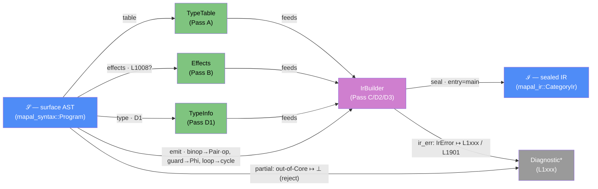

# Component: lower — DESIGN

Status: **binding** (written Session 05, 2026-06-12, per HANDOFF §7.1.5; supersedes the
"pre-design notes only" banner). §0.1 below is retained verbatim (it is binding and is
cited by ADR-0013, ir/DESIGN, and next-session.md); the §0 notes are retained as a
historical appendix at the end of this file and are **not binding** where superseded
(notably obligations 8, 12, 21 — see the ADR-0013 markers there).

Authority for this design (highest wins): accepted ADRs (esp. ADR-0013, ADR-0009/LC-2,
ADR-0005/E4, ADR-0010, ADR-0011) > `category-ir.md` §4/§11 (as corrected by ERRATA LC-4)
> `user-guide.md` §3/§5 > `ir/DESIGN.md` (the realized builder contract lower programs
against) > `syntax/DESIGN.md` §15 (the tree lower consumes). The five §0.1 pins are law.

## §0.1 Pre-design pins from the IR increment (recorded Session 04, 2026-06-12)

These five rules were pinned during the mapal-ir design review (ADR-0013; ir/DESIGN §7–§10)
because leaving them "lowering's choice" would let two lower authors produce different
graphs for the same program. They are obligations on lower, decided already:

1. **Effect signature synthesis (law, ADR-0013):** a function containing `print` (or
   calling an effectful fn) declares token-threaded: surface `A → B` ⇒ IR
   `(IoToken × A) → (IoToken × B)`, degenerating to `IoToken → IoToken`; surface
   `fn main()` declares as `main : IoToken → IoToken`, `input()` is the seed token, and
   the final token is written to Return. Tokens never die (I4b); loop-carried tokens exit
   via every `LoopExit` of that merge.
2. **Canonical ret-write (ir/DESIGN §10):** the producing primitive targets Return via
   `Dest::Ret`; `output()` only for bare `x -> ret` / `x -> ret.k` of pre-existing
   objects. Never `Fresh` + `output()` where `Dest::Ret` suffices.
3. **Negative literals fold at lower time:** `Unary(Neg, <literal>)` becomes one negated
   `Constant` object; `Neg` morphisms are emitted only for non-constant operands (the
   IEEE `fneg` case ADR-0013 keeps `Neg` for).
4. **Value-match guards lower as a right-folded Phi chain:** for arms `-k_i-> e_i` with
   default `-_-> e_d`: `cond_i = Eq(scrutinee, k_i)`; chain = `phi(e_1, phi(e_2, …
   phi(e_n, e_d, cond_n) …, cond_2), cond_1)` — arm order preserved, default innermost.
   (3-way golden pinned in ir/DESIGN §16.)
5. **Loop exit values read the merge-state view** of the iteration in which the guard
   fails (Proj of the LoopMerge or pre-update derivations), never the recomputed next
   state; back edges carry the recomputed state. `sum_to_n(10)` exits 55 — the contract
   test. Both routes share the loop guard's single `cond` object in the canonical form.

---

## Categorical model (Dat + Trn)

> Read first. This section models the **compiler itself** at the LEVEL-B
> firewall (FRAMEWORK §0): the objects below are the lowering filter's own `Dat`,
> the passes are its `Trn`. It does **not** restate the object language — Mapal
> programs as morphisms in Mapal-Cat are modeled once in
> [`docs/architecture/categorical-model.md`](../../architecture/categorical-model.md)
> (the project-wide model kernel) and crossed here only as opaque typed `Trm`
> payloads (`mapal_syntax::Program` in, `mapal_ir::CategoryIr` out). Never conflate
> the two — the project already paid the category-keyword tax once (errata E5).
> Scoping (FRAMEWORK §7.1): the compiler is one in-process pipe-and-filter
> pipeline, so the physical pair `Loc`/`Trm` is **degenerate** here (all passes
> share one process `Loc`, every pipe is same-location); we apply the logical pair
> `Dat`/`Trn` richly and reserve `Loc`/`Trm` for the downstream backend/runtime
> seam where CPU/GPU/FPGA placement and host↔device transmission are genuinely
> real. The model is the authority for the *intent* of §§1–16; where code and
> model disagree, FRAMEWORK §2 governs (fix the code, or amend the model with a
> stated exception).

### Why (one paragraph)

`mapal-lower` **is one functor**, `lower : 𝒮 ⇀ ℐ`, from the surface syntax
category 𝒮 (the parse-clean `mapal_syntax` AST as a `Dat` category) to the IR
category ℐ (the sealed `mapal_ir::CategoryIr` as a `Dat` category). Saying it once,
categorically, buys three things the prose otherwise repeats construct-by-construct:
(1) the **object map** (`TyKind → Ty`, parse-node kind → IR construct) and the
**morphism map** (each surface form → its IR realization) are the *same* functor
viewed on objects vs. arrows — so the §5 type-table and the §8 emission recipes
are not two designs but two faces of one map; (2) the functor is **partial**
(`⇀`) by construction — its domain of definition is exactly Mapal-Core (J3-clean
trees minus the rejected-but-kept forms), and **rejection = partiality**: every
out-of-Core form is an arrow where `lower` is undefined, surfaced as an L-code
(§4), never a silent pass and never a panic (§13 totality is "total *into* the
`⊕ Diagnostic*` sum", not "defined everywhere"); (3) the **staging** A→E is the
functor *factored through intermediate categories* — each pass is a `Trn` object
with `t_from`/`t_to` projections (FRAMEWORK §4.1), and their composition in `Alg`
is the realized functor. The Consolidation Principle (FRAMEWORK §3) is honored:
there is **one** AST, pattern-matched in place — not a parallel `CoreAst` plus a
translator DTO (which would be the §3 modeling smell and would force a full
SurfaceParse→CoreAst copy on every clean compile).

### The functor `lower : 𝒮 ⇀ ℐ`

**On objects (the type-lowering core, §5 / `tys.rs`).** `resolve_ty` /
`TypeTable::resolve` carry `mapal_syntax::TyKind → mapal_ir::Ty`. This map is
**not** bijective-on-objects (so by FRAMEWORK §3 step 4 it is genuinely two
categories, not one in disguise): one surface `Named` arrow fans out to five IR
targets via name resolution, surface-only `Dynamic`/`Error` have no IR image, and
IR-only `Unit`/`Str`/`IoToken` are **minted downstream** by the functor's own
signature-synthesis law (§6.2) and the Return/Print machinery — they have no
surface preimage. The only squares that commute on the nose are the recursive
product/array centre (`Tuple → Ty::Tuple`, `Array{len} → Array{size}` — note the
`len ↦ size` relabel, pinned identical); the discriminated leaves are the genuine
distinctions, segregated as the resolution `Trn`, not a shared shape.

**On morphisms (the emission core, §8 / `emit.rs`).** Each parse-node *kind* maps
to an IR *construct*. Two structural facts make this a clean functor rather than a
table of special cases:

- **`binop → Pair-then-primitive` is categorical product formation.** A `k`-ary
  surface operation lowers to `k` distinct-slot `Pair` edges into one product
  `Object`, then a single op-edge `(A×B…) → T`. This is *why* the IR's
  one-source/one-target invariant (I1) stays total: arity is reified as a product
  `Object`, never as a wide multi-source edge. (Unary `Neg`/`Not` are the genuine
  non-product arrows — deliberately not wrapped in a degenerate 1-tuple, which I9
  would reject.)
- **`guard → Phi`, `loop → inline trace`.** A pure value-match/bool guard lowers to
  a (right-folded chain of) `Phi` selection edge(s) over a product
  `Tuple[T,T,Bool]`; a routing guard is *not* a guard at all but the loop's route
  point. A `loop` lowers to an **inline cycle** — a `LoopMerge` object plus
  `LoopEnter`/`LoopBack`/`LoopExit` edges — never a materialized `Trace` payload
  (the trace *is* the cycle; loop regions are recovered on demand by SCC). This is
  FRAMEWORK §5 "deduce, don't store" applied to loop structure.

**Functoriality (the staging law).** `lower = sealₑ ∘ emitₐ₃ ∘ emitₐ₂ ∘ typeₐ₁ ∘
declareᵪ ∘ effectsᵦ ∘ tableₐ`, read right-to-left as composition in `Alg`. Piecewise
emission — `lower(hₙ ∘ … ∘ h₁) = lower(hₙ) ∘ … ∘ lower(h₁)` over a chain's stages —
is what makes "lower stage-by-stage against the wire" correct by construction (§8.1).

### Morphism table

Every arrow below is a `Trn` (a pass) or a structural construct-map of the functor;
each is realized in code at the cited seam.

| Morphism / construct-map | Signature | Partiality | Semantics |
| --- | --- | --- | --- |
| `lower` | `𝒮 ⇀ ℐ` | Partial | THE functor; total *into* `CategoryIr ⊕ Diagnostic*`, undefined on out-of-Core arrows (`lib.rs::lower`) |
| `table` (Pass A) | `Trn : 𝒮 → TypeTable` | Total | resolve `type` decls to `name → Ty::Struct` (`tys::build`) |
| `resolve_ty` | `TyKind ⇀ Ty` | Partial | the object map; `Named`→{Int,Float,Bool,Struct}∪⊥, `Dynamic`/`Error`→⊥ (`tys.rs`) |
| `effects` (Pass B) | `Trn : 𝒮 → Effects` | Total | classify transitively-effectful fns; I6 call-graph cycle → L1008 (`effects::analyze`) |
| `ir_signature` | `FnSig → Ty × Ty` | Total | §6.2 law: pure `A→B`; effectful → token-threaded `(IoToken×A)→(IoToken×B)`; mints `IoToken`/`Unit` (`emit.rs`) |
| `type` (Pass D1) | `Trn : 𝒮 → TypeInfo` | Total | literal-width unification + block sigs; emits typing L-codes (`typing::analyze_fn`) |
| `emit` (Pass D2/D3) | `Trn : 𝒮 → CategoryIr` (under construction) | Partial | the morphism map; per-construct recipes §8; fail-fast on first `IrError` (`emit::lower_program`) |
| `binop` | `Binary → Pair*-then-op` | Partial | product formation: k `Pair` edges → one op-edge `(A×B)→T` (I1 total) |
| `zip` (builtin) | `Tuple[A^n,B^n] → Zip` | Partial | proj the 2-tuple wire, re-pair, `Zip` → `(A×B)^n`; L1606/L1607/L1608 (§8.9; ADR-0018) |
| `enumerate` (builtin) | `A^n → Enumerate` | Partial | single-source `Enumerate` → `(i32×A)^n`; L1609/L1610 (§8.9; ADR-0018) |
| `time` (builtin, effectful) | `IoToken → (IoToken × f64)` | Partial | plan-time-builtin: `() -> time` is the **wire-LESS** stage — consume the token register, `TimeMs`, split the pair (slot 0 = new token, slot 1 = ms). An effect like `print` (never folded/reordered/dropped: the token says so); `()` elsewhere → L1301, a wire fed to `time` → L1302 (§8.3) |
| `guard` | `Guard → Phi` | Partial | pure arms → right-folded `Phi` over `Tuple[T,T,Bool]`; routing arms → loop route |
| `loop` | `Loop → inline cycle` | Partial | `LoopMerge` + `LoopEnter`/`LoopBack`/`LoopExit`; no stored `Trace` (D3) |
| `seq` | `SeqBlock → statement thread` | Partial | ADR-0019: **no IR footprint** — statements lower in-scope in source order, tail = value; ordering *is* the token thread (§8.10); L1611 if it continues with no tail |
| `seal` (Pass E) | `Builder ⇀ CategoryIr` | Partial | freeze with `entry=main`; post-check failure ⇒ L1901 (lower bug) (`emit.rs` tail) |
| `ir_err` | `IrError → Diagnostic` | Total | builder = "second line of type checking"; maps to L12xx or L1901 (LD12) |
| `feeds` (TT/EF/TI → BU) | `TypeTable × Effects × TypeInfo → IrBuilder` | Total | data availability: these three Dat objects are all inputs consumed by the Pass C/D2/D3 emission block; no copying — FRAMEWORK §7.1 degenerate case |
| `rejection` (out-of-Core → Diagnostic*) | `StageKind::Error / Call / Question / Dynamic / StmtBlock / GuardDiscr::OutOfCore ⇀ Diagnostic` | Partial | the functor being undefined on out-of-Core forms; rejection path of `lower`; each branch produces one or more L1xxx codes (L1000 backstop) |

### Partiality — rejection is the functor being undefined

`dom(lower) = Mapal-Core ⊊ SurfaceParse`. The inclusion `ι : Mapal-Core ↪
SurfaceParse` is injective-but-not-surjective on objects, so the two are related
by a **proper inclusion**, not an identity — there is genuinely a larger surface
category. Each out-of-Core arrow is segregated as a partial-morphism site
discriminated by its variant and rejected with a dedicated code: `Call`/`Question`/
`Dynamic`/`StmtBlock`/`GuardDiscr::OutOfCore`/the `Error` sentinels are the exact
branches where `emit`/`lower` return `Err` (L1000 backstop; the parser's P-codes
are the upstream span-precise gate, C13). `LoopLabel::Custom` and `FanoutKind::Void`
are gated **only** upstream (P0110/P0113) and silently tolerated by `lower` — so for
those two, J3-cleanliness (not a `lower` Err arm) is the guarantee. The model's
honest statement: `dom(lower)` is the J3-clean sub-category, enforced jointly by the
parser's P-codes and `lower`'s `Err` arms, not uniformly by `lower` alone.

### Diagram (project lint: single `-->` arrow style; partiality carried in the label)



The arrows out of `𝒮` are the functor's two faces (object map via `table`/`type`,
morphism map via `emit`); the arrow to `D` labeled "partial" is rejection — the
functor being undefined. See
[`docs/architecture/categorical-model.md`](../../architecture/categorical-model.md)
for the project-wide model kernel (the object-language category this functor's
codomain realizes).

---

## 1. Scope and contract

mapal-lower turns a **parse-clean** `mapal_syntax::Program` into a **sealed**
`mapal_ir::CategoryIr`, or a list of lower-stage diagnostics (L-codes, §4). It performs
name resolution, literal typing, effect analysis, and graph emission. It does **not**
perform: the E2 surface seq-context check, exhaustive whole-program type checking beyond
what lowering itself requires, lifetime analysis, or runtime exclusivity of multiple
Return writers (all mapal-check/interp obligations — §12).

```rust
/// Lower a parse-clean program to a sealed IR.
///
/// Precondition: `program` came from a `parse()` whose diagnostics were empty
/// (syntax J3: no Error nodes, no rejected-but-kept forms). Encountering such a
/// form anyway yields L1000, never a panic. Total: never panics, never hangs
/// (recursion is bounded by the parser's depth guard P0011; see §13).
pub fn lower(source: &str, program: &mapal_syntax::Program)
    -> Result<mapal_ir::CategoryIr, Vec<mapal_syntax::Diagnostic>>
```

- `source` is required because `Name` nodes are bare spans (syntax DESIGN §15); all
  identifier text is `&source[span]`. Lower also re-parses `Float` literal text and calls
  `mapal_syntax::unescape_string` for `Str` (both are "consumer's job" per §15).
- Diagnostics reuse `mapal_syntax::Diagnostic` (pub fields; constructed directly).
  Severity is always `Error` in v1. `fix` is `None` in v1.
- On success the IR is sealed with `entry = main` and satisfies `validate(&ir).is_empty()`
  (mapal-ir's own §16 property); lower never returns an unsealed graph.
- **Error policy (LD12):** the typing pass (§7) collects diagnostics across the whole
  program (multi-error UX); the emission pass (§8) is fail-fast — its first error aborts
  lowering (a half-built graph is never returned). Any `IrError` escaping a builder call
  during emission is a lower bug surfaced as L1901, not a user diagnostic.

Crate deps: `mapal-syntax`, `mapal-ir` (mapal-ir keeps zero deps per its D8; `SourceLoc` is
field-identical — conversion is a trivial `{start, end}` copy). Dev-deps: `insta`,
`proptest`, `criterion`.

## 2. Pipeline architecture (passes)

The `FnBuilder<'a>` mutably borrows the `IrBuilder`, so **no two functions can be built
concurrently, and nothing can be declared while a body is open**. Combined with
declare-before-call (builder API: calls may reference fns defined later) and the fact
that a map/fold body's *declared* tys (`T → U`, `(Acc × T) → Acc`) are only computable
from dataflow types at the operator's stage, the pass structure is forced:

- **Pass A — type table (§5).** Collect `type` declarations into `name → Ty::Struct`;
  resolve field tys; reject duplicates and recursive type definitions.
- **Pass B — effect & call-graph analysis (§6).** Per fn: a lexically-scoped AST walk
  finds direct `print` uses and the direct callee set. Then: call-graph cycles → L1008
  (recursion is out of Core; also a precondition for the next step to terminate);
  transitive effectfulness by iterative propagation (J1: no recursion).
- **Pass C — declare.** `declare()` every surface fn in source order with its IR tys per
  the signature-synthesis law (§6.2). `main` is checked here (exists, no params, no
  declared return — L1001/L1002).
- **Pass D — per fn, in source order:**
  - **D1 typing walk (§7):** symbol-table + literal-width-unification walk of the body.
    Records (all keyed by the driving node's span — spans are unique per node, J2):
    resolved tys for every unsized literal; each map/fold block's operator signature
    (elem/acc ty, body result ty, synthesized body name); per-loop carried sets and
    guard classifications; per-binding *derives-from-merge* tags (§7.3); the
    return-completeness verdict (L1306); and all typing L-codes.
  - **D2 body emission:** declare+build each map/fold block body as a `MapBody`/
    `FoldBody` function, innermost-first (recursion over nested blocks).
  - **D3 outer emission (§8):** `build_fn` + the construct recipes + `finish()`.
- **Pass E — seal.** `seal(main)`. A seal error after lower's own checks is L1901.

D1 exists because D2 needs body signatures before D3 opens the outer `FnBuilder`; it is
*not* a general type checker — it computes exactly what emission needs (literal tys,
block signatures, symbol tys) and rejects exactly what would make emission impossible.
Emission re-synthesizes object tys bottom-up through the builder; any D1/D3 divergence is
caught by the builder's per-call checks and surfaces as L1901 (a lower bug by definition).

## 3. Symbol table and the `mut`-SSA discipline

A scope stack of `name → Binding { obj: ObjectId, ty: Ty, mutable: bool, decl_seq: u32 }`.
`decl_seq` is the monotonic declaration-sequence number (params first, then source-order
binds); a `mut` rebind keeps the original `decl_seq` (LD4).

- **Binding forms:** function **parameters** (`mutable = param.mut_span.is_some()` —
  user-guide §3.5's `fn countdown(mut n: i32)` is the canonical mut-param loop, the
  surface of ir golden h; LD23), `BindStmt` (`x <- e`, `mut y: T <- e`),
  `StageKind::Bind` (`-> x: T`, `-> mut y`), and bare-name stages that resolve to no
  existing binding (`-> result`, LD1). A binding to a value-producing expression names
  the produced object via `Dest::Fresh(Some(name))` (LD17); a binding to an existing
  object (`x <- y`) is pure aliasing — no IR is emitted.
- **One-definition rule (ADR-0013):** re-assignment `e -> x` requires `mut` (else L1104;
  mut params are rebindable like mut bindings) and allocates a **fresh object** (named
  `x` again); the symbol rebinds. No object is ever mutated.
- **Element update `c[i] <- x` (ADR-0021; LD27):** an *indexed* `BindStmt` (`b.index.is_some()`)
  is a **rebind of `c`**, never a fresh shadow — it desugars to `Update(cur, i, x)` (ir §5.1)
  producing a fresh array, then rebinds the symbol via the same `rebind()` a bare `x -> c` uses.
  `c` must resolve to a rebindable local/mut param (else L1104 / not-`mut`); the write is pure
  (no token). Inheritance is **not** automatic — three explicit wiring points (S13 review):
  (a) `emit` — `StmtKind::Bind` with `index.is_some()` takes the `update()`-then-`rebind()` path,
  never `bind_new`; (b) `collect_assigns_stmt` records the indexed target so a `mut c` updated in
  a loop body joins the carried set (the ADR's motivating shape); (c) `scan_stmt` (Phi-arm scan)
  records it so `c[i] <- x` in a Phi arm draws **L1408** like any other enclosing-mut rebind.
  Typing (`typing.rs`): an indexed bind unifies `x` with `array_elem_wty(c)` and re-reads the
  index; `capture_stmt`'s indexed-bind branch reads target+index+value without registering a
  body-local (else a captured enclosing local would evade capture). Precedent: LD4/LD23 rebind
  machinery, LD26 builtin-emission.
- **Scopes (LD8/LD10):** function body = root scope. Guard-arm payloads and loop bodies
  open child scopes (new bindings are arm/body-local). Updates to outer `mut` names
  rebind the **outer** symbol **only in statement position** (loop-body statements
  before the routing guard). Inside guard arms the rule is restricted, because both
  Phi arms always compute (§4.4) and routing arms are *alternative* continuations:
  - **Phi-position arms:** assignment to an enclosing `mut` is **L1408** (an
    unconditional rebind would leak the not-taken arm's update — review SF-1/PHI-1).
    Arm-local `mut`s are fine.
  - **Routing-guard arms:** all arms lower against a **snapshot** of the bindings and
    the token register taken at the guard; jump-arm rebinds are **arm-local** and feed
    only that arm's back-edge pack; exit arms read the snapshot (= the merge-state
    view — this is the mechanism that makes pin 5's `sum_to_n(10) = 55` hold; review
    SF-2c).
  Fanout branches do **not** open a scope — their bindings land in the enclosing scope
  (fanout.mapal uses `sq`/`db` after the join; this is the spec's "implicit join: both
  available here"). map/fold block bodies get a fresh root scope seeded only with the
  block params — referencing an enclosing local is L1108 (blocks are not closures;
  their IR functions have no capture slots).
- **Resolution order for a bare name in stage position (LD1):** local scopes (innermost
  first) → surface functions → the effectful builtins `print`/`println` (ADR-0015; one
  `is_print_builtin` predicate gates every print/effect/token site — LD25) → the **pure
  collection builtins** `zip`/`enumerate` (ADR-0018; one `is_collection_builtin` predicate
  gates the emit dispatch + the two bare-name-binding lookahead sites — LD26). Variables
  shadow functions; declaring `fn print`/`println`/`zip`/`enumerate` or a `type` named
  after a builtin scalar is L1009. In *expression* position a name resolves to locals only
  (a function name as a value is L1105).
- **Collection builtins are pure (LD26; ADR-0018).** `zip : ([A;n],[B;n]) → [(A,B);n]` and
  `enumerate : [A;n] → [(i32,A);n]` carry **no IoToken** — unlike `print`, they never appear
  in the effects walk or consume a token, so they are legal inside a parallel fanout and in
  map/fold bodies. `zip`'s surface source is a 2-tuple wire; emission projects the two arrays
  out (Pair-then-primitive, exactly as `binop`), independently re-derives the shape (owning
  L1606/L1607/L1608), then calls the builder — which re-checks defensively (it is not the
  diagnostic surface, LD12). `enumerate` is single-source; emission owns L1609/L1610 and the
  builder re-derives the `n ≤ i32::MAX` bound. D1 threads the fanout scrutinee ty into each
  headless branch (`chain_seeded`) so a tuple-producing op followed by a `map` types its body
  element correctly.
- **After a loop**, the loop's carried `mut` names are **poisoned** in the enclosing
  scope; reading one is L1107 ("bind the exit value instead", LD9). Rationale: the
  post-loop value lives in the LoopExit object; surfacing it through the old name would
  require exit payloads to always be the full state tuple, contradicting pin 5's
  minimal-payload goldens (d/d′).

## 4. Diagnostics: the L1xxx catalogue

Lower owns the **L1000–L1999** band of the `L` code space; the lexer owns L0xxx (the
`diag.rs` convention comment reads "L#### for lexer" — recorded here as LD16, reconciled
in syntax docs when next touched). Every diagnostic carries the most specific span
available (§10). Catalogue (each gets ≥1 rejection test, §14):

| Code | Name | Trigger |
| --- | --- | --- |
| L1000 | UncleanTree | any Error/rejected-but-kept node reached (defensive; J3 says unreachable for clean parses) |
| L1001 | NoMain | no `fn main` |
| L1002 | MainShape | `main` has params or a declared return type |
| L1003 | DuplicateFn | two `fn` with one name |
| L1004 | DuplicateType | two `type` with one name |
| L1005 | DuplicateField | duplicate field in a `type` body |
| L1006 | DuplicateParam | duplicate parameter name |
| L1007 | RecursiveType | `type` reference cycle (Ty is a tree; cycles are unrepresentable) |
| L1008 | RecursiveCall | call-graph cycle (recursion is Core+1) |
| L1009 | ReservedName | `fn print` / `fn time` / shadowing a builtin scalar type name (every stage builtin name is reserved) |
| L1010 | EmptyType | zero-field `type` declaration (its literal would mint an in-edge-less Temporary — review TY-1; see also the mapal-ir fix note in §16) |
| L1101 | UnknownName | unresolved identifier (expression or stage position) |
| L1102 | UnknownType | unresolved type name |
| L1103 | UnknownField | `.f` not a field of the struct ty / member on non-product |
| L1104 | AssignImmutable | `e -> x` where `x` is not `mut` |
| L1105 | FunctionAsValue | function name in expression position |
| L1106 | NamedParamApplication | `v -> f.p` partial application (Core+1; HANDOFF §4.1 lists only tuple-input + pipeline calls) |
| L1107 | ReadAfterLoop | carried `mut` name read after its loop (LD9) |
| L1108 | CaptureInBody | map/fold body references an enclosing local |
| L1201 | TypeMismatch | operand/annotation/arg/field/elem/arm/state-ty disagreement (one code, specific messages) |
| L1202 | LiteralOutOfRange | literal does not fit its resolved ty (incl. `u64` clamp artifacts; `i32::MIN` via fold is in range) |
| L1203 | LiteralTypeConflict | literal-width unification clash (§7.2) |
| L1204 | NotAProduct | index on non-array, member on scalar, fold seed not `(init, array)` |
| L1205 | SlotOutOfRange | `ret.k` / `x.k` out of bounds, or any index > `u32::MAX` (the Session-04 truncation lesson) |
| L1206 | StrOutsidePrint | string literal anywhere but directly feeding `print` |
| L1207 | Unprintable | `print` of a non-(numeric/bool/str) value |
| L1208 | EmptyArray | array literal/type of size 0 |
| L1209 | TypeTooDeep | any ty (declared or synthesized) nested deeper than mapal-ir's `MAX_TY_DEPTH = 64` — the parser guards only at 128, so depths 65–128 are parse-clean user input, not lower bugs (review SF-8) |
| L1301 | HeadlessChain | statement-level headless chain other than `-> ret;` (`-> loop;` is legal only as a jump-arm terminal — L1304); **or `()` in a value position** — `()` produces no object, its only use is the wire-less head of `() -> time` (plan-time-builtin; the message names that one use) |
| L1302 | ExprStage | stage expression that does not consume the piped value (general E4 stages, tuple stages; OQ2); **or a wire fed to `time`** (`5 -> time`) — the one stage that takes no value |
| L1303 | RetMidChain | stages after `-> ret` in one chain |
| L1304 | JumpMisplaced | `-> loop` outside a loop body, in a headed chain, in non-terminal position, or as an unconditional statement (a `LoopBack` needs a Bool cond; the only legal position is a routing-guard jump-arm terminal — review CP-8) |
| L1305 | FanoutNoValue | chain continues after a fanout but some branch produces no value |
| L1306 | IncompleteReturn | non-Unit declared output with no return write; partial/duplicate `ret.k` slot coverage; mixed bare-`ret`/`ret.k` in one fn; bare value-less `-> ret` where output is non-Unit. Checked in D1 (syntactic presence — sound for Core because L1405 bans ret in Phi arms and loop exits count); keeps `RetSlotMissing`-class IrErrors out of the user path (review RET-2/CP-3) |
| L1307 | EffectfulReturnShape | in an effectful fn: surface `ret.k` writes, or >1 surface ret-write, or token use after a ret-terminal loop exit — each write consumes *the* final token, so at most one surface return site exists (review IR-1; ADR-candidate if surface demand appears) |
| L1401 | GuardArmMissing | bool guard without both poles (default may stand for the missing pole), or value-match without `-_->` |
| L1402 | GuardArmDuplicate | duplicate discriminant |
| L1403 | GuardArmMixed | bool and integer discriminants in one guard |
| L1404 | GuardArmEffectful | `print`/effectful call in a Phi-position arm (honest coproducts are Core+1; tokens cannot pass Phi) |
| L1405 | GuardRetInPhiArm | `-> ret` inside a Phi-position arm (OQ3) |
| L1406 | GuardScrutineeType | integer discrs on non-integer scrutinee / bool arms on non-bool scrutinee |
| L1407 | RoutingGuardShape | routing guard not the final body item (statement **or tail**) of the loop body, or a routing-guard arm that neither jumps nor exits |
| L1408 | AssignInPhiArm | assignment to an enclosing `mut` inside a Phi-position arm (both arms always compute; the rebind would apply unconditionally — review SF-1) |
| L1409 | RoutingGuardArms | routing guard with discriminants other than exactly one jump pole + one exit pole of `{true, false}` (`-_->` may stand for one pole); integer-discr routing arms are Core+1 (multi-route loops are IR-expressible but their cond/polarity/token-fork surface rules need an ADR — reviews SF-4/GD-1/TK-1/CP-9; OQ7) |
| L1501 | LoopNoExit | no routing guard exits (incl. `loop { -> loop; }`-shaped bodies; OQ1) |
| L1502 | LoopNoState | loop assigns no enclosing-scope `mut` var (a token alone cannot drive a guard — its carried set is vacuous for termination; review DG-1) |
| L1503 | LoopGuardShape | the routing guard's cond, or every component of a jump arm's next-state, fails the *derives-from-merge* test (§7.3). Deliberately **stricter** than seal (a merge-derived exit payload alone keeps the graph seal-clean — review DG-1/IR-2): a non-derived cond means a vacuous or unconditionally-divergent loop, and a fully non-derived next-state is seal `LoopBackOutsideScc` |
| L1504 | NestedLoopShape | inner loop assigns a `mut` carried by an enclosing loop; an inner-loop exit arm not terminating in `-> ret`; or any nested loop inside a token-carrying loop body — the only nested shape both I5 and the I4 token fork admit is "inner exits via ret" (ir/DESIGN §7; reviews SF-1ir/LP-2/SF-11; OQ7) |
| L1601 | BlockArity | map block ≠ 1 param, fold block ≠ 2 params (lower enforces; supersedes W19's deferral — arity is structural for lowering, LD11) |
| L1602 | MapNonArray | map applied to a non-array wire |
| L1603 | FoldShape | fold wire not a 2-tuple `(init, array)` |
| L1604 | BodyNoValue | map/fold body block has no tail value |
| L1605 | BodyEffectful | `print`/`time`/effectful call inside a map/fold body |
| L1606 | ZipNonTuple | `zip` source is not a 2-tuple (scalar, or arity ≠ 2) — ADR-0018 |
| L1607 | ZipNonArray | a `zip` tuple component is not an array (ADR-0018) |
| L1608 | ZipSizeMismatch | the two `zip` arrays differ in length (ADR-0018) |
| L1609 | EnumerateNonArray | `enumerate` applied to a non-array wire (ADR-0018) |
| L1610 | EnumerateOverflow | `enumerate` array length > `i32::MAX` — the index `i32` could not name every element (F4/SND-3 precedent; ADR-0018) |
| L1611 | SeqNoValue | a `seq { … }` whose chain **continues** past the stage (a following stage, or return position) but whose block has **no tail value** (ADR-0019 pin c; §8.10). Its own code, not L1305: a fanout demands a value from *every* branch to join, a seq demands *one* tail — distinct conditions, distinct messages (the L1305 name/trigger are fanout-specific) |
| L1901 | Internal | a builder call failed during emission (lower bug; message embeds the `IrError` debug form) |

## 5. Pass A — type table

`TypeDecl { name, fields }` → `Ty::Struct { name, fields }`. Field ty resolution
(`TyKind → mapal_ir::Ty`):

- `Named`: `i32`→`Int{32,true}`, `i64`→`Int{64,true}`, `u8`→`Int{8,false}`,
  `f32`/`f64`→`Float`, `bool`→`Bool`, else the type table (L1102 if absent).
- `Tuple(ts)` → `Ty::Tuple` (parser guarantees arity ≥ 2); `Array{elem, len}` →
  `Ty::Array{elem, size: len}` with `len == 0` → L1208. `Dynamic`/`Error` → L1000.
- Struct-reference cycles: iterative DFS over the decl reference graph → L1007 (Ty is a
  tree; `MAX_TY_DEPTH = 64` would also trip, but the cycle deserves its own message).
- Acyclic-but-deep tys (depth 65–128 parse clean): L1209 here and at every synthesized
  ty in D1 — `TyTooDeep` must never reach the L1901 path.
- Zero-field declarations (`type Empty {}` parses clean): L1010 — their literals would
  mint an object with zero in-edges, which seals but fails `validate()` (review TY-1;
  the corresponding mapal-ir intake/`pack_struct` hole gets fixed and regression-tested
  this increment, §16).
- Declaration-order processing; duplicates → L1004/L1005. The table makes seal's
  `StructNameConflict` unreachable from lower (one decl per name).

## 6. Pass B/C — effects, call graph, signatures

### 6.1 Direct effects and callees

Per fn, one lexically-scoped AST walk (a thin precursor of §7's walk, sharing the scope
machinery but tracking only *names*, not tys): a stage-position bare name resolving past
locals to a fn name is a **call edge**; resolving to `print` or to `time` marks the fn
**directly effectful** (both thread the IO token — plan-time-builtin). Calls made inside the owner's map/fold blocks are **owner→callee edges of
the same reference graph** — Pass B's L1008 cycle check runs over exactly the graph
seal's I6 checks (Call edges + body refs), so owner-via-body recursion is L1008, never
seal `RecursiveCall`/L1901 (review SF-9/IR-3). Effect *attribution* for block-internal
prints/effectful calls stays per-block (for L1605) — block bodies are separate
token-free functions and never make the *owner* effectful by themselves.

### 6.2 Transitive effects and IR signatures (TL-1, pin 1)

Cycle-check the call graph first (L1008), then propagate effectfulness over the acyclic
graph with an iterative worklist. IR signature per surface fn (`A` = the single param ty,
or `Tuple` of param tys for ≥2 params, or *absent* for zero params; `B` = declared return
ty or *absent*):

| effectful? | A | B | declared input | declared output |
| --- | --- | --- | --- | --- |
| no | absent | absent | `Unit` | `Unit` |
| no | present | present | `A` | `B` |
| yes | absent | absent | `IoToken` | `IoToken` |
| yes | present | absent | `Tuple[IoToken, A]` | `IoToken` |
| yes | absent | present | `IoToken` | `Tuple[IoToken, B]` |
| yes | present | present | `Tuple[IoToken, A]` | `Tuple[IoToken, B]` |

(No Unit components are manufactured — ir/DESIGN §8 verbatim. A pure fn with params but
no declared return gets output `Unit`; a pure zero-param fn input `Unit`.)

Parameter access: pure multi-param → `input()` is the product; each param symbol binds to
`proj(input, k)` emitted **on first use** (TY-2). Effectful with A present: the input is
the **2-tuple** `(IoToken, A)` — `tok = proj(input, 0)` seeds the function's
**current-token** register; `a = proj(input, 1)` (on first param use) is the params
view: the single param itself when there is one, else `param k = proj(a, k)`. Params do
**not** "shift slots" on the outer tuple — `proj(input, 2)` would be `SlotOutOfRange`
(review SIG-1). Effectful with A absent: `input()` *is* the token. Param mutability
carries through (§3/LD23). `main` is checked for `params = []`, `ret_ty = None`; pure
`main` (no print anywhere) declares `Unit → Unit` (OQ6).

### 6.3 Calling conventions (emission-side corollary)

Call stage `v -> g` with `g : A → B` surface:

- **Pure callee:** `call(g, arg, dest, loc)`; `arg` = the wire object (its ty must equal
  the declared input — multi-param callees take the wire as the product, e.g.
  `(signal, coeffs) -> fir4`).
- **Effectful callee** (caller is then effectful too, by 6.2): `arg' = pack(tok, arg)`
  (or `tok` alone when A absent); `r = call(g, arg', Fresh, loc)`. Then, **by B**:
  - B present: `tok := proj(r, 0)`; the stage's wire value is `proj(r, 1)`. Both projs
    are emitted eagerly (the token must not sit unconsumed inside `r`; the I4 exception
    list does not cover call results).
  - B absent: `r : IoToken` is not a product — **`tok := r` directly, no proj** (review
    SF-2/CALL-1); the chain ends (continuing it is L1201 "value of a unit-returning
    call"). In tail position of an effectful B-absent *caller*, the call may take
    `Dest::Ret { slot: None }` directly (the §8.1 canonical-ret note's "token fresh off
    a call" case).
- Zero-param fns are uncallable in Core (no surface form reaches them; `main` is entry).

## 7. Pass D1 — the typing walk

A bottom-up ty synthesis over the body with a scope stack (§3), whose only inference
device is **literal-width unification** (LD3):

### 7.1 What it computes

- `lit_ty: BTreeMap<(u32, u32), Ty>` — resolved ty for every unsized `Int`/`Float`
  literal, keyed by `(span.start, span.end)`; spans are unique per node (J2), giving
  O(log n) lookup at emission (accessed via `TypeInfo::lit(span)`).
- Per map/fold stage (keyed by stage span): `elem`/`(acc, elem)` input tys, body result
  ty, and the synthesized body name (LD11).
- Symbol tys, carried-state sets for loops (§8.5), guard classifications (§8.4) — i.e.
  every decision emission needs that requires ty or flow information.
- All typing diagnostics (collected, not fail-fast).

### 7.2 Literal-width unification

`Int(u64)` literals get an IntVar, `Float` literals a FloatVar. Unification points:
binop operands (must be equal — Core has no implicit conversion, L1201 on concrete
clash), bind/param/field/array-elem annotations, call argument vs declared input
components, guard `Eq(scrutinee, k_i)`, array literal elements (all equal), loop state
init vs update, fold seed vs body acc, Phi arm tys, `ret` writes vs declared output.
Vars unify only with `Int{...}`/`Float{...}` scalars respectively (IntVar↔Float clash =
L1203). At walk end, unresolved IntVars default `i32`, FloatVars `f64`. After
resolution, range-check every literal against its ty (L1202); negative-literal folds
check the *negated* value (so `-2147483648` is in range for i32). This is the minimal
scheme that types sepia's `(0.0, sepia_image) -> fold { acc, px -> acc + px.r }` (the
seed's FloatVar resolves to f32 through `acc + px.r`); no polymorphism, no occurs-check
beyond scalar-only unification.

### 7.3 Derives-from-merge tags and return completeness

Two more D1 products, both plain dataflow over the same walk:

- **Derives-from-merge tags** (for L1503): inside a loop body, each binding carries a
  boolean *derived* tag — seeded `true` at the carried names' merge views (and the
  token register), propagated through expressions (any derived operand ⇒ derived
  result) and rebinds, and **killed** when a name is rebound to a merge-independent
  value (`5 -> acc`). At the routing guard, L1503 requires: the cond's value is
  derived, **and** ≥1 component of each jump arm's next-state is derived. This is
  derivation-based, not name-based — `i + 1 -> t; (t <= n)` passes; `5 -> acc;
  (acc > 0)` fails (reviews DG-1/IR-2).
- **Return completeness** (L1306): per fn with non-Unit declared output, D1 requires ≥1
  full-value return site (a `-> ret` chain write, a ret-terminal loop exit, or a
  non-Unit fn-body tail per §8.1) **or** exactly-once coverage of every `ret.k` slot;
  mixed bare/slot, duplicate slots, or value-less `-> ret` fail here. Syntactic
  presence suffices for Core: L1405 keeps ret out of Phi arms, so every counted site is
  unconditional-or-exit.

## 8. Pass D3 — emission recipes

Emission walks statements in source order, maintaining the scope stack, the **wire**
(`cur: Option<ObjectId>` within a chain), and the **current token** (effectful fns).
Every builder call passes the `SourceLoc` of the surface node driving it (§10).

### 8.1 Chains, the wire, and the one-stage-lookahead Dest rule (LD2)

A chain lowers head-to-tail: head expr → `cur`; each stage transforms `cur`. When a
stage (or head) is about to emit a **value-producing primitive**, its `Dest` is chosen
by peeking at the *next* stage:

- next is `Ret { proj }` → `Dest::Ret { slot: proj }` (canonical ret-write, pin 2; the
  `Ret` stage is then consumed — it must be final, else L1303);
- next is a binding (`Bind` stage, or bare name resolving to unbound/mut) →
  `Dest::Fresh(Some(name))`, and the symbol binds to the result;
- otherwise → `Dest::Fresh(None)`.

When `cur` is **pre-existing** (a parameter, constant-bound name, or alias) and the next
stage is `Ret` → `output(cur, slot, loc)` (the only `Output` use, RO-1/D6). Bare `-> ret`
/ `-> ret.k` of fresh primitives never goes through `output()` (pin 2).

**Effectful returns (LD18, revised per review IR-1):** with surface return B present,
every surface ret-write lowers as a **full-tuple writer**: `pack(tok, value)` →
`Dest::Ret { slot: None }` — the same shape a ret-terminal loop exit produces (§8.5), so
the two can never mix writer arities. Because each such write consumes *the* final
token, an effectful fn has at most **one** surface return site; a second one, or surface
`ret.k` writes (which cannot be completed without the not-yet-final token), is L1307.
When B is absent, the final token is the sole writer (`output(tok, None)` — golden g —
or `Dest::Ret` when the token is fresh off a call/exit). Pure fns keep plain
full-or-slot writes; multiple pure full writers remain legal (OQ3).

**Blocks (LD21, reviews CP-1/CP-2):** a `Block` lowers as its items in order, then its
W11 **tail chain as the final item** — classification (routing guards, L1407's "final
body item") and emission treat statement-vs-tail identically. The tail's *value* has
meaning by context: arm payloads and map/fold bodies take it as the block's value
(§8.4/§8.7); a **fn-body** tail whose value dangles returns it (a virtual `-> ret`
continuation, taking the lookahead `Dest::Ret` — the W11 "block's value" reading, OQ8)
when the declared output is non-Unit, and is dead code otherwise; a **loop-body** tail
has no value role (sum_to_n and fir carry their routing guard as the body tail — the
flagship shape).

### 8.2 Expressions

| `ExprKind` | recipe |
| --- | --- |
| `Int`/`Float`/`Bool`/`Str` | `constant(value, loc)` with the §7-resolved ty; `Str` only when the consumer is `print` (else L1206) |
| `Var` | symbol lookup (L1101); function name → L1105 |
| `Unit` (`()`) | **no object**: the wire-LESS chain head — `emit_chain` seeds `cur = None` before any expression is emitted (plan-time-builtin), so only `() -> time` consumes it and every other stage then reports L1301 ("no wire"). Reaching the expression recipe at all means `()` was used as a *value* → L1301 |
| `Hole` | the substituted wire value (§8.3 OpShorthand) |
| `Unary(Neg, lit)` | **fold** (pin 3): one negated `Constant`; `Unary(Neg, e)` otherwise → `unop(Neg, e')` ; `Not` → `unop(Not, …)` |
| `Binary(op, l, r)` | lower l, lower r, `binop(op, l', r', dest, loc)` — Pair-then-primitive is the builder's atomic shape (DF-4); operand order preserved (non-commutative ops) |
| `Member(base, Named f)` | base must be `Ty::Struct`; field index by decl order → `proj(base', idx, …)` (L1103) |
| `Member(base, Index k)` | base must be **Tuple or Struct** — the IR's `Proj` excludes arrays ("arrays use Index, not Proj"); an Array base is L1204 with a "use `arr[k]`" hint (review MEM-1); `proj(base', k, …)` (L1205 on OOB/`u32` overflow) |
| `Index(base, idx)` | `index(base', idx', dest, loc)` (builder packs internally); non-array base L1204; OOB is a runtime **trap**, never a lower error (TR-1) |
| `Tuple(es)` | `pack(components, dest, loc)` |
| `Array(es)` | `pack_array(components, dest, loc)`; empty → L1208 |
| `Struct{name, inits}` | table lookup (L1102); evaluate inits in source order, reorder to field decl order; pun `r` reads the symbol; missing/unknown/duplicate field → L1201/L1103/L1402-style messages under L1201/L1103; `pack_struct(ty, comps, dest, loc)` |

### 8.3 Stage classification

| stage | recipe |
| --- | --- |
| `Expr(Var)` → local | mut → rebind (fresh object via the producing primitive's Dest, §8.1); non-mut existing → L1104; unbound → bind `cur` (aliasing or Dest-naming) |
| `Expr(Var)` → fn | call per §6.3 |
| `Expr(Var)` → `print` | `tok := print(tok, cur, loc)`; `cur` unchanged? No — the chain **ends**: `print` is a sink stage; further stages → L1303-style L1302. Value must be printable (L1207) |
| `Expr(Var)` → `time` | the one **wire-LESS** stage (plan-time-builtin): a wire is L1302. `pair := time_ms(tok, loc)`; `tok := proj(pair, 0)` (the effect ordering, exactly as `print` rebinds the register), `cur := proj(pair, 1) : f64` taking the §8.1 lookahead Dest — so `() -> time -> t0` names it and `() -> time -> ret` writes Return. Effectful, so it is a direct effect in Pass B (§6.1) and L1605 in a map/fold body |
| `Expr(Member)` | fn.param → L1106; anything else → L1302 (a member expr in stage position does not consume the wire) |
| `Expr(_)` general / `Tuple` | L1302 (OQ2 — E4 defines only the parse, not a wire-discarding semantics) |
| `OpShorthand{expr}` | lower `expr` per §8.2 with `Hole` ↦ `cur`; the outermost operator's primitive takes the chain's §8.1 lookahead Dest; result becomes `cur` (golden b / §9 pipeline — review SF-10/CP-4) |
| `Bind` | bind `cur` per §8.1; annotation unified in D1 |
| `Ret` | per §8.1 |
| `LoopJump` | legal **only** as a routing-guard jump-arm terminal (§8.4/§8.5); anywhere else — headed chain, mid-chain, statement-level unconditional, outside a loop — L1304 (a `LoopBack` needs a Bool cond; reviews CP-5/CP-8) |
| `Guard(arms)` | §8.4 |
| `Fanout` | §8.6 |
| `MapFold` | §8.7 |
| `SeqBlock` | §8.10 (statements in enclosing scope, tail = value, no IR footprint; L1611 continues-no-tail) |
| `StmtBlock`/`Error` | L1000 |

Statement-level headless chains: `-> ret;` (a no-value return marker: legal in
Unit-output fns and as a loop-exit arm; in a fn with non-Unit declared output it is
L1306) is the only form; statement-level `-> loop;` is L1304 outside a jump arm
(review CP-8), and anything else is L1301. Headless chains in guard-arm payloads seed
`cur := scrutinee` (the guard's incoming value, §0-A obligation 11) **unless** the
chain is just the bare `-> loop` / `-> ret` marker — the markers carry no value and
never adopt the scrutinee (review SF-5/LP-1; §8.5 defines their payloads). Headless
fanout branches seed `cur := fanout source`.

### 8.4 Guards

Classification (LD6, restated per review CP-5): an arm is **routing** iff its payload's
**final chain** — the `Chain` payload itself, or a `Block` payload's final item-or-tail
chain (LD21) — is a headless chain terminating in `LoopJump` (sum_to_n/fir's jump arms
are Blocks whose last item is `-> loop;`). Any other occurrence of `LoopJump` is L1304.
A guard containing a routing arm is a **routing guard**: legal only inside a loop body
(L1304 otherwise), only as the body's final item — statement or tail — (L1407), and
restricted in Core to **exactly two arms over the bool poles** — one jump arm + one
exit arm with discriminants `{true, false}` (`-_->` may stand for one pole); anything
else (≥3 arms, integer discrs, two jump arms) is **L1409** (LD19 — this single
restriction is what makes the cond/polarity story total and keeps token-carrying loops
inside I4's exactly-two-consumer fork; reviews SF-4/GD-1/TK-1/CP-9, OQ7). The exit arm
must terminate in `-> ret`, a binding, or a bare value (§8.5). A guard with no routing
arm is a **Phi guard**.

**Phi guards.** Scrutinee = `cur`. Arm payloads lower in child scopes against a
snapshot of the enclosing bindings; a payload `Block` lowers as statements-then-tail
(W11; the tail is the arm value). Restrictions: arm payloads must produce a value of
one common ty (L1201); no `print`/effectful call (L1404); no `-> ret` inside an arm
(L1405); no assignment to enclosing `mut`s (L1408 — both arms always compute, §4.4).
Forms:

- **Bool guard:** exactly `-true->`/`-false->` (a `-_->` may stand for the missing pole;
  both missing or duplicated → L1401/L1402; integer discrs mixed in → L1403; scrutinee
  must be Bool → L1406). Lowering: `phi(t_val, f_val, scrutinee, dest, loc)` — source
  order of arms does not matter; the discriminants do.
- **Value-match guard** (pin 4): integer discrs `k_1..k_n` in source order + `-_->`
  required (L1401). Scrutinee ty must be a Core integer (L1406); each `k_i` range-checks
  against it (L1202). `cond_i = binop(Eq, scrutinee, const k_i)` emitted in arm order;
  then the right-folded chain — innermost `phi(e_n, e_d, cond_n)` outward to
  `phi(e_1, …, cond_1)`, the **outermost** phi taking the chain's lookahead Dest
  (golden i: `vmatch`).

The guard stage's value (`cur` afterwards) is the outermost phi object.

**Routing guards** are not lowered as guards at all — they are the loop's route point
(§8.5).

### 8.5 Loops

**Carried state discovery (D1; LD4, refined per reviews CP-7/SF-11):** the carried set
= `mut` names **resolved to a scope enclosing the loop** (mut params included, LD23)
that are assigned anywhere in the loop body (nested arms/blocks included; nested-loop
interiors cannot assign them — L1504), in **declaration order** (params in param order
first, then bindings), plus — iff the loop body contains effects — the **token, last**.
Body-local `mut`s are ordinary per-iteration rebinds, never carried. Empty mut set →
L1502 (a token alone cannot drive the guard). `U` = the single carried ty, or `Tuple`
of the carried tys (LD5). The L1503 derivation requirements on the guard cond and the
next-state are defined in §7.3 — deliberately stricter than seal (LD20).

**Emission:**

1. `init`: current values of the carried vars (+ current token), packed in carried order
   when |U| ≥ 2 (`pack(…, Fresh(None))`); the single object itself otherwise.
2. `lh = begin_loop(init, loc)`; `merge = merge_of(&lh)`. Rebind each carried name to
   `proj(merge, k, Fresh(Some(name)))` — or to `merge` itself when |U| = 1 (golden d
   reads the merge directly; no gratuitous Proj). Token: `tok := proj(merge, last)`
   (or `merge`).
3. Lower the body items (statements, then the W11 tail — LD21) in source order against
   these bindings (prints update `tok`; `mut` updates rebind — golden h's
   `print`-then-guard order falls out). The routing guard is the final item (L1407) —
   in sum_to_n/fir it is the body's tail chain.
4. At the routing guard (exactly one jump arm + one exit arm over the bool poles —
   L1409, §8.4): `cond =` lowered scrutinee (one object — both routes share it, pin 5).
   **Snapshot** the bindings + token register (§3); each arm lowers against the
   snapshot. Per arm:
   - **Jump arm** (`-> loop` terminal): its payload's statements (state updates) lower
     first, rebinding **arm-locally** (`-true-> { acc + i -> acc; i + 1 -> i;
     -> loop; }` — sum_to_n's shape); then `next =` the arm-local values of the carried
     names (+ the arm-local token), packed in carried order when |U| ≥ 2 — the
     **recomputed** state rides the back edge (pin 5); `loop_back(&lh, next, cond_arm,
     loc)`. Polarity: `LoopBack` fires on **true** (D7) — a `-false->` jump arm wraps
     the shared cond once: `cond_arm = unop(Not, cond)`.
   - **Exit arm**: lowers against the **snapshot** — never the jump arm's rebinds (this
     is what makes "exit reads the merge-state view" true regardless of arm source
     order: `sum_to_n` exits 55, not 66 — review SF-2c). Payload `B` := the arm's chain
     value; when the loop carries a token, `B` must carry it out (TL-3): payload =
     `pack(tok_snapshot, value)` (token slot 0, matching §8.1's effectful-return shape)
     or `tok_snapshot` alone for a value-less `-> ret` exit (golden h; the snapshot
     token is the post-body-statement token — h's exit carries the post-print token).
     Terminal handling:
     - `-> ret` → `loop_exit(payload, cond_exit, Dest::Ret { slot: None }, loc)` (a
       full-value write; in a pure **Unit**-output fn the payload is the merge-state
       view `U` — the merge object (|U|=1) or its pack — exiting to `Fresh(None)` with
       zero Return writers, which I-RET permits for Unit; review LP-1. A value-less
       `-> ret` where the output is non-Unit is L1306). After a ret-terminal exit the
       token register is **consumed** — later token use is L1307.
     - a binding → `loop_exit(…, Fresh(Some(name)), …)`; the name binds **in the
       enclosing scope** to the exit object; for token-bearing exits the enclosing
       token register rebinds to `proj(exit, 0)` and the name to `proj(exit, 1)`.
     - bare value → `Fresh(None)`; in a token-carrying loop the token register still
       rebinds to `proj(exit, 0)` (the exit object must not dangle token-bearing —
       I4b; review TK-2); the value component stays unprojected.
     Exit polarity is the complement of the jump arm's (`LoopExit` fires on **false**).
5. `end_loop(lh)`. No routing guard at all → L1501 (this is where `loop { -> loop; }`
   — E1-legal divergence — is currently rejected; OQ1). Poison the carried names
   (LD9/L1107).

**Nested loops (LD20, reviews SF-1ir/LP-2/SF-11):** `-> loop` targets the innermost
loop (ADR-0011; labels are Core+1). An inner loop is a statement of the outer body with
an independently-discovered carried set, but Core admits only the shape ir/DESIGN §7
pins as I5-compatible — **inner exits terminate in `-> ret`** (the function returns
from inside the inner loop). Everything else is L1504: an inner-loop assignment to an
outer-carried `mut` or an inner exit feeding the outer next-state closes a cycle
through both merges (the inner `LoopEnter`'s source lands inside the merged SCC — seal
`LoopBackOutsideScc`); a nested loop inside a token-carrying loop gives the token a
third route consumer (I4 sanctions exactly two). Lifting these needs an mapal-ir ADR
(OQ7).

### 8.6 Fanout (`Plain`)

Branches are headless chains seeded with the fanout source; each lowers in the
**enclosing** scope (LD8). No join object is emitted (golden f1: two slot-writes, no
join). If the chain *continues* past the fanout stage (corpus-backed: user-guide §7.3
chains a fanout's result onward as a tuple), the join is materialized as
`pack(branch tail values in branch order)` → `cur` (golden f2); a value-less branch then
draws L1305, and a **single-branch** fanout's join is the branch's tail value itself —
no pack (`pack` of one is `SingletonTuple`; review FAN-1). Effects thread the **current
token in branch source order**, which makes effect order dataflow (TL-7); rejecting
effectful `Plain` branches is mapal-check's E2 obligation (ADR-0013 consequences:
"mapal-check still owes the surface seq-context rule"). Since ADR-0019 `FanoutKind` is
`Plain | Void` — the `Seq` summand migrated to the `SeqBlock` node (§8.10). `Void` is
P0113 (never reaches lower; L1000 defensively).

### 8.7 map / fold (LC-2, ADR-0009)

Wire shapes: map needs `cur : Array{T, n}` (L1602); fold needs
`cur : Tuple[Acc, Array{T, n}]` (L1603) — the surface `(init, array) -> fold` head is an
ordinary tuple pack (LC-2: "Pair(init, array) then the fold primitive"). Param arity:
map = 1, fold = 2 (L1601; lower enforces — LD11). Body fns:

- Declared in D2 (before the owner's `build_fn`): kind `MapBody`/`FoldBody`, name
  `{owner}::{map|fold}@{i}` where `i` is one per-owner counter shared across map and
  fold blocks in source order (sepia: `main::map@0`, `main::fold@1` — deterministic
  dumps; `declare`'s duplicate check covers `Named` only, but synthesized names are
  unique anyway), input `T` / `Tuple[Acc, T]`, output = body result ty (D1).
- Body block: params bind to `input()` / `proj(input, k)`; statements then **tail** =
  the body value, written canonically (`Dest::Ret`); missing tail → L1604. Fresh root
  scope (captures → L1108); effects → L1605 (bodies are token-free, TL-6). Nested
  blocks recurse (innermost-first in D2).
- Owner side: `map(body, cur, dest, loc)` / `fold(body, cur, dest, loc)` with the §8.1
  lookahead Dest (`-> sepia_image: …` names it; `-> total_r` likewise).

### 8.8 print

`print(tok, value, loc)` — token in, fresh token out; the builder packs `(IoToken, P)`
internally (the only legal `Str` product, I9s). Lower's part: maintain the current-token
register; final token → Return per §8.1. Print in Phi arms → L1404; in bodies → L1605;
in fanout branches → threaded (§8.6).

### 8.9 zip / enumerate (ADR-0018 / LD26)

Pure collection builtins, resolved by name (LD1). Neither takes or produces a token, so
neither touches the effects walk / token register — both are legal in fanout branches and
map/fold bodies.

- **`zip`**: `cur : Tuple[Array{A,n}, Array{B,n}]` → `Array{Tuple[A,B], n}`. Emission
  re-derives the shape and owns the L-codes — L1606 (source not a 2-tuple), L1607 (a
  component not an array), L1608 (sizes differ) — then projects `lhs = proj(cur,0)`,
  `rhs = proj(cur,1)` and calls `zip(lhs, rhs, dest, loc)`. The builder re-pairs them into
  the internal `(A^n, B^n)` product and applies `Zip` (Pair-then-primitive, exactly as
  `binop`, §11.1). The tuple→proj→re-pair round-trip is redundant but keeps the single-source
  IR contract; layer-2 (P4) may fuse it.
- **`enumerate`**: `cur : Array{A,n}` → `Array{Tuple[i32,A], n}`. Single-source (direct edge,
  no internal pair). Emission owns L1609 (non-array) and L1610 (`n > i32::MAX` — the index
  `i32` could not name every element; F4/SND-3 precedent), then calls `enumerate(cur, dest,
  loc)`; the builder re-derives the bound defensively (LD12).
- Owner side: the §8.1 lookahead Dest names the result (`-> c: [i32; 4]`). Both re-checks in
  the builder are an **independent** re-derivation, never shared with emission's checks.

### 8.10 seq statement block (ADR-0019)

`data -> seq { … }` is an **ordered statement block in stage position**, not a fanout
flavor (ADR-0019 split the node off `FanoutKind::Seq`). `seq` has **no IR footprint**
(pin d): its ordering guarantee *is* the token thread that source-order statement
lowering already produces (§8.8 / TL-7) — the dump of a `seq { "a" -> println; "b" ->
println }` shows only the two `Println` primitives, threaded io → io → io, with no seq
node (golden `seq_two_printlns`). Emission (`emit_seq_block`, one arm off the §8.3
stage dispatch, next to `Fanout`):

- **Statements lower in order in the enclosing scope** (no child scope — bindings
  escape, pin b, exactly the `fanout.mapal`/LD8 idiom). A **headless chain statement
  seeds `cur := seq input`** (pin a — the old bare-chain branch form parses unchanged
  and means the same); `Bind`/`Loop` statements lower as ordinary statements (`emit_stmt`).
  This chain-seeding is the one place seq diverges from `emit_block`'s non-seeding
  statement loop, so it does not call `emit_block` directly.
- **The seq's value is its tail chain's value** (pin c), the tail lowered via
  `ChainCtx::HeadlessSeed(input)`. A seq whose chain **continues** past the stage (a
  following stage, or return position) with **no tail value** draws **L1611** (no more
  silent pack-of-tails — the old `FanoutKind::Seq` in body-return position packed branch
  tails into a baffling join). In statement position with no continuation, a tail-less
  seq is a legal no-op (`empty seq { }`). The return-position guarantee holds **uniformly**
  for pure *and* effectful fns: an effectful-B-present body-tail whose value is packed with
  the token lowers under `ChainCtx::RetValue` (a return-position context that still hands
  the value back for the pack), so a tail-less seq there also draws L1611 — not the outer
  L1306 it fell through to before the WP2 fixer pass.
- The seq value comes **bare** off its tail (the tail took no lookahead `Dest::Ret`, since
  it lowered under `HeadlessSeed`), so `SeqBlock` is **not** a `stage_writes_value` — a
  following `-> ret` marker routes the value through `emit_ret_existing` exactly as a
  pre-existing wire, and a seq that *is* the final stage of a return-position chain
  (`FnBodyReturn`/`BodyReturn`) writes its value to Return itself (the tail handler
  ignores the returned wire). Value → next `-> f`/bind consumes it, unchanged.
- **Effects:** `seq` is the E2 legal effect site (pin e). A `print` inside a seq **does**
  make the owner effectful (the effects walk, `effects.rs`, recurses the seq body in the
  enclosing scope — unlike a map/fold body, LD24). An **effectful seq inside a `Plain`
  (parallel) fanout** opens no escape hatch: an effectful branch that joins produces no
  value → the existing **L1305**, exactly as a bare effectful branch (parity test
  `effectful_seq_in_fanout_join_rejected`). The E2 *surface* rejection of a pure-position
  effect stays mapal-check's obligation (§1).
- **Every** block-walking sub-pass descends into **both** `Fanout` branches and `SeqBlock`
  bodies — they are enclosing-scope sub-chains (pin b / LD8), so anything inside one is
  subject to the same rule as if it sat directly in the arm/body: the D2 map/fold collector
  (`collect_chain`), the D1 type walk (`stage`), the loop-body effect detectors
  (`effect_chain`, `walk_chain_stages`), **and** the three that gate on unconditional
  execution — the Phi-arm scan (`scan_chain`: an effect/`-> ret`/enclosing-`mut` rebind
  inside a fanout/seq in a Phi arm still fires unconditionally → L1404/L1405/L1408), the
  loop-assign collector (`collect_assigns_chain`: a rebind inside a fanout/seq in a loop
  body is loop-carried, so it must reach the carried-set discovery or the loop drops state
  and miscompiles), and the map/fold capture check (`capture_chain`: a capture inside one
  is still L1108, not a misleading L1101). The earlier "do not descend, matching the
  sibling" parity was a **bug**: for the phi-scan and loop-assign collector it produced
  validate-clean miscompiles (effect hoisted out of a Phi; loop-carried state silently
  dropped), so the parity now runs the other way — descend into both, matching
  `effect_chain`.

## 9. Worked contracts (what the goldens will show)

- **pipeline.mapal `f`** = dump_demo's `f` exactly: `Mul → Fresh`, then
  `Add → Dest::Ret` (lookahead), constants at point of use.
- **sum_to_n.mapal `sum_to_n`** = golden d′ shape: init pack (1, 0) in declaration order
  (`i`, `acc`), guard `Le(i, n)` reading merge projs, jump-arm updates `acc+i`, `i+1`
  (recomputed state on the back edge), exit payload = the merge-view `acc` proj,
  `Dest::Ret`, one shared cond. 55, not 54/65.
- **abs.mapal `abs`**: head `Gt(x, 0)`; Phi guard; false arm folds `-1` (pin 3) and emits
  `Mul(x, -1)`; `phi(x, mul, cond, Dest::Ret)` (golden c shape).
- **fir.mapal `fir4`**: product input `(signal, coeffs)` projected on first use (TY-2);
  loop carries `(k: i32, acc: f32)`; `index()` twice; exit = merge-view `acc`.
- **fanout.mapal `main`**: two pure branches binding `sq`/`db` in main's scope (f1 shape
  inside main — no join object); then two prints in source order on one token chain
  (golden g shape); `main : IoToken → IoToken`; final token `output(…, None)`.
- **sepia.mapal**: `Pixel` struct table; `clamp` = nested Phi guards (inner phi feeds
  outer's false slot — golden i nesting); `main::map@0 : Pixel → Pixel` (MapBody) with
  three `clamp` calls and a `pack_struct` tail to Ret; `main::fold@1 : (f32, Pixel) → f32`
  (FoldBody; the seed `0.0` resolves f32 via §7.2); fold head pack `(0.0, sepia_image)`;
  one print; token threading.
- **countdown (non-example regression, golden h's surface):** `fn countdown(mut n: i32)
  { loop { n -> print; (n > 0) -> { -true-> { n - 1 -> n; -> loop; } -false-> -> ret; }
  } }` — mut param carried (LD23), `U = (i32, IoToken)` (token last), print before the
  guard, value-less ret exit carrying the post-print snapshot token, `Output` to Ret
  (golden h shape).
- **effectful call (non-example regression):** `fn log(x: i32) { x -> print; }` called
  `5 -> log;` from `main` — callee `(IoToken, i32) → IoToken` (B absent), caller packs
  `(tok, 5)`, `tok := r` directly (no proj — §6.3's degenerate clause, review SF-2).

## 10. Spans and naming

- Every builder call receives the span of the surface node that semantically produces
  it: expression nodes for expression recipes; the stage span for stage-level emissions
  (call/print/map/fold/ret-writes); the guard-arm discr span for that arm's
  `Eq`/`Not`/route emissions; the loop stmt span for `begin_loop`/`end_loop`/`LoopEnter`
  plumbing; the fn decl span for signature objects and the synthesized final-token
  ret-write. No `SourceLoc::empty_at` — I11 wants real spans and every emission has a
  responsible surface node.
- Object names (LD17): exactly the surface-bound identifiers (via `Dest::Fresh(Some)` /
  named projs of merge); lowering plumbing (init/next/route packs, conds) stays unnamed.
  The ir goldens' extra debug names (`init`, `next`, `cond`) are cosmetic; the lower
  goldens are **shape-contracts** (nodes+tys+edges+ops+cycle structure), not
  label-contracts, against d′/c/g/h/i.

## 11. Determinism

Emission order is fully determined by source order plus the fixed recipes (constants at
point of use; projs on first use; carried order = declaration order; branch/arm order =
source order). `FuncDef.morphisms` insertion order and Mermaid node ids therefore depend
only on the source text — snapshot-stable (I12/D2 downstream).

## 12. What lower does NOT do (deferred, with owners)

- **E2 surface rule** (`print` only under `seq`): mapal-check (ADR-0013 consequence).
  Lower's token threading keeps even illegal-surface programs deterministic meanwhile.
- **Full type checking** (e.g. annotation-vs-use beyond lowering needs): discharged
  **by construction** at the mapal-check boundary — builder I2 + `validate::edge_type_ok`
  independently certify §5.1 on every sealed graph; the residual is empty, so check runs
  no typing re-walk (check/DESIGN §0, S10; supersedes this bullet's earlier "re-walks the
  sealed graph (§11.2 phase-2)" wording, whose §11.2 pointer was dangling). Lower's L12xx
  codes remain the subset needed to build at all.
- **Multi-writer Return exclusivity at runtime**: interp (parked per next-session).
- **Lifetime/escape analysis**: mapal-check/E3.
- **Float print formatting**: interp.

## 13. Module layout & totality

```
crates/mapal-lower/src/
├── lib.rs        // pub fn lower; pass orchestration (A→E)
├── diag.rs       // L-codes table + Diagnostic constructors
├── tys.rs        // Pass A: type table, TyKind→Ty
├── effects.rs    // Pass B: scoped name walk, call graph, cycles, propagation
├── scope.rs      // scope stack, Binding, poisoning
├── typing.rs     // Pass D1: typing walk + literal-width unification
└── emit.rs       // Pass C + D2/D3: declare, recipes §8, seal
```

Recursion in `typing.rs`/`emit.rs` mirrors the tree and is bounded by the parser's
depth-128 guard (P0011) — accepted under J1 with a `debug_assert!` depth counter;
everything else (cycle checks, effect propagation) is iterative. `lower` is total:
clean tree + bounded recursion + fail-fast emission ⇒ never panics/hangs.

## 14. Test plan

1. **Golden Mermaid snaps (insta)** — all six examples **plus** the §9 non-example
   regressions (countdown, effectful call): parse (assert zero diags, J4) → lower →
   `to_mermaid()`; every snap hand-read against §9's shape contracts and
   `lint_mermaid`-clean (HANDOFF §7.3). Wrong-but-stable is the failure mode — review
   discipline unchanged.
2. **Round-trip integration** — per golden program: lower → seal Ok (implied) →
   `validate(&ir).is_empty()`.
3. **Structural assertions** (shape half of the semantic pins; the value half waits for
   interp): sum_to_n — 1 LoopEnter/1 LoopBack/1 LoopExit, both routes' slot-1 Pair
   source is one shared cond object, exit-route slot-0 source is a Proj of the merge —
   NOT the jump arm's recomputed `acc+i` (the 55-not-66 snapshot regression, review
   SF-2c); abs — exactly 1 Phi, a `-1` Constant, no Neg morphism; sepia — one MapBody
   (`main::map@0`) + one FoldBody (`main::fold@1`), fold source ty `(f32, [Pixel; 16])`;
   fanout main — Print₂'s token
   pack consumes Print₁'s output token (order pinned); countdown — token-bearing `U`,
   exit payload = post-print token (golden h shape); every fn's declared tys match
   §6.2's table; `fn f(x: i32) -> i32 { x + 1 }` — fn-body tail returns (LD21).
4. **Rejection matrix** — ≥1 unit test per L-code of §4 **except L1901** (by
   definition only a lower bug can raise it — review TP-1; its rendering path gets one
   `#[cfg(test)]` fault-injection test if cheap, else is exempt). Includes the gotcha
   regressions: `u64→u32` slot overflow (L1205), ret-in-Phi-arm (L1405),
   enclosing-mut-in-Phi-arm (L1408), three-arm routing guard (L1409), nested loop
   updating outer state / non-ret inner exit / loop-in-effectful-loop (L1504),
   non-derived guard cond and non-derived next-state (L1503), empty `type` (L1010),
   65-deep ty (L1209), missing/mixed/duplicate-slot returns (L1306), `ret.k`-in-
   effectful-fn (L1307), capture-in-body (L1108), `0.0`-seed fold typing (must lower
   clean — the unification regression), single-branch fanout continuation (passes
   through unpacked, FAN-1).
5. **Property tests (proptest, bounded)** — (i) random arithmetic/pipeline/guard Core
   programs (small grammar-directed generator): `lower` never panics; `Ok(ir)` ⇒
   `validate` empty + `lint_mermaid` clean; (ii) random literal-width scenarios:
   resolved tys never contradict an annotation.
6. **Bench (criterion)** — `lower_scale`: synthetic N-stage pipeline + N-arm value
   match; record build numbers in STATUS (HANDOFF §7.2 step 6).

## 15. Decision ledger (LD1–LD28)

| # | Decision | Why |
| --- | --- | --- |
| LD1 | Stage-name resolution: locals → fns → builtin `print`; unbound bare name = fresh binding; vars shadow fns | W25's closing note (bare `-> name` is a plain name stage); examples bind results this way (`-> result`, `-> sq`) |
| LD2 | One-stage-lookahead Dest (Ret / named-bind / Fresh(None)); `output()` only for pre-existing→ret | pin 2 / RO-2; golden b/c/i shapes |
| LD3 | Literal-width unification (IntVar/FloatVar; defaults i32/f64; scalar-only) | sepia's `0.0` fold seed forces cross-component inference; anything less breaks a frozen example, anything more is unneeded |
| LD4 | Carried state = enclosing-scope `mut` names (params incl.) assigned in body; params-then-bindings declaration order; token last; body-local muts never carried | determinism; d′ (`i`, `acc`) and h (`(i32, io)`) shapes; reviews CP-7/SF-11 |
| LD5 | \|U\|=1 ⇒ no init/next packs, bindings read merge directly | golden d's exact shape (no gratuitous Proj) |
| LD6 | Routing iff an arm's final item-or-tail chain is headless ending in LoopJump; routing guard = loop body's final item; non-jump arm = exit | §0-A obligation (arm reaching `-> loop` is routing, never Phi); CP-1/CP-5: the flagship guards live in `Block.tail` |
| LD7 | Phi arms: no ret-writes (L1405), no effects (L1404), no enclosing-mut assignment (L1408); bool arms positional by discr; value-match right-folded, default required | pin 4; TokenInPhi is structural; both-arms-compute makes leaked rebinds unconditional (SF-1); exclusivity unresolved (OQ3) |
| LD8 | Guard arms/loop bodies = child scopes; routing-guard arms lower against a snapshot, jump-arm rebinds arm-local; fanout branches = enclosing scope | fanout.mapal uses `sq`/`db` after the join; arm locals (`bounded`) don't escape; the snapshot is pin 5's mechanism (SF-2c: 55, not 66) |
| LD9 | Carried names poisoned after the loop (L1107) | exit object carries the value; rebinding would force full-state exit payloads, contradicting d/d′ |
| LD10 | Exit payload = arm chain value from the guard snapshot (+ token packed first); exit binding lands in enclosing scope; bare-value exits in token loops still rebind the token register | pin 5 + TL-3 + I4b (TK-2); validate attributes exits by merge-reachability (verified in validate.rs `check_loops`), so derived payloads are legal |
| LD11 | Bodies = `{owner}::{map\|fold}@{i}` fns; no captures (L1108); lower enforces arity (supersedes W19's deferral) | blocks aren't closures (LC-2); arity is structural — without it there is no lowering to hand check |
| LD12 | Typing pass collects errors; emission fail-fast; builder errors = L1901 internal — D1 owns every user-reachable completeness check (L1306/L1209/L1010) so L1901 stays internal | half-built graphs are useless; duplicate checking avoided — the builder is the second line, not the diagnostic surface (RET-2/CP-3/SF-8/TY-1) |
| LD13 | Clean-tree precondition (J3); L1000 defensively | parser owns P-codes; lower never re-diagnoses surface syntax |
| LD14 | `seq` (ADR-0019) is `StageKind::SeqBlock`, **not** a `FanoutKind`: an ordered statement block (§8.10), statements in the enclosing scope, headless chains seeded from the seq input, tail = value (L1611 if it continues with no tail), no IR footprint; token thread orders it; E2 surface rule deferred to check | token linearity already serializes effects structurally (TL-7); seq-ness needs no IR representation — the `Seq` summand's old pack-of-tails is gone (`FanoutKind` is now `Plain \| Void`) |
| LD15 | General-expression stages rejected (L1302) | E4/UG §3.6 define only the parse; no wire-discard semantics exists in the corpus (OQ2) |
| LD16 | Lower owns L1xxx within the `L` namespace | next-session's "L-code" vocabulary; lexer occupies L0xxx |
| LD17 | Object names = surface-bound identifiers only; goldens are shape-contracts not label-contracts | ir goldens' `init`/`next`/`cond` names were hand-built cosmetics |
| LD18 | Effectful returns with B present: every surface ret-write = `pack(tok, value)` → full `Dest::Ret`; ≤1 surface return site; `ret.k`/extra sites = L1307 | matches the loop-exit shape (no `RetMixedWriters`); each write consumes *the* token (IR-1); TL-1's `(IoToken × B)` order |
| LD19 | Routing guards: exactly two arms over the bool poles (one jump + one exit); else L1409 | makes cond/polarity total and keeps the token inside I4's two-consumer fork (SF-4/GD-1/TK-1/CP-9); D7's canonical form; multi-route surface needs an ADR (OQ7) |
| LD20 | Nested loops: inner exits must `-> ret`; no assignment to enclosing-carried muts; none inside token-carrying loops; else L1504 | the only I5-compatible nested shape (ir/DESIGN §7); anything else closes a cross-merge cycle or over-forks the token (SF-1ir/LP-2) |
| LD21 | Block tail = final item for classification and emission; tail value: arm/body value, fn-body virtual ret (non-Unit), else none | W11; sum_to_n/fir carry the routing guard as `Block.tail` (CP-1); fn-body tails parse clean (CP-2; OQ8) |
| LD22 | L1503 is derivation-based (derives-from-merge tags, §7.3) and deliberately stricter than seal | name-based reads have false positives/negatives (DG-1/IR-2); non-derived next-state is seal `LoopBackOutsideScc` |
| LD23 | Params bind with `mutable = mut_span.is_some()`; mut params are carried-state-eligible | user-guide §3.5 countdown is golden h's surface (SF-3/CP-6) |
| LD24 | Pass B's L1008 graph = I6's reference graph (owner→callee edges include block-internal calls) | owner-via-body recursion must be a user diagnostic, not seal `RecursiveCall` (SF-9/IR-3) |
| LD25 | `print`/`println` are one builtin family behind `is_print_builtin` (ADR-0015); `println` lowers to `Print{newline:true}`, `print` to `Print{newline:false}` | `print` was special-cased in 9 effect/typing/emit sites — a single predicate stops them drifting (FRAMEWORK §5); `println` regressed an un-updated site, which is why the helper exists |
| LD26 | `zip`/`enumerate` are the **pure** collection builtins behind `is_collection_builtin` (ADR-0018); routed at call-shaped stages (§8.9), emit owns L1606–L1610, builder re-derives defensively (LD12); no token ⇒ legal in fanout/bodies | mirrors LD25's one-predicate rule for the emit dispatch + two bare-name-binding lookahead sites; pure-ness (no effects-walk entry) is what makes them fanout-legal, the property the fanout golden guards |
| LD27 | `c[i] <- x` (indexed `BindStmt`, ADR-0021) is a **rebind**, not a fresh shadow: emit's `index.is_some()` path emits `Update(cur,i,x)` then `rebind()` (never `bind_new`); the three sub-passes each recognize it — `collect_assigns_stmt` (carried set), `scan_stmt` (L1408 in Phi arms); typing unifies `x` with `array_elem_wty(c)` and `capture_stmt` reads target/index/value without a body-local binding | reuses LD4/LD23 rebind machinery + LD26 emit-dispatch precedent; the pure (token-free) `Update` keeps it fanout/body-legal like the collection builtins |
| LD28 | `time` (plan-time-builtin) is the **effectful, wire-LESS** builtin behind `is_time_builtin`: `() -> time` only, source = the IO token, target = `(IoToken, f64)` ms. It reuses existing codes rather than minting new ones — `()` as a value is L1301 (no wire), a wired `time` is L1302 (a stage not consuming the piped value), `fn time` is L1009, `time` in a map/fold body is L1605 | LD25's one-predicate rule again (four effect/typing/emit sites ask "is this an effect?"); the wire-less head is a *new stage class* but not a new failure class — both misuses are exactly what L1301/L1302 already mean, and the messages carry the teaching (`` `()` is not a value: its only use is the head of `() -> time` ``) |

## 16. Open questions (→ next-session / ADR candidates)

- **OQ1 — `loop { -> loop; }`:** E1 calls it legal divergence; mapal-ir's `end_loop`
  requires ≥1 exit, so it is unconstructible. Lower rejects (L1501). Through M5 nothing
  needs infinite loops; if that changes, an ADR must add an exit-free loop form to the
  IR (E1's fuel semantics already covers evaluation).
- **OQ2 — general-expression stages** (`a -> b + c -> d`): parse is defined (E4), wire
  semantics is not. L1302 until an ADR picks a meaning (wire-discard being the
  candidate).
- **OQ3 — ret-writes from guard arms** outside loops: I-RET permits multiple full
  writers; runtime exclusivity is parked for interp. L1405 keeps Core to the Phi style
  the spec actually exhibits.
- **OQ4 — named-param partial application** (`15 -> add.a`): L1106; HANDOFF §4.1 omits
  it from Core's call forms and its "executes when both bound" semantics is unmodeled.
  Confirm Core+1.
- **OQ5 — zero-state loops** (L1502): degenerate (loop-invariant guard ⇒ diverge or
  never loop); rejected pending need.
- **OQ6 — pure `main`:** declared `Unit → Unit` (signature synthesis is conditional on
  effectfulness by its ADR-0013 wording). If the CLI/interp later wants a uniform
  token-threaded entry, that is an interp-facing ADR, not a lower change.
- **OQ7 — routing-guard and nested-loop restrictions (L1409/L1504):** multi-route loops
  (≥2 backs/exits per merge) are IR-expressible (I3d allows ≥1 LoopBack), but their
  surface story — per-arm cond composition, polarity, the I4 token fork widened to N
  mutually-exclusive routes — needs an mapal-ir + lower ADR. Likewise nested loops
  beyond the inner-exits-via-ret shape. Nothing through M5 needs either.
- **OQ8 — fn-body tails as return values (LD21):** `fn f(x: i32) -> i32 { x + 1 }` is
  parse-clean (W11) and lowered as a virtual ret-write. If Sapir prefers requiring
  explicit `-> ret` in fn bodies, that is a one-line L-code swap.
- **mapal-ir fix shipped with this increment (review TY-1):** `pack_struct` with zero
  components (and intake of zero-field `Struct` tys) sealed Ok but failed `validate()`
  with `BadInEdges` — breaking the §16 headline "seal Ok ⇒ validate empty". Fixed in
  mapal-ir (intake + builder rejection + regression) alongside lower's L1010; recorded
  in ir STATUS.

---

# Appendix (historical) — Session 03 pre-design notes

(The §0 notes below predate ADR-0013 and the binding design above; they are kept for
provenance and are **not binding** — notably obligations 8 (`rhs_const`), 12
(`Trace` materialization), and 21 (`Kleisli(Result)` indexing) are superseded by
ADR-0013/LC-4 as the inline markers state.)

## §0 Pre-design notes: parse-tree obligations (recorded Session 03, 2026-06-12)

Provenance: extracted from `category-ir.md` §3/§4 (+§2/§5/§10/§11) and `ERRATA.md` by an
Opus reader during the Session 03 parser design, then consumed by the parser's
adversarial design review (finding: guard arms lower to **Phi or Trace routing**, §4.4 vs
§4.5 — do not feed loop-guard arms to the Phi rule). Kept here so the lower increment
starts from the same obligations the parse tree was designed against. **Not binding** —
re-verify against the spec when writing the real DESIGN; the authoritative tree shape is
`docs/components/syntax/DESIGN.md` §15 (note `Expr::Hole`: exactly one per
`StageKind::OpShorthand`, leftmost leaf = the piped value as left operand). Out-of-Core
surface never reaches lower: the parser rejects it with P-codes (syntax DESIGN §16), so
the obligations below cover Core forms only. ADR-0012 (labeled blocks `:label`) is
Core+1; lower sees only the `loop` keyword form through M5.

## §0-A. PARSE-TREE OBLIGATIONS

Each entry: construct → what the tree must preserve → why (the consuming lowering rule) → spec ref.

1. **Binary operations — operands kept as a left/right pair, operator identity kept.**
The tree must carry an operator node with **exactly two ordered operand subtrees** (`lhs`, `rhs`) and the operator tag. Lowering (§4.1; §11.1 `ParseNode::BinOp { op, lhs, rhs }`) does: lower `lhs`, lower `rhs`, emit a `Pair` morphism from the env object to an `i32 × i32` temporary, then emit the primitive (`Add`, etc.). The parse tree must NOT pre-flatten `a + b` into a single multi-source node — the IR invariant is "**Every morphism has exactly one source object and exactly one target object**" (§3.1), realized as "a product-pair followed by the primitive operation" (§3.1, §2.2). Operand **order is load-bearing** for non-commutative ops (`Sub`, `Div`, `Mod`, `Lt`, `Gt`, `Le`, `Ge` in the `Operation` enum, §3.3). Ref: §4.1, §3.1, §11.1.

2. **Shorthand pipeline stages — the implicit-left-operand distinction must be preserved.**
A stage like `+ 5` or `* 2` (chained pipeline, §4.3; user-guide §3.3) is "syntactic sugar for `⟨·, 5⟩ ; add`... they take the piped value as the left operand and the literal as the right" (user-guide §3.3, verbatim). The tree must record (a) that this stage has an *implicit* left operand (the incoming wire) rather than two explicit operands, (b) the operator, and (c) the literal as the **right** operand. Lowering pairs the previous intermediate object with the constant and applies the primitive (§4.3 worked example: `data * 2 -> + 5 -> * 3 -> ret`). The left/right asymmetry matters because the piped value is *always* the left operand. Ref: §4.3, user-guide §3.3.

3. **Pipelines — chains kept as ordered sequences; stages are NOT semantically grouped.**
The tree must preserve the **order** of `->` stages but must NOT impose parenthesization/grouping. "Because composition in a category is associative, the IR does not record 'stages' — it records a flat sequence of morphisms that can be grouped arbitrarily for codegen" (§4.3, verbatim) and "The graph above denotes a single morphism `A → D` regardless of how you parenthesize the chain. This is why pipeline syntax `a -> f -> g -> h` is unambiguous" (§2.1.2, verbatim). So the parse tree needs an ordered list of stages; it must not commit to a nesting that lowering would have to undo. (See §0-B obligation below — lowering wants the chain as a flat ordered chain.) Ref: §4.3, §2.1.2.

4. **Mapal direction `->` vs `<-` — must be normalized but the binding/assignment distinction preserved.**
Both `result <- a + b` (§4.1 source) and `a + b -> result` denote the same composition. The tree must capture **source and destination** unambiguously regardless of which arrow was written. Critically, per Erratum E4 (ERRATA E4; user-guide §3.6): "**a flow is a statement, not a value-producing expression**; `->`/`<-` chains are parsed at statement level." The parser MUST parse flows at statement level, not as value-producing expressions — a flow cannot appear as an operand. Ref: ERRATA E4, user-guide §3.6/§3.2, §4.1.

5. **`ret` keyword — must be preserved as the distinguished return target, not an ordinary variable.**
"The `ret` keyword names the return object. Every morphism that writes to `ret` contributes to the function's output" (user-guide §3.2, verbatim). The tree must mark writes to `ret` distinctly so lowering produces an `Object` of `ObjectKind::Return` (§3.2 `ObjectKind` enum). Multiple writes to `ret` are legal and all contribute. Ref: §3.2 (`ObjectKind::Return`), user-guide §3.2.

6. **Tuple-indexed return targets `ret.0`, `ret.1` — index must be preserved.**
`a / b -> ret.0; a % b -> ret.1;` (user-guide §3.2, multiple-return) requires the tree to carry the **projection index** on the return target. Lowering builds a tuple-typed `Return` object; each indexed write feeds a specific component. Ref: user-guide §3.2.

7. **Variable bindings — name, mutability flag, optional type annotation, and `mut` distinction.**
The tree must carry, for `x: i32 <- 5`, `mut y: i32 <- 10`, and `value <- 42`: the binding name, whether `mut` was present, and the optional type annotation (`Ty` may be inferred when absent). Mutability is load-bearing: "Mutation — only permitted on `mut` bindings" and `x + 1 -> x` on a non-`mut` `x` is "ERROR" (user-guide §3.1). The lowering/checker needs the `mut` flag to validate re-assignment. Bindings map to `Object`s whose `kind` is `Parameter`/`Temporary` and whose `ty` is the annotation (§3.2, §3.4). Ref: user-guide §3.1, §3.2 (`Object.ty`, `ObjectKind`).

8. **Constants/literals — value must be preserved for `Const` and for `Pair`-with-constant metadata.**
Integer/float/bool/char literals become `Object`s with `kind: Constant` and `value: Some(Value)` (§3.2), or are folded into a `Pair` morphism's metadata. "The Pair operation's metadata records *which projections* of the ambient environment to bundle" and in the worked example the constant `2`/`5` ride along with the `Pair` (§4.1; Appendix B morphism table: "Pair (with constant 2)"). The serialization shows the constant inline: `"op": {"Mul": {"rhs_const": 2}}` (§5.3). So the tree must keep literal values verbatim (not just spans). Note string literals are Core-restricted — see §2 below. Ref: §3.2, §4.1, §5.3, Appendix B. **[Superseded by ERRATA LC-4/ADR-0013: no Pair metadata, no `rhs_const` — constants are `Constant`-kind source objects with per-slot `Pair{slot,arity}` edges.]**

9. **Guard/conditional blocks — guard arms must be kept ORDERED and each arm's discriminant + body preserved.**
A conditional `cond -> { -true-> ...; -false-> ...; }` (§4.4; user-guide §3.4) lowers via `Phi` for pure branches. The tree must carry: the condition subtree, and an **ordered list of arms**, each with its discriminant (`true`/`false`/integer/`_`) and its body subtree. Lowering (§4.4, §11.1 `ParseNode::If { cond, then_b, else_b }`) builds the condition morphism `→ Bool`, lowers *both* branches, forms the `i32 × i32 × Bool` triple object, and emits `Phi`. "both branches are *always computed*" for pure morphisms (§4.4). The arm bodies map to the two `T` inputs of `Phi`'s `T × T × Bool` source (§3.3 `Phi`), so the tree must keep which arm is the true-case vs false-case. Ref: §4.4, §3.3, §11.1, user-guide §3.4.

10. **Value-match guards — discriminant *values* and the default `-_->` must be preserved and ordered.**
`status_code -> { -0-> ...; -1-> ...; -2-> ...; -_-> ...; }` (user-guide §3.4). The tree must carry each integer discriminant value and flag the wildcard/default arm `-_->`. ADR-0010 fixes that a Core guard arrow is a **single lexeme** `-D->` with `D ∈ { true, false, _, [0-9]+ }`; the parser consumes `Guard` tokens (not `Minus Int Arrow`) and must preserve `D`. Over-`u64` discriminants clamp to `u64::MAX` (ADR-0010). The parser "must report stray `Guard` tokens outside guard blocks with an 'add a space' hint" (ADR-0010). Ref: user-guide §3.4, ADR-0010.

11. **Guard arms with an implicit-input body (`-false-> -> ret;`) — the bare-arrow continuation must be representable.**
In §4.5 and user-guide §3.5, an arm body can be a bare flow `-> ret;` or `-> loop;` with no explicit source (the source is the guard's incoming value). The tree must distinguish an arm whose body is *just a flow to a target* from one with a computed body. Lowering routes this to the exit edge / back edge. Ref: §4.5, user-guide §3.5.

12. **Loops — must be a distinct node carrying a (optional) label and a body; back-edge and exit must be derivable.**
`loop { ... }` (§4.5; user-guide §3.5) lowers to `Trace`. The tree needs a `Loop { label?, body }` node (§11.1 `ParseNode::Loop { body }`). Lowering (§11.1) creates a `new_loop_merge_object()` (a `LoopMerge`-kind object, the `U` in `Tr^U(f)`, §3.2/§3.3 `Trace { body, carried }`), lowers the body against that merge object, and adds the `Trace` morphism. The **loop label** (e.g. `search`, `outer`, `inner` — user-guide §3.5, §8.5) is the jump target name and MUST be preserved. Ref: §4.5, §3.3, §3.2, §11.1, user-guide §3.5. **[Superseded in part by ADR-0013: `Trace` is not materialized — the loop is an inline cycle (LoopEnter/LoopBack/LoopExit).]**

13. **Loop control edges — continue (`-> loop;`) vs exit (`-> ret;`) must be DISTINGUISHED, and target the named label.**
"The `-> loop;` edge is the back-edge in the graph; `-> ret;` is the exit edge" (user-guide §3.5, verbatim). "`route -. 'true-case' .-> merge` ... `route -- 'false-case' --> ret`" (§4.5). The tree must record, for each control flow, **which label it targets** (`loop`, `search`, `outer`, `inner`, or `ret`), because nested loops use distinct labels: `-> inner;` (continue inner) vs `-> outer;` (break inner, restart outer) (user-guide §3.5 nested-loops). Lowering glues the "keep looping" output back to the `LoopMerge` (back edge) and the exit output to the result (§4.5: "the trace operator glues the 'keep looping' output back to `i_loop`"). The back edge "is not a special field on any morphism. ... a real edge in the adjacency list" (§4.5, §5.2) — but the parse tree must still mark *which* arm continues and *which* exits so lowering knows where to draw the edge. Ref: user-guide §3.5, §4.5, §5.2.

14. **Loop-carried state updates — assignments to `mut` loop vars must be preserved in body order.**
In `-true-> { i + 1 -> i; -> loop; }` (§4.5) and the array-sum body `total + head -> total; tail -> items; -> loop;` (user-guide §3.5/§8.2), the writes to loop variables (`i`, `total`, `items`) define the `next_state` half of `body : (input, state) ↦ (output, next_state)` (§2.7). Mapal-Core restricts carried state to "scalar/tuple carried state" (ADR-0001). The tree must preserve these state-update assignments and their order so lowering can construct the `U`-typed back edge. Ref: §4.5, §2.7, ADR-0001.

15. **Fanout blocks — branches kept as an unordered-but-enumerated set, with the implicit join point marked.**
`data -> { -> process1 -> r1; -> process2 -> r2; -> process3 -> r3; }` (user-guide §3.3) is a product/parallel fanout. The tree must carry each branch (each beginning with a bare `->` taking the fanned-out value as source) and the fact that there is an **implicit join at the closing brace**. "The implicit join at the closing brace waits for all branches to complete" (user-guide §3.3). Lowering: branches have disjoint successor sets and become bifunctor-product images (§4.5 visual; §9.5 "if the two morphisms appear in the image of a bifunctor `(f × g)` ... independent ... The IR records which morphisms came from such bifunctor images"). For the memory model the join point IS the free-frontier ("the join point of a fanout *is* the frontier synchronization point", §10), so the tree must make the block boundary recoverable. Ref: user-guide §3.3/§4.5, §9.5, §10.

16. **`seq` blocks — the sequencing keyword must be preserved as a distinct fanout flavor.**
`data -> seq { ... }` (user-guide §5.2) forces sequential execution. The tree must distinguish a `seq`-block from a plain fanout block, because effectful branches (`print`) are "**Not permitted in parallel fanout** — must `seq`" (user-guide §5.4; ERRATA E2). The effect checker (built per E2) depends on knowing a fanout is `seq`-wrapped. Ref: user-guide §5.2/§5.4, ERRATA E2. **[Superseded by ADR-0019: `seq` is **not** a fanout flavor but its own `StageKind::SeqBlock` — an ordered statement block (§8.10). `FanoutKind` shrank to `Plain \| Void`; effect legality of a `seq` block is a composite morphism (E2 by ADR-0003), CK5 a theorem, OQ-C1 closed.]**

17. **`void` blocks — the discard keyword must be preserved as a distinct fanout flavor.**
`data -> void { ... }` introduces "a fanout whose results are discarded ... for side-effects-only branches" (user-guide §3.3). The tree must mark `void` distinctly; lowering maps discarded results to the terminal object `1`/`drop` (§2.4 "Terminal object `1` ... This is `drop` or 'discard the value.'"). Ref: user-guide §3.3, §2.4.

18. **Function definitions — name, ordered parameters (name+type), return type, body.**
`fn name(p1: T1, p2: T2) -> R { ... }` (user-guide §3.2). The tree must carry the function name, the **ordered** parameter list with names and types, the return type, and the body. Parameters become `ObjectKind::Parameter` objects, and multiple params are conceptually one product input ("Mapal functions conceptually take one input — a product object when the function has multiple parameters", user-guide §3.2). Mapal-Core requires functions be **non-recursive with an acyclic call graph** (ADR-0001) — the parser need not enforce acyclicity (a later pass does) but must preserve call names so that check is possible. Ref: user-guide §3.2, §3.2 (`ObjectKind::Parameter`), ADR-0001.

19. **Function calls — three call syntaxes must each be representable, preserving argument structure/order.**
"three syntaxes, all equivalent" (user-guide §3.2): (a) tuple input `(15, 20) -> add`; (b) named-parameter partial application `15 -> add.a; 20 -> add.b;`; (c) pipeline single input `data -> process`. The tree must preserve which form was used and the argument(s): for (a) the **ordered tuple**; for (b) the **parameter name** (`.a`, `.b`) each argument binds to; for (c) the single piped value. Lowering produces `Call(FunctionId)` (sugar for `Apply` after `curry`, §3.3) with the source being the product of arguments. The tuple-input order corresponds positionally to parameters (cf. `(v, lo, hi) -> clamp`, ERRATA LC-2). Ref: user-guide §3.2, §3.3 (`Call`, `Apply`).

20. **Member access — `.field` must be preserved with the field name; index must precede `->` per precedence.**
`x -> f.method` parses as `x -> (f.method)` (user-guide §3.6), and `px.r`, `px.g`, `px.b` (user-guide §8.3) access struct fields. Member access `.` binds tighter than everything except grouping (precedence rank 2, user-guide §3.6). The tree must carry the base subtree and the field symbol. Lowering uses `Proj(u8)` (π_i projection, §3.3) for tuple/struct field access into a named product (`Struct { name, fields }`, §3.4). Ref: user-guide §3.6/§8.3, §3.3, §3.4.

21. **Array indexing — base and index subtrees preserved; bounds-check obligation noted.**
`arr[5]` / `arr[mid]` (§4.2; user-guide §8.5). The tree carries base + index expression. Lowering pairs `arr` with the index and applies `index` (§4.2). Bounds-checking "lifts this into `Kleisli(Result)`" (§4.2) — i.e., the index morphism's target becomes `Result<T, IndexError>`. Mapal-Core indexing is "bounds-checked" (ADR-0001). Ref: §4.2, ADR-0001. **[Superseded by ADR-0013: in Core, OOB `Index` is a runtime trap; the `Kleisli(Result)` lift waits for Core+1 coproducts.]**

22. **Operator precedence — the tree must reflect the §3.6 precedence so lowering sees correct grouping.**
Precedence (tightest→loosest, user-guide §3.6): `()` > `.` > `* / %` > `+ -` > comparisons > `&&` > `||` > `-> <-` > `?` > `;`. Per ERRATA E4, `a -> b + c -> d` ≡ `a -> (b + c) -> d` and `a + b -> c` ≡ `(a + b) -> c`. The parse tree must encode these groupings (the recursive-descent grammar enforces them); this is what guarantees the `BinOp`/pipeline lowering receives correctly-nested operands. Note `?` is rank 9 (looser than `->`) but is **out of Core** (see §2). Ref: user-guide §3.6, ERRATA E4.

23. **Struct/product construction — type name and field bindings preserved.**
`RGB { r, g, b }` (user-guide §8.3) and `type Point { x: f32, y: f32 }`, `type Color {...}` (user-guide §2.1). Construction maps to a named product `Struct { name, fields }` (§3.4); the tree must carry the type name and the field-name→value map. Field-init shorthand (`RGB { r, g, b }` where `r,g,b` are in-scope vars) must be representable. Ref: user-guide §2.1/§8.3, §3.4.

24. **Named product type declarations — `type Name { field: T, ... }` preserved (Core), enum-form rejected (see §2).**
After E5, the keyword is `type` (ERRATA E5; user-guide §2.1). Mapal-Core allows **product** (struct-like) `type` declarations only; "any `category`/`type` declaration beyond product types" is out of scope (ADR-0001). The parser must accept the struct-like form and capture field names+types (→ `Ty::Struct`, §3.4), while rejecting the enum-like (coproduct) form. The keyword `category` "may be reserved-and-rejected with a helpful error" (ERRATA E5). Ref: user-guide §2.1, ERRATA E5, ADR-0001, §3.4.

25. **`map` / `fold` collection operators — postfix block with positional parameters; block is NOT an argument.**
Per ERRATA LC-2 / ADR-0009 (the "collection-operator law"): "data arrives through the wire; the inline block is **postfix operator syntax, never an argument**; the operator's input tuple corresponds positionally to the block's parameters." Canonical forms: `array -> map { item -> ... }` (array ↔ item) and `(init, array) -> fold { acc, item -> ... }` (init ↔ acc; array ↔ item). The tree must represent the block as a **postfix operator on the operator node**, NOT as a call argument, and must preserve the **ordered block parameter list** (`item`; `acc, item`) for positional correspondence with the input tuple. The block body is "**not a first-class value**" (ERRATA LC-2). Lowering is `Pair(init, array)` then the fold/map primitive (ERRATA LC-2 cites category-ir §4). Note: the earlier `fold(0, {...})` call-position form is **explicitly wrong** and patched out. Mapal-Core restricts these to fixed-size arrays with inline non-first-class block bodies (ADR-0001). Ref: ERRATA LC-2, ADR-0009, ADR-0001.

26. **Source spans on every node — required for diagnostics and for `SourceLoc`/`loc` fields throughout the IR.**
Every `Object` and `Morphism` carries `loc: SourceLoc` (§3.2). The lowering signature `fn lower(pt: ParseNode, ...)` propagates location into each `add_morphism`/`new_object`. Every parse node therefore must carry a span. This is also mandatory for the "reject-with-reason" diagnostics that must "name the construct and that it is post-Core" (ADR-0001) and for the guard-arrow "add a space" hints (ADR-0010). Ref: §3.2, §11.1, ADR-0001, ADR-0010.

27. **Effectful-branch distinction is NOT a parse obligation but the effect surface (`print`) must be preserved.**
Lowering chooses Phi (§4.4, pure) vs honest coproduct split/copair (§4.6, effectful) "When a branch contains side effects". This decision is made by the **type/effect system** ("The type system tracks effects (`IO<T>` rather than `T`) to force this lowering when needed", §4.6), not the parser. The parser need not classify effects, but must preserve calls to `print` (Mapal-Core's "only effect, sequential-context-only", ADR-0001) so the effect checker can run. Ref: §4.6, §4.4, ADR-0001.

## §0-B. WHAT §4 (AND ADJACENT SECTIONS) SAY ABOUT PARSE-TREE SHAPE

Specific shape constraints the lowering rules impose, stated factually:

1. **Lowering wants flow chains kept as FLAT ORDERED chains, NOT pre-grouped.** §4.3: "the IR does not record 'stages' — it records a flat sequence of morphisms that can be grouped arbitrarily for codegen." §2.1.2: associativity makes `a -> f -> g -> h` "unambiguous" regardless of parenthesization. Implication: the parse tree should hand lowering an ordered stage list; it must not encode a binding/nesting of `->` that lowering would have to flatten. (Contrast: arithmetic operands DO need explicit lhs/rhs nesting per precedence — obligation 1.)

2. **Lowering wants guard arms ORDERED and the true/false (or value) cases positionally identified.** §11.1 destructures `If { cond, then_b, else_b }` — the then/else slots are positional. §4.4's `Phi` source is `T_true × T_false × Bool` (the §3.3 `Phi` op: `T × T × Bool → T`). The tree must keep arm order / which arm is which discriminant so the two `T` inputs land in the right product slots. For value-match (`-0->`, `-1->`, `-_->`) the discriminant tags + ordering + default position must be preserved (§3.3 `Copair`/`Inject(u8)` carry an index; though full coproduct lowering is Core+1, Core value-match still lowers via Phi-chains and needs ordered discriminants).

3. **Lowering wants loop continue/exit arms DISTINGUISHED, and the loop merge object is created BEFORE the body is lowered.** §11.1 `ParseNode::Loop { body }`: `let merge = b.new_loop_merge_object(); let body_ir = lower(body, b, merge);` — the body is lowered *against* the merge object as its environment. §4.5: the continue path ("true-case") routes back to `i_loop` (`LoopMerge`), the exit path ("false-case") routes to `ret`. The tree must therefore mark, per control arm, whether it is a back-edge (`-> loop;`/`-> <label>;` to the loop's own label) or an exit (`-> ret;` or to an outer label). The merge object "has *two* incoming edges — the initial value `i₀` and the back edge" (§4.5), so the tree must let lowering identify both the loop entry (initial state) and the back-edge state-updates. Nested loops require **label-resolution** in the tree (which label a `-> X;` targets — §4.5 / user-guide §3.5 `-> inner;` vs `-> outer;`).

4. **Lowering wants binary/multi-arg ops as Pair-then-primitive — so the tree must keep operands SEPARATE and ORDERED, never as a fused n-ary node.** §3.1 core invariant + §4.1: "a product-pair followed by the primitive operation." §11.1 `BinOp { op, lhs, rhs }` lowers to `Pair` then `op.into()`. The tree's binary node = operator tag + two ordered children. The `Pair`'s metadata "records *which projections* of the ambient environment to bundle" (§4.1) — derivable from the operand subtrees, so the tree must preserve enough to identify each operand as either an environment projection (variable) or a constant.

5. **Lowering wants fanout branches as bifunctor-product images — the tree must keep branches enumerable and the block boundary (join) recoverable.** §9.5: "The IR records which morphisms came from such bifunctor images; those are parallelizable without a dataflow analysis." §10: the fanout join point IS the lifetime free-frontier. So the parse tree must delimit the fanout block (its branches and its closing-brace join), and keep `seq`/`void`/plain flavor (obligations 15–17), because that flavor changes both parallelism and effect-legality (E2).

6. **Lowering wants `map`/`fold` as Pair-then-primitive with the block as postfix operator metadata.** ERRATA LC-2: "Lowering is unchanged: `Pair(init, array)` then the fold primitive (category-ir §4)." So the tree shape for `(init, array) -> fold { acc, item -> body }` is: an operator node whose source is the tuple `(init, array)` and whose **block body + ordered block params** ride as operator metadata — NOT a call node with the block in argument position. The positional correspondence `(init↔acc, array↔item)` must be encoded so lowering binds them.

7. **The tree is thin by design — no typed-AST obligations.** §1.3: "The parse tree is deliberately thin — there is no separate typed AST phase. Type checking, lifetime analysis, and optimization all run on the graph directly" and "the parser does produce a small tree that the lowering code pattern-matches on." Implication: the tree carries syntactic structure + names + spans + literal values + mutability/keyword flags only; it must NOT attempt to resolve types, infer `Ty`, classify effects, or compute `FunctionId`/`ObjectId`/projection indices — those are assigned during lowering (`IRBuilder`) and later passes (§11.1–§11.2). Types on bindings are *annotations to carry forward*, not resolved types.

8. **No identity morphisms / no implicit `drop`s need representing.** §2.1.1: "the IR builder never emits them [identity edges] explicitly — they are implicit." The parse tree need not (and should not) materialize identity composition or implicit env-threading; lowering threads the environment object (`env`/`Γ`) itself (§11.1 passes `env: ObjectId`).
