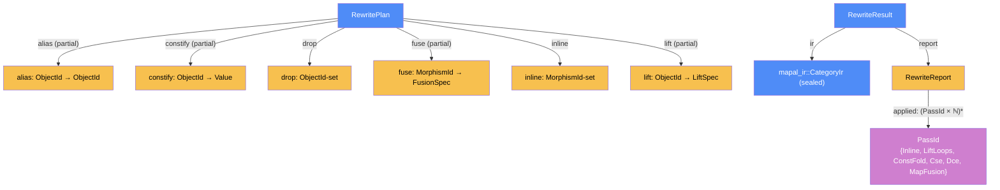

# Component: rewrite — DESIGN

Written: 2026-07-17 · Session 12 · Updated: 2026-07-24 · S27b loop lifting — authoritative for `crates/mapal-rewrite`
Spec authority: category-ir.md §9 (optimization framework — layers, §9.6 verification) + §6.1.1 (map fusion = the `List` functor law) > ADR-0013 / ir/DESIGN (§5.1 typing table, §7 loops D7, §8 tokens I4/I4b, §11 validate, §17 "seal-then-rebuild is the v1 stopgap") > interp/DESIGN (the oracle: fueled `run`/`eval_call`, wrapping integer arithmetic, traps, guard-first loops, M1 canonical-loop scope) > check/DESIGN (pipeline position: check runs **pre-rewrite**; rewrite must preserve what check certified) > HANDOFF §5.7 (layer directories), §8 P4 DoD, §9 (random-program generation lives here).

## Categorical model (Dat + Trn)

**Firewall.** These are the compiler's own Level-B `Dat` types, not Mapal-Cat arrows. The crate holds Level-A constructs as data only: a sealed `mapal_ir::CategoryIr` value is one Level-B object; the *laws* that justify each pass (functor laws, within-category equations) are Level-A facts about Mapal-Cat, **cited** by the pass's correctness argument, never restated or re-proven here (category-ir.md §6/§9 owns them).

**Physical pair.** Degenerate (FRAMEWORK §7.1) — `Dat` + `Alg` only. Rewriting is one in-process pass between `lower`/`check` and the backends.

### Why (one paragraph)

Modeling the rewriter categorically buys three things. (1) **Soundness is one stated equation, not a vibe**: every pass must satisfy the oracle-equality composition rule R1 below (`run ∘ rw ≈ run`), which is C-interp-2's `eval ∘ r ≅ eval` made precise — including what `≈` does with traps, fuel, and divergence, the three places a naive "same output" claim is wrong. (2) **A pass is a plan plus one shared replay functor**: the sealed IR is immutable (ir §17), so every pass factors as *analysis* (`CategoryIr → RewritePlan`, pure, read-only) followed by *replay* (`CategoryIr × RewritePlan → CategoryIr`, executed through the public `IrBuilder`). Well-formedness of the output is then **by construction** — the builder cannot emit an ill-formed graph — and `validate()` is a redundant independent check, exactly the ir §11 "P4 runs it before/after" posture. One replayer, six plan channels: the §5 one-seam rule. (3) **The layer taxonomy is the correctness budget** (category-ir §9.4 table): map fusion needs only the `List` functor law; loop lifting needs the ratified guarded-trace factorization; const folding needs only per-op axioms; DCE/CSE need only graph properties.

### Core category



### Morphism table

| Morphism | Signature | Partiality | Semantics |
|---|---|---|---|
| `alias?` | `ObjectId → ObjectId` | Partial | consumers of the key read the value instead (CSE merge, Phi-select, proj∘pack forward, algebraic identity). Resolved transitively before replay; acyclic by construction (always points at an earlier-in-topo object) |
| `constify?` | `ObjectId → mapal_ir::Value` | Partial | the object is re-materialized as a `Constant` with this value; its defining cone is not replayed for it (const fold) |
| `drop` | `RewritePlan → ObjectId-set` | Total | objects (with their defining morphisms) not replayed at all (DCE). Plan-consistency: nothing live references a dropped object |
| `fuse?` | `MorphismId → FusionSpec` | Partial | a `Map` edge replaced by a fused `Map` with a synthesized composed body (layer 1) |
| `inline` | `RewritePlan → MorphismId-set` | Total | selected `Call` sites replay as the callee body with Return redirection |
| `lift?` | `ObjectId(loop merge) → LiftSpec` | Partial | a canonical loop SCC becomes `Iota(K)` plus a synthesized captured `Map`/`Fold` body |
| `applied` | `RewriteReport → (PassId × ℕ)*` | Total | the §9.6 diagnostic log: which law fired, how many times, per fixpoint round |
| `ir` / `report` | `RewriteResult → …` | Total | the rewritten sealed graph + its log |

### Passes (Trn)

| Pass (`Trn`) | `t_from → t_to` | Layer / justifying law |
|---|---|---|
| `analyze_const_fold` | `CategoryIr → RewritePlan` | 3 — per-op axioms at the **oracle's** semantics (wrapping ints, IEEE floats) |
| `analyze_cse` | `CategoryIr → RewritePlan` | 4 — "same op + same source ⇒ same morphism" (category-ir §9.4) |
| `analyze_dce` | `CategoryIr → RewritePlan` | 4 — graph liveness, **trap-conservative** (R4) |
| `analyze_map_fusion` | `CategoryIr → RewritePlan` | 1 — `List` functor law `map g ∘ map f = map (g ∘ f)`, `map id = id` (§6.1.1) |
| `analyze_inline` | `CategoryIr → RewritePlan` | structural substitution of loop-free callees, bounded by the recorded size policy |
| `analyze_lift` | `CategoryIr → RewritePlan` | guarded-trace factorization R-LF/R-LM; exact v1 conditions in §4.1 |
| `replay` | `CategoryIr × RewritePlan ⇀ CategoryIr` | the one graph constructor: full rebuild through `IrBuilder`; partial only on internal-error (surfaced as a bug, never user-facing) |
| `rewrite` (driver) | `CategoryIr → RewriteResult` | capped fixpoint of `Inline → LiftLoops → ConstFold → Cse → Dce → MapFusion`; `validate()` after every replay |

### Composition rules (the implementation must preserve)

- **R1 — oracle equality (the soundness contract).** For every pass `p` and ample budget `B`:
  `run(p(ir), B) ≈ run(ir, B)` and `eval_call(p(ir), f', a, B) ≈ eval_call(ir, f, a, B)` for every surviving fn, where `≈` is: `Done(v)`/`output` **byte-exact** on both sides; `Trapped(k₁) ≈ Trapped(k₂)` for **any** kinds (all traps are the same ⊥ of the §2.6 error monad — a rewrite may change *which* trap fires first, because the rebuild permutes topo order among independent morphisms, but never *whether* the run traps); `Diverged ≈ Diverged`; the three classes never cross. `≈` is **fuel-insensitive**: `B` must be ample for both sides (a rewrite may only *reduce* work; property tests use the acceptance budget). Flagged to Sapir in next-session.md: this pins "interpreter-equal" (HANDOFF P4 DoD) as equal-modulo-trap-identity on abnormal runs — ADR-candidate if contested.
- **R2 — validate-clean preservation.** Output graphs are builder-built and sealed ⇒ well-formed by construction; `validate()` is additionally asserted empty after every pass (tests + debug).
- **R3 — check preservation.** check runs pre-rewrite only (check/DESIGN §1). A pass must not create a second unconditional full-value Return writer (T0101) and must not move an effect into fanout context (T0201) — structurally guaranteed: passes never touch token-bearing objects except by identity replay, and never add Return writers.
- **R4 — trap conservativity.** The oracle evaluates **every** morphism of an evaluated function in topo order (interp §2), so a trap in *dead* code is observable. DCE therefore removes only provably-non-trapping dead cones; const folding folds only non-trapping applications. `Add/Sub/Mul/Neg` wrap (eval.rs `wrapping_*`) ⇒ trap-free; `Div/Mod` trap iff integer divisor 0; `Index` traps iff OOB.
- **R5 — determinism.** `rewrite` is a pure function; same input graph ⇒ byte-identical `to_mermaid` output. No `HashMap` keyed iteration anywhere (D2 inherited); CSE keys use `BTreeMap` over stable ids / bit patterns.
- **R6 — reachable-shape preservation.** Output stays inside the lower-reachable, interp-M1 subset: canonical loop quartet (1 enter / 1 back / 1 exit per merge) replayed as a unit via `begin_loop`/`loop_back`/`loop_exit`; a graph containing **any** non-canonical loop shape (incl. the lower-reachable multi-merge nested loop) makes `rewrite` the identity on the **whole graph** (§5 — by-value return, `skipped_non_canonical`; review F3). Backends consume rewritten IR; they may not see shapes lower could not have produced.

### Bridges

| Bridge | Signature | Stored? | Semantics |
|---|---|---|---|
| IR intake/output | `&CategoryIr → CategoryIr` | new value | read-only intake; the output is a **new** sealed graph (ids not stable across rebuild — consumers must not hold old ids) |
| oracle | dev-dep on `mapal-interp` | test-only | R1 is discharged by the property harness, not by the library (the crate itself depends only on `mapal-ir`) |
| generator | `testgen` (this crate's test harness) | test-only | HANDOFF §9: random Core-program generation lives here and is **exported for P5–P7 differential tests** |

---

## 0. Scope of increment 1 (P4)

In: the plan+replay architecture (§1); layer-3 constant folding + algebraic identities (§2); layer-4 DCE + CSE (§3); layer-1 map fusion + `map(id)` elimination (§4); the fixpoint driver + report (§5); the random-program generator + property harness (§6); goldens, properties, bench (§8).

Out (deliberately): layer-2 naturality — the `Zip`/`Enumerate` naturality squares recorded in ir §17 (rule table seeded in `naturality.rs` as data, **no pass**; next increment); non-canonical loops — multi-back/exit merges (lower OQ7, unreachable) **and the multi-merge inner-exits-via-`ret` nested loop, which IS lower-reachable** (ir §7, lower §8.5; review F3 corrected the earlier "unreachable" claim) — both take the R6 whole-graph identity path; rewriting across `IoToken`-bearing objects beyond identity (effect chains are replayed verbatim); a mutation API in mapal-ir (ir §17 sanctions seal-then-rebuild; a mutating rewriter is a later ADR if profiles ever demand it); cost models (every implemented rewrite is unconditionally profitable or neutral).

## 1. Pass architecture — plan + one shared replayer

A sealed `CategoryIr` has no mutators, is not `Clone`, and its only producer is `IrBuilder` (code reality, verified). Every pass therefore factors:

```
analysis : &CategoryIr → RewritePlan        // pure, read-only, per-pass
replay   : (&CategoryIr, &RewritePlan) → CategoryIr   // shared, plan-driven, builder-backed
```

### 1.1 The replayer (replay.rs) — recipe classification

The builder exposes **typed primitives only** (no raw add-object/add-edge); composite primitives mint their internal `Pair` products atomically (`binop`, `phi`, `index`, `zip`, `print`, loop routes). Replay walks each function's `topo_order` and reconstructs every object from its *recipe*:

| old object | recipe | replay |
|---|---|---|
| `Parameter` | — | `declare(kind, name, in_ty, out_ty, loc)`; map to `fb.input()` |
| `Constant` | — | `constant(value, loc)` (ty follows value, I7) |
| product, ≥1 *explicit* consumer (`Proj`, `Fold` seed-and-arr, `Call` arg, `Map` arr, `LoopEnter` init, `Output`, ≥2 consumers) | `Pair×arity` | `pack` / `pack_struct` / `pack_array` from replayed slot feeders (declaration order = slot order) |
| product consumed **only** as one internally-packing primitive's source | `Pair×arity` | **not materialized** — the primitive call rebuilds it internally from the slot feeders |
| defined by `Add..Or` / `Neg,Not` / `Proj` / `Index` / `Update` / `Zip` / `Enumerate` / `Phi` / `Call` / `Map` / `Fold` / `Print` | one op edge | the matching builder primitive, feeders = replayed slot sources (operand order = slot order; load-bearing for non-commutative ops — `Update`'s `(arr,i,v)` triple, ADR-0021, replays via `fb.update`) |
| defined by `TimeMs` (S29) | one op edge, source = the **bare** `IoToken` (no packed source, unlike `Print`) | `fb.time_ms(replayed_token, loc)` — mints the fresh `(IoToken, f64)` pair. Identity replay only: no pass ever plans a `TimeMs` (see §3 — it is impure by `is_pure` and token-bearing by ty, which excludes it from CSE, forwarding, DCE removal and lifting without a single `TimeMs` special case) |
| defined by `Output` | op edge | `output(replayed_src, slot, loc)` |
| Return slot writes | `Pair` into Return | the writing primitive replayed with `Dest::Ret{slot}` (canonical form, ir L3-4) |
| `LoopMerge` + routes + exits | the quartet | canonicity and per-merge layout are **delegated to `mapal_ir::CategoryIr::loop_plan(f, merge)`** (ir §13, BL7 — the one source of truth; `is_canonical` gates on `loop_plan(...).is_some()` for every `loop_structure` merge, `replay` reads the same `LoopPlan` back). Replay init → `begin_loop` → in-SCC morphisms in body order (merge ↦ `merge_of(lh)`) → `loop_back(next_state', cond')` from the back route's slot feeders → `loop_exit(value', cond', dest)` from the exit route's slot feeders → `end_loop`. Route objects are never materialized. **Exit attribution (S12): by route-feeder membership in the specific merge's SCC (the interp driver's rule, now encapsulated in `loop_plan`) — never by reachability, which mis-attributed a downstream loop's exit to an upstream merge; two sequential canonical loops in one fn are canonical and rewritable** (pinned by `identity.rs::two_sequential_loops_rewrite_not_skipped`) |

- **Id remap**: `SecondaryMap<ObjectId_old, ObjectId_new>`, built during the walk. `alias?` is resolved (transitively) *before* lookup; `constify?` short-circuits to a fresh `constant(v)`; `drop` objects are skipped.
- `inline` redirects a selected call through the callee replay recipe. `lift` reconstructs the planned SCC as a captured collection op and marks the old merge/routes/SCC complete; both reuse the same remap and primitive emitter.
- **Names and locs preserved** (`Dest::Fresh(name)`, original `loc`s) — Mermaid diffs stay readable; folded constants carry the folded morphism's `loc`.
- **Function set**: `declare` every surviving fn first (declare-before-reference), then build each. Uncalled non-entry `Named` fns and unreferenced bodies are dropped (§3.1) — always sound: the oracle only evaluates called functions.
- **Shared primitive-source products** (a product feeding both an explicit consumer and an internally-packing primitive) are validate-legal but not lower-emitted; the replayer handles them soundly by letting the primitive re-pack (one duplicate product; values identical). Recorded, not optimized.
- **Identity replay is a first-class product**: `replay(ir, empty_plan)` must satisfy R1 against `ir` on the 10 in-Core examples — this is the harness's own soundness anchor and the first thing built (plan WP1).

### 1.2 Plan-consistency rules (global — every pass, enforced by plan.rs, asserted by replay)

The design review (S12, 4-lens adversarial) converged three independent blockers onto one missing generalization: the exclusions §3.2 gave CSE are really **laws of the plan itself**. Promoted here; the per-pass sections inherit them.

- **P1 — plans key `Temporary` objects only.** No `alias`/`constify`/`drop` entry may key a Parameter, Constant, Return, or LoopMerge object. In lower's canonical form the producing primitive targets Return *directly* (`Dest::Ret{None}` — `fn f() -> i32 { 2 + 3 }` makes the Add's target the Return object); folding/aliasing that target would drop the sole Return writer and fail I-RET at re-seal (review SND-1/RW-CF-RET-IRET/F1, all CONFIRMED). Excluding Return here is **lossless**: Return is a sink, so no downstream simplification is forfeited.
- **P2 — plans respect loop SCCs.** `constify` and `drop` keys must belong to **no** `LoopScc`; an `alias` value must have the *same* SCC membership as its key (both none, or both the same SCC). Constifying a loop-carried next-state (`x*0 → 0` on `mut x`) would replace the LoopBack route's state source with an in-degree-0 Constant outside the merge's SCC — `LoopBackOutsideScc` at re-seal (review RW-CF-LOOP-I5, CONFIRMED with a live builder repro). Loop-*invariant* computations sit outside the SCC and still fold; in-body cycle arithmetic is left alone (correct and cheap).
- **P3 — fusion requires divergence-free bodies.** `Map` fusion reorders "all f, then all g" into per-element `f;g`; if `f` can diverge on a later element while `g∘f` traps on an earlier one, fusion flips `Diverged → Trapped`, crossing an R1 class (review RW-FUSION-DIVERGE-TRAP, CONFIRMED). Both bodies must be transitively **loop-free** (the §3.1 "total" notion) — then every abort is a trap and RW2's `⊥ ≈ ⊥` covers the reorder.

## 2. Layer 3 — equations.rs (const folding + algebraic identities)

All §2 rules produce plan entries and are therefore bounded by §1.2 P1/P2 (keys are non-SCC `Temporary` objects only).

**Const folding.** A foldable application is an op edge whose operand feeders are all `Constant` (via the current alias/constify view). Folding computes the value at the **oracle's exact semantics** (interp eval.rs): integers `wrapping_add/sub/mul/neg`; `wrapping_div/rem` **only when the divisor constant ≠ 0** (zero divisor: not folded — the runtime trap is the program's meaning, R4); floats IEEE at width; comparisons/logic exact; `Neg` wrapping / IEEE `fneg`. Foldable ops: `Add..Mod` (guarded), `Neg`, `Eq..Ge`, `And,Or,Not`. Result → `constify[target]`. Constants stay scalar (Value is scalar-only); aggregates never constify — `Proj`/`Index` reach *through* structure instead:

- **proj∘pack forwarding**: `Proj{k}` whose source product's slot-`k` feeder is `x` ⇒ `alias[target] = x`. (Also collapses lower's zip round-trip re-pair, the fusion seeded in lower §8.9.)
- **Index-of-const**: `Index` with constant index `i` on a `pack_array`-built source with `0 ≤ i < n` ⇒ `alias[target] = feeder(i)`; OOB or non-literal array: untouched (R4).
- **Index∘Update (L-a, ADR-0021 §3)**: `Index_i` reading a source produced by `Update_i`, both indices **constant, equal, and in-bounds** ⇒ the read is the written value ⇒ `alias[target] = update's value operand`. OOB or unequal/non-const index does not fold (a real OOB read is a trap = the program's meaning, R4; the base-read law L-b and update∘update L-c need an operand-rewrite channel that does not exist yet — headroom §11).
- **Phi-select**: `Phi` with constant cond ⇒ `alias[target] = chosen branch object` (branch cones remain; DCE decides their fate under R4).

**Algebraic identities** (table-driven; **integer types only** for arithmetic — float identities are IEEE-unsound: `-0.0 + 0.0 = 0.0 ≠ -0.0`, `NaN * 0 ≠ 0`): `x+0 → x`, `0+x → x`, `x-0 → x`, `x*1 → x`, `1*x → x`, `x*0 → 0`* , `0*x → 0`*, `x/1 → x`, `x%1 → 0`*, `Not(Not(x)) → x`, `x && true → x`, `true && x → x`, `x && false → false`*, `x || false → x`, `x || true → true`*. Entries marked `*` produce a constant while `x`'s cone remains in the graph — sound because DCE is trap-conservative (R4); the cone is removed only if independently provably-safe. No strength reduction (Core has no shift op).

## 3. Layer 4 — graph_rewrites.rs (DCE + CSE)

### 3.1 DCE

Liveness = backward reachability from the function's Return object over `in_edges` (through loop machinery: Return ← exit route ← cond/payload ← merge ← LoopBack cone — the whole loop body is live iff its exit is). Token chains are live automatically (I4b: every token chain terminates at Return). Dead objects are removable iff their defining morphism is **provably non-trapping and non-diverging**:

| op | removable when dead |
|---|---|
| `Pair, Proj, Output, Zip, Enumerate, Eq..Ge, And, Or, Not, Neg, Add, Sub, Mul, Phi` | always (wrapping ⇒ no trap) |
| `Div, Mod` | divisor feeder is a `Constant ≠ 0`, or float ty — **as-built (S12): conservatively never removed** (kept as a keep-root); the refinement is recorded headroom (§11) |
| `Index` | index feeder is a `Constant` in `[0, n)` — **as-built: conservatively never removed**; same headroom |
| `Update` (ADR-0021) | index feeder is a `Constant` in `[0, n)` — may-trap (OOB ⇒ `IndexOob`), so **as-built: conservatively never removed** (excluded from `is_pure`, kept as a keep-root like `Index`); same headroom |
| `Call, Map, Fold` | callee/body is transitively **total** (no loops, removable-class ops only) — **as-built: conservatively never removed**; same headroom |
| `Print`, `TimeMs`, loop ops, `LoopMerge`-related | **pinned live unconditionally** (no removal, no assertion). `TimeMs` (S29) is kept by the same two mechanisms as `Print` — outside `is_pure` ⇒ its target is a keep-root, and its `(IoToken, f64)` target ty is token-bearing ⇒ CSE and `forward` skip it — so a clock read never merges with another, never folds, and never dies. Token chains reach Return by I4b, but a *pure* bounded loop whose exit feeds a dead Temporary is validate-clean, lower-reachable, and oracle-evaluated (review SND-2, CONFIRMED) — it is genuinely dead by the reachability definition and must simply be kept (it spends fuel and may diverge; removing it could flip `Diverged → Done`) |

A dead-but-unremovable morphism *pins its own input cone* live. **Function-level DCE** is separate and unconditional: a `Named` fn never referenced from the entry's call/body closure (and any orphaned `MapBody`/`FoldBody`) is not replayed — the oracle never evaluates uncalled functions, so this is invisible to R1.

### 3.2 CSE (local value numbering, globally over the SSA-shaped DAG)

One walk of `topo_order` per function; key = `(op discriminant + payload, resolved feeder ids in slot order, target ty)` in a `BTreeMap`. First occurrence wins; later occurrences get `alias[target] = first_target`. Exclusions (all conservative):

- non-`Temporary` targets (Parameter/Constant/Return/LoopMerge);
- token-bearing target ty (`ty_contains_token`) — merging could widen token out-degree past I4;
- loop machinery (`LoopEnter/Back/Exit`, route objects) and any pair of objects with **different SCC membership** (both must be in the same `LoopScc`, or both in none) — preserves R6;
- `Call/Map/Fold` are mergeable (pure by I4 token rules when token-free; an effectful call has token-bearing ty and is excluded by the token rule).

**Constant dedup — omitted as-built (S12).** The originally-specified `(ty, bit pattern)` constant dedup contradicts P1 (a `Constant` may not be a plan key, and the replayer rebuilds every `Constant` unconditionally). CSE therefore dedups op-defined `Temporary`s only. Lifting it needs a replay-side channel (skip-constant + remap), recorded in §11 as headroom; lower's constants-at-point-of-use redundancy is otherwise harmless.

## 4. Layer 1 — functor_laws.rs (map fusion)

- **`map g ∘ map f → map (g ∘ f)`** (category-ir §6.1.1). Pattern: a `Map{f}` edge whose target array's **only** consumer is a `Map{g}` edge. Plan: `fuse[g_edge] = FusionSpec{f, g}`; replay synthesizes one new `MapBody` `h` (`declare(MapBody, "fused$n", T, V, loc_g)`) whose body is the **inline replay** of `f`'s body (param ↦ `h.input`; Return-writes redirected to a fresh object `r₁` — slot-writes assembled by an explicit pack) followed by `g`'s body (param ↦ `r₁`; Return-writes to `h`'s Return canonically), then emits `map(h, arr, dest)` and skips both original edges; `f`/`g` bodies drop if orphaned (§3.1). Preconditions (v1): each body's Return has a single full-value writer (lower-canonical; else skip), **and both bodies are transitively loop-free (§1.2 P3 — divergence guard)**. Trap-class preservation: before ⇒ trap iff `∃i: f(eᵢ)` traps ∨ (none ∧ `∃i: g(f(eᵢ))` traps); after ⇒ trap iff `∃i:` `f(eᵢ)` or `g(f(eᵢ))` traps — same disjunction, same class; trap *identity* may move, covered by R1's `⊥ ≈ ⊥`.
- **`map(id) → id`**: a `MapBody` whose body is exactly the identity (one `Output` edge param → Return) ⇒ `alias[map_target] = arr`; edge + body drop.
- Layer 2 (naturality) ships as a **data table only** in `naturality.rs` — the four ir §17 `Zip`/`Enumerate` laws, marked `planned` — so the catalogue lives where §9.2 expects it without an unproven pass.

### 4.1 Guarded-trace lifting — lift.rs

`analyze_lift` consumes `CategoryIr::loop_plan`; it never re-derives SCC membership,
routes, order, or product targets. Plans are keyed by the loop merge.

- **R-LF:** exactly two carried components `(counter, acc)`; counter init `0`,
  guard `counter < K`, step `counter + 1`, constant `K >= 1`; one attributed exit
  carrying `acc`; no token in the SCC; accumulator advance is a pure cone over
  `(acc, counter, invariants)`. Replay emits `Iota(K)` and a captured Fold seeded
  by the original accumulator init. Fold item order `0..K-1` is the loop order.
- **R-LM:** the other component is `c: [E; n]`; exactly one advance-phase
  `Update(c, counter, v)`; the index is the counter object itself, `v` is pure and
  c-free, `n == K`, and the exit carries c. Replay emits a captured Map over
  `Iota(K)` and drops c's init edge because every cell is overwritten.
- Any failed condition is an empty plan entry: non-constant/zero bounds, extra
  carried state, effects/tokens, multiple Updates, non-identity index, unequal
  length/bound, non-unit step, non-zero init, a c-dependent value cone, or any
  unselected decide/advance work stay loops. Because replay retires the complete
  SCC, every phase morphism must be either in the selected body cone or exact loop
  scaffolding.

Synthesized bodies clone safe pure invariant derivations down to parameter-projection
capture boundaries, so affine structure stays visible to `tile_plan`. The selected
cone root targets the body Return directly, matching fused-body synthesis and lower's
canonical body shape.

## 5. The driver (driver.rs) + report

```rust
pub fn rewrite(ir: CategoryIr) -> RewriteResult;                    // fixpoint, all passes
pub fn rewrite_with(ir: CategoryIr, passes: &[PassId]) -> RewriteResult;   // tests / CLI
pub enum PassId { Inline, LiftLoops, ConstFold, Cse, Dce, MapFusion }
pub struct RewriteResult { pub ir: CategoryIr, pub report: RewriteReport }   // Debug only — CategoryIr is not Clone/PartialEq (as-built)
pub struct RewriteReport { pub rounds: u32, pub applied: Vec<(PassId, u64)>, pub skipped_non_canonical: bool }
```

As-built (S12): `applied` holds **cumulative** counts per pass in first-fire order (per-round splitting was not needed by any §8 assertion); `rounds` counts executed rounds including the final no-op one (0 exactly on the identity path).

**By-value intake** (`CategoryIr` is not `Clone`): a round whose plans are all empty returns the input graph *itself* — no rebuild, structurally untouched. **Non-canonical guard (R6, review F3):** if **any** function contains a loop shape outside the canonical quartet — a multi-merge SCC (the *lower-reachable* inner-exits-via-`ret` nested loop), or multiple backs/exits per merge — `rewrite` is the **identity on the whole graph**: it returns the input unchanged with `skipped_non_canonical = true`. The replayer never needs a multi-merge recipe; a generic-SCC replay path is a recorded later increment (§11). Differential harnesses run the oracle on the input *before* handing it to `rewrite` (by-value).

Round = `Inline → LiftLoops → ConstFold → Cse → Dce → MapFusion`, each pass replaying only if its plan is non-empty. This order makes the matmul4 chain converge across rounds: lift the callee fold, inline the now-loop-free callee, then lift the caller map. Fixpoint: repeat until a full round applies nothing; cap `MAX_ROUNDS = 32`. `debug_assert!(validate(&out).is_empty())` after every replay; tests assert it unconditionally.

## 6. testgen — the random-program generator (HANDOFF §9: lives here, feeds P5–P7)

`crates/mapal-rewrite/tests/testgen/mod.rs` (shared test module, importable pattern per lower's `tests/common`). Two strategies over the **public builder** (well-typed by construction; seal always Ok):

1. **Closed programs** — an entry `main` (effectful: token-threaded prints of every interesting intermediate; or pure) over a generated DAG of scalar/tuple/array ops: constants (small-int biased ±100 + edge values {0, 1, -1, MIN, MAX}), chains of `binop/unop/phi/pack/proj/index/zip/enumerate/map/fold/call`, helper fns (acyclic), canonical loops with **statically bounded** iteration (guard `i < K`, `K ≤ 64`, carried tuple state), plus liftable `LiftFold` and identity-`Update` `LiftMap` shapes with `K >= 1` — generated programs terminate; divergence is pinned by a separate hand-built case, not generated.
2. **Open functions** — pure `Named` fns with parameter input, exercised via `eval_call` with proptest-generated `RValue` args (random inputs × random programs).

Modes: `default` (traps permitted — `Div/Mod/Index` with arbitrary feeders; the R1 relation absorbs them) and `trap_free` (divisors const-nonzero, indices const-in-bounds) — the mode P5–P7 differential harnesses will consume where backend trap behavior is not yet pinned. Budget: the acceptance `BUDGET = 100_000` scaled by generated loop bounds.

## 7. Public API

§5's driver types plus nothing — no `Display` (C3), `RewriteResult`/`RewriteReport` derive `Clone, Debug, PartialEq` (PassId also `Copy, Eq`). Library deps: `mapal-ir`, `slotmap`. Dev-deps: `mapal-syntax`, `mapal-lower`, `mapal-interp`, `proptest`, `insta`, `criterion`.

## 8. Test plan (what P4-green means)

1. **Identity-replay anchor**: `replay(ir, ∅)` on the **10 in-Core examples** (all of `examples/` except `vector.mapal`, which is the out-of-Core generics sketch and does not lower — review F5) — validate-empty, interp `RunResult` byte-equal, Mermaid lint-clean.
2. **The headline property (P4 DoD)**: ∀ generated program `p` (both strategies, both modes), every pass including `Inline` and `LiftLoops`, and the full pipeline: `run(rewrite(p)) ≈ run(p)` per R1; `validate` empty; plus **determinism** (same input ⇒ byte-identical output Mermaid) and **idempotence** (`rewrite(rewrite(p).ir)` applies nothing).
3. **Example goldens**: every example through `rewrite` → interp output unchanged (exact), rewritten Mermaid snapshot (insta, read against this DESIGN), report snapshot (which laws fired — e.g. lower's undeduped constants collapse under CSE).
4. **Micro-goldens per rule** (before/after shape assertions): each §2 table row; each §3 exclusion (dead trapping `Div` **kept**; dead `Div` by const-2 removed; `-0.0`/`0.0` **not** CSE-merged; token-bearing never merged; cross-SCC never merged); `Phi`-select keeps branch cones; fusion micro (fused body shape, orphan bodies dropped, out-degree-2 intermediate **not** fused); `map(id)` elimination; uncalled-fn removal. **Plus the §1.2 pins**: `fn f() -> i32 { 2 + 3 }` and `x + 0 -> ret` survive `rewrite` *unchanged* and re-seal clean (P1); `x * 0 -> x` inside a loop is *not* constified (P2, the `LoopBackOutsideScc` repro); fusion skipped when either body contains a loop (P3); a dead pure bounded loop is *kept* (RW11); a hand-built multi-merge nested loop makes `rewrite` the whole-graph identity with `skipped_non_canonical` (RW8).
5. **Adversarial R1 cases**: dead trapping code preserved end-to-end (`Trapped` before ⇒ `Trapped` after); a program with two independent traps stays `Trapped` under rebuild-order permutation; float-identity non-rewrites (`x+0.0` untouched); divergent hand-built loop stays `Diverged`.
6. **Bench** (`rewrite_scale`): rewrite of synthetic chains/grids at 1k/10k/100k morphisms; numbers recorded in STATUS.

## 9. Module layout (HANDOFF §5.7 — one source file per layer, mirroring §9)

```
crates/mapal-rewrite/src/
  lib.rs             // rewrite, rewrite_with, PassId, RewriteResult, RewriteReport + curated pub use
  plan.rs            // RewritePlan (alias/constify/drop/fuse/inline/lift), specs
  lift.rs            // R-LF/R-LM analysis over mapal-ir LoopPlan facts
  replay.rs          // the shared replayer (§1.1)
  driver.rs          // fixpoint rounds, report, validate assertion
  functor_laws.rs    // layer 1: map fusion, map(id)          (§4)
  naturality.rs      // layer 2: rule table (data, planned)   (§4)
  equations.rs       // layer 3: const fold + identities      (§2)
  graph_rewrites.rs  // layer 4: DCE + CSE                    (§3)
crates/mapal-rewrite/tests/
  testgen/mod.rs     // §6 generator (shared; P5–P7 will consume)
  identity.rs        // §8.1
  property.rs        // §8.2 headline + §8.5 adversarial
  golden.rs          // §8.3 example goldens
  micro.rs           // §8.4 per-rule shape assertions
  lift.rs            // focused R-LF/R-LM positives + rejection pins
crates/mapal-rewrite/benches/rewrite_scale.rs
```

## 10. Decision ledger (RW1–RW8 — decided once, do not re-litigate)

| id | decision | why |
|---|---|---|
| RW1 | Rebuild-through-builder, never mutate; one shared replayer, plans per pass | ir §17 sanctions it; well-formedness by construction; one seam (§5) |
| RW2 | R1's `≈`: exact on `Done`+output, ⊥-identified on `Trapped`, fuel-insensitive | traps are one ⊥ in the §2.6 error monad; rebuild permutes trap identity among independent morphisms; **ratified by Sapir S13** |
| RW3 | Trap-conservative DCE; fold only non-trapping applications | the oracle evaluates dead morphisms (interp §2) — dead traps are observable |
| RW4 | Arithmetic identities integer-only | IEEE: `-0.0+0.0`, `NaN*0` falsify float identities |
| RW5 | Const-fold at wrapping semantics | parity with eval.rs `wrapping_*` — the oracle is the spec |
| RW6 | CSE excludes token-bearing/cross-SCC/non-Temporary; constant dedup **omitted as-built** (P1 forbids keying Constants — §3.2, headroom §11) | I4 linearity; R6 canonical shapes; P1 |
| RW7 | Uncalled-fn removal unconditional | the oracle never walks uncalled fns — invisible to R1 |
| RW8 | Non-canonical loop shapes ⇒ **whole-graph identity** (by-value return, `skipped_non_canonical`) | interp M1 scope (R6); the multi-merge nested loop IS lower-reachable (review F3) but hits interp's own M1 assert — no R1 property can even run on it; none of the 10 examples produce it |
| RW9 | §1.2 P1/P2: plans key non-SCC `Temporary` objects only; alias preserves SCC membership | three CONFIRMED review blockers (Return-writer drop → I-RET fail; loop-state constify → `LoopBackOutsideScc`); lossless for Return (a sink) |
| RW10 | §1.2 P3: fusion only on transitively loop-free bodies | fusion's per-element reorder can flip `Diverged ↔ Trapped` across R1 classes when a body can diverge (review, CONFIRMED) |
| RW11 | `Print` + loop machinery pinned live in DCE (no assertion) | dead *pure* loops are validate-clean and lower-reachable (review SND-2); removal could flip `Diverged → Done` |
| RW12 | R-LF/R-LM require constant `K >= 1`; zero-trip shapes stay loops | Core has no empty arrays, so `Iota(0)` is not a legal replacement; ratified option 2 |

## 11. Open questions (→ ADR candidates / later increments)

- **Layer-2 naturality pass** (`Zip`/`Enumerate` squares, `naturality.rs` table): next increment; needs a cost direction choice per §9.2.
- **Precise-DCE + constant-dedup headroom (as-built S12)**: DCE keeps every `Div/Mod/Index/Call/Map/Fold` result unconditionally (the §3.1 refinements — const-nonzero divisors, in-bounds const indices, transitively-total callees — are specified but unimplemented); CSE skips constants (P1). Both are strict-superset-conservative: lifting either only removes more, never changes R1.
- **R1's ⊥-identification** — flagged to Sapir (RW2); if exact-trap-preservation is demanded, DCE/fusion shrink further and rebuild must preserve trap-order (a topo-order pin), at real cost.
- **Backend trap story (P5)**: the `trap_free` generator mode exists for backends until backends pin deterministic trap behavior (LLVM div-by-zero is UB — P5's DESIGN must decide guard-and-abort vs. trap-free-subset differential testing).
- **Generic-SCC replay** (lift RW8): a structural-clone path reconstructing multi-merge SCCs via nested `LoopHandle`s (the ir algos.rs nested test proves the builder can express them) — needed the day a backend must compile the nested inner-exits-via-`ret` shape; until then whole-graph identity + interp's M1 assert make the conservative path honest.
- **Ret-targeted fold via `output()` re-emission** (lift P1's lossless-but-lazy exclusion): replay could rewrite a Return-targeted foldable op as `constant(v)` + `output(v_obj, None)` — only worth it if backends ever want pre-folded returns.
- **Mutating rewriter**: only if `rewrite_scale` ever shows rebuild dominating; would be a mapal-ir ADR (removal/replace API with its own invariant story, ir §17).
