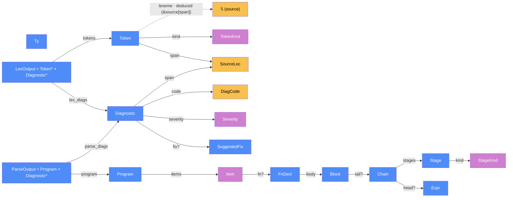

# Component: syntax — DESIGN

Last updated: 2026-06-11 · Session 02
Living document per HANDOFF §7.1.5 — written before code, updated every session that touches this component.

Increment map:

- **§1–§11 (Session 02): the lexer.** Token model, lexical grammar, diagnostics, API, tests.
- **§13–§21 (Session 03): the parser.** Two-tier grammar (ADR-0005), parse-tree data structures, P-code diagnostics + recovery (ADR-0008), `Ident {` law (ADR-0011), tests + bench. §12's pre-collected questions are resolved here.
- **ADR-0019 (Session 11): `seq` is a statement block.** `StageKind::SeqBlock(Block)` replaces the `FanoutKind::Seq` summand; the `KwSeq` parser arm parses the ordinary block production; new **P0117** flags non-chain statements dropped from a fanout (`void`) block. Touches §14.3/§14.4 (seq out of the fanout classifier), §15 (shapes), §16 (P0117).
- **S29 (`time` builtin): `()` is the Unit literal.** `ExprKind::Unit` replaces the P0001 empty-paren rejection in `parse_paren_or_tuple` — `()` is the **wire-less chain head** whose one sanctioned use is `() -> time`. It carries no value, so every other position is rejected downstream (lower's **L1301**, the no-wire code), where the chain context is known; the parser only records the shape. Touches §14.6 (primary), §15 (`ExprKind`), §16 (P0001 no longer covers `()`).

## Categorical model (Dat + Trn)

> See `docs/architecture/categorical-model.md` for the cross-cutting model and bridges.

**Scope of this section (the firewall).** This models the **compiler's own**
internal data and passes — `flow-syntax` as a **Level-B** component — in
FRAMEWORK.md vocabulary. Its `Dat` is the crate's own data types (tokens, AST
nodes, diagnostic values); its `Trn` is the crate's two passes (`lex`, `parse`).
It does **not** model the object language: `Chain`/`Stage`/`StageKind` are
Level-B AST nodes that *represent* Flow-Cat (Level-A) constructs — they are data
*inside* this category, never arrows of it. The Level-A object language lives in
`docs/spec/category-ir.md` and is not restated here (errata E5: the
category-keyword collision was already paid for; `category` is reserved-and-
rejected via L0004 in favour of `type`).

**Why categorical, here.** Two payoffs the diagram makes checkable. (1) The crate
is the **degenerate pipe-and-filter** case (FRAMEWORK §7.1 final note): an
in-process two-filter chain `lex ; parse` where all filters share one process
`Loc` and every pipe is same-location, so the physical pair `Loc`/`Trm` collapses
entirely and the model reduces to `Dat` + `Alg` (the pass pipeline) — there is no
backend/runtime seam in this crate to invoke them at. (2) The
consolidation reading is honest about its near-twins: `GuardDiscr` is *not* a
parallel copy of `GuardKind` but `GuardKind` **plus** the `OutOfCore` morphism
(§3 "extend, don't parallel"); and `SourceLoc` is **duplicated** into `flow-ir`
by a deliberate dependency-direction choice (D8), an accepted stored-copy
tradeoff at the crate seam, not a modeling smell.

### The core category — `Dat`

The crate's `Dat` is dominated by two free monoids and one product hub. `Token*`
(the free monoid of `Token = TokenKind × SourceLoc`) is the carrier between the
two filters; `Diagnostic*` (the free monoid of structured, renderer-free
diagnostics) is the second projection of *both* pass outputs; and the AST is a
recursive product/sum tree of nodes, each carrying a `SourceLoc` span (C12). The
two pass containers `LexOutput = Token* × Diagnostic*` and
`ParseOutput = Program × Diagnostic*` are the products that the passes weld.



(Project lint rules: every node uses a quoted label; one arrow style `-->`
throughout, with `-.->` reserved for deduced morphisms — partial morphisms use
solid `-->` and a `?`-suffixed label (FRAMEWORK §appendix); the color legend
is FRAMEWORK.md's — primitives/spans yellow, data objects blue, enums/discrete
categories purple.)

### Morphism table

Selected structural morphisms (every arrow in the diagram above appears here, and
every row here that is in the diagram's scope appears there; display-only
deductions are tabled separately below and are deliberately off-diagram). `?`
marks a partial morphism; "Deduced" marks a morphism computed on demand, never
stored.

| Morphism | Signature | Partiality | Semantics |
| --- | --- | --- | --- |
| `kind` | `Token → TokenKind` | Total | the token's classification |
| `span` | `Token → SourceLoc` | Total | the token's byte range — the sole home of its lexeme text |
| `lexeme` | `Token × 𝕊 → 𝕊` | Deduced | `&source[span.start..span.end]`; never stored (single source of truth) |
| `span` (uniform) | `Node → SourceLoc` | Total | every node/token carries a span (C12): a nat. transf. `Id ⇒ ConstSourceLoc`; child spans ⊆ parent (J2) |
| `code` | `Diagnostic → DiagCode` | Total | stable machine class (`L####`/`P####`/`T####`) |
| `severity` | `Diagnostic → Severity` | Total | `Error \| Warning` |
| `fix?` | `Diagnostic → SuggestedFix` | Partial | machine-applicable repair, when offered |
| `items` | `Program → Item*` | Total | the free monoid of top-level declarations (`item* EOF`) |
| `fn?` | `Item → FnDecl` | Partial | the `Fn` variant's declaration; `None` for `Type`/`Error` items |
| `body` | `FnDecl → Block` | Total | the function body block |
| `tail?` | `Block → Chain` | Partial | the block's optional trailing chain expression; absent for statement-only blocks |
| `head?` | `Chain → Expr` | Partial | optional leading expression; absent for headless chains (`stage+`) |
| `stages` | `Chain → Stage*` | Total | the flat ordered pipe-and-filter spine (no arrow nesting, C11) |
| `kind` | `Stage → StageKind` | Total | classified stage body — the central dispatch surface for lowering |
| `tokens` | `LexOutput → Token*` | Total | the token stream, always `Eof`-terminated (I1) |
| `lex_diags` | `LexOutput → Diagnostic*` | Total | recovery diagnostics from the lexing pass |
| `program` | `ParseOutput → Program` | Total | first projection of the parse result — the thin tree |
| `parse_diags` | `ParseOutput → Diagnostic*` | Total | merged, position-sorted lex+parse log; ⊇ `lex(s).diagnostics` (J6) |

The diagram's `diagnostics` arrows carry the disambiguating labels `lex_diags`
and `parse_diags` for the two pass containers; both land on `Diagnostic`.

**Display-only deductions** (off-diagram — computed for rendering, never on nodes,
not part of the core `Dat` category diagram above):

| Morphism | Signature | Partiality | Semantics |
| --- | --- | --- | --- |
| `line_col` | `SourceLoc.start → LineCol` | Deduced | offset → 1-based line/col via `LineIndex`; display-only, never on nodes |

### `Trn` — the two passes (the `Alg` sub-chain)

The passes are `Trn` objects with `t_from`/`t_to` projections into `Dat`. The
whole crate is one composable chain in `Alg`: `parse` internally composes
`lex ; parse_program ; (merge+sort)`, so the pipe-weld equation
`t_to(lex) = t_from(parse_program) = Token*` holds (Coherence Law 1 specialised:
the pipe carries exactly `Token*`).

| Pass (`Trn`) | `t_from` | `t_to` | Partiality | Semantics |
| --- | --- | --- | --- | --- |
| `lex` | `𝕊` | `LexOutput` | Total | one forward maximal-munch scan; error-recovering, always `Eof`-terminated; the scanner always advances (I1/C2/C4) |
| `parse` | `𝕊` | `ParseOutput` | Total | runs `lex`, then two-tier recursive descent (ADR-0005) into `Program`; merges + stably sorts lex+parse diagnostics; depth-guarded (P0011) + progress lemma ⇒ never panics/hangs (J1) |

Both passes are **total** (never panic, never bail) — the `Diagnostic*` arm of
each output container carries recovery information, so partiality is encoded as a
*sum in the output*, not as an undefined transformation. This is why
`lex`/`parse` are arrows in `Alg`, not partial morphisms.

### Composition rules / invariants (cross-reference)

The categorical facts above are enforced by the named invariants: span
single-source and monotonicity (I2, J2), coverage as a partition of the source
(I3), `Eof`-termination and scanner progress (I1), parse totality (J1),
clean-tree (J3: zero diagnostics ⇒ no `Error` nodes and no rejected-but-kept
forms — i.e. the in-Core sub-AST is exactly the domain of clean parsing),
renderer-freedom (I5/J5: no `Display` anywhere — diagnostics are structured
values, presentation is `flow-cli`'s job), and lex-diagnostic preservation (J6).
See §8 (I1–I5) and §19 (J1–J6).

### Bridges (Level-B seams to other crates)

| Bridge | Direction | Stored? | Note |
| --- | --- | --- | --- |
| `SourceLoc` | `flow-syntax ↔ flow-ir` | Stored copy (D8) | field-identical `{start,end}`; `flow-ir` defines its **own** to keep zero deps; converted by `flow-lower::tys::ir_loc` |
| `Diagnostic`/`DiagCode`/`Severity` | `flow-syntax → flow-lower` (verbatim) | Shared type | one `DiagCode` space, L-bands partitioned (LD16); no separate diagnostics crate |
| `Program` | `flow-syntax → flow-lower` | Crosses as typed payload | the entry datum to `lower` (consumes a clean `Program`) |
| `Ty`/`TyKind` (surface) | `flow-syntax → flow-ir::Ty` (resolved) | Two distinct objects | resolved by `flow-lower::tys`; do **not** conflate surface `Ty` with IR `Ty` |
| `unescape_string` | `flow-syntax → flow-lower::emit` | Shared helper | materialises `Str` values the thin tree leaves un-decoded |
| `Diagnostic` rendering | `flow-syntax → flow-cli` | One-directional | structured values out, presentation downstream (I5/C3/J5) |

## 0. Spec basis and binding constraints

Sources, in authority order (HANDOFF §2.2): ADR-0005/0006/0008/0009/0010 · `user-guide.md` §2–3 (as patched: E4, E5) for the Flow-Core surface, **plus §5–§10 and the flow snippets in `category-ir.md` enumerated for full-surface tokenization per C8** (`@`-annotations, `?`, `channel<i32>`, `::`, `200MHz`, …) · `architecture.md` §2.2.1 · HANDOFF §4.1 (Flow-Core scope), §5 items 2/6 · `docs/spec/ERRATA.md` (LC-2).

Constraints that bind this design:

| # | Constraint | Source |
|---|---|---|
| C1 | Handwritten lexer; spans (`SourceLoc`) from day one | HANDOFF §5 item 2 |
| C2 | Error-recovering: always returns tokens *and* diagnostics, never bails at first error | ADR-0008(a) — names the parser; applied to the lexer by analogy (strictly stronger) |
| C3 | Diagnostics are structured values (code, severity, span, message, optional fix); **no rendering** in flow-syntax — rendering only in flow-cli | ADR-0008(b) |
| C4 | Pure `fn(source) -> artifacts`, no global state, no incremental machinery | ADR-0008(d) |
| C5 | `type` is the type keyword; `category` reserved-and-rejected with a diagnostic pointing at `type` | ADR-0006 (E5) |
| C6 | `map`/`fold` take a postfix inline block — operator syntax, never a call argument | ADR-0009 (LC-2) |
| C7 | Guard arrows (`-true->`, `-false->`, `-_->`, integer guards) are surface lexemes | architecture.md §2.2.1; user-guide §3.4 |
| C8 | Out-of-Core constructs are *rejected with a clear diagnostic*, not silently accepted → the lexer must tokenize the full v0.2 surface so the **parser** can reject with precision | HANDOFF §4 |
| C9 | Guard arrows are single lexemes, recognized under an adjacency + statement-initial context rule | ADR-0010 (this session; details in §5) |

## 1. Source model: `SourceLoc` and `LineIndex`

```rust
/// Half-open byte range [start, end) into the source text. Always on char boundaries.
pub struct SourceLoc { pub start: u32, pub end: u32 }   // Copy, Eq, Ord

pub struct LineCol { pub line: u32, pub col: u32 }      // 1-based, for display

/// Built once per file; converts byte offsets to line/col. O(log n) lookup.
pub struct LineIndex { /* sorted line-start offsets */ }
impl LineIndex {
    pub fn new(source: &str) -> Self;
    pub fn line_col(&self, offset: u32) -> LineCol;
}
```

Byte offsets are the canonical representation (LSP-friendly; 0-based offsets convert to either 1-based terminal display or 0-based LSP positions at the consumer). `u32` suffices — Flow-Core programs are single files (HANDOFF §4.2: no modules).

## 2. Diagnostics

Defined in `flow-syntax` and shared by the parser later; `flow-check` will reuse these types (the fixed crate list of HANDOFF §6 has no diagnostics crate, and check depends on syntax for spans anyway).

```rust
pub struct Diagnostic {
    pub code: DiagCode,            // stable machine code, e.g. L0004
    pub severity: Severity,        // Error | Warning
    pub span: SourceLoc,
    pub message: String,           // plain text, no formatting/color
    pub fix: Option<SuggestedFix>, // machine-applicable suggestion
}
pub struct DiagCode(pub &'static str);     // "L####" lexer, "P####" parser, "T####" check
pub enum Severity { Error, Warning }
pub struct SuggestedFix { pub span: SourceLoc, pub replacement: String, pub label: &'static str }
```

`Debug` is derived (tests snapshot the structured values). `Display`/terminal rendering live in `flow-cli` only (C3).

### Lexer diagnostic codes

| Code | Severity | Trigger | Recovery |
|---|---|---|---|
| L0001 | Error | Unknown character(s) | Coalesce the maximal run of consecutive unknown chars into **one** `Error` token + one diagnostic; continue |
| L0002 | Error | Unterminated string (EOF or raw newline before closing `"`) | Emit `Str` token up to the break point; continue |
| L0003 | Error | Unknown escape sequence in string | Take the escaped char literally; continue lexing the string |
| L0004 | Error | Reserved keyword `category` | Emit `KwCategory`; message points at `type`; `fix` = replace with `type` (ADR-0006). Parser may still parse the declaration for downstream diagnostics |
| L0005 | Error | Lone `=` | Message hints `<-` (binding) or `==` (comparison); emit `Error` token |
| L0006 | Error | Lone `&` or `\|` | Message hints `&&` / `\|\|`; emit `Error` token |
| L0007 | Error | `/*` block comment | Skip to matching `*/` (or EOF, noted in message) as trivia; Flow has line comments only |
| L0008 | Error | Integer literal **or guard discriminant** exceeds `u64` | Value clamps to `u64::MAX` (`GuardKind::Int` included — `-99999999999999999999->` must not panic, I1); typed range checks are flow-check's job |

Reserved-but-lexable keywords (`executor`, `pub`, `use`, `void`) get **no lexer diagnostic** — they are legal v0.2 surface that is merely out of Flow-Core; scope rejection is the parser's job (C8), with targeted P-codes next increment. (Scoping authority: `executor`/`pub`/`use` are out of Core per HANDOFF §4.2 and keyword-listed in architecture.md §2.2.1; `void` is the discard-fanout form of user-guide §3.3, absent from HANDOFF §4.1's exhaustive in-scope list → out of Core by §4's default-reject rule.) `category` is different: after E5 it is not legal surface at all, so the lexer flags it (C5, "from day one").

## 3. Token model

```rust
pub struct Token { pub kind: TokenKind, pub span: SourceLoc }   // Copy

pub enum TokenKind {
    // payload-free; lexeme text is recovered via span when needed
    Ident, Int, Float, Str,
    // Flow-Core keywords
    KwFn, KwType, KwMut, KwLoop, KwRet, KwSeq, KwMap, KwFold, KwTrue, KwFalse,
    // reserved keywords (lexed, rejected later or at lex time per §2)
    KwCategory, KwExecutor, KwPub, KwUse, KwVoid,
    // delimiters & punctuation
    LParen, RParen, LBrace, RBrace, LBracket, RBracket,
    Comma, Colon, Semi, Dot, DotDotDot,
    // operators
    Plus, Minus, Star, Slash, Percent,
    EqEq, BangEq, Lt, Gt, Le, Ge, AmpAmp, PipePipe, Bang,
    Arrow,                    // ->
    BackArrow,                // <-
    Guard(GuardKind),         // -true->  -false->  -_->  -42->   (single lexeme, §5)
    Question,                 // ?   (Core+1 surface, lexed for parser-side rejection)
    At,                       // @   (§9 annotations, lexed for parser-side rejection)
    Error,                    // unknown input, carries diagnostics alongside
    Eof,                      // always last, zero-width span at end of input
}

pub enum GuardKind { True, False, Default /* -_-> */, Int(u64) }
```

Design choices and rationale:

- **Payload-free `Ident`/`Int`/`Float`/`Str`** — text is `&source[span]`; `Token` stays `Copy`, and there is exactly one source of truth for the lexeme. Numeric *typed* values (i32 vs i64 vs f32…) are type-directed and parsed in lower/check from the span text. Exception: `Guard(GuardKind::Int(u64))` carries its value because the digits are *inside* the lexeme `-42->` and sub-span re-parsing at every use site would be error-prone.
- **String values:** the unescaped content differs from the lexeme; `flow-syntax` provides `pub fn unescape_string(lexeme: &str) -> String` (assumes a lexically valid token) used by later phases. Core strings are `print`-only arguments (HANDOFF §4.1).
- **Keywords vs identifiers.** `map`/`fold` are *hard keywords*: they have special syntax (postfix block, C6), so they are operators of the language, not names. `print` is a **plain identifier**: it has ordinary flow-target syntax (`x -> print;`) and is resolved as a builtin by flow-check — no lexical specialness. Primitive type names (`i32`, `f32`, `bool`, …) are plain identifiers resolved by the type grammar/checker, uniform with user type names like `Pixel`.
- **`true`/`false`** are keywords (bool literals). A standalone `_` lexes as `Ident` (it only validly occurs inside `-_->`, which is a single Guard token; the parser rejects stray `_`).
- **`;` is overloaded** by the surface: statement terminator *and* array-type size separator (`[f32; 8]`). One `Semi` token; the parser disambiguates by context.

## 4. Lexical grammar (except guard arrows — §5)

**Trivia** (skipped, no tokens; every byte of input is attributable to exactly one token or trivia region — see §8 invariants):

- Whitespace: space, `\t`, `\r`, `\n`. Newlines are not significant (statements end with `;`).
- Line comments: `//` to end of line. Comments may contain arbitrary UTF-8 (the shipped examples use `∘`, `×`, `—` in comments); skipping must be char-boundary safe.
- `/* … */` is *not* Flow syntax: consumed as trivia with diagnostic L0007 (friendlier than lexing `/` `*`).

**Identifiers / keywords:** `[A-Za-z_][A-Za-z0-9_]*` (ASCII). Match against the keyword table after scanning; otherwise `Ident`. Non-ASCII outside comments/strings → L0001.

**Integer literals:** `[0-9]+` → `Int`. No sign (unary `-` is the parser's), no underscores, no hex/octal/binary, no suffixes — none appear in the v0.2 surface. Leading zeros lex as written.

**Float literals:** `[0-9]+ '.' [0-9]+` → `Float`. Digits required on **both** sides of the dot: consequently `ret.0` lexes as `KwRet Dot Int` (tuple projection, user-guide §3.2) and `5.` lexes as `Int Dot` (parser error). No exponent form (`1e10` is not v0.2 surface; it lexes as `Int Ident` and the parser rejects).
Maximal munch: at a digit, scan digits; if the next char is `.` **and** the char after it is a digit, continue as float; otherwise stop (so `coeffs[k]`, `4 + k`, `0..` all work — `0..255` appears only in comments).

**String literals:** `"` … `"` on a single line. Escapes: `\\`, `\"`, `\n`, `\t`; anything else → L0003 (char taken literally). Raw newline or EOF before the closing quote → L0002, token ends at the break. Content may be arbitrary UTF-8.

**Operators and punctuation — maximal munch, longest first:**

| Lookahead | Result |
|---|---|
| `...` | `DotDotDot` (slice rest-pattern surface, §3.5; out of Core, parser rejects). A bare `..` is two `Dot` tokens; `::` (path syntax, category-ir.md flow snippets) is two `Colon` tokens — both out-of-Core, parser rejects |
| `->` | `Arrow` (but see guard-arrow rule §5 first) |
| `<-` / `<=` | `BackArrow` / `Le` (distinct second chars; `<` alone → `Lt`) |
| `==` `!=` `>=` `&&` `\|\|` | `EqEq` `BangEq` `Ge` `AmpAmp` `PipePipe` |
| singles | `+ - * / % < > ! ( ) { } [ ] , : ; . ? @` → their kinds |
| `=` alone | `Error` + L0005 |
| `&` / `\|` alone | `Error` + L0006 |
| anything else | `Error` + L0001 (coalescing run) |

## 5. Guard arrows — the one hard lexical problem

Guard arms (`-true->`, `-false->`, `-_->`, `-0->`) collide lexically with `Minus`/`Arrow` sequences, and **whitespace is semantically load-bearing**: inside a guard block, `-7-> x;` (arm with discriminant 7, payload `x`) and `-7 -> x;` (the value −7 flowing into `x`) contain the *same* token sequence if guards are assembled from `Minus Int Arrow` — only adjacency distinguishes them. Token streams must not erase that distinction, so a guard arrow is a **single token** produced by the lexer (this also matches architecture.md §2.2.1, which lists guards at the lexer level).

**The rule.** A guard arrow is the lexeme

```
'-' D '->'        with no whitespace anywhere inside,
D ∈ { 'true', 'false', '_', [0-9]+ }
```

recognized **only when both** hold:

1. *(adjacency)* the full pattern matches exactly, with zero interior whitespace;
2. *(context)* the most recently emitted token is `{`, `;`, or `}` — or there is no previous token (start of input). Guard arms are statement-initial: after `{` (first arm), `;` (after a statement payload), or `}` (after a block payload, e.g. `-false-> -> ret;` following the true-arm's closing brace in user-guide §3.5). 

If either fails, the lexer does **not** consume a guard lexeme: it re-scans from the leading `-` with the ordinary rules — `Arrow` if `>` immediately follows the `-`, otherwise `Minus` — and continues normal scanning (so `-7 -> abs` becomes `Minus Int Arrow Ident`).

Because `>` is never a discriminant-start character, the guard rule can never capture a plain `->`: only a leading `-D` with full adjacency can produce a `Guard` token. (This is why fanout arms like `-> square -> sq;` after `{` are safe even though the context gate passes.)

This rule is a binding surface-syntax decision recorded as **ADR-0010** (the spec exhibits the lexemes but is silent on adjacency and context; the ADR fixes both, and the W1 wart below is part of the accepted tradeoff).

**Why the context gate:** without it, `a-1->c` (tightly written `(a-1) -> c`, prev token `Ident`) would mis-lex as `a` `Guard(Int 1)` `c`. With it, expression-position `-` can never start a guard. The remaining wart is statement-initial *tight* negation, `-7->x;`, which lexes as a guard arm — see the ledger (§6, W1); spec style always spaces binary/unary minus, and the parser will report stray `Guard` tokens outside guard blocks with a "did you mean `-7 -> x`? add a space" hint (§12).

**Worked consequences** (all asserted by unit tests, §9):

| Input (context) | Tokens |
|---|---|
| `-true->  x;` (after `{`) | `Guard(True) Ident(x) Semi` |
| `-false-> -> ret;` (after `}`) | `Guard(False) Arrow KwRet Semi` |
| `-_-> "unknown";` (after `;`) | `Guard(Default) Str Semi` |
| `-42-> f;` (after `{`) | `Guard(Int 42) Ident Semi` |
| `-7 -> abs;` (after `{`; spaced) | `Minus Int(7) Arrow Ident Semi` — adjacency fails |
| `x * -1;` | `Ident Star Minus Int(1) Semi` — context fails (prev `Star`); adjacency would fail too (after `1` comes `;`, not `->`) |
| `a-1->c;` | `Ident Minus Int(1) Arrow Ident Semi` — context fails (prev `Ident`) |
| `-true ->` (interior space) | `Minus KwTrue Arrow` — adjacency fails; parser hints |
| `-Some(x)->` (after `{`) | `Minus Ident(Some) LParen Ident RParen Arrow` — `Some` ∉ D; Core+1 pattern guards are a parser-recovery concern (§12), not a lexeme |
| `-1.5->` (after `{`) | `Minus Float(1.5) Arrow` — float discriminants are not Core guards |

The lexer keeps one piece of state for the gate (kind of the last emitted token) — the standard context-sensitivity hack (cf. regex-vs-division in JS lexers), confined to this one production and documented here.

## 6. Edge-case / wart ledger

Decisions, made once, so neither the implementation nor review re-litigates them:

| # | Case | Decision |
|---|---|---|
| W1 | `-7->x;` statement-initial tight negation | Lexes as `Guard(Int 7) Ident(x) Semi`. Applies in **all three** gate contexts (`{`, `;`, and `}` — e.g. `} -7->x;`). Accepted tradeoff of ADR-0010; parser gives the add-a-space hint on stray guards (§12) |
| W2 | `i<-1` meaning `i < -1` | Maximal munch gives `BackArrow`: `i <- 1`. Same family as W1; spec style spaces comparisons. No lexer special case |
| W3 | `ret.0` vs floats | Floats need digits both sides of `.` → `KwRet Dot Int(0)`. `5.` → `Int Dot` (parser error) |
| W4 | `..` (ranges) | Not v0.2 surface outside comments. Two `Dot` tokens; parser rejects |
| W5 | Unicode | Only in comments and strings (examples rely on this). Elsewhere → L0001. All scanning is char-boundary safe; spans never split a UTF-8 sequence |
| W6 | CRLF | `\r` is trivia whitespace; no normalization, spans index the bytes as-is |
| W7 | `1_000`, `0xFF`, `1e10`, `200MHz` | Not lexed as single literals (no suffixed/based/exponent literals in the v0.2 surface); they lex as literal-then-ident etc. and the parser reports. `200MHz` (user-guide §9 annotations) → `Int(200) Ident(MHz)` — maximal munch stops at the letter. Listed here so it's known-deliberate |
| W8 | Adjacent unknown chars | One coalesced `Error` token + one L0001 |
| W9 | Empty input | `[Eof]`, no diagnostics |

## 7. Public API (crate `flow-syntax`)

```rust
// lib.rs re-exports — the whole lexer surface:
pub use loc::{SourceLoc, LineCol, LineIndex};
pub use diag::{Diagnostic, DiagCode, Severity, SuggestedFix};
pub use token::{Token, TokenKind, GuardKind};
pub use lexer::{lex, LexOutput};
pub use token::unescape_string;

pub struct LexOutput { pub tokens: Vec<Token>, pub diagnostics: Vec<Diagnostic> }

/// Total function: never panics, never fails; C2/C4.
pub fn lex(source: &str) -> LexOutput;
```

Module layout:

```
crates/flow-syntax/src/
├── lib.rs      // re-exports + crate docs
├── loc.rs      // SourceLoc, LineCol, LineIndex
├── diag.rs     // Diagnostic, DiagCode, Severity, SuggestedFix
├── token.rs    // Token, TokenKind, GuardKind, unescape_string
└── lexer.rs    // lex(), the scanner, keyword table
```

Implementation shape: single forward pass over `source.char_indices()` with bounded lookahead (guard munch needs ≤ discriminant+2 chars; everything else ≤ 2); no regex, no allocation except `String`s inside diagnostics. O(n).

## 8. Invariants (and where enforced)

| # | Invariant | Enforcement |
|---|---|---|
| I1 | `lex` is total: any `&str` → tokens + diagnostics; last token is always `Eof`; **the scanner always advances** (no infinite loop on any byte) | Structure of the scanner loop; proptest (§9) |
| I2 | Token spans are strictly ascending, non-overlapping, within source, on char boundaries | Debug assertions in the token emitter + proptest |
| I3 | Coverage: every input byte belongs to exactly one token span or trivia region | Test helper re-walks tokens vs source on all fixtures + proptest |
| I4 | Every `Error` token overlaps ≥ 1 diagnostic span | Unit tests per L-code |
| I5 | No rendering: `Diagnostic` has no `Display` impl in this crate (C3) | Code review; grep-able |

## 9. Test plan (this increment)

Dev-dependencies (first external deps in the workspace, per plan): `insta` (golden snapshots), `proptest` (lexer totality). Both dev-only — the compiler itself stays dependency-free.

1. **Golden token streams (insta), the acceptance surface:** `tests/golden_tokens.rs` lexes each of `examples/{abs,fanout,fir,pipeline,sepia,sum_to_n}.flow` and snapshots the rendered stream — one token per line:
   `{line}:{col} {start}..{end} {Kind} ‹{lexeme}›`
   (lexeme omitted for `Eof`). Six `.flow` files must produce **zero diagnostics**. Snapshot review is the verification that tokenization is *correct*, not merely stable — reviewers read the `.snap` against the source.
2. **Golden diagnostics:** `tests/fixtures/lex_errors.flow` exercises every L-code (L0001–L0008, incl. `category` and an over-`u64` guard discriminant); snapshot of `Debug`-formatted `LexOutput` (structured values — not rendering, C3).
3. **Golden full-surface (C8 evidence):** `tests/fixtures/full_surface.flow` exercises the out-of-Core v0.2 surface — `@executor(ThreadPool)`, `@target_frequency(200MHz)`, `x -> f? -> g?`, `channel<i32>`, `Result<T, E>`, `List::map`, `[head, ...tail]`, `pub`/`use`/`executor`/`void` keywords — and snapshots that everything lexes to the intended **non-Error** tokens with zero diagnostics. This is the positive evidence that C8 holds (the parser can later reject these with precision because the lexer never mangles them).
4. **Unit tests** (`lexer.rs` `#[cfg(test)]`): the full §5 worked-consequences table; the §6 ledger rows; operator munch boundaries (`<-` vs `<=` vs `<`, `...`, `::`, `//` vs `/*` vs `/`); string escapes incl. L0002/L0003; float/int boundaries; guard-discriminant overflow (L0008, no panic); CRLF; empty input; `LineIndex` line/col correctness incl. multi-byte chars.
5. **Property tests** (proptest, small): for arbitrary `String`s — no panic; I1–I3 hold. Plus a generator over "Flow-ish" token soup (keywords/operators/literals joined with random whitespace) asserting I1–I3 and that lexing is deterministic.

Benchmarks: deferred until the parser exists (HANDOFF §7.2 step 6 says "once the component is functional" — the *component* is syntax = lexer **+** parser; a lexer-only microbench has no consumer and low signal, so the component-level criterion bench lands with the parser. Recorded as a deliberate choice in STATUS).

## 10. Deliberately not supported (this increment)

Char literals (`char` is v0.2 but not Core; no literal *form* appears anywhere in the corpus — `'` → L0001; known C8 soft-spot, revisit with a dedicated token/L-code if an example ever introduces `'x'`), trivia-preserving token stream (no consumer yet; see §11), interning/symbol table (premature at Core scale), incremental lexing (explicitly excluded by ADR-0008(d)).

## 11. Open questions (→ STATUS / future ADR candidates)

- **String escape set**: `\\ \" \n \t` chosen; spec is silent. Revisit if an example needs more. (Design decision, not a spec deviation — no ADR needed unless the spec gains a position.)
- **Single-line strings**: raw newline terminates with L0002. Same status as above.
- **Trivia for LSP semantic tokens** (ADR-0008 ladder v2): if needed post-M1, add a `lex_with_trivia` variant rather than changing `lex`.
- **Core+1 pattern guards** (`-Some(x)->`, `-[head, ...tail]->`): cannot be single lexemes (nested structure). Expected resolution: keep Core discriminants as single Guard tokens; pattern arms become parser-level compositions with span-adjacency checks, decided in the Core+1 coproducts ADR. Flagged now so the Guard token design isn't treated as accidentally closed.

## 12. Parser-increment notes (RESOLVED in Session 03 — see §13–§21)

Every item below was resolved by the parser design: two-tier grammar → §14; stray/spaced
guard hints → §16 (P0004/P0005); `Ident {` disambiguation and loop labels → ADR-0011 +
§14/§17; `KwCategory` recovery → §16; out-of-Core P-codes → §16. Kept verbatim for the
record:

- Two-tier grammar per ADR-0005: expression parser (precedence 1–7) + statement-level flow-chain parser (`->`/`<-` over expression operands; `?` reserved at level 9).
- Stray `Guard` token outside a guard block → targeted diagnostic with the W1 add-a-space hint.
- `- true ->` / `-true ->` *inside* a guard block (adjacency failure) → targeted "guard arrows are written without spaces" diagnostic.
- `Ident {` ambiguity: struct literal (`Pixel { r: … }`) vs labeled loop (`outer { … }`) — disambiguation strategy is a parser-design question; Core may restrict loop labels to the `loop` keyword (HANDOFF §4.1 shows only `loop`), making custom labels an out-of-Core rejection. Decide next increment.
- `KwCategory` recovery: parse the declaration as if `type` so field diagnostics still fire (L0004 already reported).
- Out-of-Core keyword rejections (`KwExecutor`, `KwPub`, `KwUse`, `KwVoid`, `Question`, `At`, `DotDotDot`) get dedicated P-codes with "out of Flow-Core (HANDOFF §4) — Core+1/post-M5" messages.

---

# Parser increment (Session 03)

## 13. Spec basis and binding constraints

Sources, in authority order: **ADR-0005** (two-tier grammar: expressions levels 1–7,
`->`/`<-` at statement level; a flow is a statement) · **ADR-0008** (a: error-recovering —
always a tree *and* diagnostics; b: structured diagnostics, no rendering; d: pure
`fn(source) -> artifacts`) · **ADR-0009** (map/fold postfix block; block is never an
argument) · **ADR-0010** (Guard tokens are authoritative; parser owes the two hint
diagnostics) · **ADR-0011** (Core loops are `loop` only) as amended by **ADR-0012**
(labeled blocks are `:label { … }`, jumps `-> :label;`; `Ident {` is always a struct
literal) · `user-guide.md` §2–§3
(syntax reference as patched), §3.6 precedence table (E4), §5 (`seq`), §8.3/§10.4 exhibits ·
`architecture.md` §2.2.2 ("recursive descent. Produces a small parse tree", "no type
inference, name resolution, or constant propagation") · HANDOFF §4 (Core scope; C8
default-reject) · `examples/*.flow` (the acceptance corpus: must parse with **zero**
diagnostics).

Additional constraints binding this increment:

| # | Constraint | Source |
|---|---|---|
| C10 | The tree is **thin**: syntax + names + spans + literal values + flags only — no name resolution, no type inference, no effect classification | architecture.md §2.2.2; category-ir.md §1.3 |
| C11 | Chains stay **flat ordered stage lists** (no arrow nesting); arithmetic operands keep precedence-correct lhs/rhs nesting | category-ir.md §4.3/§2.1.2 vs §4.1 |
| C12 | Every node carries a `SourceLoc` span | category-ir.md §3.2; ADR-0008 |
| C13 | Out-of-Core v0.2 surface is parsed precisely and rejected with a **dedicated** P-code naming the construct and horizon — never a generic parse error | HANDOFF §4; ADR-0001 |
| C14 | Lexer diagnostics are never duplicated (L0004 `category`, L0005/6 Error tokens, L0008 overflow); `Error` tokens are skipped, not re-reported | DESIGN §2; crate inventory |
| C15 | The parser is a module of `flow-syntax` (reuses `pub(crate)` `Diagnostic::error`/`with_fix`) | diag.rs visibility |

## 14. Grammar

Two tiers per ADR-0005. Notation: `*` zero+, `+` one+, `?` optional, `|` alternatives;
UPPERCASE = token kinds; `⟦P…⟧` = parsed-then-rejected with that P-code (tree is still
built; C13).

### 14.1 Items

```
program    := item* EOF
item       := fn-decl | type-decl
            | ⟦P0102⟧ '@' IDENT ( '(' …balanced… ')' )?  item     -- annotation skipped, item kept
            | ⟦P0111⟧ 'executor' IDENT '{' …balanced… '}'
            | ⟦P0112⟧ ('pub' | 'use') …to ';' or item start…
            | ⟦P0012⟧ statement                                    -- top-level statement
type-decl  := ('type' | KwCategory⟦no new diag; L0004 already emitted⟧)
              IDENT '{' field-list? '}'
field-list := field (',' field)* ','?
field      := IDENT ':' type
            | ⟦P0105⟧ '-' IDENT ( '{' …balanced… '}' | '(' …balanced… ')' )   -- enum variant
fn-decl    := 'fn' IDENT '(' params? ')' ( '->' type )? block
params     := param (',' param)* ','?
param      := 'mut'? IDENT ':' type
```

### 14.2 Types

```
type := IDENT
      | ⟦P0103⟧ IDENT '<' …balanced… '>'        -- generics; base name kept in tree
      | '[' type ';' INT ']'                     -- fixed array; length must be an INT literal
      | ⟦P0104⟧ '[' type ']'                     -- dynamic array/slice
      | '(' type (',' type)+ ','? ')'            -- tuple type, ≥2 elements
```

The parser does **not** validate scalar names (`i8`, `usize`, `String` parse as `Named`) —
whether a named type exists/is Core is flow-check's job (C10).

### 14.3 Statements, chains, blocks

```
block      := '{' block-item* tail? '}'
block-item := statement | guard-arm            -- mixing arms and statements → P0006
tail       := chain                             -- unterminated chain ending at '}' (block value)
statement  := chain ';'                         -- ';' OPTIONAL when the chain's last stage is a
                                                --   block form (guard/fanout/seq/map/fold/stmt-block)
            | bind-stmt ';'
            | loop-stmt
            | ';'  ⟦P0001⟧                      -- empty statement, skipped
loop-stmt  := 'loop' block
            | ⟦P0110⟧ ':' IDENT block           -- labeled block (ADR-0012); parsed, Core+1
                                                -- (un-sigiled `IDENT block` is NOT a loop form —
                                                --  see the §14.5 heuristic)
bind-stmt  := 'mut'? IDENT ('[' expr ']')? (':' type)? '<-' expr
                                                -- second '<-' in one statement → P0008
                                                -- '[' expr ']' = element-update sugar `c[i] <- x`
                                                --   (ADR-0021): index excludes `mut` (P0013) and
                                                --   a type annotation (P0014); nested `c[i][j]` → P0015
chain      := expr stage* | stage+              -- headed | headless (e.g. '-> loop;', fanout branches)
stage      := '->' stage-body
stage-body := 'ret' ('.' INT)?                  -- return target / projection (ret.0)
            | 'loop'                            -- back-edge jump, innermost loop (ADR-0011)
            | ⟦P0110⟧ ':' IDENT                 -- labeled jump `-> :search` (ADR-0012); Core+1
            | 'mut'? IDENT ':' type             -- typed binding stage  (5 -> x: i32)
            | 'mut' IDENT                       -- mut binding stage (untyped; uniformity)
            | op-shorthand
            | 'seq' block                       -- ordered statement block → SeqBlock (ADR-0019, §14.4)
            | ⟦P0113⟧ 'void' block
            | ('map' | 'fold') op-block
            | block                             -- classified by content, §14.4
            | expr                              -- general expression stage (ADR-0005: a -> b + c -> d)
op-shorthand := BINOP hole-expr                 -- BINOP ∈ {+ - * / % == != < > <= >= && ||}
op-block   := '{' IDENT (',' IDENT)* '->' block-item* tail? '}'
            -- params: plain idents only; '(' pattern → ⟦P0116⟧. No param trailing comma.
guard-arm  := GUARD arm-payload
            | ⟦P0005, recovered as the meant arm⟧ '-' ('true'|'false'|IDENT‹_›) '->' arm-payload
            | ⟦P0106⟧ '-'⊕(IDENT|'[') …balanced ()/[]… ⊕'->' arm-payload   -- pattern guard; ⊕ = span-adjacent
arm-payload := chain (';' per statement rule)   -- incl. bare expr ('-true-> x;') and headless ('-false-> -> ret;')
             | block                            -- plain payload block (statements + tail; NOT classified)
```

**Block-item disambiguation for leading `Minus` (normative; arm-vs-statement precedence).**
A clean `Guard` token only exists where the lexer's gate passed; spaced and pattern arms
arrive as plain token runs that are *also* parseable as unary-minus expressions, so the
choice is fixed here, by bounded lookahead at block-item-initial position, in this order:

1. `Minus (KwTrue | KwFalse | Ident‹_›) Arrow` (any spacing) → **P0005 arm** (guard-arm
   wins; a negated bool/`_` heading a flow is never sensible, so this shape is claimed
   unconditionally — even in a block with no other arms, so a block written entirely with
   spaced arms still classifies as a GuardBlock and gets the targeted hints).
2. `Minus` **span-adjacent** to `Ident‹≠_›` or `[`, followed by a balanced `(…)`/`[…]`
   group (possibly empty), followed by a **span-adjacent** `Arrow` → **P0106 pattern arm**
   (`-Some(x)->`, `-None->`, `-[]->`, `-[head, ...tail]->`; the adjacency requirement is
   exactly ADR-0010's anticipated span-adjacency composition, and any `...` inside the
   pattern is covered by the arm's single P0106).
3. Otherwise → expression statement (`- 7 -> x;` stays the negative-seven flow that
   ADR-0010 fixes; `- count -> y;` stays a negated-variable flow). If such a statement
   sits in a block that also contains arms, P0006 fires with the bidirectional hint.

**Termination rule (uniform):** after parsing a chain inside a block — if next is `;`,
consume (statement); else if next is `}`, the chain is the block's **tail**; else if the
chain's last stage was a block form, it is a statement without `;` (exhibited:
fanout.flow `6 -> { … }` followed by `sq -> print;`; `};` also legal, user-guide §5.2);
else → P0001 expected `;`. A bare-expression chain (zero stages) is legal **only** as a
tail or an arm payload; as a `;`-terminated statement it is P0003.

**Hole expressions (op-shorthand).** After `->`, a leading binary operator starts an
expression whose left operand is the **hole** (the piped value): parse by the §14.6
precedence climber with a synthetic `Hole` lhs at the leading operator's level. `-> + 5`
⇒ `· + 5`; `-> * 2 + 1` ⇒ `(· * 2) + 1`; `-> + 2 * 3` ⇒ `· + (2 * 3)`. A leading `-`
after `->` is always the subtraction shorthand, never unary minus (a constant stage is
meaningless; ledger W12). A leading `!` is **not** a shorthand (unary, no hole) — it
starts a general expression stage.

### 14.4 Block-stage classification

A `{` in **stage position** (immediately after `->`, or after `void`) parses as a
generic block, then classifies:

| Content | Class | Notes |
|---|---|---|
| ≥1 item and all items guard arms | **GuardBlock** | arm order preserved (lowering: Phi slots) |
| ≥1 item, all items headless chains, no tail | **Fanout** (plain / `void`⟦P0113⟧) | branches = the chains |
| anything else (headed statements and/or tail) | **StmtBlock** ⟦P0115⟧ | the user-guide §8.3 anonymous-block form; not in HANDOFF §4.1 |
| arms mixed with non-arms | GuardBlock + **P0006** | the spaced-int case gets the bidirectional hint (§16) |
| empty `{}` | Fanout(0) + **P0010** | |

**`seq` is not classified (ADR-0019).** `seq { … }` does **not** go through this
classifier: it parses directly to `StageKind::SeqBlock(Block)` via the ordinary block
production (`parse_block`, `guard_ok=false`), so its body is an ordered *statement* block
(chains — headed or headless — plus `x <- e` rebinds, `loop`s, and an optional tail),
never a fanout. Consequences: the old bare-chain branch form (`seq { -> a; -> b; }`) still
parses — the headless statements seed from the seq input in lowering (compat pin 3); a
rebind or `loop` inside `seq` is a first-class statement (no more silent drop); an empty
`seq { }` is clean (no P0010 — that is the `-> {}` fanout path); and guard arms are illegal
in a `seq` body (a seq body is no guard block), rejected by whichever arm-form diagnostic
fires: a **clean** guard token (`-true->`, `-7->`) is a stray guard → **P0004**; a
*spaced* bool/default arm (`- true ->`) → **P0005** and a *pattern* arm (`-Some(x)->`) →
**P0106** (both detected form-first in `classify_block_item`, independent of `guard_ok`);
and any such arm mixed with a statement additionally draws **P0006** (arm/non-arm mixing).
`seq` remains a block
form for the optional-`;` termination rule (§14.3, W10). `void { … }` is the sole remaining
form routed through `parse_fanout_block`, where a dropped non-chain statement now draws
**P0117** (§16) instead of vanishing silently.

Arm-payload braces and `map`/`fold` bodies are **not** classified — they are plain
payload blocks (`-true-> { n -> print; … -> loop; }` legally mixes headed and headless
statements).

A stage-position `IDENT '{'` where the brace content matches the op-block prefix
(`IDENT (',' IDENT)* '->'`) is an out-of-Core collection operator (`filter`, `for_each`,
…) → **P0114**, parsed like an op-block for recovery. Otherwise `IDENT '{'` in any
expression position is a struct literal (§14.6) — no scan needed outside statement-initial
position (ADR-0011).

Note (scope boundary, not a defect): the user-guide §5.2 / getting-started §3.2 `seq`
exhibits wrap each branch payload in an anonymous block (`-> { "Step 1" -> log };`) and
therefore draw P0115 (plus check-level rejections for `log`) — those exhibits are
full-language, not Core; none of the six acceptance examples uses the form (J4
unaffected). Flagged to Sapir with P0115's scope reading.

### 14.5 Statement-initial `Ident {` and labeled blocks (ADR-0011 as amended by ADR-0012)

Statement-initial `Ident {` is **always a struct literal** heading a chain — labeled
blocks carry the prefix sigil (`:label { … }`, `Colon Ident LBrace`, dispatched on the
`Colon` with one token of lookahead; `:` before an identifier occurs nowhere else in the
grammar). Both the labeled-block statement and the `-> :label` jump stage are parsed
precisely and rejected with **P0110** (Core+1; jumps may only target lexically enclosing
labels — enforcement is lower/check's job once Core+1 lifts P0110).

**Recovery heuristic (demoted ADR-0011 scan):** when a statement-initial `Ident {`'s
braces contain any of `Semi`, `Arrow`, `BackArrow`, or `Guard` (at any depth — a struct
literal's field initializers, being expressions, can contain none of them), the form is
loop-shaped, not a struct literal: emit **P0110** with the hint "labels are written
`:NAME { … }`" and parse the body as a labeled block for recovery. Keyword-introduced
blocks (`loop`, `seq`, `map`, `fold`, `void`) are dispatched by their keyword token
before any of this is considered.

### 14.6 Expressions (levels 1–7, §3.6 table)

```
expr     := or
or       := and ( '||' and )*                       -- level 7, left-assoc
and      := cmp ( '&&' cmp )*                        -- level 6, left-assoc
cmp      := add ( CMPOP add )?                       -- level 5, NON-ASSOCIATIVE: a second
                                                     --   CMPOP at this level → P0007 (W14)
add      := mul ( ('+'|'-') mul )*                   -- level 4, left-assoc
mul      := unary ( ('*'|'/'|'%') unary )*           -- level 3, left-assoc
unary    := ('-'|'!') unary | postfix                -- not in the §3.6 table; binds tighter
                                                     --   than '*', looser than postfix (W15)
postfix  := primary ( '.' IDENT                      -- member access (level 2)
                    | '.' INT                        -- tuple projection (x.0)
                    | '[' expr ']'                   -- index (fir: coeffs[k], signal[4 + k])
                    | ⟦P0108⟧ '(' args? ')'          -- call expression; use (args) -> f
                    | ⟦P0101⟧ '?' )*
primary  := INT | FLOAT | STR | 'true' | 'false'
          | IDENT
          | IDENT '{' field-inits? '}'               -- struct literal
          | '(' ')'                                  -- Unit literal (S29): the wire-less chain head,
                                                     --   sole sanctioned use `() -> time`. NOT a
                                                     --   value — every other position is lower's
                                                     --   L1301 (§15 note)
          | '(' expr ')'                             -- grouping (no Paren node; nesting carries it;
                                                     --   the inner expr's SPAN widens to include the
                                                     --   parens, so J2 child⊆parent holds)
          | '(' expr (',' expr)+ ','? ')'            -- tuple, ≥2  ('(e,)' → P0001)
          | '[' array-elem (',' array-elem)* ','? ']'  -- array literal ('[]' → P0001: no type, not exhibited)
array-elem  := expr
             | ⟦P0107⟧ '...' expr                    -- rest element, parsed-then-rejected precisely
field-inits := field-init (',' field-init)* ','?
field-init  := IDENT (':' expr)?                     -- pun shorthand allowed (RGB { r, g, b }, §8.3)
```

`BackArrow` encountered inside an expression → **P0009** with the W2 hint (`i<-1` lexes as
`i <- 1`; "for a comparison write `i < -1`"). Two adjacent `Colon` tokens (span-adjacent)
in any position → **P0109** (`::` paths): consume both, then consume the following token
as the path segment if it is an `Ident` **or any keyword** (`List::map` ends at `KwMap`),
and continue the postfix loop on the base expression — so the chain after a rejected path
still parses and the fixture's net P-code set stays exactly {P0109}. `ret`/`loop`
keywords are not expressions; they are stage forms only (a `ret`/`loop` chain **head** is
P0001).

**`?` placement (deliberate deviation, W23).** The §3.6 table lists `?` at rank 9 (looser
than `->`), but every corpus exhibit binds `?` to the stage target (`File.open? ->
read_contents?`, `f? -> g?` — never `(x -> f -> g)?`), so the grammar parses `?` as an
expression postfix (level 2) and `Question` spans the target expression. `?` is rejected
(P0101) either way; the binding grammar decision belongs to the Core+1 error-handling ADR
(LC-1 territory). Recorded so the P0101 span is contractual.

Trailing commas: allowed in `{}` field lists (decl + literal, exhibited), array literals
(exhibited, sepia), tuple exprs/types (≥2 elems), and param lists; **not** in op-block
params. `(e,)` is not a 1-tuple (P0001).

## 15. Parse-tree data structures (`src/ast.rs`)

Thin tree (C10), `Debug` derived everywhere, no `Display` (C3/I5/J5). All `Box`/`Vec`
based — no arena at Core scale. Every node has `span: SourceLoc` (C12); `Name` is a bare
span (text via `&source[span]`, same single-source-of-truth rule as tokens).

```rust
pub struct ParseOutput { pub program: Program, pub diagnostics: Vec<Diagnostic> }
pub fn parse(source: &str) -> ParseOutput   // total; lexes internally; diags = lex ++ parse,
                                            // stably sorted by (span.start, span.end)

pub struct Program { pub items: Vec<Item>, pub span: SourceLoc }
pub enum Item { Fn(FnDecl), Type(TypeDecl), Error(SourceLoc) }
pub struct FnDecl  { pub name: Name, pub params: Vec<Param>, pub ret_ty: Option<Ty>,
                     pub body: Block, pub span: SourceLoc }
pub struct Param   { pub mut_span: Option<SourceLoc>, pub name: Name, pub ty: Ty, pub span: SourceLoc }
pub struct TypeDecl{ pub name: Name, pub fields: Vec<Field>, pub span: SourceLoc }
pub struct Field   { pub name: Name, pub ty: Ty, pub span: SourceLoc }
pub struct Name    { pub span: SourceLoc }

pub struct Ty { pub kind: TyKind, pub span: SourceLoc }
pub enum TyKind {
    Named(Name),                       // i32, Pixel, …; also the kept base of ⟦P0103⟧ generics
    Tuple(Vec<Ty>),
    Array { elem: Box<Ty>, len: u64, len_span: SourceLoc },
    Dynamic(Box<Ty>),                  // [T] — kept, P0104 reported
    Error,
}

pub struct Block { pub items: Vec<BlockItem>, pub tail: Option<Chain>, pub span: SourceLoc }
pub enum BlockItem { Stmt(Stmt), Arm(GuardArm) }
pub struct Stmt { pub kind: StmtKind, pub span: SourceLoc }
pub enum StmtKind {
    Chain(Chain),
    Bind(BindStmt),                    // place <- expr
    Loop(LoopStmt),
    Error,                             // recovery region
}
pub struct LoopStmt { pub label: LoopLabel, pub body: Block, pub span: SourceLoc }
pub enum LoopLabel { Loop(SourceLoc), Custom(Name) }   // Custom ⇒ P0110 was reported
pub struct BindStmt { pub mut_span: Option<SourceLoc>, pub name: Name,
                      pub index: Option<Expr>,         // Some ⇒ element-update `c[i] <- x` (ADR-0021)
                      pub ty: Option<Ty>, pub value: Expr, pub span: SourceLoc }

pub struct Chain { pub head: Option<Expr>, pub stages: Vec<Stage>, pub span: SourceLoc }
pub struct Stage { pub arrow_span: SourceLoc, pub kind: StageKind, pub span: SourceLoc }
pub enum StageKind {
    Expr(Expr),                                        // targets, tuple stages, ADR-0005 expr stages
    Bind { mut_span: Option<SourceLoc>, name: Name, ty: Option<Ty> },   // -> x: i32 / -> mut y
    Ret { proj: Option<(u64, SourceLoc)> },            // -> ret / -> ret.0
    LoopJump,                                          // -> loop   (innermost; ADR-0011)
    OpShorthand { expr: Expr },                        // hole-expression: contains exactly one
        // Expr::Hole leaf, as the leftmost leaf. `-> + 5` ⇒ Binary(Add, Hole, Int 5);
        // `-> * 2 + 1` ⇒ Binary(Add, Binary(Mul, Hole, Int 2), Int 1)
    Guard(Vec<GuardArm>),                              // ordered; lowering selects Phi (pure
        // value-select, §4.4) vs Trace routing (arm reaches -> loop / exit, §4.5)
    Fanout { kind: FanoutKind, branches: Vec<Chain> }, // branches are headless chains
    MapFold { op: CollOp, params: Vec<Name>, body: Block },
    SeqBlock(Block),                                   // `seq { … }` statement block (ADR-0019)
    StmtBlock(Block),                                  // ⟦P0115⟧ anonymous block stage — kept
    Error(SourceLoc),
}
pub enum FanoutKind { Plain, Void(SourceLoc) }  // Void ⇒ P0113 reported; seq is no longer a fanout kind (ADR-0019)
pub enum CollOp { Map, Fold }

pub struct GuardArm { pub discr: GuardDiscr, pub discr_span: SourceLoc,
                      pub payload: ArmPayload, pub span: SourceLoc }
pub enum GuardDiscr { True, False, Default, Int(u64), OutOfCore }  // OutOfCore ⇒ P0106
pub enum ArmPayload { Chain(Chain), Block(Block) }

pub struct Expr { pub kind: ExprKind, pub span: SourceLoc }
pub enum ExprKind {
    Int(u64),                          // value clamped like L0008 (re-parse of span digits; no new diag)
    Float,                             // value is type-directed (f32 vs f64) — parsed later from span
    Str,                               // unescaping is the consumer's job (unescape_string)
    Bool(bool),
    Unit,                              // `()` (S29) — the wire-less chain head, `() -> time`
    Var(Name),
    Hole,                              // the piped value inside an OpShorthand rhs — never
                                       //   constructible from ordinary expression syntax
    Unary  { op: UnOp,  op_span: SourceLoc, operand: Box<Expr> },
    Binary { op: BinOp, op_span: SourceLoc, lhs: Box<Expr>, rhs: Box<Expr> },
    Member { base: Box<Expr>, field: MemberField },
    Index  { base: Box<Expr>, index: Box<Expr> },
    Tuple(Vec<Expr>),
    Array(Vec<Expr>),
    Struct { name: Name, fields: Vec<FieldInit> },
    Call { callee: Box<Expr>, args: Vec<Expr> },       // ⟦P0108⟧ — kept for precision
    Question(Box<Expr>),                               // ⟦P0101⟧ — kept
    Error,
}
pub enum MemberField { Named(Name), Index { value: u64, span: SourceLoc } }
pub struct FieldInit { pub name: Name, pub value: Option<Expr>, pub span: SourceLoc }  // None = pun
pub enum UnOp  { Neg, Not }
pub enum BinOp { Add, Sub, Mul, Div, Mod, Eq, Ne, Lt, Gt, Le, Ge, And, Or }
```

Design notes:

- **`Hole`** makes the op-shorthand lowering obligation explicit (piped value = left
  operand, category-ir §4.3). Normative rule: after `->`, a leading binary operator
  starts the §14.6 climber with `Hole` as the initial lhs at that operator's level; the
  resulting single `Expr` is stored in `StageKind::OpShorthand`. Invariants: the
  hole-expression contains **exactly one** `Hole`, it is the leftmost leaf, and `Hole`
  never occurs anywhere else in a tree. One representation, zero special cases; the
  exhibited simple form `-> + 5` is `Binary(Add, Hole, Int 5)` (operator and right
  operand are the Binary node's fields — lowering obligation 2 satisfied).
- **Int values** carried (array lengths, guard discriminants need them; clamping mirrors
  L0008 with no duplicate diagnostic — C14). **Float values** are not parsed (type-directed,
  f32 vs f64 unknown until check; lexer DESIGN §3 rationale).
- `Call`/`Question`/`Dynamic`/`StmtBlock`/`LoopLabel::Custom`/`GuardDiscr::OutOfCore` are
  *rejected-but-kept* forms: the P-code is in `diagnostics`, the structure stays for
  span-precise downstream messages (C13).
- **`Unit`** (S29, `time` builtin) is a **clean Core** form, not rejected-but-kept: `()` was
  the P0001 "empty parentheses" rejection and now parses to `ExprKind::Unit` with zero
  diagnostics. It is the **wire-less chain head** — it denotes *no value*, so `() -> time`
  reaches the `time` stage with no source, matching `TimeMs : IoToken → (IoToken, f64)`.
  **The parser does not police its position** (W-style call, made once): `()` in a value
  position (`() + 1`, a bare `();`) and `()` heading anything but `time` are chain-context
  questions the parser cannot answer locally — both are lower's **L1301** (no wire), and the
  mirror error (`5 -> time`, a wire *into* `time`) is its **L1302**; see the lower component
  and `docs/components/lower/plans/plan-time-builtin.md`. So a tree containing
  `Unit` outside a `time` head is legal *syntax*, and J3 (zero diagnostics ⇒ no
  rejected-but-kept forms) is untouched: `Unit` is never a rejected-kept node.
- **`SeqBlock(Block)`** (ADR-0019) is a **clean Core** form, not rejected-but-kept: the
  `seq` keyword marks an ordered statement block in stage position. Its body is the
  ordinary block production (`parse_block`, `guard_ok=false`) — statements (headed/headless
  chains, `x <- e` rebinds, `loop`s) plus an optional tail chain. It is **not** a fanout:
  the old bare-chain branch form parses unchanged (its headless statements now seed from the
  seq input in lowering — compat pin 3), and rebinds/loops are first-class statements rather
  than silently dropped. Guard arms are illegal in it: a clean guard token there is a stray
  guard → P0004 (whose message — "outside a guard block" — fits, a seq body being no guard
  block; ADR-0019 pins guard arms illegal in `seq`).

## 16. Parser diagnostics (P-codes) and recovery

All severity Error. Messages are plain text naming the construct; out-of-Core messages
end with the horizon, e.g. "out of Flow-Core (HANDOFF §4); planned for Core+1".

**Syntax class:**

| Code | Trigger | Recovery / fix |
|---|---|---|
| P0001 | expected X, found Y (generic: missing `;`, `(e,)`, `[]`, non-INT array length, ascription on non-name, `ret`/`loop` as chain head, empty statement, …). **Not** `()` — since S29 that is the `Unit` literal (§14.6/§15), rejected downstream by lower's **L1301** when it is not a `time` head | sync per §16.1 |
| P0002 | unclosed delimiter at EOF | span = the open token |
| P0003 | bare expression used as a `;`-terminated statement | hint: flow it (`-> target`) or make it the block tail; tree keeps the chain |
| P0004 | stray guard arrow outside a guard block (W1) | message: `-7-> x` is a guard arm; **fix**: built by *slicing the source lexeme* — `&source[span]` minus the trailing `->`, plus `" ->"` (never re-rendered from the clamped `GuardKind::Int`, which would rewrite an over-`u64` literal); recover: Int discr ⇒ chain head `Unary(Neg, Int)` + implicit arrow; other discrs ⇒ `Expr::Error` head |
| P0005 | the shape `Minus (true\|false\|_) Arrow` at block-item-initial position (§14.3 rule 1 — claimed unconditionally; a block of only spaced arms still becomes a GuardBlock) | **fix**: remove interior whitespace (`-true->`); recover as the meant arm |
| P0006 | a genuinely non-arm statement (per the §14.3 precedence rules) in a block that also contains arms | for a `Minus Int Arrow` statement among arms, message adds: "if you meant a guard arm, remove the space: `-7->`". Note: at *stage* position the Guard node holds arms only (§15), so the offending statement is reported and then dropped from the tree |
| P0007 | chained comparison (`a < b < c`) — level 5 is non-associative; enforced on **both** expression paths (plain `cmp` and the op-shorthand hole climber) | parenthesize hint; lhs kept; recovery absorbs **all** further `CMPOP add` pairs at this level (one P0007 per chain, no P0001 cascade) |
| P0008 | second `<-` in one statement | consume to `;` |
| P0009 | `<-` inside an expression (W2) — gated on bracket-nesting depth > 0 (`(i<-1)`), so statement-level stray `<-` stays with P0008/P0001 (W17/W18) | hint: `i<-1` is `i <- 1`; "for a comparison write `i < -1`"; **fix**: `< -` |
| P0010 | empty block `{}` in stage position | classify Fanout(0) |
| P0011 | nesting depth > 128 (expressions or blocks) | unwind to statement sync — **totality guard, J1** |
| P0012 | statement at top level | parse it for spans, store `Item::Error` |
| P0013 | `mut` on an element-update target (`mut c[i] <- x`) — the indexed form is a rebind (ADR-0021), not a fresh binding, so `mut` is meaningless | span = the `mut` keyword; node kept as an indexed bind |
| P0014 | type annotation on an element-update target (`c[i]: T <- x`) — the slot type is already fixed by the array (ADR-0021) | span = the annotation type; node kept as an indexed bind |
| P0015 | nested/chained element-update target (`c[i][j] <- x`) — one-dimensional update only this increment (ADR-0021); ceiling: multi-dimensional update planned for a later increment | span = the extra `[…]` group(s); recovered as a clean one-dimensional indexed bind (outer index kept, inner dropped) |

**Out-of-Core class (C8/C13):**

| Code | Construct (exhibit) | Notes |
|---|---|---|
| P0101 | `?` operator (`f? -> g?`) | one per `?`; `Question` node kept |
| P0102 | `@` annotation (`@executor(…)`, `data @device`) | annotation tokens skipped; annotated item kept |
| P0103 | generic type args (`Result<T, E>`, `channel<i32>` in type position) | base `Named` kept |
| P0104 | dynamic array type `[T]`, incl. `[[f32]]` | `Dynamic` kept |
| P0105 | enum/coproduct variant in `type` body (`-Circle { … }`) | variant skipped, decl kept |
| P0106 | pattern guard arm (`-Some(x)->`, `-[]->`, `-[h, ...t]->`) | one per arm; `OutOfCore` discr; payload parsed |
| P0107 | `...` rest pattern outside guard arms (`[head, ...tail]` exprs) | |
| P0108 | call expression `f(args)` / `arr.len()` | message: "use tuple-input flow: `(args) -> f`" |
| P0109 | `::` path (`List::map`) | detected by adjacent `Colon Colon` |
| P0110 | labeled block / labeled jump (ADR-0012): `:search { … }`, `-> :search` — and the un-sigiled loop-shaped `Ident {` heuristic (§14.5) with the "labels are written `:NAME { … }`" hint | parsed as a labeled block / Error stage; Core+1 lifts this code |
| P0111 | `executor` declaration | skipped |
| P0112 | `pub` / `use` | skipped |
| P0113 | `void` — both the fanout stage (`-> void { … }`) and statement-initial `void` (with or without block, e.g. bare `void;` in full_surface.flow) | parsed as fanout when a block follows; bare keyword ⇒ skip + `Stmt::Error` |
| P0114 | collection operator beyond map/fold (`filter { x -> … }`) | op-block-shaped `Ident {` heuristic, §14.4 |
| P0115 | anonymous block stage (`-> { expr } -> r`, user-guide §8.3) | parsed as StmtBlock; flagged to Sapir (scope reading) |
| P0116 | destructuring op-block parameter (`map { (x, y) -> … }`) | |
| P0117 | a non-chain statement (`x <- e` rebind, `loop { }`) inside a fanout block (`void { … }` — the sole `parse_fanout_block` caller after ADR-0019 moved `seq` to a statement block) | **structural, not out-of-Core**: only chains are fanout branches; each dropped statement draws P0117 at its span (replacing the old silent `filter_map` drop, ADR-0019 defect #3 — reported by direct push, not `self.diag`, so the cursor-settled cooldown cannot collapse the 2nd+ drops into silence). All chains are kept as branches, including a final branch written without a trailing `;` (the block tail, likewise no longer silently dropped); stray/spaced arms already carry P0004/P0005/P0006 and stay silent here |

In expression position, generic-argument syntax (`channel<i32>` as an *expression*) is
indistinguishable from comparisons and surfaces as P0007/P0001 — documented imprecision
(W16); the type-position case (the one in the corpus that matters) gets P0103.

### 16.1 Recovery strategy

Panic-mode with per-production sync sets; always build a node (ADR-0008a):

- **Item level:** sync to `fn` / `type` / `executor` / `@` / EOF.
- **Statement level:** on error, emit one diagnostic, then skip to `;` (consume) or `}`
  (leave) or a statement-start keyword (`loop`, `fn`, `type` — leave); insert
  `StmtKind::Error` spanning the skipped region.
- **Cooldown:** after a diagnostic, no further diagnostics until the cursor advances ≥1
  token (prevents cascades from one defect).
- **`Error` tokens** (lexer-diagnosed): skipped silently wherever encountered (C14); they
  end the current expression atom.
- **Depth guard:** expression, block, **and type** recursion share one depth counter,
  limit 128 (examples nest ≤ 8); exceeding ⇒ P0011 + unwind. Every recursive production
  is covered — a single unguarded one (e.g. nested `[[[…` array types) re-opens the
  stack-overflow panic and voids J1. This is what makes `parse` total on adversarial
  input (J1) — a recursive-descent stack overflow would be a panic.
- **Progress lemma (J1's other half):** every iteration of every `*`-loop (`item*`,
  `block-item*`, `stage*`, list elements) either consumes ≥ 1 token or exits the loop; on
  a token no production accepts, emit one diagnostic (under cooldown) and **skip exactly
  one token**. Enforced by a `debug_assert!` on cursor monotonicity per iteration and a
  proptest asserting termination.

Multi-error proof: the `parse_errors.flow` fixture contains ≥ 6 independent defects and
the golden snapshot shows all of them reported with correct spans (no masking).

## 17. Decision ledger (parser warts & calls — made once, not re-litigated)

| # | Case | Decision |
|---|---|---|
| W10 | `};` vs `}` after a block-final stage | Both legal: `;` optional after a chain whose last stage is a block (both exhibited: fanout.flow / user-guide §5.2). Uniform termination rule §14.3 |
| W11 | Block tail | A chain without `;` ending at `}` is the block's value (`bounded`, `Pixel {…}`, `acc + px.r`); applies uniformly, even where a value is meaningless (loop bodies) — semantic rejection is check's job |
| W12 | `-> - 5` | Always subtraction shorthand, never a negative-literal stage (constant stages are meaningless). Write `0 - 5` or `(-5)` as an expression stage if ever needed |
| W13 | `X { }` / flow-free `X { x }` statement-initial | Struct literal — under ADR-0012 this is no longer a fork at all: `Ident {` is always a struct literal; labeled blocks are sigiled (`:X { … }`). Empty `type X { }` body likewise allowed — all are check's concern |
| W14 | `a == b == c` | Comparisons are non-associative → P0007 (parenthesize). Avoids the silent `(a==b)==c : bool` surprise |
| W15 | Unary `- !` precedence | Not in the §3.6 table (spec gap). Bind tighter than `*` , looser than postfix: `x * -1` ⇒ `x * (-1)` ✓ (abs.flow), `-x.f` ⇒ `-(x.f)`, `!a && b` ⇒ `(!a) && b`. Flagged to Sapir; standard resolution, no ADR |
| W16 | `Ident<Ident>` in expression position | Surfaces as P0007/P0001, not P0103 — documented imprecision (type-position generics get P0103; no expression exhibit exists in the corpus) |
| W17 | `<-` chains | One binding per statement (`a <- b <- c` → P0008). Only single-step `<-` is exhibited |
| W18 | Mixed-direction chains (`a -> b <- c`) | Rejected: `<-` after a `->` stage is P0001 (not exhibited, meaningless under ADR-0005) |
| W19 | op-block param arity | Parser accepts ≥1 params for both map and fold; the map=1/fold=2 positional law (ADR-0009) is arity/type checking — flow-check's job |
| W20 | `ret`/`loop` in expressions | Stage forms only. `ret -> f;` / `loop + 1` → P0001 |
| W21 | Named-param partial application (`15 -> add.a;`) | Parses as a member-expression stage (grammatically indistinguishable from member access); Core legality is flow-check's call (HANDOFF §4.1 omits it). No parser special case |
| W22 | Statement-initial `seq` / `map` / `fold` / `void` / stray `Guard` | `seq`/`map`/`fold`: targeted P0001 ("must follow `->`"); `void`: P0113 (out-of-Core keyword, §16); stray `Guard`: P0004. Recover by parsing the block/arm where present |
| W23 | `?` parsed as expression postfix (level 2), not §3.6 rank 9 | Matches every corpus exhibit (`f? -> g?` binds per stage); rejected via P0101 either way; the real grammar call belongs to the Core+1 error-handling ADR (LC-1). See §14.6 |
| W24 | All-spaced guard blocks (`{ - true -> x; - false -> y; }`) | Classified GuardBlock via §14.3 rule 1 (P0005 per arm) — the targeted hints fire even with zero clean `Guard` tokens |
| W25 | The three roles of `:` | Ascription (`x: i32`, after-ident), struct fields (`r: 1.0`, after-ident inside braces), labels (`:outer`, before-ident; ADR-0012) — all position-distinguished, no lookahead conflict. An *un-sigiled* `-> search;` is a plain name stage (variable flow), never a jump |

## 18. Public API (additions to `flow-syntax`)

```rust
// lib.rs gains:
pub use ast::*;                      // the §15 node types
pub use parser::{parse, ParseOutput};
```

Module layout: `src/ast.rs` (nodes; ~no logic), `src/parser.rs` (the recursive-descent
parser over `(&[Token], &str)`, in-module unit tests). `parse(source)` runs `lex`
internally and merges diagnostics (§15 signature); there is no public token-level parse
entry point (consumers hold source text; ADR-0008d full-reparse model).

Implementation shape: cursor over the token slice (`Eof` guaranteed last ⇒ no bounds
checks), single forward pass + the two bounded look-ahead scans (§14.4 op-block sniff,
§14.5 semicolon-scan), shared depth counter, `debug_assert!` span-nesting checks in node
constructors (J2), no allocation beyond the tree and diagnostic strings. O(n) except the
pathological nested-`Ident {` scan (ADR-0011, documented).

## 19. Invariants (and where enforced)

| # | Invariant | Enforcement |
|---|---|---|
| J1 | `parse` is total: any `&str` → `ParseOutput`, never panics, never hangs | depth guard (P0011) + the §16.1 progress lemma (every `*`-loop iteration consumes ≥1 token or exits; `debug_assert!` cursor monotonicity); proptest over arbitrary strings + flow-soup |
| J2 | Span sanity: every node span within source; child spans ⊆ parent span; sibling statements non-overlapping and ordered | `debug_assert!` in constructors + recursive walker in tests/proptest |
| J3 | Zero diagnostics ⇒ no `Error` nodes and no rejected-but-kept forms in the tree | golden tests + proptest walker |
| J4 | Acceptance: all six `examples/*.flow` parse with **zero** diagnostics | golden parse-tree tests |
| J5 | Presentation-free (C3): no `Display` anywhere in the crate | review; grep |
| J6 | Lex-diagnostic preservation: `parse(s).diagnostics` ⊇ `lex(s).diagnostics` (same values) | unit + proptest |

## 20. Test plan (this increment)

Renderer: `tests/support/mod.rs` gains `render_tree(source, &Program) -> String` — one
node per line, two-space indent, pre-order; every line starts `{line}:{col}` (span start
via `LineIndex`); names and literals show their lexeme in `‹…›`; binary operators and
member fields render as bare canonical symbols (`Binary +`, `Member .r`); stages render
as `-> Kind`; arms as `arm ‹-true->›`. Deterministic, lexeme-faithful — same review
discipline as token snapshots (read the `.snap` against the source; wrong-but-stable is
the failure mode).

1. **Golden parse trees** (`tests/golden_trees.rs`): all six examples; assert zero
   diagnostics + snapshot `tree_{name}`. The acceptance surface (J4).
2. **Golden parse errors** (`tests/parse_errors.rs` + `tests/fixtures/parse_errors.flow`):
   ≥6 independent syntax defects exercising P0001–P0012 (incl. stray guard W1 with its
   SuggestedFix, spaced guard P0005, mixing P0006, chained comparison P0007, `i<-1` P0009,
   bare-expr statement P0003); snapshot = rendered tree + `Debug` diagnostics. Proves
   multi-error recovery (ADR-0008a).
3. **Golden out-of-Core** (`tests/out_of_core.rs` + `tests/fixtures/out_of_core.flow`):
   every P01xx code fires exactly where intended, incl. parsing the existing
   `full_surface.flow` lexer fixture and asserting its P-code set (C8 end-to-end: lexer
   tokenizes cleanly → parser rejects precisely).
4. **Unit tests** (`parser.rs` `#[cfg(test)]`): the §3.6 examples verbatim (`a + b -> c`,
   `a -> b + c -> d`, `x -> f.method`); precedence/associativity table; hole-expression
   shapes; every §17 ledger row; §14.4 classification table incl. arm-after-`}` lexer
   gate interplay; ADR-0011 scan cases (`Pixel {…} -> ret;` vs `search { x -> y; }`,
   `X { }`); termination-rule matrix (`;`, `}`, block-final, `};`); trailing commas;
   `ret.0` targets; guard payload forms F-matrix (expr / chain / block / headless /
   nested-guard payload); `category` decl recovery (no double-report, C14); the design-
   review counterexamples pinned as regressions: all-spaced guard block (W24), pattern-
   arm-only block (`opt -> { -Some(x)-> y; -None-> 0; }` ⇒ P0106 ×2, no spurious P0108),
   `search`-labeled loop whose body has arrows but no top-level `;` (⇒ P0110 via the
   four-token scan), `- 7 -> x;` among arms (statement + P0006 bidirectional hint),
   `[head, ...tail]` (⇒ exactly P0107), `List::map -> out;` (⇒ exactly P0109, chain
   continues), over-`u64` stray guard (P0004 fix slices the source lexeme verbatim).
5. **Property tests** (`tests/proptest_parser.rs`): J1/J2/J3/J6 over arbitrary strings
   and the flow-soup generator; determinism (`parse(s) == parse(s)`).

## 21. Benchmarks (deferral expires)

`benches/lex_parse.rs` (criterion, dev-dep; workspace's first bench): (a) `parse` of each
example, (b) a ~100× synthetic concatenation of sepia-shaped functions (uniquely renamed)
for an O(n) sanity curve. Mechanics: `criterion` as a plain `[dev-dependencies]` line
(there is no `[workspace.dependencies]` table; mirror insta/proptest) **plus** a
`[[bench]] name = "lex_parse" harness = false` stanza in the crate manifest (criterion
supplies its own main). Record numbers + date in component STATUS per HANDOFF §7.2
step 6. No optimization without profile evidence.
