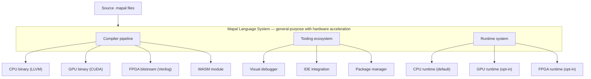
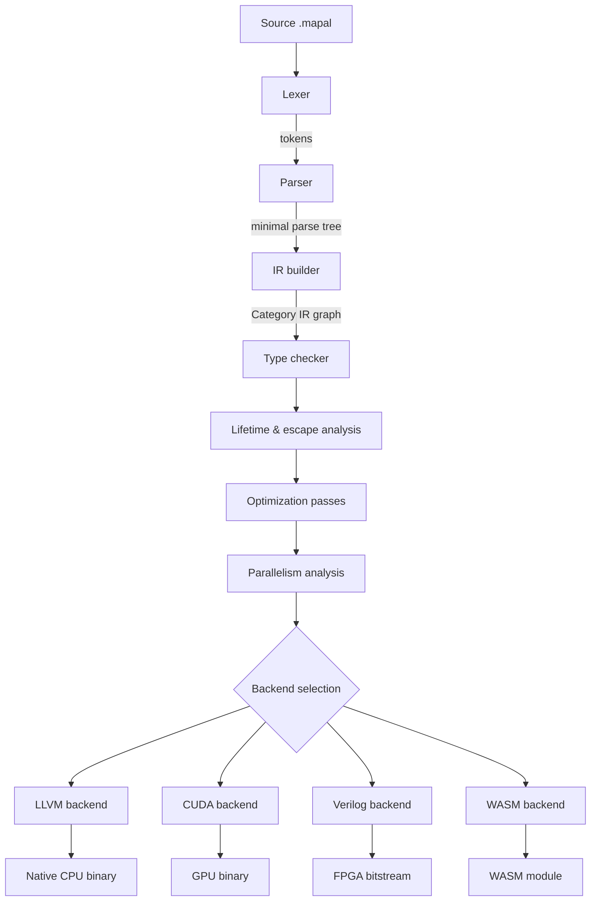
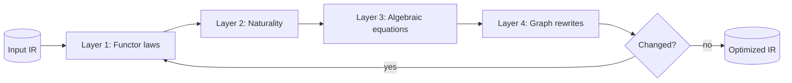
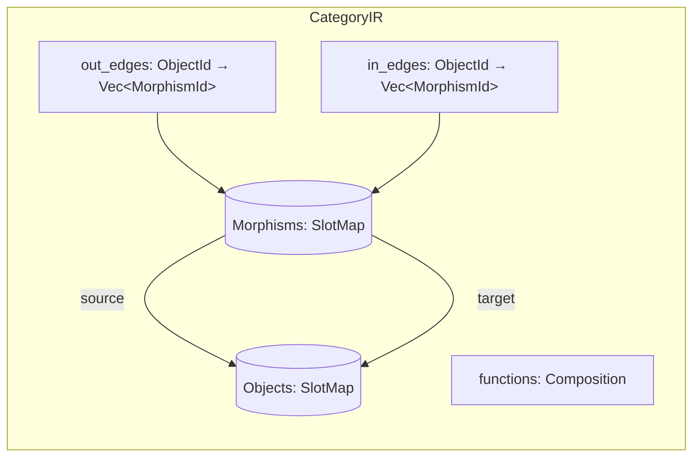
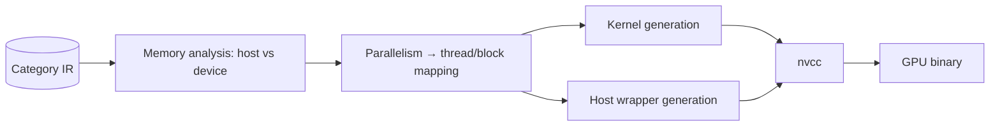
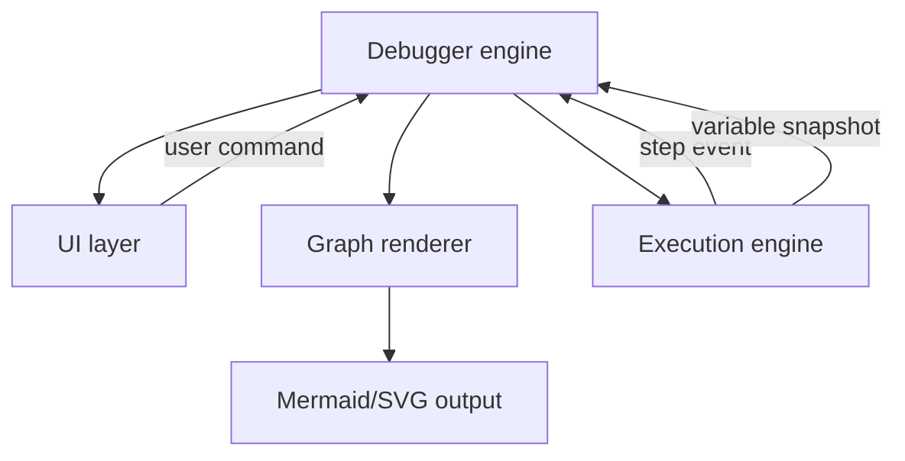
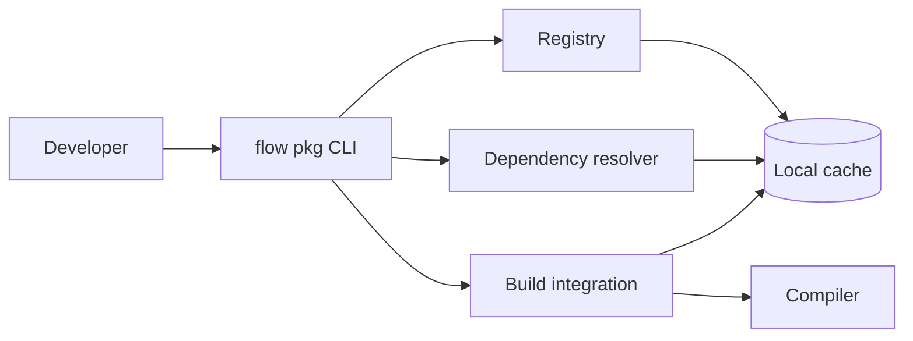
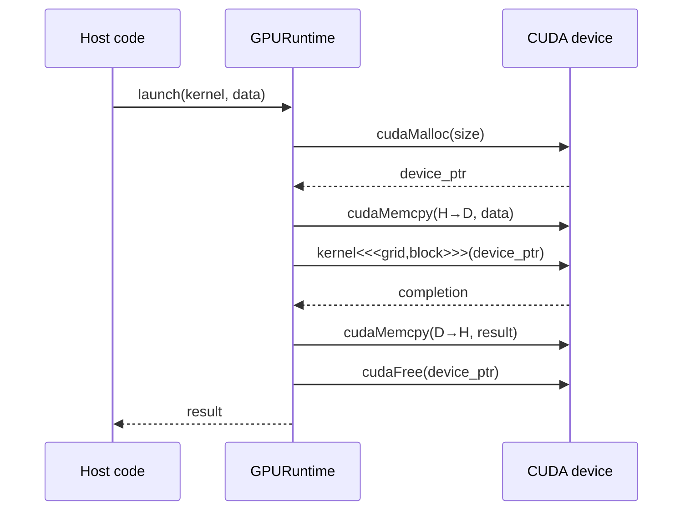
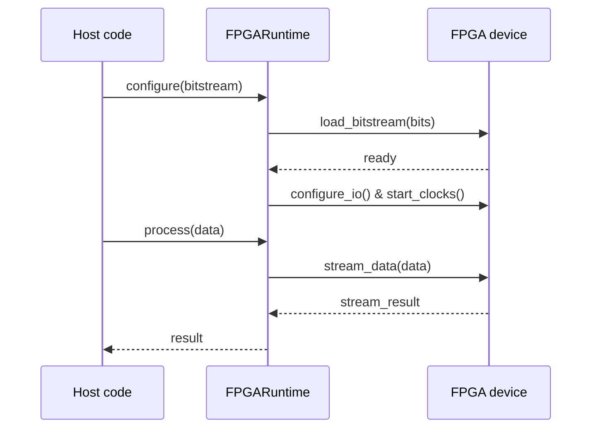

# Mapal Language — Architecture Overview v0.2

**Complete system architecture from source code to hardware execution.**

---

## Table of contents

1. System overview
2. Compiler architecture
3. Category IR design
4. Backend architectures
5. Tooling ecosystem
6. Runtime system
7. Development workflow
8. Performance considerations
9. System requirements
10. Future work

Appendices: A. Component responsibilities. B. File formats.

---

## 1. System overview

### 1.1 High-level architecture



### 1.2 Design philosophy

Three pillars, stated precisely:

1. **Single source of truth.** Code denotes a morphism in Mapal-Cat; the graph IR is that morphism made explicit. The visual and textual representations are two renderings of the same object, not two representations that must be kept in sync.

2. **General-purpose with hardware strengths.** Default target is CPU via LLVM. GPU and FPGA are alternative backends (functors out of Mapal-Cat, §8 of `category-ir.md`), not a separate language.

3. **Mathematical foundation.** Every sound optimization has a categorical justification: a functor law, a naturality square, a within-category equation, or a graph property. The compiler records which layer justifies each rewrite (see §9 of `category-ir.md`).

### 1.3 Key innovations

- **Category-IR.** One graph-based IR serves as both optimization substrate and visualization format; see `category-ir.md`.
- **Unified multi-target.** Same source compiles to CPU, GPU, FPGA, or WASM via backend functors.
- **Graph-derived memory safety.** No GC, no ownership annotations; lifetimes are inferred from the graph's last-use frontier (§3.4 below, §10 of `category-ir.md`).
- **Pipeline-native syntax.** The surface language's `->` operator is categorical composition.
- **Parallel-first execution.** Independent subgraphs execute in parallel by default; `seq` forces ordering where required.

---

## 2. Compiler architecture

### 2.1 Compilation pipeline



The parse tree is minimal and transient: it exists only long enough for the IR builder to consume it, and is discarded before type checking runs. All analyses and optimizations operate on the graph IR directly — there is no separate typed-AST phase.

### 2.2 Compiler components

#### 2.2.1 Lexer

Straightforward token recognition. Produces a flat token stream consumed by the parser.

- Keywords: `fn`, `mut`, `category`, `ret`, `seq`, `loop`, `pub`, `use`, `executor`
- Operators: `->`, `<-`, `+`, `-`, `*`, `/`, `%`, `==`, `!=`, `<`, `>`, `<=`, `>=`, `&&`, `||`, `?`
- Guards: `-true->`, `-false->`, `-pattern->`
- Literals and identifiers.

#### 2.2.2 Parser (deliberately minimal)

Recursive descent. Produces a small parse tree which is immediately handed to the IR builder and then discarded. The parser does no type inference, name resolution, or constant propagation — those live in later phases that operate on the graph.

#### 2.2.3 IR builder — lowering

Walks the parse tree and emits Category IR nodes and edges according to the lowering rules in §4 of `category-ir.md`. In particular:

- Binary operations `a + b` lower to `env --pair--> (A × B) --add--> T` — every morphism is single-source, single-target.
- Conditionals lower to a `Phi` morphism on the triple `(true-result, false-result, condition)`.
- Loops lower to a traced region: a `LoopMerge` object receives both the initial value and the back-edge; a select morphism routes to the body or out.

#### 2.2.4 Type checker

Runs on the graph. For each morphism, checks that its operation is well-typed for its declared source and target objects. Because the IR enforces single-source / single-target, type checking is a local predicate at each morphism — no tree traversal needed.

#### 2.2.5 Lifetime and escape analysis

Graph analyses:

- **Last-use frontier.** For each heap-allocated object, compute the set of morphisms with it as source. The topologically-last members are the frontier; a `Free` is scheduled after the frontier synchronizes.
- **Escape analysis.** An object escapes if it is a source of a `Return`, `Store`, or `ChannelSend` morphism. Escaped objects get no local free — ownership transfers.

#### 2.2.6 Optimizer (four layers)

Optimization passes are classified by which categorical property justifies them. See §9 of `category-ir.md` for the full treatment.



- **Layer 1 — functor laws.** Map fusion, identity-map elimination, bifunctor independence.
- **Layer 2 — naturality.** Sliding polymorphic operations past `map` using naturality squares (e.g., `head ∘ map(f) = Option::map(f) ∘ head`).
- **Layer 3 — algebraic equations.** `x + 0 = x`, constant folding, strength reduction.
- **Layer 4 — graph rewrites.** Dead-code elimination, common subexpression elimination.

Run to fixpoint.

#### 2.2.7 Parallelism analysis

Independent morphisms in the graph execute in parallel. "Independent" is a graph-reachability property; additionally, morphisms that arise as the image of a bifunctor `(f × g)` with disjoint sources are marked parallel without further analysis. See §9.5 of `category-ir.md`.

#### 2.2.8 Backend code generators

Each backend is a functor `F : Mapal-Cat → Target-Cat` that satisfies `F(id) = id` and `F(g ∘ f) = F(g) ∘ F(f)`. The backend lowers one morphism at a time using a compile-time table of `Operation → target-instruction`. Semantic preservation of the whole program follows from functoriality.

### 2.3 Compiler driver

```rust
fn compile(source: &str, target: Target) -> Result<Output> {
    let tokens = Lexer::new(source).lex()?;
    let parse_tree = Parser::new(tokens).parse()?;

    let mut ir = IRBuilder::new().lower(parse_tree)?;  // parse_tree discarded after this line

    TypeChecker::new(&ir).check()?;
    LifetimeAnalyzer::new(&mut ir).run()?;

    Optimizer::new(&mut ir).run_to_fixpoint();
    ParallelismAnalyzer::new(&mut ir).annotate();

    let code = match target {
        Target::LLVM    => F_LLVM.apply(&ir)?,
        Target::CUDA    => F_CUDA.apply(&ir)?,
        Target::Verilog => F_Verilog.apply(&ir)?,
        Target::WASM    => F_WASM.apply(&ir)?,
    };
    Ok(Output { code, ir })
}
```

---

## 3. Category IR design

### 3.1 Graph structure

The IR stores objects (graph nodes) and morphisms (edges) separately, with forward and reverse adjacency maps for O(1) neighborhood lookup during analysis.



Memory layout uses arena allocation for both objects and morphisms — IDs are dense integers, iteration is cache-friendly. The forward/reverse adjacency maps are the indexes that make lifetime analysis (§10 of `category-ir.md`), topological sort, and cycle detection all near-linear in graph size.

### 3.2 Graph algorithms

**Topological sort.** Standard DFS-based post-order reversal. Applies only on the DAG obtained by removing back-edges in loop regions.

**Cycle detection.** Tarjan's SCC algorithm. Non-trivial SCCs are exactly the loop regions; within each SCC, the `LoopMerge` object is the designated entry and gives canonical ordering.

**Reachability.** For parallelism analysis and dominance, standard forward/backward BFS from any object.

### 3.3 Serialization

JSON is the canonical interchange format. It renders directly to Mermaid, Graphviz DOT, or the visualizer — no separate visual format exists.

```json
{
  "version": "0.2",
  "objects": [
    {"id": 1, "kind": "Parameter", "ty": "i32"},
    {"id": 2, "kind": "Temporary", "ty": {"Tuple": ["i32", "i32"]}},
    {"id": 3, "kind": "Temporary", "ty": "i32"}
  ],
  "morphisms": [
    {"id": 1, "source": 1, "target": 2, "op": "Pair"},
    {"id": 2, "source": 2, "target": 3, "op": "Add"}
  ]
}
```

A binary format exists for large compilation units (100K+ LOC) where JSON parse cost dominates.

### 3.4 Memory model (graph-derived lifetimes)

Mapal does not use Rust-style ownership annotations. Lifetimes are inferred from the graph's last-use frontier:

1. Allocation morphisms (`Alloc`) create heap objects.
2. All uses are morphisms with the object as source.
3. The *frontier of last uses* — the set of uses with no subsequent use in their forward-reachable set — is computed by graph analysis.
4. A `Free` morphism is scheduled after the frontier synchronizes.

Primitive types (`i32`, `f32`, `bool`) copy on use, have no allocation, and skip the lifetime pass entirely. Heap types (`Buffer`, `String`, `Vec<T>`, user structs) flow by reference, and the use set accumulates across readers. Explicit `clone` is available when a user needs two independent owners.

Escape analysis handles objects that outlive the current function: if an allocation's reachable set includes a `Return`, `Store`, or `ChannelSend`, no local free is emitted — ownership transfers to the consumer.

See §10 of `category-ir.md` for the full formalism.

---

## 4. Backend architectures

Each backend is a functor; the diagrams below show the pipeline from the optimized IR to the target artifact.

### 4.1 LLVM backend — `F_LLVM`


Object-level: Mapal primitive types map to LLVM primitive types; tuples map to LLVM struct types; function types map to `ptr`. Morphism-level: primitives map one-to-one to LLVM instructions (`Add ↦ add nsw`, `Mul ↦ mul nsw`, `Phi ↦ select` or the `phi` instruction depending on control-flow lowering, `Trace ↦ structured loop with back-edge`).

Example output:

```llvm
; Mapal:  data * 2 -> + 5 -> ret;
define i32 @process(i32 %data) {
  %t1 = shl nsw i32 %data, 1    ; from Mul→strength-reduction
  %ret = add nsw i32 %t1, 5
  ret i32 %ret
}
```

### 4.2 CUDA backend — `F_CUDA`



Map-over-array morphisms `List(f)` are the critical case: because `List` is a functor in both Mapal-Cat and CUDA-Cat, the image of `List(f)` is a kernel launch whose body is `F_CUDA(f)`. Map fusion in the source (a functor law) is preserved by the functor and becomes kernel fusion in the backend for free — no separate kernel-fusion pass is required.

Example output:

```cuda
// Mapal:  data * 2 -> + 5 -> ret;  applied via map
__global__ void pipeline_kernel(int32_t* input, int32_t* output, int n) {
    int idx = blockIdx.x * blockDim.x + threadIdx.x;
    if (idx < n) {
        int32_t data = input[idx];
        int32_t t1 = data * 2;
        int32_t t2 = t1 + 5;
        output[idx] = t2;
    }
}
```

### 4.3 Verilog backend — `F_Verilog`


The target category `Clocked-Cat` is a traced monoidal category where:

- Objects are bundles of wires (typed by bit-width).
- Monoidal product is "wires side-by-side."
- Morphisms are combinational blocks plus registers.
- Trace is register feedback on the designated wire.

Because both Mapal-Cat and `Clocked-Cat` are traced, `F_Verilog` commutes with the trace operator. A software loop `Tr^U(body)` in the source becomes a hardware state machine with a register on `U` — the *same categorical construct*, just interpreted in a different category.

Example output:

```verilog
// Mapal:  data * 2 -> + 5 -> ret;  (pipelined)
module pipeline(
    input  wire        clk,
    input  wire [31:0] data,
    output reg  [31:0] result
);
    reg [31:0] stage1, stage2;
    always @(posedge clk) begin
        stage1 <= data << 1;     // × 2 strength-reduced
        stage2 <= stage1 + 5;
        result <= stage2;
    end
endmodule
```

Pipeline depth is a graph-theoretic property of the functor's image: count register hops along the longest combinational path.

### 4.4 WASM backend — `F_WASM`


Straightforward because WebAssembly's structured control flow (`block`, `loop`, `if`, `br`) mirrors Mapal's composition, conditional, and trace primitives.

---

## 5. Tooling ecosystem

### 5.1 Visual debugger



Because the IR *is* the graph, the debugger renders it directly with no translation layer. Stepping walks morphism-by-morphism in topological order; parallel groups are visualized as simultaneous activations; back-edges into loop-merge objects show which iteration is active.

### 5.2 IDE integration

A Language Server Protocol (LSP) implementation provides syntax highlighting, completion, inline type hints, go-to-definition, and a side-panel graph preview that updates live with edits. The graph renderer is shared code with the debugger.

### 5.3 Package manager (`flow pkg`)



```bash
flow pkg init
flow pkg add image-processing@1.0.0
flow pkg build --target cuda
```

---

## 6. Runtime system

### 6.1 GPU runtime — kernel launch



The runtime's `launch` function is driven entirely by the CUDA backend's output — the kernel code, grid/block dimensions, and memory requirements are all compile-time outputs.

### 6.2 FPGA runtime — bitstream configuration



### 6.3 CPU runtime

The default runtime is a thin wrapper around the LLVM-generated binary. Parallelism uses a work-stealing thread pool configured by the `@executor` annotation or the default `ThreadPool` executor.

---

## 7. Development workflow

### 7.1 Typical cycle


### 7.2 Project layout

```
my-project/
├── flow.toml              # project manifest
├── src/
│   ├── main.mapal          # entry point
│   ├── image_proc.mapal    # module
│   └── utils.mapal         # utilities
├── tests/
│   └── test_image.mapal
├── benches/
│   └── benchmark.mapal
└── build/
    ├── ir/                # serialized Category IR (.mapal-ir)
    ├── cuda/              # emitted .cu
    └── verilog/           # emitted .v
```

---

## 8. Performance considerations

### 8.1 Compilation speed

Targets for cold compilation:

| Project size | Target |
|---|---|
| 1 K LOC | < 1 s |
| 10 K LOC | < 5 s |
| 100 K LOC | < 30 s |

Strategies: incremental compilation with IR caching, parallel type checking (type check is a local predicate at each morphism — trivially parallel across disjoint morphisms), lazy backend codegen, arena allocation.

### 8.2 Runtime performance targets

| Backend | Target |
|---|---|
| LLVM (CPU) | Match hand-written C/Rust |
| CUDA (GPU) | 90–95% of hand-written CUDA |
| Verilog (FPGA) | Match hand-written Verilog |
| WASM | Match hand-written AssemblyScript |

The CUDA number is the most ambitious and the one most likely to slip early; kernel fusion from functor laws (§4.2) is the single biggest lever.

### 8.3 Memory usage during compilation

Target: < 1 GB resident for 100 K LOC. Arena allocation plus graph compression (dense IDs, shared operation metadata) keep per-node overhead below 100 bytes.

---

## 9. System requirements

### 9.1 Development environment

| Tier | CPU | RAM | Disk | Optional |
|---|---|---|---|---|
| Minimum | 4 cores | 8 GB | 10 GB | — |
| Recommended | 8+ cores | 16 GB+ | SSD | NVIDIA GPU, FPGA dev board |

### 9.2 Software dependencies

**Core.** Rust toolchain (compiler is written in Rust), LLVM 15+.

**Optional.** CUDA Toolkit 11.0+ for GPU backend; Xilinx Vivado or Intel Quartus for FPGA backend.

---

## 10. Future work

### 10.1 Short-term (year 1–2)

- JIT compilation for interactive development.
- Hot code reloading driven by the IR diff.
- Distributed compilation (build farm).
- Advanced profiling that overlays sample counts on the IR graph.

### 10.2 Medium-term (year 2–3)

- AI-assisted optimization: learned cost models for when to apply layer-2 naturality rewrites (which direction is cheaper is not always obvious).
- Cross-backend optimization (e.g., CPU-side arranging of inputs for GPU kernel fusion).
- Formal verification integration using mechanized proofs of the functor-law claims in `category-ir.md`.

### 10.3 Research directions

- **Quantum backend.** A functor `Mapal-Cat → Quantum-Cat` is plausible for the pure, unitary-expressible fragment. The dagger structure of quantum categories has no analog in Mapal-Cat, so only a subset of programs target this backend.
- **Neuromorphic backend.** Dataflow maps naturally to spiking-neural-network substrates.
- **Richer type systems.** Dependent types (size-indexed arrays for dimension checking), linear types (single-use resources, matches FPGA hardware resource constraints), graded monads (fine-grained effect tracking).

---

## Appendix A — component responsibilities

| Component | Input | Output | Purpose |
|---|---|---|---|
| Lexer | Source text | Tokens | Tokenization |
| Parser | Tokens | Minimal parse tree | Syntax recognition |
| IR builder | Parse tree | Category IR graph | Graph construction |
| Type checker | IR | Typed IR | Per-morphism type predicate |
| Lifetime analyzer | Typed IR | IR + free-insertions | Memory safety |
| Optimizer | IR | Optimized IR | Apply categorical laws + graph rewrites |
| Parallelism analyzer | IR | Annotated IR | Mark parallel groups |
| `F_LLVM` | Optimized IR | LLVM IR | CPU target |
| `F_CUDA` | Optimized IR | CUDA C++ | GPU target |
| `F_Verilog` | Optimized IR | Verilog RTL | FPGA target |
| `F_WASM` | Optimized IR | WAT/WASM | Browser/embedded target |

## Appendix B — file formats

| Extension | Contents |
|---|---|
| `.mapal` | Source |
| `.mapal-ir` | Compiled IR, binary |
| `.mapal-debug` | Debug info, JSON |
| `flow.toml` | Package manifest |
| `flow.lock` | Resolved dependency versions |

---

**Version:** 0.2 · **Status:** Design specification · **See also:** `category-ir.md`, `user-guide.md`, `getting-started.md`, `CHANGES.md`.
