# Mapal Language — Category IR Specification v0.2

**Internal representation: a graph-based IR with a category-theoretic semantics.**

---

## Table of contents

1. Introduction
2. Categorical foundations
3. IR data structures
4. Lowering from surface syntax
5. Graph representation
6. Functors
7. Natural transformations
8. Backends as functors
9. Optimization framework
10. Implementation guide

Appendices: A. Terminology note — two meanings of "category". B. Complete worked example. C. Bibliography.

---

## 1. Introduction

### 1.1 What this IR is

Mapal programs are represented internally as directed graphs. A program is a graph; a function is a subgraph; an optimization is a graph rewrite. The representation has a *semantics* in category theory: each graph denotes a morphism in a specific category, **Mapal-Cat**, and every rewrite is justified by a law of that category or of some structure on it (functor laws, naturality, monadic laws).

This document specifies:

- the categorical structure the IR is interpreted in,
- the data structures that realize the graph in the compiler,
- how surface syntax is lowered into the graph,
- which optimization classes correspond to which categorical laws,
- how each backend is modeled as a functor out of Mapal-Cat.

### 1.2 Why go to the trouble

Graph-based IRs are not new (Sea of Nodes, RVSDG, MLIR). What a categorical semantics adds on top:

1. **Compositionality.** Every subgraph is a morphism and composes with every other subgraph whose types match. There are no special "statement" vs. "expression" kinds.
2. **Rewrite justification.** An optimization is sound iff it preserves the denoted morphism. The categorical laws (associativity, functor laws, naturality) are exactly the rewrites that are sound *by construction* — you don't need a separate equivalence proof per rule.
3. **Backend portability.** Each backend is a functor; functoriality is the formal statement of "the compiler doesn't change the meaning of your program."
4. **Parallelism.** Products and tensor products expose independence structurally — parallel composition is just a fact about the graph, not an annotation on top of it.

### 1.3 Pipeline overview

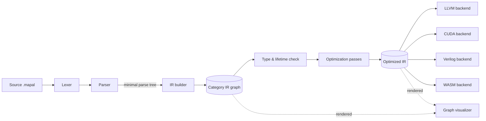

The parse tree is deliberately thin — there is no separate typed AST phase. Type checking, lifetime analysis, and optimization all run on the graph directly.

> **Note on "skipping the AST".** Earlier drafts claimed Mapal "skips the AST entirely." That overstates it: the parser does produce a small tree that the lowering code pattern-matches on. The honest claim is: there is no separate typed intermediate; the graph is the canonical representation from lowering onward.

---

## 2. Categorical foundations

This section defines **Mapal-Cat**, the category in which Mapal IR graphs are interpreted, together with the extra structure (products, coproducts, exponentials, traces) needed to model real programs. All diagrams are Mermaid; all claims are either definitional or are flagged as theorems to be discharged.

### 2.1 Mapal-Cat

> **Erratum E1 applied — see docs/spec/ERRATA.md and ADR-0002.**

**Definition (Mapal-Cat).** The category whose

- **objects** are Mapal types (categories in the surface-language sense — see appendix A for the terminological note),
- **morphisms** `f : A → B` are pure total Mapal functions from `A` to `B`,
- **composition** `g ∘ f : A → C` for `f : A → B`, `g : B → C` is the graph obtained by connecting the output of `f` to the input of `g`,
- **identity** `id_A : A → A` is the empty-transformation morphism on `A`.

Pure means: no observable side effects. Total means: terminates and produces a value of the target type on every input. Totality holds for this **loop-free core**: Mapal-Cat as defined here is the total core, and the total core has **no trace**. Partial and effectful operations are handled in §2.6 via Kleisli categories over appropriate monads — they do not live directly in this total core.

**Loops and iteration are not total** and therefore do not live in the total core. They live in the **Kleisli category of the partiality (divergence) monad** — the same §2.6 machinery already used for I/O and errors — where the trace operator is interpreted by **least-fixpoint / Elgot-iteration semantics**. An unbounded loop such as `loop { -> loop; }` is legal and diverges; divergence is a defined outcome of that monad, not an excluded case. See §2.7 and §2.8 for the traced structure on this partial extension, and §4.5 for the lowering.

#### 2.1.1 Identity

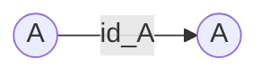

**Law (identity).** For every `f : A → B`, `f ∘ id_A = f = id_B ∘ f`. Identity morphisms are the do-nothing edges of the graph; the IR builder never emits them explicitly — they are implicit.

#### 2.1.2 Composition and associativity

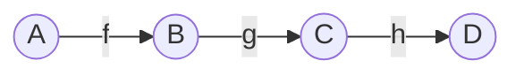

**Law (associativity).** `(h ∘ g) ∘ f = h ∘ (g ∘ f)`. The graph above denotes a single morphism `A → D` regardless of how you parenthesize the chain. This is why pipeline syntax `a -> f -> g -> h` is unambiguous.

### 2.2 Products — the categorical meaning of tuples

Mapal tuples `(A, B)` are **products** in Mapal-Cat. The universal property of a product is what makes pairing well-behaved.

**Definition (product).** A product of `A` and `B` is an object `A × B` together with two projection morphisms

- `π₁ : A × B → A`,
- `π₂ : A × B → B`,

such that for any object `X` and pair of morphisms `f : X → A`, `g : X → B`, there exists a *unique* morphism `⟨f, g⟩ : X → A × B` making the following diagram commute:

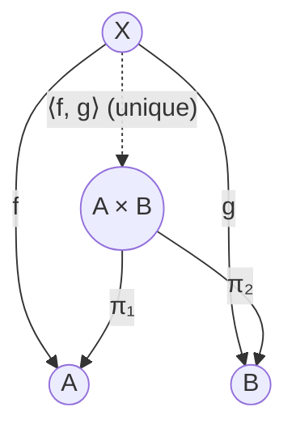

The dashed edge is forced by `f` and `g`: `π₁ ∘ ⟨f, g⟩ = f` and `π₂ ∘ ⟨f, g⟩ = g`. That uniqueness is why tuple construction in the IR never needs disambiguating annotations — there is only one morphism that projects back to your chosen components.

**Implication for the IR.** A binary operation like `a + b` is not a morphism with two sources. It is the composition

```
(⟨a, b⟩ : Γ → i32 × i32)  ;  (add : i32 × i32 → i32)
```

where `Γ` is the ambient environment object (the tuple of variables in scope) and `a`, `b` are themselves morphisms `Γ → i32` (projections from the environment). This keeps the invariant that every morphism has exactly one source and one target. See §4.1 for the worked lowering.

### 2.3 Coproducts — the categorical meaning of tagged unions

`Option<T>`, `Result<T, E>`, and all `match`-able enums are **coproducts** in Mapal-Cat.

**Definition (coproduct).** A coproduct of `A` and `B` is an object `A + B` with two injection morphisms

- `ι₁ : A → A + B`,
- `ι₂ : B → A + B`,

such that for any object `X` and pair of morphisms `f : A → X`, `g : B → X`, there exists a unique morphism `[f, g] : A + B → X` making the following commute:

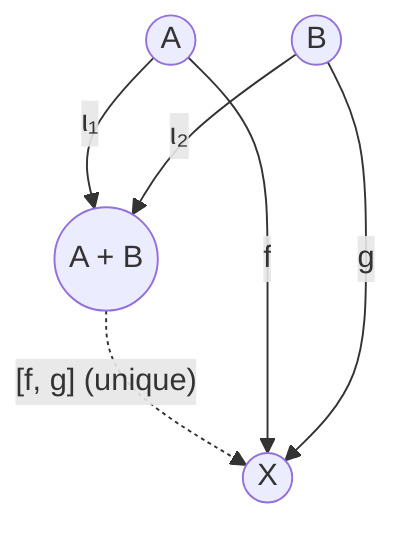

**Implication for the IR.** Pattern matching `match x { Some(a) => f(a); None => g() }` is literally the copair `[f, g] ∘ x`. `Option<T>` is `T + 1` (where `1` is the terminal object — the unit type). `Result<T, E>` is `T + E`.

The `?` operator is Kleisli bind for the Result-monad; see §2.6.

### 2.4 Terminal and initial objects

- **Terminal object `1`** (unit type): for every `A` there is exactly one morphism `A → 1`. This is `drop` or "discard the value."
- **Initial object `0`** (empty type, sometimes written `Never` or `!`): for every `A` there is exactly one morphism `0 → A`. This is the type of expressions that cannot produce a value (e.g., `panic!()`), and the uniqueness is why such expressions can be inserted anywhere — there's only one way to do it.

### 2.5 Exponentials — first-class functions

Mapal-Cat is **cartesian closed**: for every pair `A`, `B` there is an exponential object `B^A` (function type `A → B`) with a morphism `eval : B^A × A → B` such that for any `f : C × A → B` there is a unique `curry(f) : C → B^A` with `eval ∘ (curry(f) × id_A) = f`.

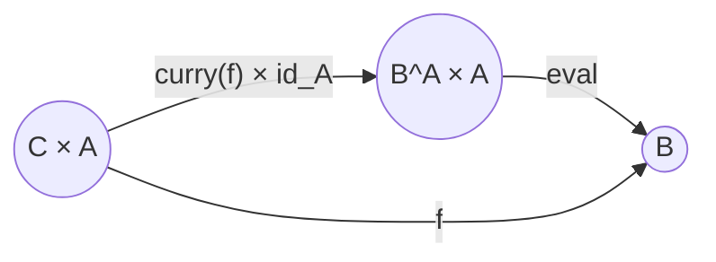

In the IR this means closures are ordinary objects, and function-valued variables compose normally.

### 2.6 The effect story — Kleisli categories

Not every Mapal operation is pure and total. I/O, mutable state, and errors all break the Mapal-Cat assumptions. Each effect gets a **monad** on Mapal-Cat, and effectful functions are morphisms in the corresponding **Kleisli category**.

**Definition (Kleisli category).** For a monad `(T, η, μ)` on Mapal-Cat, the Kleisli category `Mapal-Cat_T` has the same objects, with morphisms `A → B` being Mapal-Cat morphisms `A → T(B)`. Composition uses the monad's bind.

Monads used in Mapal:

| Monad | What it tracks | Used for |
|---|---|---|
| `Option` | absence | nullable results |
| `Result<_, E>` | recoverable failure | `?` operator propagation |
| `IO` | external world | file, network, console |
| `State<S, _>` | mutable state | `mut` variables within a region |
| `Err` (same as Result) | partial functions | division, array bounds |
| `Divergence` (partiality), carrier `A_⊥` (flat lifting) | possible nontermination of unbounded loops / iteration | loop semantics (least fixpoint / Elgot iteration); introduced by Erratum E1 |

> **Erratum E1 applied — see docs/spec/ERRATA.md and ADR-0002.**

The `?` operator is Kleisli composition in the `Result`-monad. Given `f : A → Result<B, E>` and `g : B → Result<C, E>`, writing

```flow
x -> f? -> g?
```

denotes the Kleisli composition `g ⤙ f : A → Result<C, E>` whose definition expands to the copairing in §2.3:

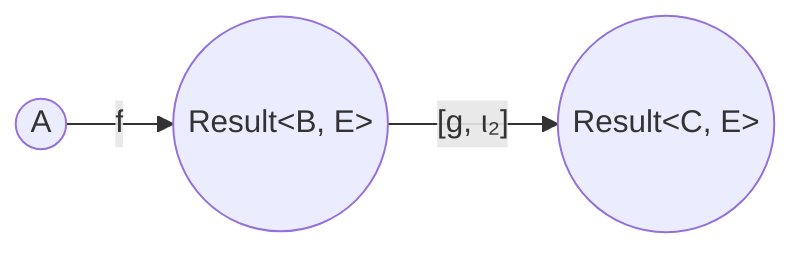

The copair `[g, ι₂]` means: on `Ok(b)` call `g`; on `Err(e)` re-inject `e` unchanged.

### 2.7 Traced monoidal structure — the meaning of loops

> **Erratum E1 applied — see docs/spec/ERRATA.md and ADR-0002.**

Loops and recursion don't fit into a plain category; they require **feedback**. The standard formal account is a **traced monoidal category**: for any morphism `f : A ⊗ U → B ⊗ U`, the trace `Tr^U(f) : A → B` "loops back" the `U` wire.

The traced structure described below lives on the **partial extension** of Mapal-Cat (the Kleisli category of the divergence monad, §2.1, §2.6), **not on the total core**. This is forced: a traced cartesian category is equivalent to one carrying a Conway fixed-point operator (Hasegawa 1997), and total functions lack fixpoints in general — `not : Bool → Bool` has no fixpoint — so the total core cannot be traced. Tracing the partial extension is exactly right, because tracing back the `U` wire is where divergence can enter, and the divergence monad already accounts for it via least-fixpoint / Elgot-iteration semantics.

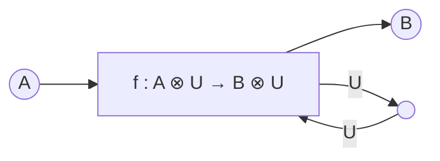

In the partial extension of Mapal-Cat, the monoidal product is the categorical product (×), `U` is the loop-carried state type, and `Tr^U(f)` is the meaning of a loop whose body transforms `(input, state) ↦ (output, next_state)`. (The trace lives on the partial extension, never on the total core — see the note above.)

**Consequence for the IR.** The "back edge" in the graph representation of a loop is not a special field on a Branch morphism — it is literally an edge in the graph, targeting the merge object that plays the role of `U`. See §4.5 for the worked lowering.

**Consequence for Verilog.** Synchronous digital circuits are morphisms in a traced monoidal category where the trace is register feedback. That circuit trace is **guarded** (every register is a unit delay, hence always productive and total), which is a *different* traced structure from the iteration trace of the partial extension here. Relating the two is therefore not automatic — it is a theorem mediated by the done-signal protocol; see §8.3.

### 2.8 Summary of structure on Mapal-Cat

> **Erratum E1 applied — see docs/spec/ERRATA.md and ADR-0002.**

The **total core** of Mapal-Cat is a **bicartesian closed category**:

- bicartesian: has both products (tuples) and coproducts (tagged unions),
- closed: has exponentials (function types).

The total core is **not** traced. The trace lives one level out, on the **partial extension** (the Kleisli category of the divergence monad, §2.1, §2.6, §2.7), which is **traced cartesian** with least-fixpoint / Elgot-iteration semantics:

- traced: has trace operators for loops and feedback, on the partial extension only.

The earlier v0.2 claim that Mapal-Cat is jointly *total* and *traced cartesian* was inconsistent: by the Hasegawa 1997 correspondence a traced cartesian category carries a Conway fixed-point operator, and total functions have no fixpoints in general (`not : Bool → Bool` has none). Splitting the structure — total core without trace, partial extension with trace — removes the inconsistency without losing any property the compiler relies on. The next sections define the IR data structures that realize morphisms as concrete graphs.

---

## 3. IR data structures

### 3.1 Core invariant

**Every morphism has exactly one source object and exactly one target object.** Operations that conceptually take multiple inputs are lowered as a product-pair followed by the primitive operation (§2.2). This invariant is what makes composition total and what justifies the categorical reading.

### 3.2 Object, Morphism, Composition

```rust
/// An object in Mapal-Cat — a value/variable/type-inhabited point.
struct Object {
    id: ObjectId,
    ty: Ty,                 // The Mapal category (type) of this object
    value: Option<Value>,   // Compile-time value if known (for constants)
    kind: ObjectKind,       // Parameter | Temporary | Constant | Return | LoopMerge
    loc: SourceLoc,
}

enum ObjectKind {
    Parameter,
    Temporary,
    Constant,
    Return,
    LoopMerge,  // The U in Tr^U(f) — the loop-carried state object
}

/// A morphism — a single-source, single-target operation.
struct Morphism {
    id: MorphismId,
    source: ObjectId,       // Exactly one
    target: ObjectId,       // Exactly one
    op: Operation,
    loc: SourceLoc,
}

/// A composition is a path in the graph.
/// Stored explicitly only when it names a function boundary.
struct Composition {
    morphisms: Vec<MorphismId>,  // in composition order, f then g then h...
    source: ObjectId,
    target: ObjectId,
}

struct CategoryIR {
    objects: SlotMap<ObjectId, Object>,
    morphisms: SlotMap<MorphismId, Morphism>,
    functions: HashMap<FunctionId, Composition>,
    entry: FunctionId,
}
```

### 3.3 Operations

The `Operation` enum is the set of primitive morphisms. Every multi-ary operation takes a *product* as its source.

> **Note (ADR-0013, Session 04).** This enum is the long-horizon shape. The Core-realized operation set differs: `Identity`/`Const`/`Trace` are not materialized (identities are implicit per §2.1.1; constants are `Constant`-kind objects; the trace is the inline cycle per CHANGES §1.3), out-of-Core variants await their features, and Core adds `Neg`, `Index`, `Map`/`Fold`, `Print`, and the loop-edge operations. See ADR-0013 and `docs/components/ir/DESIGN.md` §5.

```rust
enum Operation {
    // --- Structural (product & coproduct) ---
    Identity,                           // id_A : A → A
    Pair,                               // ⟨π₁, π₂⟩ is implicit in typing; Pair builds A × B from an env
    Proj(u8),                           // π_i : A₀ × A₁ × ... → A_i
    Inject(u8),                         // ι_i : A_i → A₀ + A₁ + ...
    Copair,                             // [f₀, f₁, ...] : Σ A_i → X, branches stored in op metadata
    Distribute,                         // dist : (A + B) × C → (A × C) + (B × C)

    // --- Arithmetic (source: numeric × numeric) ---
    Add, Sub, Mul, Div, Mod,

    // --- Comparison (source: A × A, target: Bool) ---
    Eq, Neq, Lt, Gt, Le, Ge,

    // --- Logical (source: Bool × Bool or Bool, target: Bool) ---
    And, Or, Not,

    // --- Constants (source: 1 = Unit) ---
    Const(Value),                       // k : 1 → A

    // --- Phi (select, source: T × T × Bool, target: T) ---
    // Derived: Phi = [π₁, π₂] ∘ dist ∘ (swap × id)
    // Kept as a primitive for codegen simplicity.
    Phi,

    // --- Memory (effectful — live in Kleisli(IO)) ---
    Load, Store, Alloc, Free,

    // --- Function application (source: B^A × A, target: B) ---
    Apply,                              // eval morphism for exponentials
    Call(FunctionId),                   // named-function call — sugar for Apply after curry

    // --- Trace (loop) ---
    // Tr^U(body) : A → B, where body : A × U → B × U is stored in metadata
    Trace { body: CompositionId, carried: Ty },

    // --- Effect lifts ---
    Return,                             // η : A → T(A), pure lift into a monad
    Bind,                               // Kleisli bind
}
```

#### 3.3.1 Why `Phi` is a primitive despite being derived

The Phi operation `(T × T × Bool) → T` can be derived from coproducts and distribution:

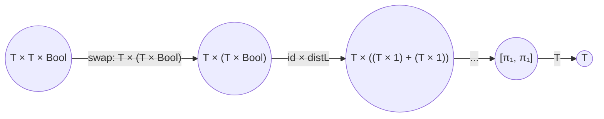

but this blows up into many morphisms for a very common pattern. The IR keeps `Phi` as a single primitive morphism. The *semantics* is fixed by the derivation above, so every backend can translate `Phi` to its native conditional-move / mux / `select` instruction knowing the meaning is forced.

### 3.4 Ty — the object language

```rust
enum Ty {
    // Atomic
    Int { bits: u8, signed: bool },
    Float { bits: u8 },
    Bool,
    Char,
    Unit,                               // terminal object 1
    Never,                              // initial object 0

    // Product
    Tuple(Vec<Ty>),
    Struct { name: Symbol, fields: Vec<(Symbol, Ty)> },  // named product
    Array { elem: Box<Ty>, size: Option<usize> },

    // Coproduct
    Sum { name: Symbol, variants: Vec<(Symbol, Ty)> },   // named coproduct
    Option(Box<Ty>),                    // T + 1
    Result(Box<Ty>, Box<Ty>),           // T + E

    // Exponential
    Fn { dom: Box<Ty>, cod: Box<Ty> },  // B^A

    // Effectful lifts (Kleisli)
    Io(Box<Ty>),
    State(Box<Ty>, Box<Ty>),
}
```

---

## 4. Lowering from surface syntax

### 4.1 Binary operation — worked example

**Source:**
```flow
result <- a + b;
```
where `a, b : i32` are already in scope in environment `Γ`.

**Lowering.** We need the composition `Γ --⟨a, b⟩--> i32 × i32 --add--> i32`, i.e., *two* morphisms sharing an intermediate object:

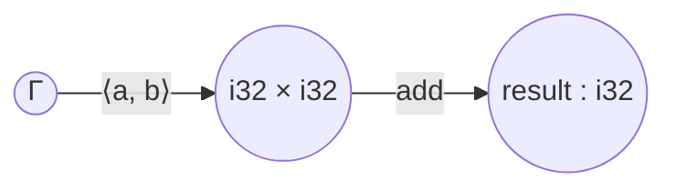

**IR objects.**

| id | kind | ty |
|---|---|---|
| 1 | Parameter | Γ |
| 2 | Temporary | i32 × i32 |
| 3 | Temporary | i32 (= `result`) |

**IR morphisms.**

| id | source | target | op |
|---|---|---|---|
| m1 | 1 | 2 | Pair |
| m2 | 2 | 3 | Add |

The Pair operation's metadata records *which projections* of the ambient environment to bundle — in this case, the morphisms for `a` and `b`. Every morphism is single-source, single-target; the invariant holds.

> **Erratum LC-4 applied — see docs/spec/ERRATA.md and ADR-0013.** Pair carries no dataflow metadata: each component arrives on its own in-edge (`Pair { slot, arity }` from the component's object), and constants enter the graph as `Constant`-kind source objects (`value: Some`, §3.2) rather than riding in payloads. The compact tables above elide those component edges; the realized graph contains them explicitly — which is what §5.1's merge detection and the §9/§10 analyzes read.

### 4.2 Array access

**Source:**
```flow
v <- arr[5];
```

**Lowering.** Indexing is a morphism `Array<T> × Nat → T`. We pair `arr` with the constant `5`:

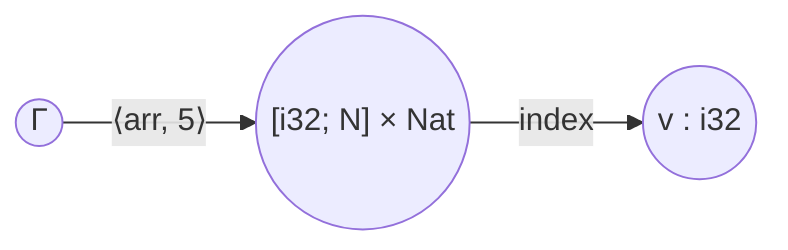

Bounds-checking (if enabled) lifts this into `Kleisli(Result)`: the index morphism becomes `Array<T> × Nat → Result<T, IndexError>`, and the caller must deal with the `Result` via `?` or an explicit match.

### 4.3 Pipeline

**Source:**
```flow
data * 2 -> + 5 -> * 3 -> ret;
```

**Lowering.** Each stage is a morphism from the previous intermediate to the next. The `* 2` stage is the composition `⟨id, 2⟩ ; mul`:

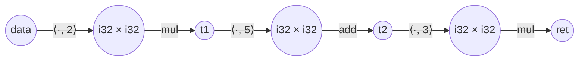

Because composition in a category is associative, the IR does not record "stages" — it records a flat sequence of morphisms that can be grouped arbitrarily for codegen.

### 4.4 Conditional — using Phi

**Source:**
```flow
(x > 0) -> {
    -true->  x * 2;
    -false-> x * -1;
} -> ret;
```

**Lowering.** The condition is a morphism `x : i32 → Bool`. Both branches are morphisms `i32 → i32`. The result uses `Phi` to select:

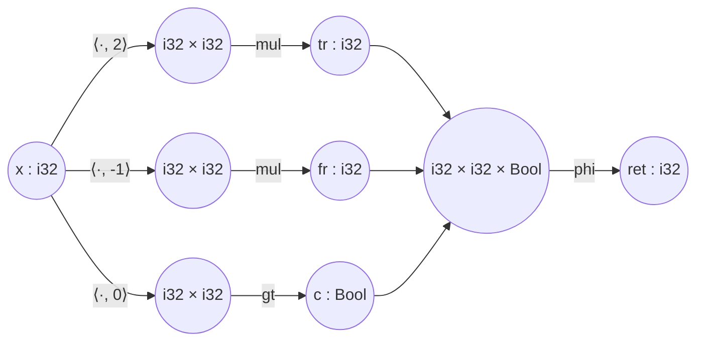

Observe that both branches are *drawn*. Whether both are **computed** is a
separate question, and the answer is no: the condition **gates** the arms — an
arm's exclusive work runs only if the condition selects that arm (plan-s39).

This section previously said both branches are always computed, justified by
"the natural behavior for hardware (both datapaths exist)" and "the
branchless-by-default bias for GPU codegen". Both statements are true, and both
are about **how to realize a guard on a particular machine** — they were
mistakenly written down as what a guard *means*. In this document's own terms
that is a `TrnLoc` promoted to a `Trn` (§4.2: a transformation placed twice has
two placements, and "the two may be different code"). The concrete cost: an
arm's `7 / 0` trapped on a path the condition never took.

Two things the strict reading got wrong:

- **Pure is not total.** The arm restrictions buy purity, but `Div`, `Mod`,
  `Index` and `Update` are pure *partial* morphisms. Evaluating both arms
  implements the copair `[f, g]` only where **both** are defined — a strictly
  smaller morphism than the guard denotes, so it is the wrong morphism, not a
  different schedule of the right one.
- **Compiled is not computed.** Both arms' code exists in the emitted artifact.
  Only running is conditional.

Realizations differ because locations differ, and each one *realizes* the gate
rather than waiving it: on the parallel task DAG it is an unsatisfied
dependency (the task never becomes ready); in scalar straight-line code a
branch; on a SIMD lane the lane mask; on a GPU thread warp divergence. One
degenerate case remains, and it is where `select` survives: when an arm's work
is a small **total** computation, gating and computing are the same work, so
the backend computes both and merges. `mapal_ir::guard_plan` supplies the
legality (can this arm trap?) and the cost input; the backend picks.

When a branch has side effects, the lowering changes further — see §4.6.

### 4.5 Loop — using Trace

**Source:**
```flow
loop {
    (i < 10) -> {
        -true->  { i + 1 -> i; -> loop; }
        -false-> -> ret;
    }
}
```

**Lowering.** The loop body is a morphism `body : i32 → i32 + i32` (the `+` is `Result<KeepLooping, Exit>`-shaped, informally). Wrapped in a trace, it becomes a morphism `Γ → i32`:

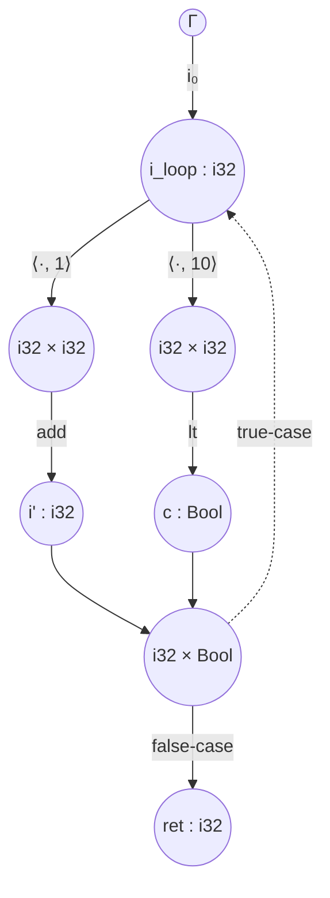

- `i_loop` is the loop-carried state object (`LoopMerge` kind). It has *two* incoming edges — the initial value `i₀` and the back edge from `i'` — and the choice between them is resolved by the route/phi at the bottom.
- The dashed edge is the back edge. It is a real edge in the adjacency list, not a special field on any morphism. Cycle detection is just SCC analysis on the adjacency graph.
- The pair `(i_loop, ret)` together form the trace: the `route` morphism has type `i32 × Bool → i32 + i32`, and the trace operator glues the "keep looping" output back to `i_loop`.

Formally, the whole loop denotes `Tr^{i32}(body)` where `body = ⟨route_keep, route_exit⟩ ∘ (inext × c)`.

### 4.6 Effectful branches

When a branch contains side effects (logging, store, channel send), the Phi-based "compute both, then select" lowering would execute both effects. Wrong. In that case the lowering uses an honest coproduct:

```
c : Γ → Bool
split : Γ × Bool → Γ + Γ                 (distribute Γ over Bool)
[eff_true, eff_false] : Γ + Γ → IO<T>    (copair of effectful branches)
```

so that only one side's effects fire. The `split`/copair pair is what traditional compilers call a conditional branch. The type system tracks effects (`IO<T>` rather than `T`) to force this lowering when needed.

---

## 5. Graph representation

### 5.1 Storage

```rust
struct CategoryIR {
    objects: SlotMap<ObjectId, Object>,        // arena-allocated
    morphisms: SlotMap<MorphismId, Morphism>,  // arena-allocated
    out_edges: HashMap<ObjectId, Vec<MorphismId>>,
    in_edges: HashMap<ObjectId, Vec<MorphismId>>,
    functions: HashMap<FunctionId, Composition>,
}
```

- `out_edges[o]` gives every morphism whose source is `o` — used for forward dataflow and for checking last-use (§9.4).
- `in_edges[o]` gives every morphism whose target is `o` — used for reverse dataflow and for merge-point detection (an object with `in_edges.len() > 1` is a merge / Phi / loop header).

### 5.2 Cycle structure and topological order

The graph is a DAG exactly when the program has no loops. Loops create cycles through `LoopMerge` objects. Tarjan's SCC algorithm partitions the objects into SCCs; non-trivial SCCs are exactly the loop regions.

Within a single SCC, topological order is undefined (it's a cycle), but Mapal's lowering guarantees every non-trivial SCC has a designated `LoopMerge` entry object. That gives a canonical order: loop-header-first, then the body in topo order of the DAG-with-back-edge-removed.

### 5.3 Serialization — JSON

```json
{
  "version": "0.2",
  "objects": [
    {"id": 1, "kind": "Parameter", "ty": "i32"},
    {"id": 2, "kind": "Temporary", "ty": "i32"}
  ],
  "morphisms": [
    {"id": 1, "source": 1, "target": 2, "op": {"Mul": {"rhs_const": 2}}}
  ],
  "functions": {
    "main": {"morphisms": [1], "source": 1, "target": 2}
  }
}
```

A graph in this form renders directly to Mermaid, Graphviz, or the visualizer — there is no separate "visualization format."

> **Erratum LC-4 applied — see docs/spec/ERRATA.md and ADR-0013.** The `{"Mul": {"rhs_const": 2}}` form above is superseded: constants are serialized as `Constant`-kind objects and reach the primitive through explicit `Pair`-slot edges; operation payloads never carry value flow. The serializer (when implemented) emits the edge form.


---

## 6. Functors

A **functor** `F : C → D` is a structure-preserving map between categories. It takes each object `A` of `C` to an object `F(A)` of `D`, and each morphism `f : A → B` of `C` to a morphism `F(f) : F(A) → F(B)` of `D`, subject to two laws.

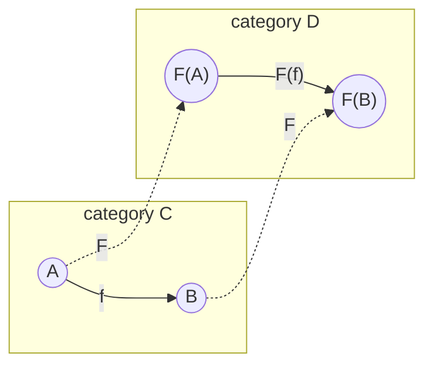

**Functor laws.**
1. **Identity preservation:** `F(id_A) = id_{F(A)}` for every object `A`.
2. **Composition preservation:** `F(g ∘ f) = F(g) ∘ F(f)` for every composable pair `f : A → B`, `g : B → C`.

As commutative diagrams:

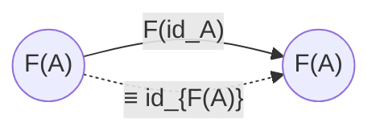

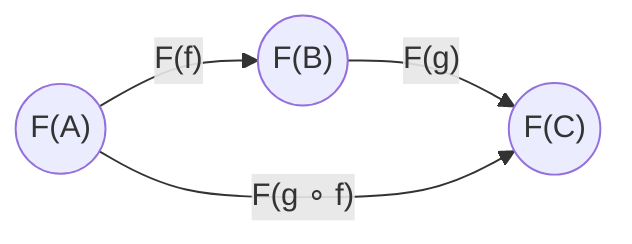

Both paths `F(A) → F(C)` must be the same morphism in `D`.

### 6.1 Endofunctors on Mapal-Cat

An **endofunctor** is a functor `F : C → C`. The important ones in Mapal-Cat are the parametric type constructors.

#### 6.1.1 The `List` endofunctor

`List` sends a type `A` to the type `List<A>`. On morphisms, it is `map`:

```
List(f : A → B) = map(f) : List<A> → List<B>
```

**Functor laws for List.**

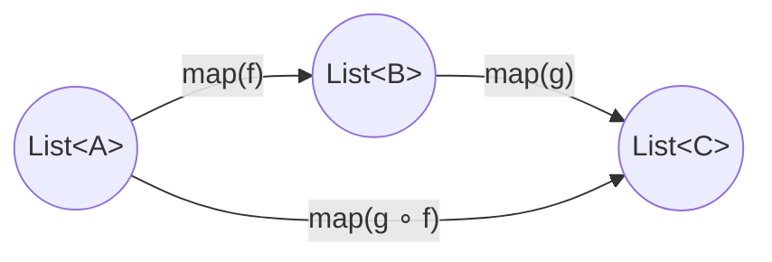

The two paths are equal, by the composition law. **This equation is the map-fusion optimization.** The IR doesn't need a separate proof that map-fusion is sound — it's forced by `List` being a functor.

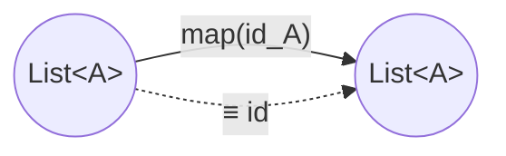

Identity preservation gives us `map(id) = id` — another free optimization (eliminating no-op maps).

#### 6.1.2 Other endofunctors

| Functor | On types | On morphisms | Fusion law |
|---|---|---|---|
| `Option` | `A ↦ Option<A>` | `f ↦ Option::map(f)` | `Option::map(g) ∘ Option::map(f) = Option::map(g ∘ f)` |
| `Result<_, E>` | `A ↦ Result<A, E>` | `f ↦ Result::map(f)` | ditto |
| `Array<_, N>` | `A ↦ [A; N]` | `f ↦ array_map(f)` | ditto |
| `Stream` | `A ↦ Stream<A>` | `f ↦ stream_map(f)` | ditto |

Every one of these gives the compiler a fusion rewrite for free.

### 6.2 Bifunctors

`Result<T, E>` depends on two types. Categorically it is a **bifunctor** `Result : Mapal-Cat × Mapal-Cat → Mapal-Cat`. Functoriality in each argument gives:

- `map_ok(g) ∘ map_ok(f) = map_ok(g ∘ f)`
- `map_err(g) ∘ map_err(f) = map_err(g ∘ f)`
- `map_ok(f) ∘ map_err(g) = map_err(g) ∘ map_ok(f)` — the two sides commute.

The third equation is what lets the optimizer reorder unrelated `map_ok` / `map_err` passes without reasoning about their contents.

### 6.3 Products and coproducts as functors

The categorical product and coproduct themselves are bifunctors:

- `(−) × (−) : Mapal-Cat × Mapal-Cat → Mapal-Cat`
- `(−) + (−) : Mapal-Cat × Mapal-Cat → Mapal-Cat`

This justifies rewrites like `(f × g) ∘ (h × k) = (f ∘ h) × (g ∘ k)` — parallel composition of independent morphisms is itself functorial. This is the formal basis for the parallelism analysis in §9.5.

---

## 7. Natural transformations

Functor laws cover fusion within a single functor. **Natural transformations** cover the *other* large class of rewrites: polymorphic operations that commute with `map`.

**Definition (natural transformation).** Given functors `F, G : C → D`, a natural transformation `η : F ⇒ G` assigns to each object `A` of `C` a morphism `η_A : F(A) → G(A)` in `D`, such that for every morphism `f : A → B` in `C`, the following **naturality square** commutes:

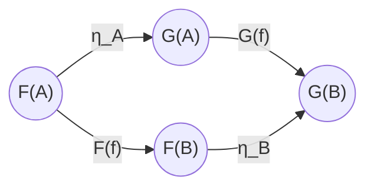

Both paths `F(A) → G(B)` are equal: `η_B ∘ F(f) = G(f) ∘ η_A`.

### 7.1 Polymorphic operations are natural transformations

A Mapal function `head : ∀T. List<T> → Option<T>` is a family of morphisms indexed by `T`. For this family to deserve the name "polymorphic," it must behave the same way at every type — which is exactly naturality with respect to the `map` operations of `List` and `Option`:

```mermaid
flowchart LR
    LA(("List&lt;A&gt;")) -- "head_A" --> OA(("Option&lt;A&gt;"))
    LA -- "List::map(f)" --> LB(("List&lt;B&gt;"))
    OA -- "Option::map(f)" --> OB(("Option&lt;B&gt;"))
    LB -- "head_B" --> OB
```

**Both paths must be equal.** The equation `Option::map(f) ∘ head = head ∘ List::map(f)` is called a **free theorem**: it holds for `head` by virtue of its polymorphic type, with no additional proof required, and it is an optimization rule.

The optimizer can rewrite

```flow
big_list -> List::map(expensive_fn) -> head
```

into

```flow
big_list -> head -> Option::map(expensive_fn)
```

without any per-type reasoning. The first form calls `expensive_fn` on every element; the second calls it at most once. The rewrite is justified by naturality of `head` alone.

### 7.2 Catalogue of natural transformations in Mapal

| NT | Type (polymorphic signature) | Naturality law (optimization) |
|---|---|---|
| `head` | `∀T. List<T> → Option<T>` | `Option::map(f) ∘ head = head ∘ List::map(f)` |
| `reverse` | `∀T. List<T> → List<T>` | `List::map(f) ∘ reverse = reverse ∘ List::map(f)` |
| `length` | `∀T. List<T> → Nat` | `length ∘ List::map(f) = length` (because `List::map` of constant Nat is id) |
| `concat` | `∀T. List<List<T>> → List<T>` | `List::map(f) ∘ concat = concat ∘ List::map(List::map(f))` |
| `pure` / `η_Option` | `∀T. T → Option<T>` | `Option::map(f) ∘ pure = pure ∘ f` |
| `ι₁` | `∀T, U. T → T + U` | `(f + g) ∘ ι₁ = ι₁ ∘ f` |
| `dup` | `∀T. T → T × T` | `(f × f) ∘ dup = dup ∘ f` |

Each row is a free optimization: the left-to-right or right-to-left direction is chosen by the pass based on cost.

### 7.3 Composition of natural transformations

Natural transformations compose in two ways:

- **Vertical:** given `η : F ⇒ G` and `θ : G ⇒ H`, `θ ∘ η : F ⇒ H`.
- **Horizontal:** given `η : F ⇒ G` between `C → D` and `θ : H ⇒ K` between `D → E`, there is `θ * η : H∘F ⇒ K∘G`.

Vertical composition lets the optimizer chain naturality rewrites. Horizontal composition justifies rewrites across layers of type constructors (e.g., `List<Option<T>>`).

### 7.4 Where natural transformations are *not* the right tool

Some rewrites look like they should be NTs but aren't. It helps to know which is which.

| Rewrite | What it is |
|---|---|
| `x * 1 = x` | Within-category equation (axiom about `mul`). |
| `reverse ∘ reverse = id` | Within-category equation (involution law of `reverse`). Orthogonal to its naturality. |
| Constant folding | Within-category equation (values of primitives). |
| Dead code elimination | Graph property (no outgoing edge from a non-return object). |
| `map(g) ∘ map(f) = map(g ∘ f)` | **Functor law** (composition preservation of `List`). |
| `head ∘ map(f) = Option::map(f) ∘ head` | **Naturality of `head`.** |
| Backend correctness | **Functoriality of the backend.** |

Confusing these categories blurs what guarantees what. The compiler code organizes optimization passes by these layers: `functor_laws.rs`, `naturality.rs`, `equations.rs`, `graph_rewrites.rs`. Each layer has a clearly scoped correctness argument.

---

## 8. Backends as functors

A backend is a functor `F : Mapal-Cat → T` where `T` is the target's native category. "The backend preserves program semantics" is then the statement that `F` satisfies the functor laws.

```mermaid
flowchart LR
    subgraph FL["Mapal-Cat (source)"]
        fa((A)) -- f --> fb((B))
        fb -- g --> fc((C))
    end
    subgraph TG["Target category"]
        ta(("F(A)")) -- "F(f)" --> tb(("F(B)"))
        tb -- "F(g)" --> tc(("F(C)"))
    end
    fa -. F .-> ta
    fb -. F .-> tb
    fc -. F .-> tc
```

If `F(g) ∘ F(f) = F(g ∘ f)` and `F(id) = id`, then the compiled program computes the same function as the source, provably.

### 8.1 LLVM backend: `F_LLVM : Mapal-Cat → LLVM-Cat`

- **Objects.** Mapal types map to LLVM types: `i32 ↦ i32`, `f32 ↦ float`, `Tuple(A, B) ↦ {F_LLVM(A), F_LLVM(B)}`, `Fn(A, B) ↦ ptr`.
- **Morphisms.** Primitive ops map to LLVM instructions: `Add ↦ add nsw`, `Mul ↦ mul nsw`, `Phi ↦ select` (or `phi` inside a merge block), etc. Compositions become basic-block sequences.
- **Trace.** Loops are lowered to LLVM's structured CFG with a header block and back-edge — which is exactly how LLVM already represents traces.

Functoriality is checked by a pass that confirms every primitive has the declared LLVM translation and that composition is honored.

### 8.2 CUDA backend: `F_CUDA : Mapal-Cat → CUDA-Cat`

- **Objects.** Same primitive mapping as LLVM for scalars. `Array<T, N>` maps to a device pointer. The `Array × Array` product maps to a pair of device pointers.
- **Morphisms.** A `map`-over-array morphism `List(f)` lowers to a kernel launch whose body is `F_CUDA(f)` — this is the *key* morphism that gives CUDA its parallelism. Because `List` is a functor in both Mapal-Cat and CUDA-Cat, map-fusion in the source (§6.1.1) is preserved by the functor and becomes kernel-fusion in the backend — without a separate pass.
- **Memory.** Host/device transfers are *effects*, so they live in Kleisli(IO) in the target. The functor factors through `IO`.

### 8.3 Verilog backend: `F_Verilog : Mapal-Cat → Clocked-Cat`

> **Erratum E1 applied — see docs/spec/ERRATA.md and ADR-0002.**

Clocked-Cat is the traced monoidal category of synchronous digital circuits: objects are bundles of wires, morphisms are combinational blocks plus registers, the monoidal product is wire-side-by-side, and the trace is register feedback. Crucially, Clocked-Cat's trace is **guarded**: every register is a **unit delay**, so feedback through a register is **always productive** and the traced morphism is **total** — these are ordinary **Mealy-machine** semantics. This is a *different* traced structure from the **iteration trace** on the partial extension of Mapal-Cat (§2.7, §2.8), whose semantics is least-fixpoint / Elgot iteration and which may diverge.

```mermaid
flowchart LR
    subgraph FL2["Mapal-Cat — trace for loops"]
        flbody["body: A×U → B×U"]
        fltrace["Tr^U(body): A → B"]
    end
    subgraph CC2["Clocked-Cat — register feedback"]
        ccbody["circuit: A×U → B×U"]
        cctrace["Circuit with register on U"]
    end
    flbody -. F_Verilog .-> ccbody
    fltrace -. F_Verilog .-> cctrace
```

`F_Verilog` therefore maps an **iteration trace** (Mapal-Cat partial extension) to a **guarded trace** (Clocked-Cat). Because these are *different* traced structures, "F commutes with `Tr`" is **not free** — it is a **theorem with content**, and its content is carried by a **done-signal protocol** (`valid_in / busy / done / result` handshake) that lets a circuit that is always total simulate an iteration that may diverge.

**Theorem (trace preservation / done protocol).** Let `body : A×U → B×U` be a loop body, let `Tr^U(body) : A → B` be its iteration trace in the partial extension of Mapal-Cat, and let `F_Verilog(Tr^U(body))` be the synthesized circuit with the done-signal protocol. Then for every input `a : A`:

> the iteration `Tr^U(body)(a)` **terminates in `n` steps with value `v`** **⟺** the circuit, started on `a`, **asserts `done` at cycle `n` with output `result = v`**.

Equivalently: the iteration diverges on `a` **⟺** the circuit never asserts `done` on `a`. This is exactly the sense in which `F_Verilog` "commutes with `Tr`" — not as a free consequence of both categories being traced (their traces differ), but as a correspondence between iteration-trace termination and the guarded circuit's `done` handshake.

This theorem is **discharged informally for now**; its mechanization (Lean/Coq) is **deferred** (HANDOFF §5 item 8) and reserved for the write-up of this trace-preservation result.

Pipeline depth for FPGAs comes from counting register hops along the longest combinational path in the image of the functor — a graph-theoretic property of the output of `F_Verilog`.

### 8.4 WASM backend: `F_WASM : Mapal-Cat → WASM-Cat`

Similar to LLVM but targeting WebAssembly's stack machine. The functor is straightforward because WASM supports structured control flow that mirrors Mapal's composition.

### 8.5 What backend correctness means formally

For any Mapal morphism `h : A → B` and any backend functor `F`, the compiled program `F(h)` is correct in the sense that for every way `h` decomposes as `h = h_n ∘ ... ∘ h_1`:

```
F(h) = F(h_n) ∘ ... ∘ F(h_1)
```

So the compiler can translate piecewise (morphism by morphism) and be confident the composition is preserved. This is the formal version of the folklore claim "local correctness implies global correctness" for compilers — it is *true* here by construction, given a functorial backend.


---

## 9. Optimization framework

Every optimization pass is classified by *which* categorical property justifies it. Classification is not bookkeeping; it determines what the pass must check and what it can take for granted.

### 9.1 Layer 1 — Functor laws

- **Map fusion:** `L(g) ∘ L(f) → L(g ∘ f)` for any endofunctor `L`. No precondition beyond compatible types. Justified by §6.
- **Identity-map elimination:** `L(id) → id`. Same.
- **Bifunctor independence:** `(f × g) ∘ (h × k) → (f ∘ h) × (g ∘ k)`. Justified by `(−) × (−)` being a bifunctor.

These rewrites are always safe and need only syntactic pattern matching.

### 9.2 Layer 2 — Naturality

- **Sliding maps past polymorphic operations:** `head ∘ L(f) → Option::map(f) ∘ head`, `length ∘ L(f) → length`, and so on.

The pass carries a table of polymorphic functions together with their naturality equations (§7.2) and applies them to the graph. The direction (L-to-R vs R-to-L) is chosen by a cost model: e.g., `head ∘ L(f) → Option::map(f) ∘ head` moves work from N elements to 1 and is almost always a win.

### 9.3 Layer 3 — Within-category equations

- **Constant folding:** evaluate morphisms whose source is the terminal object (no dependencies on inputs).
- **Algebraic identities:** `x + 0 = x`, `x * 1 = x`, `x * 2 = x << 1`, `not(not(x)) = x`, etc.
- **Strength reduction:** as a special case of the above.

Each rule is an axiom about a specific primitive operation. They are stored in a rewrite table and applied by local graph pattern matching.

### 9.4 Layer 4 — Graph analyzes (no categorical law needed)

- **Dead-code elimination.** An object with no outgoing edges (and not a return) cannot affect the output. Remove the unique morphism producing it; the object then has no uses either. Iterate to fixpoint.
- **Common subexpression elimination.** Two morphisms with the same `op` and the same `source` denote the same morphism; their targets can be merged.
- **Last-use lifetime analysis.** For each object, the set of morphisms with that object as source is its *use set*; the topologically last members of the set are its *last uses*. A `free` morphism is inserted after each last-use completes. This is the foundation of the memory model (§10).

### 9.5 Parallelism analysis

**Claim.** Two morphisms can execute in parallel iff neither's source depends (transitively) on the other's target.

This is a graph reachability check. But there's an additional structural fact: if the two morphisms appear in the image of a bifunctor `(f × g)` where `f` and `g` have disjoint sources, they are *by construction* independent. The IR records which morphisms came from such bifunctor images; those are parallelizable without a dataflow analysis.

```rust
fn analyze_parallelism(ir: &CategoryIR) -> ParPlan {
    let mut plan = ParPlan::new();
    for scc in tarjan_sccs(ir) {
        for level in topological_levels_within(scc) {
            let (par, seq) = partition_by_independence(level, ir);
            plan.add_parallel_group(par);
            plan.add_sequential(seq);
        }
    }
    plan
}
```

### 9.6 Verification of rewrites

For each rewrite the compiler performs, the diagnostic log records the layer (functor/NT/equation/graph) and the specific law applied. In debug builds, the IR-after-rewrite is compared against the IR-before by a structural checker that:

1. Confirms the rewritten morphism's declared source and target match the original's — this catches type errors.
2. Re-runs the affected laws on a small test-case battery at compile time — this catches implementation bugs in the pass itself.

This does not prove soundness of the laws (that's done once, in this document and in mechanization work), but it proves the *application* of each law was well-formed.

---

## 10. Memory model and lifetime analysis

Mapal uses **graph-derived lifetimes** rather than ownership types. The idea is direct:

1. Each heap-allocated object is produced by some morphism (an allocation).
2. All uses of that object are morphisms with it as source.
3. The compiler computes the *frontier of last uses* — the set of morphisms in the use set that have no other use in their forward reachable set.
4. A `Free` morphism is inserted after the frontier synchronizes.

This is a graph algorithm on the IR. There are no user-visible lifetime annotations and no borrow checker in the Rust sense. The trade-off is:

- **Pro.** Uniform, automatic, inferred from structure.
- **Pro.** Works naturally with parallel fanout: the join point of a fanout *is* the frontier synchronization point.
- **Con.** Escape analysis is load-bearing. If an allocation escapes the current function (via return, store into a longer-lived structure, or channel send), no `Free` is emitted locally and the responsibility transfers to the caller/consumer.
- **Con.** Cyclic data structures need a separate analysis (reference counting for cycles, or arena-per-cycle); in v0.2 these require an explicit annotation.

### 10.1 Primitives copy implicitly

Small scalar types (`i32`, `f32`, `bool`, etc.) copy on use — no free is ever inserted for them because there's no heap allocation to reclaim. The IR marks morphisms on primitive-typed objects as "copy-on-use" so the lifetime pass skips them.

### 10.2 Heap types pass by reference

`Buffer`, `String`, `Vec<T>`, user-defined structs — these allocate on the heap and flow by reference. The use set accumulates across all readers; the free is at the frontier.

```flow
buffer <- allocate(1024);
buffer -> {
    -> read_header -> h;
    -> read_body   -> b;
}
// Both read_header and read_body are in the use set.
// Frontier: after both complete. Free(buffer) inserted here.
(h, b) -> combine -> ret;
```

### 10.3 Explicit clone when independence is needed

When a user wants two independent owners (e.g., to mutate one and not the other), an explicit `clone` morphism produces a fresh allocation. The compiler does not clone implicitly.

---

## 11. Implementation guide

### 11.1 Phase 1 — parser to IR builder

```rust
fn lower(pt: ParseNode, b: &mut IRBuilder, env: ObjectId) -> ObjectId {
    match pt {
        ParseNode::BinOp { op, lhs, rhs } => {
            let l = lower(lhs, b, env);
            let r = lower(rhs, b, env);
            let pair = b.new_object(Ty::Tuple(vec![b.ty_of(l), b.ty_of(r)]));
            b.add_morphism(Morphism { source: env, target: pair, op: Op::Pair });
            let out = b.new_object(b.result_ty(op, l, r));
            b.add_morphism(Morphism { source: pair, target: out, op: op.into() });
            out
        }
        ParseNode::If { cond, then_b, else_b } => {
            let c = lower(cond, b, env);
            let t = lower(then_b, b, env);
            let e = lower(else_b, b, env);
            let triple = b.new_object(Ty::Tuple(vec![b.ty_of(t), b.ty_of(e), Ty::Bool]));
            b.add_morphism(Morphism { source: env, target: triple, op: Op::Pair });
            let out = b.new_object(b.ty_of(t));
            b.add_morphism(Morphism { source: triple, target: out, op: Op::Phi });
            out
        }
        ParseNode::Loop { body } => {
            let merge = b.new_loop_merge_object();
            let body_ir = lower(body, b, merge);
            b.add_morphism(Morphism { source: merge, target: merge, op: Op::Trace { /* ... */ } });
            body_ir
        }
        // ... other cases
    }
}
```

### 11.2 Phase 2 — analyzes

- Type check (verify each morphism's op is compatible with its source/target types).
- Escape analysis (what's returned, stored, or sent).
- Last-use / lifetime analysis.
- Parallelism analysis.

### 11.3 Phase 3 — optimization

Apply the four layers from §9, in order, to fixpoint. Each pass records its rewrites in the diagnostic log.

### 11.4 Phase 4 — codegen

Walk the graph in topological order (respecting SCCs for loops). Apply the chosen backend functor morphism-by-morphism. The functor's action on each primitive operation is a compile-time table.

### 11.5 Visualization

The IR renders to Mermaid directly:

```rust
fn render_mermaid(ir: &CategoryIR) -> String {
    let mut s = String::from("flowchart LR\n");
    for (oid, obj) in &ir.objects {
        s.push_str(&format!("    {oid}((\"{}: {:?}\"))\n", obj.name, obj.ty));
    }
    for (_, m) in &ir.morphisms {
        s.push_str(&format!("    {} -- \"{:?}\" --> {}\n", m.source, m.op, m.target));
    }
    s
}
```

---

## Appendix A — terminological note: "category"

In Mapal, the surface-language keyword `category` declares a type (a Mapal-Cat object). In category theory, a "category" is an entire system of objects-plus-morphisms-plus-composition. This document uses both meanings and disambiguates by context:

- Lowercase "category" or "Mapal-Cat" → the category-theoretic structure.
- Capitalized "Category" in surface syntax, or "Mapal category" → a Mapal type, i.e., an object in Mapal-Cat.

A future revision may rename the surface keyword to `type` to avoid this collision.

---

## Appendix B — complete worked example

**Source:**
```flow
fn process(data: i32) -> i32 {
    data * 2 -> + 5 -> ret;
}
```

**Objects.**

| id | kind | ty |
|---|---|---|
| 1 | Parameter | i32 (= data) |
| 2 | Constant | i32 (= 2) |
| 3 | Temporary | i32 × i32 |
| 4 | Temporary | i32 (= t1) |
| 5 | Constant | i32 (= 5) |
| 6 | Temporary | i32 × i32 |
| 7 | Return | i32 (= ret) |

**Morphisms.**

| id | source | target | op |
|---|---|---|---|
| m1 | 1 → 3 | Pair (with constant 2) |
| m2 | 3 → 4 | Mul |
| m3 | 4 → 6 | Pair (with constant 5) |
| m4 | 6 → 7 | Add |

**Graph.**

```mermaid
flowchart LR
    d(("data : i32")) -- "⟨·, 2⟩" --> p1(("i32 × i32"))
    p1 -- mul --> t1(("t1 : i32"))
    t1 -- "⟨·, 5⟩" --> p2(("i32 × i32"))
    p2 -- add --> r(("ret : i32"))
```

**Optimization trace (illustrative).**

1. Layer 3 (equation): `t1 = 2 * data` is nothing to fold — depends on input.
2. Layer 1 (functor): no `map` compositions here.
3. Strength reduction (Layer 3): `mul by 2` → `shift-left by 1`. After rewrite, `m2.op = Shl`, source pair becomes `(data, 1)`.

**After `F_LLVM`:**

```llvm
define i32 @process(i32 %data) {
  %t1 = shl nsw i32 %data, 1
  %ret = add nsw i32 %t1, 5
  ret i32 %ret
}
```

---

## Appendix C — bibliography

**Category theory for programming languages.**
- Pierce, B. (1991). *Basic Category Theory for Computer Scientists.*
- Awodey, S. (2010). *Category Theory*, 2nd ed.
- Barr, M. & Wells, C. (1990). *Category Theory for Computing Science.*

**Graph IRs.**
- Click, C. (1995). *Combining Analyzes, Combining Optimizations.* (Sea of Nodes.)
- Reissmann, N. et al. (2020). *RVSDG: An Intermediate Representation for Optimizing Compilers.*
- Lattner, C. et al. (2021). *MLIR: Scaling Compiler Infrastructure for Domain-Specific Computation.*

**Naturality and free theorems.**
- Wadler, P. (1989). *Theorems for Free!*
- Reynolds, J. (1983). *Types, Abstraction and Parametric Polymorphism.*

**Traced monoidal categories and hardware.**
- Joyal, A., Street, R. & Verity, D. (1996). *Traced Monoidal Categories.*
- Ghica, D. (2007). *Geometry of Synthesis.* (traced monoidal → circuits.)

---

**Version:** 0.2 · **Status:** Design specification · **See also:** `architecture.md`, `user-guide.md`, `getting-started.md`, `CHANGES.md`.
