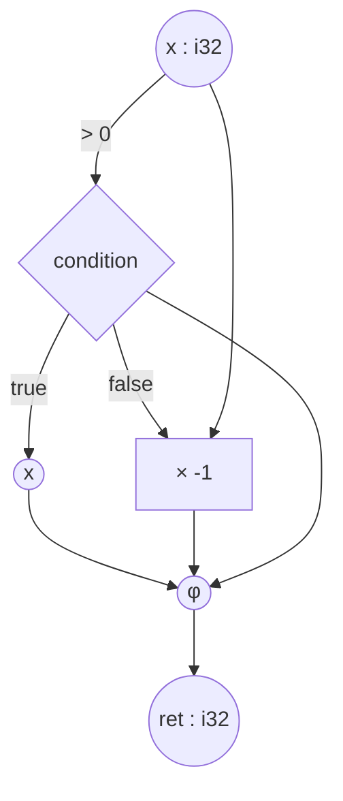

# Mapal — Getting Started v0.2

**A 10-minute introduction to the Mapal language.**

For the full reference, see `user-guide.md`. For compiler internals, see `architecture.md` and `category-ir.md`.

---

## 1. What Mapal is in one paragraph

Mapal is a general-purpose language whose surface syntax directly denotes a dataflow graph. You write `data -> process -> result;` and that is, literally, the compiler's internal representation — three nodes with two edges. Because the representation is a graph (formally: a morphism in a category called Mapal-Cat), the compiler can reason about parallelism structurally, infer memory lifetimes, and target CPU, GPU, or FPGA from the same source.

## 2. Install and build your first program

```bash
# Install (placeholder — tooling not yet released)
curl -sSf https://mapal-lang.org/install | sh

# Create a project
flow pkg init hello
cd hello

# Source: src/main.mapal
cat > src/main.mapal <<'EOF'
fn main() {
    "Hello, world!" -> print;
}
EOF

# Build and run
flow build
flow run
```

## 3. The five things you need to know

### 3.1 `->` is composition

`a -> b` means "pipe the value of `a` into `b`". Chain as many as you like:

```flow
data * 2 -> + 5 -> * 3 -> ret;
```

This is the idiomatic form for a pipeline. Each stage is a morphism in the graph.

### 3.2 `{ … }` is parallel fanout

Inside braces, each `-> …` starts a new parallel branch from the same source:

```flow
data -> {
    -> expensive_a -> r1;
    -> expensive_b -> r2;
}
(r1, r2) -> combine -> ret;
```

The two `expensive_*` calls run in parallel. The implicit join at `}` waits for both.

If you need sequential ordering (logging, I/O), use a `seq` statement block. The body is an ordinary block of statements; source order is the guaranteed order:

```flow
data -> seq {
    "step 1" -> println;
    "step 2" -> println;
}
```

> **Corrected per ADR-0019 — see docs/spec/ERRATA.md (LC-5).** This example previously wrapped each step in an anonymous block (`-> { … }`), which the parser rejects (P0115, out of Mapal-Core); `seq { … }` is a statement block in stage position whose body is the ordinary block production.

### 3.3 `-pattern->` is a guard

Guards match and branch:

```flow
x -> {
    -0->       10;
    -1->       20;
    -_->       30;
} -> code;
```

Booleans use `-true-> / -false->`. `_` is the default. Enum-variant patterns like `-Some(n)->` are full-language — Mapal-Core rejects them at parse (P0106, planned for Core+1). Guard arms are pure, and string values may only flow to `print`/`println` (L1206) — not through a guard join.

### 3.4 Variables declare with `<-` or `->`

```flow
x: i32 <- 5;           // traditional
5 -> x: i32;           // flow-style, equivalent

mut counter: i32 <- 0;
counter + 1 -> counter;    // mutation requires `mut`
```

Immutable by default — this is what makes parallel fanout safe.

### 3.5 Functions use `ret` as the return target

```flow
fn add(a: i32, b: i32) -> i32 {
    a + b -> ret;
}

// call with tuple:
(15, 20) -> add -> result;
```

## 4. A complete small program

A function that returns the absolute value:

```flow
fn abs(x: i32) -> i32 {
    (x > 0) -> {
        -true->  x;
        -false-> x * -1;
    } -> ret;
}
```

Rendered as a graph:



The graph is not a separate artifact — it's exactly what the compiler holds internally. Running `mapal build --debug` and opening the project in the visual debugger will show you this graph live.

## 5. What makes Mapal different

**Parallel by default.** Independent morphisms execute concurrently; `seq` is opt-in for ordering. Most mainstream languages flip this — you write sequential code and bolt on threads.

**No garbage collector, no ownership annotations.** Memory is reclaimed at the graph's *last-use frontier* — computed automatically. There is no `&`, `&mut`, or borrow checker.

**Same code, different targets.** CPU, GPU, FPGA, and browser all come from the same source. Each backend is a functor out of Mapal-Cat (in the category-theoretic sense), which is the formal basis for "the compiler doesn't change your program's meaning."

**The text is the graph.** Visual debugging, graph rendering, and diff views across IR versions all come from the same representation that the compiler runs on.

## 6. Where to go next

- **`user-guide.md`** — full syntax reference, all language features, complete examples.
- **`architecture.md`** — compiler pipeline, backend internals, tooling, runtime system.
- **`category-ir.md`** — formal semantics of the IR, functors, natural transformations, optimization framework.
- **`CHANGES.md`** — design decisions and rationale for the v0.2 revision.

## 7. Minimal cheat-sheet

| You want to… | Write… |
|---|---|
| Pipeline `a` through `f` then `g` | `a -> f -> g -> ret;` |
| Run two things in parallel | `x -> { -> a -> r1; -> b -> r2; }` |
| Force sequential order | `x -> seq { ... }` |
| Branch on a condition | `cond -> { -true-> A; -false-> B; } -> ret;` |
| Loop with a counter | `loop { (i < n) -> { -true-> {... -> loop;} -false-> i -> ret; } }` |
| Declare a type | `type Point { x: f32, y: f32 }` |
| Call with multiple args | `(a, b) -> f -> result;` |

> **Erratum E5 applied — see docs/spec/ERRATA.md and ADR-0006.**
>
> **Cheat-sheet verified against Mapal-Core (2026-07-18).** Removed the error-propagation row: the `?` operator is full-language (P0101, out of Core). The loop row's exit arm produces the counter (`-false-> i -> ret;`) — a value-less `-> ret` in a value-returning function is L1306.

---

**Version:** 0.2 · **Status:** Design specification · **See also:** `user-guide.md`, `architecture.md`, `category-ir.md`, `CHANGES.md`.
