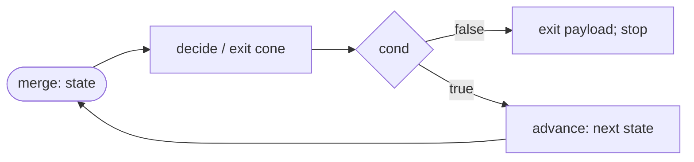

# Mapal as Implemented — the operative index of the language

**Date:** 2026-07-18 · **Status:** Operative index of the language (designated this date; governance record: ADR-0022) · **Scope:** Mapal-Core as compiled by the workspace at M2 (Session 13, 558 tests green)

---

## 0. Why this document exists

The v0.2 specification corpus (`category-ir.md`, `user-guide.md`, `architecture.md`, `getting-started.md`, `CHANGES.md`) is frozen **as text**: since bootstrap on 2026-06-11, no design change has touched those files directly except inline errata markers. The **language** has not been frozen. Thirty-one recorded normative deltas — errata E1–E5, later corrections LC-1–LC-5, and ADR-0001…0021 — sit on top of the frozen text, and the realized compiler implements the composition of all of them. Until today, knowing the language meant reading the spec, then the errata, then twenty-one ADRs. This document is the single description of Mapal **as it is actually implemented**, written in the errata register: every claim carries its normative source, and everything unproven is labeled unproven.

What this document is **not**: it is not a new authority layer, and it is not a rewrite of the v0.2 texts. It restates and indexes; it does not legislate. Where its prose disagrees with an accepted ADR, the ADR wins and this file gets patched — the same rule ERRATA.md lives under.

---

## 1. Authority order

When two documents disagree, the higher rank wins (HANDOFF §2.2, restated in ERRATA.md):

| Rank | Artifact | Decides |
|---|---|---|
| 1 | Accepted ADRs in `docs/decisions/` (including the bootstrap ADRs encoding E1–E5; `FRAMEWORK.md` governs compiler-internal Level-B modeling and defers to ADRs on any spec question) | everything they touch |
| 2 | `docs/spec/category-ir.md` v0.2 | formal semantics |
| 3 | `docs/spec/user-guide.md` v0.2 and `docs/spec/architecture.md` v0.2 (tie) | language behavior vs. compiler structure |
| 4 | `docs/spec/getting-started.md` v0.2 | the newcomer surface |
| 5 | `docs/spec/CHANGES.md` | rationale — not normative |
| 6 | `docs/spec/mapal-language-design.docx` | historical |

Two meta-rules sit above the table:

- **The compiler is the ground truth of what is implemented.** Where a document and the code disagree, one of them is wrong; the disagreement is recorded (erratum or ADR), never silently resolved (HANDOFF §0).
- **"Frozen" describes the texts, not the language.** The language is exactly what ranks 1–4 compose to after the ADR stack is applied. This file is that composition, stated once; it stands outside the ranks as the index that reads them for you.

---

## 2. The Core language as implemented

Mapal-Core (HANDOFF §4, ADR-0001) is the frozen implementation scope through M5. This section describes it as realized in the workspace today: `mapal-syntax` → `mapal-lower` → `mapal-ir` (sealed + validated) → `mapal-check` → `mapal-rewrite` → `mapal-interp` (the oracle) and `mapal-backend-llvm`. Anything outside Core is rejected with a named diagnostic (§3), never silently accepted.

### 2.1 Types and values

| Surface | IR `Ty` | Notes |
|---|---|---|
| `i32`, `i64`, `u8` | `Int { bits, signed }` | exactly these three widths; `i8`/`u32`/etc. are unknown types (L1102) |
| `f32`, `f64` | `Float { bits }` | IEEE 754 binary32/binary64 |
| `bool` | `Bool` | |
| — | `Unit` | the type of `main`'s input and of unwritten returns |
| `(T1, T2, …)` | `Tuple` | anonymous product, arity ≥ 2 |
| `type Point { x: f32, y: f32 }` | `Struct { name, fields }` | named product (E5 renamed the keyword to `type`); ≥ 1 field (L1010) |
| `[T; n]` | `Array { elem, size }` | fixed size, `n ≥ 1` (L1208); `n` is part of the type |
| `"literal"` | `Str` | valid **only** directly feeding `print`/`println` (L1206); no string data |
| (not denotable) | `IoToken` | the linear world token — §2.8 |

Values are scalars, tuples, structs, arrays, and `Unit` (the interpreter's `RValue`). Products and arrays nest (depth ≤ 64, L1209).

What does **not** exist in Core: dynamic arrays `[T]` (P0104), coproducts/enums/`Option`/`Result` and `?` (P0105/P0106/P0101), `char`, string data, function values (L1105), `Never`. The user-guide's wider primitive list (§2.1) and enum syntax (§2.1, §3.4) describe the full language, not Core.

Literals: integers (width-unified against context — L1202/L1203), floats, bools, strings, array literals `[1, 2, 3]`, tuple and struct literals. Unary minus is `Neg` (a real op; `0 − x` would differ from `fneg` on `−0.0` — ADR-0013 context).

### 2.2 Statements, flows, bindings

- **A flow is a statement, not a value-producing expression** (E4 / ADR-0005). `a -> f -> g -> t;` composes left to right; `->`/`<-` bind looser than arithmetic, so `a -> b + c -> d` ≡ `a -> (b + c) -> d`.
- Operator shorthand: `data * 2 -> + 5 -> ret;` — a stage like `+ 5` is sugar for `⟨·, 5⟩ ; add` (user-guide §3.3).
- Binding works both directions: `x: i32 <- 5;` ≡ `5 -> x: i32;`. Rebinding requires a `mut` declaration (L1104); a rebind allocates a fresh IR object — the graph keeps a one-definition rule (ADR-0013 consequences). Immutability-by-default is what makes parallel fanout safe.
- Indexed rebinding `c[i] <- x;` is the array-update sugar — §2.6.

### 2.3 Functions and calls

- `fn name(p1: T1, …) -> R { … }` (E5 keyword set). The single-input convention is real: the parameter list is one product object, so calls are tuple flows `(a, b) -> f -> r;` (pipeline form `x -> f` for unary input). Named-parameter partial application (`15 -> add.a;`) is rejected — L1106, Core+1.
- `ret` names the return object. Tuple outputs are written per slot (`ret.0`, `ret.1`) and must be covered completely and unmixed (L1306). Exactly one write to a given `Return` may fire on any path — enforced at check (T0101); the oracle trusts it (interp IN3).
- The call graph must be **acyclic** — recursion is L1008, Core+1, CPU-only when it lands. Function names in expression position are L1105.
- An effectful function's surface signature `A → B` lowers token-threaded as `(IoToken × A) → (IoToken × B)` (signature synthesis, ADR-0013 law i); `fn main()` declares as `main : IoToken → IoToken`. An effectful fn has at most one surface return site and no `ret.k` slot writes (L1307).

### 2.4 Guards and Phi

- Surface forms: `-true->` / `-false->`, integer-literal arms (`-0->`), and the `-_->` default. Guard arrows are **single lexemes**: `-7->x;` is a guard arm; to flow negative seven, write `-7 -> x;` (ADR-0010).
- Coverage: both bool poles (a default may stand for one) or, for integer matching, a mandatory `-_->` (L1401); no duplicate or mixed discriminants (L1402/L1403); scrutinee typing L1406.
- **Core semantics is Phi**: `Phi : (T × T × Bool) → T` — both arms always compute, and the condition selects (category-ir §4.4). Consequence: arms must be **pure**. An effectful arm is L1404 (honest coproduct lowering is Core+1), `-> ret` inside an arm is L1405, and assigning an enclosing `mut` inside an arm is L1408 (the rebind would apply unconditionally).
- Pattern arms (`-Some(x)->`, `-[h, ...t]->`) parse and are rejected as P0106 — coproducts are Core+1.

### 2.5 Loops — guard-first evaluation

Surface: `loop { … }` (the keyword form only; `:label { … }` blocks and `-> :label;` jumps parse but are P0110, Core+1 — ADR-0012). The body ends in a **routing guard** whose arms are exactly one jump pole (`-> loop;`) and one exit pole over `{true, false}` — `-_->` may stand for one pole (L1409). Carried state is the set of enclosing `mut` bindings the body assigns (L1502); the guard's condition and next-state must derive from the loop merge (L1503).

Meaning: Elgot / least-fixpoint iteration of a step `U → B ⊕ U` in the Kleisli category of the divergence monad (E1 / ADR-0002; the total core of Mapal-Cat has no trace). Divergence is a **defined outcome** (`Diverged` under fuel), never a hang.

**Guard-first (ADR-0016, the operative loop semantics).** On each iteration the evaluator:

1. writes the state to the merge;
2. evaluates only the **decide/exit cone** — the shared guard `cond` and the `LoopExit` route's payload, **including any effect that feeds the exit** (countdown's in-loop `println` fires exactly once per iteration, the exit one included);
3. reads the guard; on *exit* it takes the exit value and stops **without evaluating the continue-branch** — the `LoopBack` next-state sub-DAG (the `inr(U)` arm) is **not evaluated on the exit step**;
4. only on *continue* evaluates the advance set and iterates.



This is the meaning of category-ir §4.5 under E1, and it is load-bearing: the eager-both reading (evaluate the whole body, then test) speculatively evaluates `coeffs[k]` at the exit state `k = 4` of `examples/fir.mapal` — `Index` on a `[f32; 4]` ⇒ trap — instead of the pinned golden `5.375`. Speculation is unsound exactly because the continue-branch can trap or emit; it is the loop-shaped twin of an effect in a parallel fanout. Every consumer of the IR inherits this rule from the oracle; backends are differential-tested against it (ADR-0016, ADR-0020).

IR shape: a `LoopMerge` object receives exactly one `LoopEnter` (initial state) and ≥ 1 `LoopBack` edges (real, SCC-visible — the trace *is* the cycle; `Operation::Trace` is never materialized, CHANGES §1.3 / ADR-0013); `LoopExit` edges leave the cycle. Polarity is pinned: `LoopBack` fires on `true`, `LoopExit` on `false` (ir D7; lowering inserts `Not` if the surface polarity differs). Supported shapes are single-merge / single-back / single-exit canonical loops; nesting is restricted (L1504: an inner loop must exit via `ret`, and no nested loop inside a token-carrying loop body); the LLVM backend rejects nested loops as `Unsupported`.

### 2.6 Collections: `map` / `fold` / `zip` / `enumerate` / `Update`

- **The collection-operator law** (LC-2 / ADR-0009): data arrives through the wire; the inline block is **postfix operator syntax, never an argument**, and the operator's input tuple corresponds positionally to the block's parameters. Canonical forms: `array -> map { item -> … }` and `(init, array) -> fold { acc, item -> … }`. The block is **not a first-class value**.
- Bodies are **closed**: referencing an enclosing local is **L1108** (capture is a later ADR). Arity is enforced (L1601); the body must produce a tail value (L1604) and be token-free — no effects (L1605).
- `zip : ([A;n], [B;n]) → [(A,B);n]` and `enumerate : [A;n] → [(i32, A);n]` are pure builtins resolved by name in lower, like `print` (ADR-0018; the index is pinned `i32`, so `n ≤ i32::MAX` — L1610; size mismatch — L1608). Both are effect-free and fanout-legal.
- **Element write** (ADR-0021): `c[i] <- x;` is rebind sugar over one pure IR op, `Update : (Array{T,n} × I × T) → Array{T,n}` — a **fresh array** with slot `i` replaced; value semantics, `n` stays in the type, no token, fanout-legal. Out of bounds (`i < 0 ∨ i ≥ n`) ⇒ `Trapped(IndexOob)` — the same trap class as a read (no new kind). The index form takes no `mut` keyword and no type annotation, and nested targets (`c[i][j] <- x`) are rejected (parse codes P0013–P0015). It **is** a rebind: the target array must be `mut`, Phi-arm/loop-carried rules are inherited (loop-carried arrays route through merges like tuple state). The semantics everywhere is a naive O(n) copy; in-place update via the last-use frontier is recorded optimization headroom, not semantics. Array reads `a[i]` are bounds-checked; a negative index is a trap, not a type error (there is no `Nat` in Core).

### 2.7 Parallel fanout and `seq`

- `x -> { -> a; -> b; }` is a fanout of **pure** branches with an implicit join; branch bindings escape to the enclosing scope (the `fanout.mapal` idiom). Parallelism is the default for structurally independent pure morphisms (user-guide §5; category-ir §9.5).
- **E2 / ADR-0003: effects are never permitted in parallel fanout.** This is enforced at check (T0201), and it is partly structural before that — token linearity makes two unsequenced prints unorderable, so the graph itself forbids them (ADR-0013).
- **`seq { … }` is a statement block in stage position** (ADR-0019; its own parse node, not a fanout kind). Its body is the ordinary block production — chains, `x <- e` rebinds, `loop`s, an optional tail chain; guard arms are illegal inside it (P0004/P0005/P0106, +P0006 when mixed with statements). Pinned semantics: (a) headless statements and the tail seed from the seq's input; (b) the block lowers **in the enclosing scope** — bindings escape; (c) the seq's value is its tail chain's value — a seq whose chain continues (or that sits in return position) with no tail is L1611; (d) **`seq` has no IR footprint** — its ordering guarantee *is* the effect-token thread that statement-order lowering already produces, so pure statements inside carry no observable order and rewrites may still parallelize them; (e) `seq` is the legal effect site, and an effectful `seq` inside a fanout branch is simply an effectful composite morphism in a branch — rejected by E2 verbatim (the OQ-C1 question is closed by construction).

  ```flow
  sq -> seq {
      -> println;      // seeds from the seq input
      db -> println;   // enclosing-scope binding
  }
  ```

- A non-chain statement (`x <- e`, `loop { }`) inside a *fanout* block is no longer silently dropped: each one draws **P0117** at its span (structural error, not out-of-Core — ADR-0019 defect #3).

### 2.8 Effects: `print` / `println` and the IO world token

The Core effect surface is exactly `{print, println}` (ADR-0015): `print` writes its argument's rendered text raw; `println` appends `"\n"`. Both are one parameterized IR op, `Operation::Print { newline }`. Printables are numeric scalars, bools, and string literals (L1206/L1207) — arrays are not printable. Effects are legal only in sequential context (E2).

Kleisli(IO) is realized as **linear world-token threading** (ADR-0013): `Ty::IoToken`, with `Print : (IoToken × P) → IoToken`. Three token rules are law:

1. **Signature synthesis** — an effectful fn `A → B` lowers as `(IoToken × A) → (IoToken × B)`; `main : IoToken → IoToken` and its input Parameter is the seed token.
2. **Token sink** — a token-bearing object with no token-bearing out-edge must be the function's Return; tokens are never dropped.
3. **Token-in ⇒ token-out for loops** — when the carried state contains the token, every `LoopExit` of that merge carries it out.

Token-bearing objects are linear (at most one token-bearing consumer) with exactly one sanctioned exception: the structural loop fork into one mutually-exclusive `LoopBack` + `LoopExit` pair. Tokens may not pass through `Phi`, and map/fold bodies are token-free. Effect order is thereby dataflow — E2's determinism is structural, not scheduled. At codegen the token is erased; compiled prints call `mapal-rt` externs whose float text is Rust `Display` — oracle render parity by construction (ADR-0020).

**Honest status: this is under-specified at spec level.** The frozen corpus says almost nothing here — category-ir §2.6 names an `IO` monad in a table row and stops; the user guide knows `print` alone. The entire token design exists only in ADR-0013 plus `ir/DESIGN.md` §8, and `println` only in ADR-0015. The IO realization is the least spec-anchored part of the language; this section is its authoritative statement by default, and any Core+1 effect work should start by promoting it into the corpus.

---

## 3. What the compiler rejects

Out-of-Core means **rejected with a named diagnostic, never silently accepted** (ADR-0001). The code bands: L0001–L0008 (lexer), P0001–P0015 (parse errors), P0101–P0117 (out-of-Core / structural parse rejections), L1000–L1901 (lower), T0101/T0201 (check).

### 3.1 Parses but is rejected — P0101–P0117

These constructs are part of the full-surface grammar (the user guide teaches several of them) and are parsed precisely, then rejected — P0101–P0116 with an out-of-Core scope message, P0117 as a structural error:

| Code | Construct | Code | Construct |
|---|---|---|---|
| P0101 | `?` postfix (Kleisli `Result`) | P0110 | labeled blocks `:l { … }` / jumps `-> :l;` (ADR-0012; Core+1) |
| P0102 | `@` annotations (`@executor(…)`) | P0111 | `executor` declarations |
| P0103 | generic type args (`Result<T, E>`) | P0112 | `pub` / `use` (modules) |
| P0104 | dynamic array / slice `[T]` | P0113 | `void` fanout / bare `void` |
| P0105 | enum/coproduct variants in a `type` body | P0114 | collection operators beyond `map`/`fold` (`filter { … }`) |
| P0106 | pattern guard arms (`-Some(x)->`, `-[h, ...t]->`) | P0115 | anonymous block stage (`-> { … }`) |
| P0107 | `...` rest patterns outside guard arms | P0116 | destructuring op-block parameter (`map { (x, y) -> … }`) |
| P0108 | call expressions `f(args)` — use tuple-input flow | P0117 | non-chain statement inside a fanout block (**structural**, not scope — replaces the old silent drop) |
| P0109 | `::` paths (`List::map`) | | |

(Full details: `syntax/DESIGN.md` §16.)

### 3.2 Rejected at lower — "we did not invent the semantics yet"

A second, subtler class parses *cleanly* and is in Core's grammar neighborhood, but lower rejects it because the semantics itself is undesigned. These are not user errors and not scope flags; each is a designed-out construct awaiting its ADR:

| Class | Codes | Why rejected |
|---|---|---|
| Effectful control flow (honest coproducts are Core+1, category-ir §4.6) | L1404 effectful Phi arm · L1405 `ret` in Phi arm · L1408 enclosing-`mut` assign in Phi arm · L1307 effectful return shapes | Phi computes both arms; effects/multi-return need the coproduct lowering nobody has specified for Core |
| Functions as values / richer calls | L1105 function as value · L1106 named-param application · L1008 recursion | closures and cycles need their own ADRs |
| Closed collection bodies | L1108 capture in a map/fold body · L1605 effectful body | capture and effects in bodies are undesigned (L1108 evasion was a real bug class — fixed S13) |
| Richer loops | L1409 integer-discr / multi-route routing · L1504 general nesting · L1107 read-after-loop | multi-route loops are IR-expressible but their cond/polarity/token-fork surface rules need an ADR |
| General stages | L1302 expression stage not consuming the wire | the general E4 stage semantics is unpinned (OQ2) |

The remaining L-codes are ordinary user errors — name resolution (L1101–L1103), typing and literals (L1201–L1209), shape discipline (L1001–L1010, L1301–L1306, L1401–L1407, L1501–L1503, L1601–L1611). Full catalogue: `lower/DESIGN.md` §4.

### 3.3 Rejected at check

`mapal-check` owns two passes: **T0101** (Return exclusivity — at most one firing writer per Return, strictly) and **T0201** (the E2 effect rule — an effectful composite anywhere inside a `Plain` fanout is illegal; the context is node-kind-keyed after ADR-0019, `seq` keeps it sticky). Typing itself is discharged **by construction** at the IR boundary (builder invariant I2 + independent `validate`), not by a separate pass. E3 has no code at all — see §5, item 3.

---

## 4. How correctness is defined — empirically

### 4.1 The oracle

`mapal-interp` is the oracle (HANDOFF §5.4, §7.3 hard rule: no backend or rewrite correctness claim without differential/property tests against it). It is a fueled evaluator (E1: divergence is a defined outcome, not a hang) with three first-class outcomes — `Done(output)`, `Diverged`, `Trapped(DivZero | IndexOob)` — and its semantic pins are recorded as the IN1–IN8 ledger (`interp/DESIGN.md` §13): float rendering is Rust shortest round-trip `Display`; integer div/mod by zero traps while float ÷0 is IEEE ±inf/NaN with no trap (ADR-0013's S13 amendment); the print/println split is ADR-0015. The oracle's behavior **is** the language semantics by definition; ADR-0016 lives in the oracle and every consumer inherits it.

### 4.2 The equality relation and the differential duty

The equality relation (rewrite R1, adopted by ADR-0020): `Done` ⟺ exit 0 plus **byte-equal stdout**; `Trapped(_)` ⟺ exit 101 (traps ⊥-identified, stdout ignored, classes never cross); divergence has no compiled fuel analog, so differential inputs are terminating by construction. Rewrite passes are property-tested over the `testgen` random-program generator (per-pass and full `rewrite()`, determinism, idempotence). Every backend owes the **differential duty** (ADR-0020): all `examples/*.mapal` plus the testgen sweep, on raw **and** rewritten IR, compiled and run against the oracle; toolchain absence ⇒ skip-with-reason, never a faked pass; the shared `mapal-rt` runtime gives render parity and `mapal_trap` exit-101 by construction.

### 4.3 The tested pairs, counted honestly

Exactly one backend exists — LLVM — and it is differential-tested against the oracle on 10 examples plus a 320-case closed testgen sweep, raw and rewritten, compiled at **`-O0`** (the `-O2` differential row was the one acknowledged-open hole in this duty at the time of writing; its state is tracked in `docs/components/backend-llvm/STATUS.md`). Nested loops are `Unsupported` in the emitter. CUDA and Verilog have **zero** tested pairs — those components have not started. That is the entire empirical base: **one oracle, one tested target pair, one optimization level.**

### 4.4 The one informal theorem — and what is not proven

The project contains exactly one theorem with content: E1's trace-preservation / done-protocol result (category-ir §8.3) — *the iteration terminates in n steps with value v ⟺ the circuit asserts `done` at cycle n with output v*. It is stated precisely and **discharged informally**; mechanization is deferred to write-up time (HANDOFF §5.8). The functor-law and naturality claims behind the rewrite layers are recorded as "plausible but not mechanized" (CHANGES §8). Nothing in the project is machine-proven. "Same source, provably the same function across targets" is the thesis the methodology serves — it is **not** a property the current artifact has. The honest claim today is: defined oracle + property-tested rewrites + differential-tested LLVM backend, at the stated coverage.

---

## 5. Known thin ice

1. **The shared-guard loop convention is unenforced.** ir D7 pins the polarity (`LoopBack` on true, `LoopExit` on false) and `validate` checks that each loop route's slot 1 is a `Bool`, but nothing checks that the back-route and exit-route Bools are the **same object**; the oracle's driver reads the guard from the exit route only. Lower always produces a shared guard, so no program from the supported pipeline can desynchronize — but the invariant holds **by construction, not by validation**. A hand-built IR could violate it, and the resulting behavior would be driver-defined, not rejected.
2. **Wrapping overflow is unpinned (IN7).** The oracle computes `wrapping_*` two's-complement arithmetic; the rewriter constant-folds oracle-exact wrapping; the LLVM emitter emits `add`/`sub`/`mul` without `nsw`. Three implementations agree **de facto** — but no ADR ratifies wrap-vs-trap-vs-UB, and IN7 defers the pin to a check/backend ADR. Overflow behavior is stable in practice and unowned on paper.
3. **E3 is vacuous-by-proof.** The memory guarantee (no use-after-free / double-free / leak / race) is scoped to the first-order non-cyclic core (ADR-0004) — and that scope currently contains **zero heap operations**: the IR omits the `Alloc`/`Load`/`Store`/`Free` quartet (ADR-0013), and `Update` is value semantics on stack-resident fixed arrays. `mapal-check` implements no E3 code; the guarantee holds vacuously. The reopen trigger is pinned: the first heap-op ADR (dynamic arrays being the expected one).

---

## 6. Reading map

| To answer… | Read (normative) |
|---|---|
| The formal frame — Mapal-Cat, trace, functors | `category-ir.md` §2/§4/§8, with the E1 markers applied |
| Surface syntax as designed | `user-guide.md` — it teaches Core+1 forms too; §3.1 above tells which |
| The realized IR op set and token laws | ADR-0013 + `ir/DESIGN.md` §5/§7/§8 |
| Loop meaning | ADR-0002 (E1) + ADR-0016 + `interp/DESIGN.md` §4 |
| Collections | ADR-0009 (forms), ADR-0018 (`zip`/`enumerate`), ADR-0021 (`Update`) |
| Effects | ADR-0003 (E2), ADR-0013 (token), ADR-0015 (`println`) |
| `seq` | ADR-0019 + ERRATA LC-5 |
| Scope | HANDOFF §4 + ADR-0001 |
| Correctness machinery | ADR-0020 + the rewrite/interp/backend DESIGNs |
| The full delta ledger | ERRATA.md + the Errata/ADR table in global `STATUS.md` |
| The acceptance surface | `examples/*.mapal` — ten Core programs; `vector.mapal` is the aspirational-dialect exhibit, not Core |

---

_This index is dated 2026-07-18. Each semantics-bearing ADR after this date updates this file in the same change — otherwise it stops being the index. That maintenance rule is part of its designation as the operative index (ADR-0022)._
