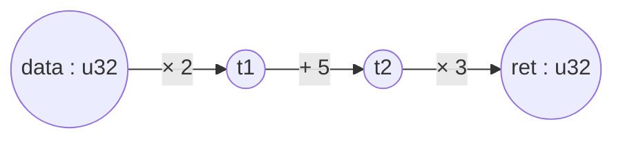
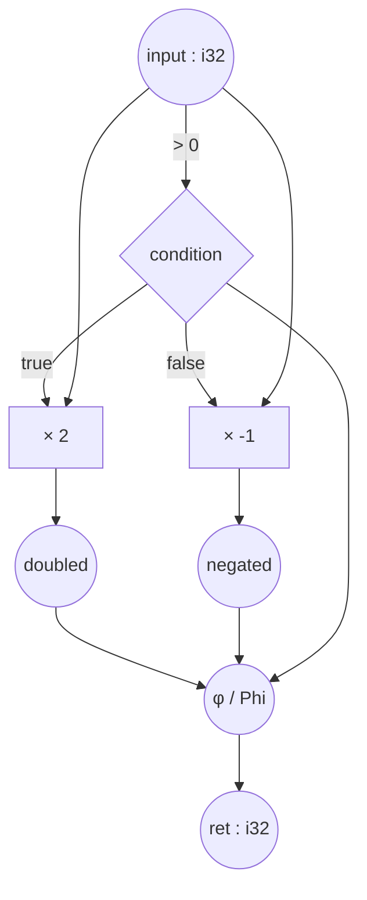
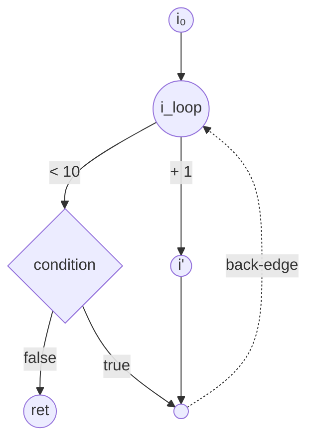
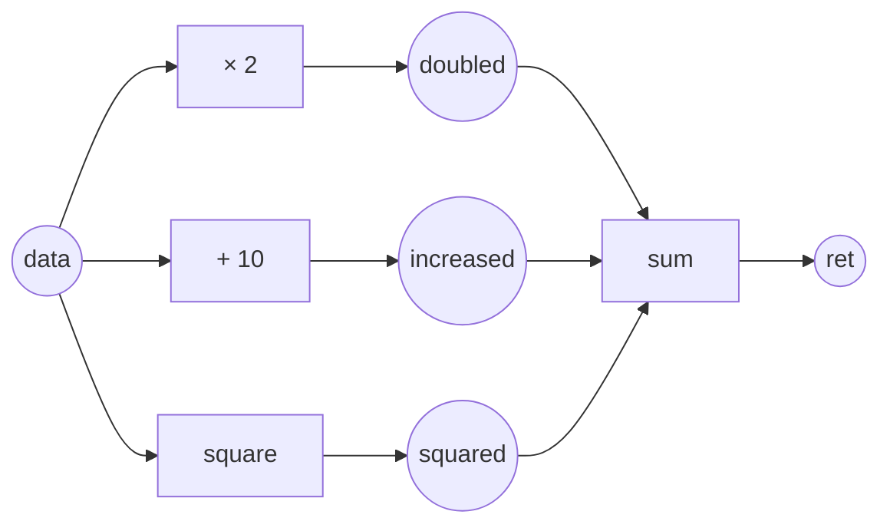
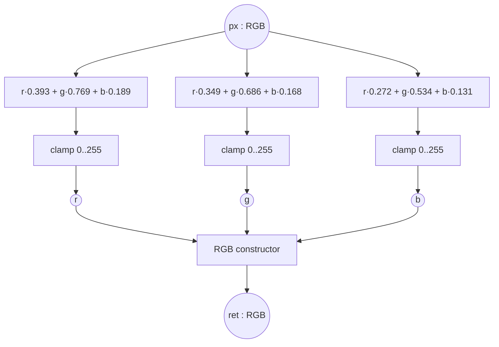
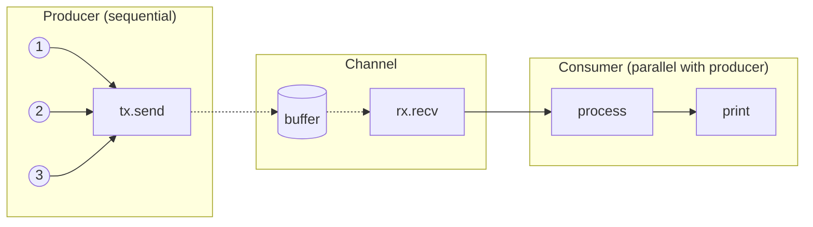

# Mapal Programming Language — User Guide v0.2

**A dataflow language with visual graph equivalence and multi-target compilation.**

> **Reading the status badges.** This guide describes the full v0.2 language design; the compiler implements **Mapal-Core**, the fixed subset catalogued in `HANDOFF.md` §4. A section that teaches constructs outside Mapal-Core carries a badge at its head:
>
> - **Core+1** — the construct parses today and is rejected with a dedicated diagnostic: a `P01xx` code at parse time, or an `Lxxxx` code at the Core-boundary (lowering) checks. The badge names the code, and the horizon where the compiler states one.
> - **Aspirational** — the construct is not in the current grammar at all (parsing fails without a dedicated code) or is explicitly post-M5. It is shown for design direction only.
>
> A section without a badge teaches only constructs that compile in Mapal-Core today; snippets are illustrative fragments unless they show a complete program.

---

## Table of contents

1. Introduction
2. Core concepts
3. Syntax reference
4. Visual representation
5. Parallelism and sequencing
6. Memory model
7. Error handling
8. Complete examples
9. Hardware-specific features
10. Best practices

Appendices: A. Standard library (planned). B. Compilation targets.

---

## 1. Introduction

### What Mapal is

Mapal is a general-purpose programming language whose surface syntax directly denotes a dataflow graph. Three design pillars:

1. **Code *is* the graph.** Text maps one-to-one onto a graph IR (the Category IR — see `category-ir.md`). The `->` operator is categorical composition; `{ … }` fanout blocks are products; pattern-match guards are coproducts.
2. **Graph-derived memory safety.** No garbage collector, no ownership annotations. Lifetimes are inferred from the graph's last-use frontier.
3. **Multi-target compilation.** Write once, compile to CPU (via LLVM), GPU (via CUDA), FPGA (via Verilog), or browser (via WASM). Each backend is a functor out of the IR, which guarantees semantic preservation.

### What Mapal is for

**General computing.** System utilities, web services, CLI applications, desktop apps, data-processing pipelines, scripting, automation.

**Hardware acceleration — special strength.** GPU compute kernels (CUDA, Vulkan, Metal), FPGA hardware synthesis, real-time signal/image/video processing, AI/ML inference, HPC.

### Hello world

```flow
fn main() {
    "Hello, world!" -> print;
}
```

---

## 2. Core concepts

### 2.1 Types

> **Core+1 — does not compile today.** The dynamic array `[T]` below is rejected with P0104, and the enum-like variants (`-Circle { … }`) with P0105. Horizon per the compiler: Core+1 (slices, coproducts). Everything else in this section — primitives, `[T; N]`, tuples, struct-like `type` declarations — is Mapal-Core.

In Mapal, types are declared with the **`type`** keyword. Every value belongs to exactly one type.

> **Note on terminology.** The keyword `type` in Mapal declares a *type*, which is an object in Mapal-Cat (the category of Mapal types and pure functions). The category-theoretic sense of "category" (as in Mapal-Cat) is disambiguated in appendix A of `category-ir.md`.

> **Erratum E5 applied — see docs/spec/ERRATA.md and ADR-0006.**

**Primitive types.**

```flow
i8, i16, i32, i64      // signed integers
u8, u16, u32, u64      // unsigned integers
f32, f64               // floating point
bool                   // boolean
char                   // Unicode scalar (UTF-8 internally)
```

**Compound types.**

```flow
[T; N]                 // fixed-size array, e.g. [i32; 10]
[T]                    // dynamic array / slice
(T1, T2, ...)          // tuple — the canonical categorical product
```

**User-defined types.**

```flow
type Point {
    x: f32,
    y: f32,
}

type Color {
    r: u8,
    g: u8,
    b: u8,
}
```

User-defined types come in two shapes: **struct-like** (products — tuples with named fields) and **enum-like** (coproducts — tagged unions):

```flow
type Shape {
    -Circle { radius: f32 }
    -Square { side: f32 }
    -Rectangle { width: f32, height: f32 }
}
```

The guard syntax (`-Variant-…`) is reused for the variants of an enum — matching the guard syntax used elsewhere for pattern matching.

### 2.2 Nodes

A **node** is any point in the program where data exists or is transformed. There are three kinds:

- **Data nodes.** Variables, literals, constants — anything you can name.
- **Operation nodes.** Primitives (`+`, `*`, etc.) and function calls.
- **Control nodes.** Pattern-match guards, loop headers.

In the IR, data nodes are objects; operation and control nodes are morphisms. See §3 of `category-ir.md` for the full data-structure account.

### 2.3 Flows

A **flow** is the movement of data from one node to another, written with `->` or `<-`:

```flow
source -> destination;     // left-to-right
result <- source;          // right-to-left (assignment)
a -> b -> c -> d;          // chained
```

Categorically, `f -> g` is composition `g ∘ f`.

---

## 3. Syntax reference

### 3.1 Variables

```flow
// right-to-left (traditional form)
x: i32 <- 5;
mut y: i32 <- 10;

// left-to-right (flow form)
5 -> x: i32;
10 -> mut y: i32;

// type inference
value <- 42;    // inferred as i32
```

**Mutation — only permitted on `mut` bindings.**

```flow
mut counter: i32 <- 0;
counter + 1 -> counter;    // updates counter

x: i32 <- 5;
x + 1 -> x;                // ERROR — x is not mut
```

Immutability-by-default is what makes parallel fanout safe by default.

### 3.2 Functions

> **Core+1 — does not compile today.** Calling syntax #2 below (named-parameter partial application, `15 -> add.a`) parses as ordinary member access but is rejected at the Core boundary with L1106 ("named-parameter partial application is out of Core"); the compiler states no horizon for it. Syntaxes #1 (tuple input) and #3 (pipeline) are Mapal-Core, as are the `ret.0` / `ret.1` tuple-slot returns.

**Definition.**

```flow
fn name(p1: T1, p2: T2) -> R {
    // body
    result -> ret;
}
```

The `ret` keyword names the return object. Every morphism that writes to `ret` contributes to the function's output.

**Single-input convention.** Mapal functions conceptually take one input — a product object when the function has multiple parameters. This matches the categorical story: `add : i32 × i32 → i32`.

**Calling a function — three syntaxes, all equivalent.**

```flow
// 1. tuple input
(15, 20) -> add -> result;

// 2. named-parameter partial application
15 -> add.a;
20 -> add.b;
// function executes when both inputs are bound

// 3. pipeline (single input)
data -> process -> result;
```

**Multiple return values via tuple product.**

```flow
fn divmod(a: i32, b: i32) -> (i32, i32) {
    a / b -> ret.0;
    a % b -> ret.1;
}
```

### 3.3 Mapal operators

> **Core+1 — does not compile today.** The `void` fanout at the end of this section is rejected with P0113 ("`void` is out of Mapal-Core … planned for Core+1"). The basic, chained, explicit-intermediate, and parallel-fanout forms are Mapal-Core.

**Basic.** `source -> destination;`

**Chained.**

```flow
data * 2
    -> + 5
    -> * 3
    -> ret;
```

Shorthand stages like `+ 5` and `* 3` are syntactic sugar for `⟨·, 5⟩ ; add` and `⟨·, 3⟩ ; mul` — they take the piped value as the left operand and the literal as the right.

**Explicit intermediates — useful for debugging or to make pipeline stages visible in hardware generation.**

```flow
data * 2 -> s1;
s1 + 5   -> s2;
s2 * 3   -> ret;
```

**Fanout (broadcast, parallel-by-default).**

```flow
data -> {
    -> process1 -> r1;
    -> process2 -> r2;
    -> process3 -> r3;
}
(r1, r2, r3) -> combine -> ret;
```

All three branches execute in parallel. The implicit join at the closing brace waits for all branches to complete. See §5 for the semantics.

**Void (discard).**

```flow
data -> void {
    -> log_for_audit;
    -> send_metric;
}
```

The `void` keyword introduces a fanout whose results are discarded. Used for side-effects-only branches.

### 3.4 Conditionals

> **Core+1 — does not compile today.** Pattern destructuring guards (`-Some(x)->`, `-None->`) are rejected with P0106 ("planned for Core+1 coproducts"). The nested example parses cleanly but is rejected at the Core boundary with L1008 — recursion is out of Core (planned Core+1, CPU backends only, `HANDOFF.md` §4.2). Boolean guards, integer-literal guards, and the `-_->` default are Mapal-Core.

**Pattern matching with guards.**

```flow
condition -> {
    -true->  handle_true;
    -false-> handle_false;
} -> result;
```

**Value matching.**

```flow
status_code -> {
    -0-> "success";
    -1-> "warning";
    -2-> "error";
    -_-> "unknown";    // default
} -> message;
```

**Pattern destructuring.**

```flow
opt -> {
    -Some(x)-> x * 2;
    -None->    0;
} -> result;
```

**Nested.**

```flow
fn fibonacci(n: i32) -> i32 {
    (n <= 1) -> {
        -true-> n;
        -false-> {
            (n - 1) -> fibonacci -> a;
            (n - 2) -> fibonacci -> b;
            a + b
        }
    } -> ret;
}
```

Internally, guards lower to coproduct injection and copairing; see §2.3 of `category-ir.md`. The `-variant->` syntax is consistent with the variant declaration syntax in enum-like types (§2.1).

### 3.5 Loops

> **Core+1 — does not compile today.** Only the while-style `loop { … -> loop; }` form is Mapal-Core. The for-style example is not: `[i32]` is rejected with P0104 and the destructuring guards (`-[]->`, `-[head, ...tail]->`) with P0106. The `:outer` / `:inner` labeled blocks and `-> :label;` jumps are rejected with P0110 (ADR-0012; "Mapal-Core's only loop introducer is `loop`"). Horizon per the compiler: Core+1.

Loops are named blocks that create feedback edges in the graph.

**While-style.**

```flow
fn countdown(mut n: i32) {
    loop {
        (n > 0) -> {
            -true-> {
                n -> print;
                n - 1 -> n;
                -> loop;       // continue
            }
            -false-> -> ret;   // exit
        }
    }
}
```

The label `loop` (the block's name) functions as a target for jump edges. The `-> loop;` edge is the back-edge in the graph; `-> ret;` is the exit edge.

**For-style (iteration over a collection).**

```flow
fn sum_array(arr: [i32]) -> i32 {
    mut total: i32 <- 0;
    mut items: [i32] <- arr;

    loop {
        items -> {
            -[]-> total -> ret;
            -[head, ...tail]-> {
                total + head -> total;
                tail -> items;
                -> loop;
            }
        }
    }
}
```

Destructuring guards (`-[]-`, `-[head, ...tail]-`) make head/tail iteration natural.

**Nested loops with explicit control targets.**

```flow
:outer {
    // outer body
    :inner {
        // inner body
        cond -> {
            -true-> -> :inner;     // continue inner
            -false-> -> :outer;    // break inner, restart outer
        }
    }
    // after inner completes
    -> :outer;
}
```

> **Corrected per ADR-0012 — see docs/spec/ERRATA.md (LC-3).** Custom labels carry a
> prefix `:` sigil on both the block (`:outer { … }`) and the jump (`-> :outer;`); jumps
> target lexically enclosing labels only. The keyword form `loop { … -> loop; }` is
> unchanged.

Formally, each `loop` denotes a `Tr^U` in the traced monoidal structure of Mapal-Cat, where `U` is the loop-carried state; see §2.7 and §4.5 of `category-ir.md`.

### 3.6 Operator precedence

> **Core+1 — does not compile today.** Row 9 of the table, the `?` operator, is rejected with P0101 ("planned for Core+1 error handling"); it is listed here to fix its precedence in the design. Every other row describes Mapal-Core syntax.

Highest (tightest) to lowest:

1. `()` grouping
2. `.` member access
3. `*` `/` `%`
4. `+` `-`
5. `==` `!=` `<` `>` `<=` `>=`
6. `&&`
7. `||`
8. `->` `<-`
9. `?`
10. `;` (statement terminator)

Examples:

```flow
a + b -> c         // (a + b) -> c
a -> b + c -> d    // a -> (b + c) -> d  — per the precedence table, -> is looser than +
x -> f.method      // x -> (f.method)
```

A flow is a statement, not a value-producing expression; `->`/`<-` chains are parsed at statement level.

> **Erratum E4 applied — see docs/spec/ERRATA.md and ADR-0005.**

---

## 4. Visual representation

Mapal's surface syntax maps directly to a dataflow graph. The graph is not a separate artifact; it *is* the program, viewed differently. The compiler renders the graph to Mermaid, Graphviz, or the visual debugger from the same IR.

### 4.1 Simple pipeline

**Source:**

```flow
fn pipeline(data: u32) -> u32 {
    data * 2
        -> + 5
        -> * 3
        -> ret;
}
```

**Graph:**



Each edge is a morphism; each node is an object in Mapal-Cat. The pipeline denotes the composition `(×3) ∘ (+5) ∘ (×2) : u32 → u32`.

### 4.2 Visual elements — legend

| Element | Meaning |
|---|---|
| Circle / rounded node | Data object (value, variable) |
| Rectangle | Function / operation morphism |
| Diamond | Condition / guard |
| Solid arrow | Data-flow morphism |
| Dashed arrow | Back-edge (loop) or control-flow cross |

### 4.3 Conditional branch

> **Core+1 — does not compile today.** This example parses, but writing `ret` inside a pure guard arm is rejected at the Core boundary with L1405 ("`-> ret` inside a Phi-position arm"). In Mapal-Core a pure arm yields its value as a tail expression — e.g. `-true-> { input * 2 -> doubled; doubled }` — or flows directly to a target, as in §3.4.

**Source:**

```flow
fn process(input: i32) -> i32 {
    (input > 0) -> {
        -true-> {
            input * 2 -> doubled;
            doubled -> ret;
        }
        -false-> {
            input * -1 -> negated;
            negated -> ret;
        }
    }
}
```

**Graph:**



The `phi` node is the IR's `Phi` morphism: source `(i32 × i32 × Bool)`, target `i32`. See §3.3 and §4.4 of `category-ir.md`.

### 4.4 Loop with back-edge

**Source:**

```flow
loop {
    (i < 10) -> {
        -true-> {
            i + 1 -> i;
            -> loop;
        }
        -false-> -> ret;
    }
}
```

**Graph:**



The dashed edge is a real graph edge targeting the `LoopMerge` object. There is no special "branch with back-target" morphism — the cycle is visible in the adjacency list, and loops are identified by Tarjan SCC analysis. See §4.5 of `category-ir.md`.

### 4.5 Parallel fanout

**Source:**

```flow
fn parallel_transform(data: i32) -> i32 {
    data -> {
        -> * 2    -> doubled;
        -> + 10   -> increased;
        -> square -> squared;
    }
    (doubled, increased, squared) -> sum -> ret;
}
```

**Graph:**



The three downstream morphisms have disjoint successor sets, so the parallelism analyzer marks them parallel by inspection (§9.5 of `category-ir.md`).

---

## 5. Parallelism and sequencing

### 5.1 Parallel-by-default

Mapal's execution model is parallel-first. Independent operations in the graph run concurrently; sequential execution is the exception, opted into via `seq`.

**Automatic parallelism — happens when both conditions hold:**

1. Two morphisms are structurally independent (neither's source is reachable from the other's target).
2. Both are pure, or the effects are non-interfering.

```flow
data -> {
    -> expensive_a -> r1;
    -> expensive_b -> r2;
}
(r1, r2) -> combine -> ret;
// expensive_a and expensive_b run in parallel
// implicit join before combine
```

### 5.2 Forced sequential execution — `seq`

When ordering matters (logging, I/O, mutation), use a `seq` statement block. The
body is an ordinary block of statements; source order is the guaranteed order:

```flow
data -> seq {
    "Step 1" -> println;
    "Step 2" -> println;
    "Step 3" -> println;
}
// output order guaranteed: 1, 2, 3
```

> **Corrected per ADR-0019 — see docs/spec/ERRATA.md (LC-5).** `seq { … }` is a
> statement block in stage position, not a fanout of anonymous blocks. Its body is
> the ordinary block production (chains, `x <- e` rebinds, `loop`s, optional tail);
> headless statements seed from the seq input; bindings escape to the enclosing
> scope; the ordering guarantee is the effect-token thread, so `seq` carries no IR
> node of its own.

### 5.3 Execution models (`executor`)

> **Core+1 — does not compile today.** The `executor` declaration is rejected with P0111 (horizon: post-M5), the `@executor(…)` annotation with P0102, and the `[Data]` / `[Result]` parameters with P0104. §§5.1–5.2 are Mapal-Core (the `seq` form per ADR-0019); §5.4's channel rule is prose only.

How parallelism is *realized* (threads, async tasks, hardware lanes) is controlled by an executor — pluggable like allocators in C++:

```flow
executor ThreadPool {
    max_threads: 8,
    work_stealing: true,
    spawn_threshold: 1000,    // don't spawn for tiny tasks
}

executor Sequential {
    // forces everything sequential
}

executor Hardware {
    // for FPGA: true parallel hardware paths
}

@executor(ThreadPool)
fn process_data(input: [Data]) -> [Result] {
    input -> map { item -> item -> transform } -> ret;
}
```

### 5.4 Decision table

| Condition | Execution |
|---|---|
| Inside `seq` block | Sequential |
| Has data dependencies | Sequential (forced by graph) |
| Independent + pure | Parallel |
| Independent + effectful | **Not permitted in parallel fanout** — must `seq` or use channels |

Effectful morphisms are **not permitted in parallel fanout**. Effects either (a) sequence via `seq`, or (b) communicate via channels with **Kahn process network semantics** — blocking reads, unbounded FIFOs — under which scheduling-independent determinism is a theorem (Kahn 1974). Channels are out of Mapal-Core scope, but the rule is fixed now.

> **Erratum E2 applied — see docs/spec/ERRATA.md and ADR-0003.**

---

## 6. Memory model

> **Core+1 — does not compile today.** The examples in §6.2 and §6.4 use call-expression syntax (`allocate(1024)`), which is rejected with P0108 ("use a tuple-input flow: `(args) -> f`"). The fanout and flow shapes themselves are Mapal-Core; `Buffer` and the library functions are illustrative.

Mapal has no garbage collector and no ownership annotations. The compiler infers lifetimes from the graph's last-use frontier — see §10 of `category-ir.md` for the formal treatment.

### 6.1 Core rule — reference by default, free at last use

The compiler:

1. Identifies every allocation morphism.
2. Collects the use set — every morphism with the allocation as source.
3. Computes the frontier of last uses.
4. Inserts a `Free` morphism after the frontier synchronizes.

```flow
fn example(data: Buffer) -> Result {
    data -> {
        -> process_a -> r1;    // data used here
        -> process_b -> r2;    // and here
    }
    // join point — both branches complete
    // compiler inserts FREE(data) HERE
    (r1, r2) -> combine -> ret;
}
```

### 6.2 Primitives copy, heap types reference

- **Primitive types** (`i32`, `f32`, `bool`, `char`, small fixed-size structs) copy on use. No free is ever emitted for them.
- **Heap types** (`Buffer`, `String`, `Vec<T>`, user structs containing heap data) flow by reference; a single free is emitted after the last use.

```flow
x: i32 <- 5;
x -> {
    -> add_one;
    -> add_two;
}
// both branches got independent copies of x — primitives are free to duplicate

buf: Buffer <- allocate(1024);
buf -> {
    -> read_head -> h;
    -> read_tail -> t;
}
// both branches got the *same* reference to buf
// FREE(buf) after (h, t) combines
```

### 6.3 Explicit clone

When two independent copies of a heap object are needed (e.g., one side mutates):

```flow
buf -> {
    -> clone -> process_mutated;
    -> process_original;
}
// two independent buffers, each freed at its own frontier
```

### 6.4 Escape analysis

Allocations that escape (returned, stored into a longer-lived structure, sent on a channel) do not get a local free — ownership transfers to the consumer:

```flow
fn create_buffer() -> Buffer {
    buf <- allocate(1024);
    buf -> fill_data -> ret;
    // buf escapes via ret — no FREE inserted here
    // caller is now responsible
}
```

### 6.5 What the compiler guarantees

The memory guarantee is **scoped**. It is **PROVEN for the first-order, non-cyclic dataflow core** (which contains Mapal-Core entirely) and **OPEN for the full language** (closures, channels, cyclic structures; cf. the Tofte–Talpin region pathologies — cycles fall back to refcounting).

Within the proven core:

- No use-after-free. (Every use is in the graph, and frees are after last uses.)
- No double-free. (Exactly one free per allocation's frontier.)
- No data races on heap data. (References flow through the graph; concurrent writes would require explicit synchronization primitives.)
- No memory leaks within a single function body. (Every non-escaping allocation has a free.)

Cyclic data structures are the one case that needs extra attention. In v0.2, cyclic types require an explicit annotation that switches to reference-counting; the type system will report an error if you try to create a cycle without it.

> **Erratum E3 applied — see docs/spec/ERRATA.md and ADR-0004.**

---

## 7. Error handling

> **Core+1 / aspirational — does not compile today.** Nothing in this section is in Mapal-Core yet; `HANDOFF.md` §4.2 schedules coproducts and `?` as the first Core+1 feature. The `?` operator parses and is rejected with P0101 ("planned for Core+1 error handling"), and enum-like variants in a `type` body with P0105 — but generic type declarations (`type Result<T, E>`) are not in the current grammar at all, and neither is `panic!()`.

Errors are values that flow through the graph like any other data. The Result type is a coproduct.

### 7.1 The Result type

```flow
type Result<T, E> {
    -Ok(value: T)
    -Err(error: E)
}
```

Categorically, `Result<T, E>` is `T + E` — see §2.3 of `category-ir.md`.

### 7.2 The `?` operator — Kleisli composition

```flow
fn read_and_process(path: String) -> Result<Data> {
    path -> File.open? -> read_contents? -> parse? -> ret;
}
```

This is sugar for the Kleisli composition in the Result-monad. Each `?` adds the Err-injection branch to a copair automatically; if any step returns `Err(e)`, the whole expression short-circuits to `Err(e)` with the error preserved.

Without sugar:

```flow
fn read_and_process(path: String) -> Result<Data> {
    path -> File.open -> {
        -Ok(file)-> file -> read_contents -> {
            -Ok(c)-> c -> parse -> {
                -Ok(d)-> Ok(d) -> ret;
                -Err(e)-> Err(e) -> ret;
            }
            -Err(e)-> Err(e) -> ret;
        }
        -Err(e)-> Err(e) -> ret;
    }
}
```

### 7.3 Errors in parallel branches

If any branch of a parallel fanout fails, the whole fanout fails. Other branches are either canceled (if the executor supports it) or their results discarded:

```flow
data -> {
    -> process_a?;    // might fail
    -> process_b?;    // might fail
} -> (r1, r2) -> combine -> ret;
// if either fails, the whole expression is Err
```

### 7.4 Panic vs. error

`Err` is for recoverable errors. `panic!()` is for bugs — its type is `Never` (the initial object — §2.4 of `category-ir.md`), so it can be inserted anywhere in the graph as a final morphism but cannot be recovered from.

---

## 8. Complete examples

### 8.1 Fibonacci

> **Core+1 — does not compile today.** This example parses cleanly, but the self-calls are rejected at the Core boundary with L1008 ("recursive call cycle: fibonacci -> fibonacci — recursion is out of Core"). Planned Core+1, CPU backends only (`HANDOFF.md` §4.2). The guard arms shown here use the Mapal-Core tail-expression form.

```flow
fn fibonacci(n: i32) -> i32 {
    (n <= 1) -> {
        -true-> n;
        -false-> {
            (n - 1) -> fibonacci -> a;
            (n - 2) -> fibonacci -> b;
            a + b
        }
    } -> ret;
}
```

### 8.2 Array sum

> **Core+1 — does not compile today.** The `[i32]` dynamic arrays are rejected with P0104 and the destructuring guards (`-[]->`, `-[head, ...tail]->`) with P0106. Horizon per the compiler: Core+1 (slices, coproducts).

```flow
fn sum_array(arr: [i32]) -> i32 {
    mut total: i32 <- 0;
    mut items: [i32] <- arr;

    loop {
        items -> {
            -[]-> total -> ret;
            -[head, ...tail]-> {
                total + head -> total;
                tail -> items;
                -> loop;
            }
        }
    }
}
```

### 8.3 Sepia filter — natural parallelism

> **Core+1 — does not compile today.** The anonymous block stages (`-> { … } -> r;`) are rejected with P0115 — the diagnostic cites this section's full-language form by name. The tuple stage (`-> (v, 0, 255) -> clamp`) would further be rejected at the Core boundary with L1302 ("expression stage does not consume the wire"). For the Mapal-Core version of this program see `examples/sepia.mapal`.

```flow
fn sepia(px: RGB) -> RGB {
    px -> {
        -> {
            px.r * 0.393 + px.g * 0.769 + px.b * 0.189
                -> (v, 0, 255) -> clamp
        } -> r;
        -> {
            px.r * 0.349 + px.g * 0.686 + px.b * 0.168
                -> (v, 0, 255) -> clamp
        } -> g;
        -> {
            px.r * 0.272 + px.g * 0.534 + px.b * 0.131
                -> (v, 0, 255) -> clamp
        } -> b;
    }
    RGB { r, g, b } -> ret;
}
```

**Graph:**



All three channel computations execute in parallel — there are no data dependencies between them. On GPU this maps to a kernel; on FPGA it maps to three parallel combinational blocks.

### 8.4 Matrix multiplication

> **Core+1 — does not compile today.** The `[[f32]]` dynamic arrays are rejected with P0104 and the destructuring op-block parameter (`map { (x, y) -> … }`) with P0116. Horizon per the compiler: Core+1.

```flow
fn matmul(a: [[f32]], b: [[f32]]) -> [[f32]] {
    a -> rows -> a_rows;
    b -> cols -> b_cols;

    a_rows -> map { row ->
        b_cols -> map { col ->
            (row, col) -> zip -> pairs;
            pairs -> map { (x, y) -> x * y } -> products;
            products -> sum
        } -> result_row;
        result_row
    } -> ret;
}
```

### 8.5 Binary search

> **Core+1 — does not compile today.** `[i32]` is rejected with P0104, `Option<usize>` with P0103, the `arr.len()` and `Some(mid)` calls with P0108, and the `:search` block / `-> :search;` jumps with P0110 ("Mapal-Core's only loop introducer is `loop`"). Horizon per the compiler: Core+1.

```flow
fn binary_search(arr: [i32], target: i32) -> Option<usize> {
    mut left: usize  <- 0;
    mut right: usize <- arr.len();

    :search {
        (left < right) -> {
            -false-> None -> ret;
            -true-> {
                (left + right) / 2 -> mid;
                arr[mid] -> mid_value;

                (mid_value == target) -> {
                    -true-> Some(mid) -> ret;
                    -false-> (mid_value < target) -> {
                        -true-> {
                            mid + 1 -> left;
                            -> :search;
                        }
                        -false-> {
                            mid -> right;
                            -> :search;
                        }
                    }
                }
            }
        }
    }
}
```

> **Corrected per ADR-0012 — see docs/spec/ERRATA.md (LC-3).** Labeled block + jumps now
> carry the prefix `:` sigil.

### 8.6 Producer-consumer with channels

> **Aspirational — does not compile today.** Channels are post-M5 (Kahn process networks, §5.4). As written, `channel<i32>` in expression position is not in the grammar — the parser reads `<` as a comparison and recovers without a dedicated code — and the anonymous block stages and `for_each` are rejected with P0115 / P0114.

```flow
fn producer_consumer() {
    channel<i32> -> (tx, rx);

    {
        -> seq {
            -> { 1 -> tx.send };
            -> { 2 -> tx.send };
            -> { 3 -> tx.send };
            -> tx.close;
        };
        -> {
            rx -> for_each { item -> item -> process -> print };
        };
    }
}
```

**Graph:**



---

## 9. Hardware-specific features

> **Core+1 / aspirational — does not compile today.** None of §9 is in Mapal-Core. The `@…` annotations (§9.1, §9.3) parse and are rejected with P0102 ("planned for Core+1"); `Stream<RGB>` draws P0103 and the `[f32]` parameters P0104. The `@device` / `@shared` / `@bram` stage attributes (§9.2) are not in the grammar at all.

### 9.1 Platform annotations

**FPGA.**

```flow
@pipeline_depth(5)
@target_frequency(200MHz)
@use_dsp_blocks(3)
fn dsp_pipeline(signal: i16) -> i16 {
    signal * coeff1 -> s1;
    s1     * coeff2 -> s2;
    s2     * coeff3 -> s3;
    s3 -> ret;
}
```

Each `-> sN;` corresponds to one clock cycle — one register in the generated Verilog.

**GPU.**

```flow
@block_size(256)
@shared_memory(4096)
fn gpu_kernel(data: [f32]) -> [f32] {
    data -> map { x -> x * 2.0 -> doubled; doubled -> ret; }
}
```

### 9.2 Memory attributes

```flow
data @device -> process -> result;      // GPU device memory
data @shared -> shared_compute;         // GPU shared memory (fast)
data @bram   -> fpga_storage;           // FPGA block RAM
```

### 9.3 Timing constraints (FPGA)

```flow
@clock(100MHz)
fn video_processor(stream: Stream<RGB>) -> Stream<RGB> {
    stream -> map { px ->
        px.r -> enhance;
        px.g -> enhance;
        px.b -> enhance;
        (r, g, b) -> combine -> ret;
    }
}
```

---

## 10. Best practices

### 10.1 Explicit vs. chained

Chained for simple pipelines — readable, dense:

```flow
data * 2 -> + 5 -> / 3 -> ret;
```

Explicit for debugging — each stage is nameable in the debugger:

```flow
data * 2 -> s1;
s1   + 5 -> s2;
s2   / 3 -> ret;
```

Explicit for hardware — each line maps to a clock cycle:

```flow
input -> mul -> s1;
s1    -> add -> s2;
s2    -> div -> s3;
s3 -> ret;
```

### 10.2 Naming

| Kind | Convention | Example |
|---|---|---|
| Variable | `snake_case` | `pixel_value`, `total_sum` |
| Type | `PascalCase` | `Point`, `ColorRGB` |
| Function | `snake_case` | `process_image` |
| Constant | `SCREAMING_SNAKE_CASE` | `MAX_SIZE` |

### 10.3 Performance tips

**GPU.**
- Minimize branches — prefer branchless / select-based constructs. The compiler lowers conditionals to branchless where possible.
- Align for memory coalescing.
- Maximize `map`-over-array — it becomes a kernel launch.

**FPGA.**
- Keep pipeline stages balanced (similar combinational depth per stage).
- Minimize feedback loops — they're expensive.
- Use fixed-point (integers + scaling) where floating-point precision isn't needed.
- Explicit stage naming (`-> s1;` etc.) helps synthesis.

**CPU.**
- Parallel fanout for embarrassingly-parallel work; the default executor parallelizes.
- `seq` for anything with ordering constraints — don't hope.

### 10.4 Common patterns

> **Core+1 — does not compile today.** The `filter` pattern below is rejected with P0114 ("only `map`/`fold` are Core collection operators … planned for Core+1"). The `map`, `fold`, and pipeline patterns are Mapal-Core.

```flow
// map
array -> map { item -> item -> transform }

// filter
array -> filter { item -> item > threshold }

// fold / reduce
(0, array) -> fold { acc, item -> acc + item }

// pipeline
data -> stage1 -> stage2 -> stage3 -> ret;
```

> **Corrected per ADR-0009 — see docs/spec/ERRATA.md (LC-2).**

---

## Appendix A — standard library (planned)

**Math.**

```flow
abs, sqrt, pow, exp, log
sin, cos, tan, asin, acos, atan
floor, ceil, round, trunc
min, max, clamp
```

**Collections.**

```flow
map, filter, fold, reduce
zip, enumerate, chunk
sum, product, min, max
sort, reverse, concat
```

**Hardware primitives.**

```flow
clamp(min, max)     // clamp to range
saturate            // clamp to [0, 1]
dot(a, b)           // dot product
cross(a, b)         // cross product
lerp(a, b, t)       // linear interpolation
```

## Appendix B — compilation targets

> **Status — as implemented.** Only the CPU row exists today: `mapal-backend-llvm` is the implemented backend; the `mapal-backend-cuda` and `mapal-backend-verilog` crates are one-line stubs, and there is no WASM backend crate. The table is the design target.

| Target | Backend | Output |
|---|---|---|
| CPU | `F_LLVM` | Native binary with SIMD, multi-threading |
| GPU | `F_CUDA` | CUDA kernel + host wrapper |
| FPGA | `F_Verilog` | Synthesizable Verilog, pipeline stages → registers |
| Browser | `F_WASM` | WebAssembly module |

Each backend is a functor out of Mapal-Cat — see §8 of `category-ir.md` for the formal treatment and semantic-preservation guarantee.

---

**Version:** 0.2 · **Status:** Design specification · **See also:** `category-ir.md`, `architecture.md`, `getting-started.md`, `CHANGES.md`.
